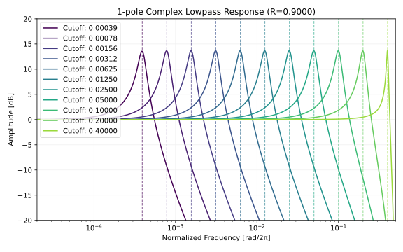
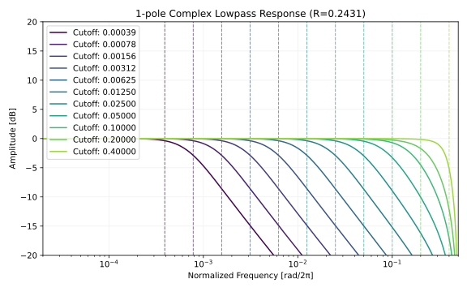

# 1-pole 複素ローパスフィルタ
[複素レゾネータ](https://ccrma.stanford.edu/%7Ejos/filters/Complex_Resonator.html)の式を変えて遊んでいたところ、以下のローパスフィルタを見つけました。適当に 0 をナイキスト周波数に置いて、レゾナンスのパラメータ `R` を勘でチューニングしています。 `b` はユニティーゲインとなるようにしています。

```python
import numpy as np

class ComplexLowpass1:
    def __init__(self):
        self.x1 = 0
        self.y1 = 0

    def process(self, x0, cutoffNormalized, R):
        """
        cutoffNormalized in [0, 0.5).
        R in [0, 1].
        """
        cut = np.exp(2j * np.pi * cutoffNormalized)
        res = np.exp(cut.imag * np.log(R))

        a = cut * res
        b = (1 - a) / 2

        self.y1 = b * (x0 + self.x1) + a * self.y1
        self.x1 = x0
        return self.y1.real
```

以下は周波数特性です。レゾナンスのピークはカットオフ周波数と一致しており、ゲインも一定です。レゾナンスの幅は対数軸上でほぼ一定に見えますが、ナイキスト周波数の近くでは狭くなっています。

<figure>

</figure>

以降では挙動の理由付けを行います。

## 伝達関数
以下はコード中の差分方程式です。

```
y1 = b * (x0 + x1) + a1 * y1
```

数式にします。

$$
y[n] = b \cdot (x[n] + x[n-1]) + a \cdot y[n-1].
$$

- $n$ : 時刻。単位はサンプル数。
- $x[n]$ : 入力信号。実数。
- $y[n]$ : 出力信号。複素数。
- $a, b$ : フィルタ係数。複素数。

$k$ サンプルの遅延を $z^{-k}$ として、z 領域での表現に変えます。


$$
\begin{aligned}
Y(z) &= b(X(z) + z^{-1}X(z)) + a z^{-1} Y(z) \\
Y(z)(1 - a z^{-1}) &= b(1 + z^{-1})X(z) \\
\end{aligned}
$$

$\dfrac{Y(z)}{X(z)}$ が複素伝達関数 $H$ です。

$$
H(z) = \frac{b(1 + z^{-1})}{1 - a z^{-1}}.
$$

$$
\newcommand{\re}[1] {#1_{\mathrm{r}}}
\newcommand{\im}[1] {#1_{\mathrm{i}}}
$$

コードと一致する実数の伝達関数 $\re{H}$ を求めます。 $^*$ は複素共役です。下付き文字の $\re{}$ は実部、 $\im{}$ は虚部です。

$$
\begin{aligned}
\re{H}(z)
&= \frac{1}{2} \left( H(z) + H^*(z) \right) \\
&= \frac{1+z^{-1}}{2} \left(
  \frac{b}{1-a z^{-1}} + \frac{b^*}{1-a^* z^{-1}}
\right) \\
&= \frac{1+z^{-1}}{2} \left(
  \frac{
    (b + b^*) - (b a^* + b^* a)z^{-1}
  }{
    1 - (a + a^*)z^{-1} + (a a^*)z^{-2}
  }
\right) \\
&= \frac{1+z^{-1}}{2} \left(
  \frac{
    2 \text{Re}(b) - 2 \text{Re}(b a^*)z^{-1}
  }{
    1 - 2 \mathrm{Re}(a)z^{-1} + |a|^2 z^{-2}
  }
\right) \\
&= \frac{
  \re{b} + \left( \re{b} - \text{Re}(b a^*) \right) z^{-1} - \text{Re}(b a^*) z^{-2}
}{
  1 - 2 \re{a} z^{-1} + |a|^2 z^{-2}
} \\
&= \frac{
  \re{b} + (\re{b} - \re{b} \re{a} - \im{b} \im{a})z^{-1} - (\re{b} \re{a} + \im{b} \im{a})z^{-2}
}{
  1 - 2\re{a}z^{-1} + (\re{a}^2 + \im{a}^2)z^{-2}
}.
\end{aligned}
$$

## 連続系のフィルタとの関係
以下は連続系での 1 次ローパス (RC フィルタ) の伝達関数です。 $\omega_a$ が極です。

$$
H_{cont.}(s) = \frac{1}{1 + s / \omega_a}.
$$

$s$ に以下の値を代入してバイリニア変換します。 $T$ は秒数で表されたサンプリング周期です。

$$
s = \frac{2}{T} \cdot \frac{1 - z^{-1}}{1 + z^{-1}}.
$$

整理した式です。

$$
H(z)
= \frac{1 + z^{-1}}{\left( 1 + \sigma \right) + \left( 1 - \sigma \right) z^{-1}}
, \quad \sigma = \frac{2}{T \omega_a}.
$$

ゲインを 1 に正規化します。

$$
H(z)
= b \cdot \frac{1 + z^{-1}}{1 - a z^{-1}},
\quad b = \frac{1}{1 + \sigma},
\quad a = -\dfrac{1 - \sigma}{1 + \sigma}.
$$

ここで $a$ は $H(z)$ の極です。また $b = \dfrac{1 - a}{2}$ の関係も成立します。

## Biquad の和としての実装
[Cookbook formulae for audio EQ biquad filter coefficients](https://webaudio.github.io/Audio-EQ-Cookbook/audio-eq-cookbook.html) で紹介されているローパス (LPF) とバンドパス (BPF) の和で `ComplexLowpass1` と同じ出力が得られます。

$$
\re{H}(z) = H_{\text{LPF}}(z) + \frac{1}{2} H_{\text{BPF, 0 dB peak}}(z).
$$

以下は検証に使ったコードです。

<details>
<summary>LPF + BPF の検証コード</summary>

```python
import numpy as np


class ComplexLowpass:
    def __init__(self):
        self.x1 = 0
        self.y1 = 0

    def process(self, x0, cutoffNormalized, R):
        cut = np.exp(2j * np.pi * cutoffNormalized)
        res = np.exp(cut.imag * np.log(R))

        a = cut * res
        b = (1 - a) / 2

        self.y1 = b * (x0 + self.x1) + a * self.y1
        self.x1 = x0
        return self.y1


class BiquadFilter:
    def __init__(self):
        self.x1 = 0
        self.x2 = 0
        self.y1 = 0
        self.y2 = 0

    def process(self, x0, b0, b1, b2, a0, a1, a2):
        y0 = (b0 * x0 + b1 * self.x1 + b2 * self.x2 - a1 * self.y1 - a2 * self.y2) / a0
        self.x2 = self.x1
        self.x1 = x0
        self.y2 = self.y1
        self.y1 = y0
        return y0


np.random.seed(42)
inputs = np.random.randn(1000)

cutoffNormalized = 0.15
R = 0.9

clp = ComplexLowpass()
output_clp = np.array([clp.process(x, cutoffNormalized, R).real for x in inputs])

cut = np.exp(2j * np.pi * cutoffNormalized)
res = np.exp(cut.imag * np.log(R))
a = cut * res

alpha = (1 - abs(a) ** 2) / (1 + abs(a) ** 2)
cos_w0 = 2 * a.real / (1 + abs(a) ** 2)

a0 = 1 + alpha
a1 = -2 * cos_w0
a2 = 1 - alpha

b0_lpf = (1 - cos_w0) / 2
b1_lpf = 1 - cos_w0
b2_lpf = (1 - cos_w0) / 2

b0_bpf = alpha
b1_bpf = 0
b2_bpf = -alpha

lpf_filt = BiquadFilter()
bpf_filt = BiquadFilter()

output_biquads = []
for x in inputs:
    y_lpf = lpf_filt.process(x, b0_lpf, b1_lpf, b2_lpf, a0, a1, a2)
    y_bpf = bpf_filt.process(x, b0_bpf, b1_bpf, b2_bpf, a0, a1, a2)
    output_biquads.append(y_lpf + 0.5 * y_bpf)
output_biquads = np.array(output_biquads)

max_diff = np.max(np.abs(output_clp - output_biquads))
print(f"Max absolute difference: {max_diff:.2e}")
assert max_diff < 1e-12
```

</details>

## レゾナンスのチューニング
カットオフ周波数が低いとき、レゾナンス `R` はバイクアッドフィルタの $Q$ とおよそ以下のような関係があるようです。

$$
R \approx e^{\normalsize -\frac{1}{Q}}.
$$

$Q = 1/\sqrt{2}$ のとき maximally flat となり、 $R$ はおよそ `0.243` です。

以下は maximally flat としたときの振幅特性です。慣例である振幅特性が -3 dB となる点とカットオフ周波数が一致していません。 `ComplexLowpass1` はカットオフ周波数を極の位置と定義しているためです。

<figure>

</figure>

## C++ による実装
C++ 20 です。

```c++
#include <cmath>
#include <complex>
#include <concepts>
#include <numbers>

template<std::floating_point T> class ComplexLowpass1 {
private:
  T x1{};
  std::complex<T> y1{};

public:
  void reset() {
    x1 = T(0);
    y1 = T(0);
  }

  T process(T x0, T cutoffNormalized, T R) {
    cutoffNormalized = std::clamp(cutoffNormalized, T(0), T(0.5));
    R = std::clamp(R, T(0), T(0.5));

    const T theta = T(2) * std::numbers::pi_v<T> * cutoffNormalized;
    const auto cut = std::polar(T(1), theta);
    const T res = std::exp(cut.imag() * std::log(R));
    const auto a1 = cut * res;
    const auto b = (T(1) - a1) / T(2);

    y1 = b * (x0 + x1) + a1 * y1;
    x1 = x0;
    return y1.real();
  }
};
```

## その他
以下はローパスと同様のアイデアで適当にでっち上げたハイパスとオールパスです。

```python
import numpy as np

class ComplexHighpass1:
    def __init__(self, cutoffNormalized, R):
        theta = 2 * np.pi * cutoffNormalized
        self.a1 = R * np.exp(1j * theta)
        self.x1 = 0
        self.y1 = 0

        gain = (1 + self.a1) / 2
        self.b = gain

    def process(self, x0):
        self.y1 = self.b * (x0 - self.x1) + self.a1 * self.y1
        self.x1 = x0
        return self.y1

class ComplexAllpass1:
    def __init__(self, cutoffNormalized, R):
        theta = 2 * np.pi * cutoffNormalized
        self.a1 = R * np.exp(1j * theta)
        self.b1 = R / np.exp(1j * theta).conj()
        self.x1 = 0
        self.y1 = 0

    def process(self, x0):
        self.y1 = x0 + self.b1 * self.x1 - self.a1 * self.y1
        self.x1 = x0
        return self.y1
```

## 参考文献
- [Complex Resonator](https://ccrma.stanford.edu/%7Ejos/filters/Complex_Resonator.html)
