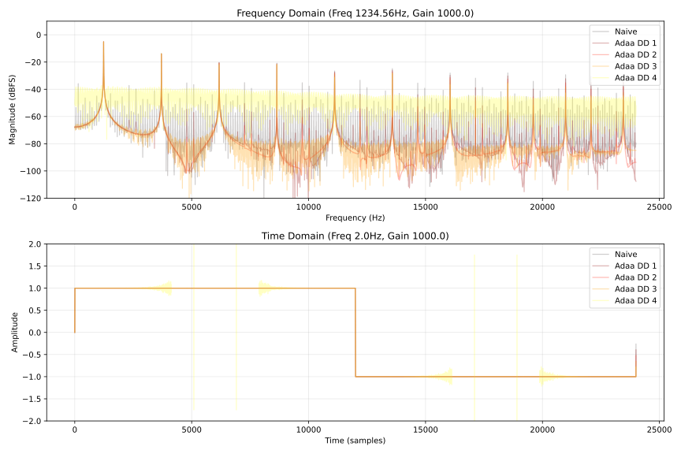

# 有限差分に基づく ADAA の誤差
この文章の主な目的は有限差分に基づく antiderivative antialiasing (ADAA) の誤差を洗い出して、使いどころをはっきりさせることです。 ADAA は連続系でローパスフィルタをかけた信号を離散系で近似的に微分することで周波数領域でのエイリアシングを減らす手法のことです。

高次の ADAA を計算する方法を調べていたところ divided difference に基づく一般化の方法を見つけました。 Divided difference に基づく方法は [Bilbao らの有限差分に基づく方法](https://drive.google.com/file/d/1SaqbMpxitC8QECkF3OfzHu7cDCnmpzY7/view)と似ていますが、 3 次以上の実装がフォールバックも含めて簡潔に行えるという長所があります。様々な非線形関数を試してみたところ 2 次以上の ADAA には計算誤差の問題があることが経験的にわかりました。この文章の主な目的は理論的な誤差の導出です。

ここでは行いませんが ADAA は非線形関数ごとに特殊化して計算するのが妥当です。

## 記号
記号が多いのでまとめました。 <kbd>Ctrl</kbd> + <kbd>F</kbd> などでハイライトすると楽です。

- $a, b$ : プレースホルダー。
- $x$ : 入力信号。
- $y$ : 出力信号。
- $i, j$ : 時間のインデックス。サンプル数。
- $f$ : アンチエイリアシングを行う関数。
- $F_k$ : $f$ の $k$ 階逆微分 (antiderivative) 。
- $e_i$ : $F_k(x_i)$ の誤差。
- $N$ : ADAA の次数。
- $n$ : 計算中の ADAA のステージ。
- $R$ : 差分の相対誤差。
- $D_{n,i}$ : Divided difference の $n$ ステージ目、インデックス $i$ についての真値。
- $E_{n,i}$ : Divided difference の $n$ ステージ目、インデックス $i$ についての誤差。
- $h_{i,j}$ : 入力の差。 $x_i - x_j$ 。インデックスを省略することがある。
- $p$ : フォールバックの中点近似の次数。
- $m$ : 中点近似の中点。

$\phi$ は divided difference 内の再帰を表す関数。 $f^{(a)}$ のように丸括弧 $()$ で囲った上付き文字は $a$ 階微分。

$$
\phi^{(p)}(x) = \begin{cases}
F_{n-p}(x)   & p \le n, \\
f^{(p-n)}(x) & p > n.
\end{cases}
$$

## 有限差分に基づく ADAA
以下は Bilbao らの "[Antiderivative antialiasing for memoryless nonlinearities](https://drive.google.com/file/d/1SaqbMpxitC8QECkF3OfzHu7cDCnmpzY7/view)" の式 14 から 16 に記載されている ADAA です。

$$
\begin{aligned}
y^n
&= \frac{F_1^n - F_1^{n-1}}{x^n - x^{n-1}},
&& \text{(order 1)}. \\
y^n
&= \frac{2}{x^n - x^{n-2}} \left(
  \frac{F_2^n - F_2^{n-1}}{x^n - x^{n-1}} - \frac{F_2^{n-1} - F_2^{n-2}}{x^{n-1} - x^{n-2}}
\right),
&& \text{(order 2)}. \\
y^n
&= \frac{1}{x^{n-1} - x^{n-2}} \left[
  \frac{2}{x^n - x^{n-2}} \left(
    \frac{F_3^n - F_3^{n-1}}{x^n - x^{n-1}} - \frac{F_3^{n-1} - F_3^{n-2}}{x^{n-1} - x^{n-2}}
  \right)
  -
  \frac{2}{x^{n-1} - x^{n-3}} \left(
    \frac{F_3^{n-1} - F_3^{n-2}}{x^{n-1} - x^{n-2}} - \frac{F_3^{n-2} - F_3^{n-3}}{x^{n-2} - x^{n-3}}
  \right)
\right],
&& \text{(order 3)}. \\
\end{aligned}
$$

論文との整合性を保つために、上の式だけ他の式と記号の表記が異なっています。上付き文字が時間のインデックス、下付き文字が逆微分の階数 ($k$ と対応) です。

これらの式は [divided difference の Peano form](https://en.wikipedia.org/wiki/Divided_differences#Peano_form) と似ています。

$$
\begin{aligned}
0! f[x_0] &= f(x_0).
\\
1! F_1[x_0,x_1] &= \frac{F_1(x_1)-F_1(x_0)}{x_1-x_0}.
\\
2! F_2[x_0,x_1,x_2] &= 2 \frac{F_2[x_1,x_2]-F_2[x_0,x_1]}{x_2-x_0}
= 2 \frac{
    \left(\cfrac{F_2(x_2)-F_2(x_1)}{x_2-x_1}\right)
  - \left(\cfrac{F_2(x_1)-F_2(x_0)}{x_1-x_0}\right)
}{x_2-x_0}.
\\
3! F_3[x_0,x_1,x_2,x_3] &= 6 \frac{F_3[x_1,x_2,x_3]-F_3[x_0,x_1,x_2]}{x_3-x_0}
= 6 \frac{
  \left(\cfrac{
      \left(\cfrac{F_3(x_3)-F_3(x_2)}{x_3-x_2}\right)
    - \left(\cfrac{F_3(x_2)-F_3(x_1)}{x_2-x_1}\right)
  }{x_3-x_1}\right)
  - \left(\cfrac{
      \left(\cfrac{F_3(x_2)-F_3(x_1)}{x_2-x_1}\right)
    - \left(\cfrac{F_3(x_1)-F_3(x_0)}{x_1-x_0}\right)
  }{x_2-x_0}\right)
}{x_3-x_0}.
\end{aligned}
$$

2 次までは等価です。 3 次からは有限差分のかけ方が異なるので式が変わります。以下は divided difference による ADAA の一般的な形です。 $B$ は [B-spline](https://en.wikipedia.org/wiki/B-spline) です。

$$
\begin{aligned}
n! F_n[x_0, x_1, \dots]
&= \sum_{i=0}^{n-1} \left( \int_{x_i}^{x_{i+1}} B_{i,n-1}(t) f(t) dt \right) \\
&= \sum_{i=0}^{n-1} (x_{i+1} - x_i) \int_0^1 \bar{B}_{i,n-1}(u) f\big(x_i + u(x_{i+1} - x_i)\big) du.
\end{aligned}
$$

Divided difference に基づく ADAA ではローパスフィルタとして B-spline カーネルを畳み込んでいると言えます。

## 計算方法
再帰の部分を $S$ とします。

$$
S_{i,j} = F_N [ x_i, \dots, x_j ].
$$

以下は計算方法を示した表です。 $n=1$ のときだけ明示的に展開して書いています。

|        | n=1                                        | n=2                                                | n=3                                                | ... |
|--------|--------------------------------------------|----------------------------------------------------|----------------------------------------------------|-----|
| time=0 | $S_{0, -1} = F_N [x_0, x_{-1}] / h_{0,-1}$ | $S_{0, -2} = (S_{0, -1} - S_{-1, -2}) / h_{0, -2}$ | $S_{0, -3} = (S_{0, -2} - S_{-1, -3}) / h_{0, -3}$ | ... |
| time=1 | $S_{1,  0} = F_N [x_1, x_0   ] / h_{1,0}$  | $S_{1, -1} = (S_{1,  0} - S_{ 0, -1}) / h_{1, -1}$ | $S_{1, -2} = (S_{1, -1} - S_{ 0, -2}) / h_{1, -2}$ | ... |
| time=2 | $S_{2,  1} = F_N [x_2, x_1   ] / h_{2,1}$  | $S_{2,  0} = (S_{2,  1} - S_{ 1,  0}) / h_{2,  0}$ | $S_{2, -1} = (S_{2,  0} - S_{ 1, -1}) / h_{2, -1}$ | ... |
| time=3 | $S_{3,  2} = F_N [x_3, x_2   ] / h_{3,2}$  | $S_{3,  1} = (S_{3,  2} - S_{ 2,  1}) / h_{3,  1}$ | $S_{3,  0} = (S_{3,  1} - S_{ 2,  0}) / h_{3,  0}$ | ... |
| ⋮      | ⋮                                          | ⋮                                                  | ⋮                                                  | ⋱   |

以下は変数の依存関係を示した図です。

<figure>

</figure>

時刻 $t$ において $x_t$ が与えられたとき、上の表を左上から横書きする順に計算を行えば値が求まります。負のインデックスを持つ $x$ を 0 に初期化するならインデックスが両方とも負の値の $S$ も 0 です。 $x$ と $S$ は長さ $N$ のリングバッファとして実装できます。

## 桁落ちの誤差
有限差分に基づく ADAA は減算と除算が入れ子になっているので、桁落ち ([catastrophic cancellation](https://en.wikipedia.org/wiki/Catastrophic_cancellation)) による誤差が再帰的に増幅されます。桁落ちの相対誤差は以下のように定義されています。 $a, b$ は何らかの真値、 $\delta_a$ は $a$ に付随する誤差、 $\delta_b$ は $b$ に付随する誤差です。

$$
\begin{aligned}
\mathrm{subtraction}(a, b) &= a - b \\
&\approx a (1 + \delta_a) - b (1 + \delta_b)
= (a - b) \left( 1 + \frac{a \delta_a - b \delta_b}{a - b} \right).
\end{aligned}
$$

減算の相対誤差を関数にします。

$$
R(a, b) = \dfrac{a \delta_a - b \delta_b}{a - b}.
$$

以降では $x$ について以下の表記を使います。

$$
R_{i,j} = R(x_i, x_j).
$$

## 1 次の Divided Difference の誤差
Divided difference の真値を以下のように定義します。

$$
D_{k,i} = k! F_k [ x_i, \dots, x_{i+k} ].
$$

$F_1(x_n) \approx y_n + e_n$ とします。 $y_n$ は真値、 $e_n$ は $F_1(x_n)$ の計算によって現れる絶対誤差で、近似誤差と丸め誤差を両方含んでいます。 $h_{i,j} = x_i - x_j$ です。

$$
D_{1,0} = \frac{F_1(x_1) - F_1(x_0)}{x_1 - x_0}
\approx \frac{(y_1 - y_0) + (e_1 - e_0)}{h_{1,0}(1 + R_{1,0})} = \hat{D}_{1,0}.
$$

$|R_{1,0}| < 1$ として $\dfrac{1}{1 + R_{1,0}}$ をテイラー展開して分母から $R_{1,0}$ を動かします。 $R$ は相対誤差なので通常は 1 以上とはなりません。

$$
\dfrac{1}{1 + R_{1,0}} = \sum_{i=0}^\infty (-R_{1,0})^i = 1 - R_{1,0} + R_{1,0}^2 - R_{1,0}^3 + \dots
$$

これで真値 $D_1$ と誤差を分けられます。

$$
\begin{aligned}
\hat{D}_{1,0}
&\approx \left( D_{1,0} + \frac{e_1 - e_0}{h_{1,0}} \right) (1 - R_{1,0} \dots) \\
&= (D_{1,0} + E_{1,0}) (1 - R_{1,0} \dots).
\end{aligned}
$$

## 2 次以降の Divided Difference の誤差
2 次の divided difference の真値を以下のように表します。 $D$ の内部で計算される関数が $F_1$ から $F_2$ に変わります。

$$
D_{2,0} = 2 \frac{D_{1,1} - D_{1,0}}{h_{2,0}}.
$$

誤差を含む 1 次の divided difference の値を再掲します。

$$
\hat{D}_{1, i} = (D_{1,0} + E_{1,0}) (1 - R_{1,0} \dots), \quad i \in \{0, 1\}.
$$

2 次の divided difference の計算値を求めます。

$$
\begin{aligned}
D_{2,0} &= 2 \frac{\hat{D}_{1,1} - \hat{D}_{1,0}}{x_2 - x_0} \\
&\approx 2 \frac{(D_{1,1} - D_{1,0}) + (E_{1,1} - E_{1,0})}{h_{2,0}(1 + R_{2,0})} \\
&= \left( D_{2,0} + 2 \frac{E_{1,1} - E_{1,0}}{h_{2,0}} \right) (1 - R_{2,0} + \dots) \\
&= \left( D_{2,0} + E_{2,0} \right) (1 - R_{2,0} + \dots) = \hat{D}_{2,0}.
\end{aligned}
$$

規則性が見えます。

$$
\hat{D}_{N,0} \approx \left( D_{N,0} + E_{N,0} \right) (1 - R_{N,0} + \dots),
\quad
E_{N,i} = \begin{cases}
\cfrac{e_{i+1} - e_i}{h_{i+1,i}}, & N = 1\\
N \cfrac{E_{N-1,i+1} - E_{N-1,i}}{h_{N+i,i}}, & N > 1. \\
\end{cases}
$$

## 分析
誤差を含む値の式を再掲します。

$$
\begin{aligned}
\hat{D}_{1,0} &\approx (D_{1,0} + E_{1,0}) (1 - R_{1,0} \dots) \\
\hat{D}_{2,0} &\approx (D_{2,0} + E_{2,0}) (1 - R_{2,0} \dots) \\
\hat{D}_{3,0} &\approx (D_{3,0} + E_{3,0}) (1 - R_{3,0} \dots) \\
&\vdots
\end{aligned}
$$

$\hat{D}_{1,0}$ の誤差を取り出します。

$$
\hat{D}_{1,0} - D_{1,0}
= \left(
  D_{1,0} + \frac{e_1 - e_0}{h_{1,0}}
\right) (1 - R_{1,0} \dots) - D_{1,0}.
$$

$F_1$ が $C^0$ continuous であれば $h_{1,0} \to 0$ のとき $e_1 - e_0 \to 0$ です。このとき $F_1$ の近似精度が高く $e_1 - e_0 \ll h_{1,0}$ であれば、ある程度は 0 に近づいても正確です。丸め誤差によって $e_1 - e_0$ がすべて 0 になることは無いので、 $h_{1,0}$ が $0$ に近いと誤差の爆発は防げません (ill-conditioned) 。 $F_1$ が $C^0$ continuous でないときは $F_1(x_1)$ と $F_1(x_0)$ の間に不連続点があると爆発します。

$1 + R_{1,0} \cdots$ は $\dfrac{1}{1 + R_{1,0}}$ のテイラー展開であるため、 $R_{1,0} \to -1$ のときに誤差が増幅されます。

$$
R_{1,0} = R(x_1, x_0) = \frac{x_1 \delta_1 - x_0 \delta_0}{h_{1,0}}.
$$

$D_{1,0}$ の項を括り直します。

$$
D_{1,0} (1 - R_{1,0} \dots) - D_{1,0}
= D_{1,0} \left(\frac{1}{1 + R_{1,0}} - 1 \right)
= -D_{1,0} \frac{1}{(1 / R_{1,0}) + 1}.
$$

つまり $E = 0$ という都合の良い条件を仮定しても $R_{1,0} \le -\dfrac{1}{2}$ のときに誤差が増幅されます。

$N$ 次のときの誤差を取り出します。

$$
\hat{D}_{N,0} - D_{N,0}
= \left(
  D_{N,0} + N \frac{E_{N-1,1} - E_{N-1,0}}{h_{N,0}}
\right) (1 - R_{N,0} \dots) - D_{N,0}.
$$

$h_{N,0} \to 0$ のときに $E$ が増幅されます。 $E$ の内部ではインデックスの異なる $h$ が分母に来るため、誤差のオーダーはざっくりと $O \left(\dfrac{1}{h^N}\right), |h| \ll 1$ です。つまり、入力 $x$ がほぼ一定のとき divided difference の誤差は爆発します。

以下は大まかに誤差の入れ子を表した形です。例なので片側だけ展開して残りは $\circ$ とし、記号のインデックスを省略しています。

$$
\frac{\cfrac{\cfrac{\cfrac{\cfrac{\left(\cfrac{e}{h (1 + R)} - D\,\text{term} \right) + \circ}{\ddots} + \circ}{h (1 + R)} + \circ}{h (1 + R)} + \circ}{h (1 + R)} + \circ}{h (1 + R)} - D\,\text{term}.
$$

## フォールバック
$h$ が 0 に近いときは中点近似 (midpoint approximation) を使います。 Divided difference の 1 ステージあたりの計算式は以下の形をしています。 $n$ は計算中のステージ 、 $\phi$ は $F_n$ か $\hat{D}_n$ です。

$$
s_n = \frac{\phi(x_i) - \phi(x_j)}{h}.
$$

$\phi(x_i)$ と $\phi(x_j)$ を中点 $m$ の周りでテイラー展開します。 $m = \dfrac{x_i + x_j}{2}$ です。

$$
\phi(x_i)
= \phi\left(m + \frac{h}{2}\right)
= \phi(m) + \phi^{(1)}(m)\left(\frac{h}{2}\right) + \frac{\phi^{(2)}(m)}{2!}\left(\frac{h}{2}\right)^2 + \frac{\phi^{(3)}(m)}{3!}\left(\frac{h}{2}\right)^3 + \dots
$$

$$
\phi(x_j)
= \phi\left(m - \frac{h}{2}\right)
= \phi(m) - \phi^{(1)}(m)\left(\frac{h}{2}\right) + \frac{\phi^{(2)}(m)}{2!}\left(\frac{h}{2}\right)^2 - \frac{\phi^{(3)}(m)}{3!}\left(\frac{h}{2}\right)^3 + \dots
$$

$s_n$ に代入します。偶数次の項は消えます。

$$
\begin{aligned}
\frac{\phi(x_i) - \phi(x_j)}{h}
&= \frac{2}{h}\left[ \phi^{(1)}(m)\frac{h}{2} + \frac{\phi^{(3)}(m)}{3!} \left(\frac{h}{2}\right)^3 + \frac{\phi^{(5)}(m)}{5!} \left(\frac{h}{2}\right)^5 + \dots \right] \\
&= \phi^{(1)}(m) + \frac{\phi^{(3)}(m)}{3!\,2^{3-1}} h^2 + \frac{\phi^{(5)}(m)}{5!\,2^{5-1}} h^4 + \dots \\
&= \sum_{p\,\in\,\text{odd}} \frac{\phi^{(p)}(m)}{p!\,2^{p-1}} h^{p - 1}.
\end{aligned}
$$

7 次まで展開します。

$$
s_n = \phi^{(1)}(m) + \frac{h^2}{24} \phi^{(3)} + \frac{h^4}{1920} \phi^{(5)} + \frac{h^6}{322560} \phi^{(7)} + \dots
$$

## フォールバックへの分岐点
分岐点となる $h$ を決める関数を組み立てます。

以下はフォールバック側の近似を $p$ 次で打ち切ったときの、誤差のおよその上限です。 $|h| \ll 1$ であれば、打ち切った次の次数の項で誤差を近似できます。以降では $\phi$ の引数 $(m)$ を省略します。

$$
E_{\text{fallback}} \approx \frac{h^{p+1}}{(p+2)!\,2^{p+1}} |\phi^{(p+2)}(m)|.
$$

Divided difference の $n$ ステージ目での誤差を再掲します。

$$
E_{\text{DD}}
= \left(
  D_{n,0} + \frac{E_{n-1,1} - E_{n-1,0}}{h_{n,0}}
\right) \frac{1}{1 + R_{n,0}} - D_{n,0}.
$$

フォールバック側の誤差 $E_{\text{fallback}}$ が divided difference 側の誤差 $E_{\text{DD}}$ より小さくなる点が分岐点です。

$$
E_{\text{fallback}} < E_{\text{DD}}.
$$

Maxima で解きます。 $h = h_{n,0}$ とします。

```maxima
E_fallback: h^(p+1) / ((p + 2)! * 2^(p+1)) * abs(phi^(p+2));
E_DD: (D(n, 0) + (E(n-1, 1) - E(n-1, 0)) / h) / (1 + R(n, 0)) - D(n, 0);
solve(E_fallback = E_DD, h);
```

整形した出力です。解けていません。

$$
h <
  \frac{E_{n-1,1} - E_{n-1,0}}{D_{n,0} R_{n,0}}
- \frac{2^{-p-1} |\phi^{(p+2)}|}{(p+2)! D_{n,0}} \cdot \frac{R_{n,0} + 1}{R_{n,0}} \cdot h^{p+2}
.
$$

### $|h| \ll 1$
$|h| \ll 1$ なら $h^{p+2}$ の項は無視できます。

$$
h < \frac{E_{n-1,1} - E_{n-1,0}}{D_{n,0} R_{n,0}}.
$$

分母の誤差が最悪となるケースを $E_{n-1,1} - E_{n-1,0} \approx 2 E_{n-1}$ とします。 $e$ は $F_n$ の誤差の最大値です。

$$
\begin{aligned}
E_1 &\le \frac{2e}{h} \\
E_2 &\le \frac{2 E_1}{h} = \frac{2^2 e}{h^2} \\
E_3 &\le \frac{2 E_1}{h} = \frac{2^3 e}{h^3} \\
&\vdots \\
E_n &\le \frac{2 E_{n-1}}{h} = \frac{2^n e}{h^n}.
\end{aligned}
$$

代入して解きます。

$$
h < \left( \frac{2^n e}{D_{n,0} R_{n,0}} \right)^{1 / (1+n)}.
$$

この不等式が真のとき、中点近似にフォールバックします。この形は $D, R$ が含まれているので実用性が低いです。十分な精度の $D$ を求めるには任意精度計算が必要ですが、そもそも任意精度計算ができるならフォールバックしなくていいです。

### $|h| < 1$
分岐点の不等式を再掲します。

$$
h <
  \frac{E_{n-1,1} - E_{n-1,0}}{D_{n,0} R_{n,0}}
- \frac{2^{-p-1} |\phi^{(p+2)}|}{(p+2)! D_{n,0}} \cdot \frac{R_{n,0} + 1}{R_{n,0}} \cdot h^{p+2}
.
$$

適当に $R \to 0$ とします。

$$
D_{n,0} R_{n,0} h =
  E_{n-1,1} - E_{n-1,0}
- \frac{2^{-p-1} |\phi^{(p+2)}|}{(p+2)!} \cdot (R_{n,0} + 1) \cdot h^{p+2}.
$$

$$
h^{p+2} < \frac{(p+2)!}{2^{-p-1} |\phi^{(p+2)}|} \left( E_{n-1,1} - E_{n-1,0} \right).
$$

$E_{n-1,1} - E_{n-1,0} \approx 2 E_{n-1}$ とします。

$$
h^{p+2} < 2^{p+2} (p+2)! \frac{E_{n-1}}{|\phi^{(p+2)}|}.
$$

$E_{n-1} = \dfrac{2^{n-1}}{h^{n-1}} e$ を代入して整理します。

$$
h < 2 \left( (p+2)! \frac{e}{|\phi^{(p+2)}|} \right)^{1 / (p + n + 1)}.
$$

$|\phi^{(p+2)}|$ が扱いづらいです。例えば音楽で歪みを加えることが目的であれば \[-1, 1\] の範囲に振幅が収まっている信号に対して +60 dB のゲインをかけるので入力信号の最大振幅は 1e+3 、といった形での仮定ができます。しかし、これだと $|h| \ge 1$ となるので中点近似が収束しません。現実的には任意精度実装と比較しながら決めるしかないように思えます。

<details>
<summary>分岐点での誤差を比較するコード</summary>

```python
import math
import sys

def branching_point(p, n, e=sys.float_info.epsilon, phi=1):
    """Assuming |h| < 1. This may not work for |h| >= 1."""
    return 2 * (math.factorial(p + 2) * e / phi)**(1 / (p + n + 1))

def fallback_error(h, p, e=sys.float_info.epsilon, phi=1):
    return phi * h**(p - 1) / (math.factorial(p) * 2**(p - 1))

def compare(p, n, phi=1):
    h = branching_point(p, n, phi=phi)
    t = fallback_error(h, p, phi=phi)
    print(f"{h:.2e}, {t:.2e}, h > t: {h > t}")
```

</details>

### 問題点
式変形のために $F_n$ の絶対誤差を導入したのですが、分岐点を決める式はそれが仇となって入力信号の振幅が大きいときに対応できない形になっています。相対誤差を使うと以下のような形になります。

$$
D_{1,0} = \frac{F_1(x_1) - F_1(x_0)}{x_1 - x_0}
\approx \frac{(F_1(x_1) - F_1(x_0)) (1 + R_F)}{(x_1 - x_0) (1 + R_x)} = D_{1,0} \frac{1 + R_F}{1 + R_x}.
$$

$|R_x| < 1$ なので $\dfrac{1}{1 + R_x}$ をテイラー展開できます。

$$
\begin{aligned}
E_{\text{rel},1} = D_{1,0} \frac{1 + R_F}{1 + R_x} - D_{1,0}
&= D_{1,0} \left( (1 + R_F) (1 - R_x \dots) - 1 \right) \\
&= D_{1,0} \left( (1 + R_F) ( - R_x \dots) + R_F \right).
\end{aligned}
$$

ここから $D$ を消す方法がわからないです。

## 実装例
Python による実装例です。分岐点は中点近似側の $\phi$ を 1 、許容誤差を $\sqrt{\epsilon}$ として固定しています。 divided difference 側の誤差が分岐点の近くで大きくなるケースについては無視しています。

```python
import math
import sys

class Adaa_DividedDifference:
    def __init__(self, order, funcs):
        """funcs.fN are N-th antiderivatives. funcs.gN are N-th derivatives."""
        self.order = order
        self.funcs = funcs
        self.x = [0.0] * order
        self.f = [0.0] * order

        e = math.sqrt(sys.float_info.epsilon)
        self.threshold = (1920 * e) ** (1 / 5)

        self.reset()

    def _call_f(self, n, val):
        return getattr(self.funcs, f"f{n}")(val)

    def _call_correction(self, n, val):
        return self._call_f(n, val) if n >= 0 else getattr(self.funcs, f"g{-n}")(val)

    def reset(self, input_val=0.0):
        self.x = [input_val] * self.order
        self.f = [self._call_f(self.order - i, input_val) for i in range(self.order)]

    def process(self, input_val):
        curr = self._call_f(self.order, input_val)
        next_f = [0.0] * self.order

        for step in range(self.order):
            target = self.order - 1 - step
            next_f[step] = curr
            d = input_val - self.x[step]

            if abs(d) < self.threshold:
                mid = (input_val + self.x[step]) * 0.5
                curr = self._call_f(target, mid) + (
                    (d * d) / 24.0
                ) * self._call_correction(target - 2, mid)
                curr *= step + 1
            else:
                curr = (step + 1) * (curr - self.f[step]) / d

        self.f = next_f
        self.x = [input_val] + self.x[:-1]
        return curr
```

ハードクリップで試してみます。

```python
class Hardclip:
    @staticmethod
    def f0(x):
        if x <= -1.0:
            return -1.0
        if x >= 1.0:
            return 1.0
        return x

    @staticmethod
    def f1(x):
        z = abs(x)
        if z < 1.0:
            return 0.5 * x * x
        return z - 0.5

    @staticmethod
    def f2(x):
        if abs(x) < 1.0:
            return (x * x * x) / 6.0
        s = 1.0 if x >= 0 else -1.0
        return (s * x - 1) * x / 2 + s / 6

    @staticmethod
    def f3(x):
        x2 = x * x
        if x2 < 1.0:
            return (x2 * x2) / 24.0
        s = 1.0 if x >= 0 else -1.0
        return (((s * 4 * x - 6) * x + s * 4) * x - 1) / 24

    @staticmethod
    def f4(x):
        z = abs(x)
        if z < 1.0:
            return (x**5) / 120.0
        s = 1.0 if x >= 0 else -1.0
        return s * (((((z - 2.0) * z + 2.0) * z - 1.0) * z / 24.0) + 1.0 / 120.0)

    @staticmethod
    def g1(x):
        if abs(x) >= 1.0:
            return 0.0
        return 1.0

    @staticmethod
    def g2(x):
        return 0.0
```

以下は結果の一例です。上は 1234.56 Hz のサイン波にゲイン 1e+3 をかけたときの周波数領域での振幅のプロット、下は 2 Hz のサイン波にゲイン 1e+3 をかけたときの時間領域での振幅のプロットです。サイン波の山と谷の部分、つまり位相が $1/2\pi$ と $3/2\pi$ の周りで 3 次以上の ADAA は値がおかしくなっています。計算誤差によるノイズやスパイクが途切れているように見えるのは中点近似の分岐に切り替わっているからです。ゲインを上げると中点近似でカバーできる範囲が狭まるため、状況が悪化します。 2 次の ADAA についてはゲインが 1e+5 を超えるあたりからプロット上でズームすると計算誤差によるノイズが見えます。

<figure>

</figure>


## 一般的な ADAA と特殊化の方針
Parker らによる "[Reducing the Aliasing of Nonlinear Waveshaping using Continuous-Time Convolution](https://dafx16.vutbr.cz/dafxpapers/20-DAFx-16_paper_41-PN.pdf)" の式 12 (§3, p.139) より、一般的な ADAA の式は以下のように書けます。

$$
y = \sum_{i=0}^{N-1} \int_0^1 A_i(t) f(x_i + t (x_{i+1} - x_i)) dt.
$$

- $y$ : 出力信号 (1 サンプル) 。
- $x$ : 入力信号。
- $N$ :  ADAA の次数。
- $i$ : サンプル数で表された相対的な時刻。 $i + j$ は $j$ サンプル前を表す。
- $A$ : 畳み込むフィルタ関数。
- $f$ : アンチエイリアシングを行う非線形関数。

ADAA の特殊化とは、 $y$ の積分を解いて、式変形によって安定して計算できる形を探すことです。

## 参考文献
- [Divided difference - Wikipedia](https://en.wikipedia.org/wiki/Divided_differences)
- [Divided Difference -- from Wolfram MathWorld](https://mathworld.wolfram.com/DividedDifference.html)
- [Peano kernel theorem - Wikipedia](https://en.wikipedia.org/wiki/Peano_kernel_theorem)
- [B-spline - Wikipedia](https://en.wikipedia.org/wiki/B-spline)
- Parker, J. D., Zavalishin, V., & Le Bivic, E. (2016, September). [Reducing the aliasing of nonlinear waveshaping using continuous-time convolution](https://dafx16.vutbr.cz/dafxpapers/20-DAFx-16_paper_41-PN.pdf). In Proc. Int. Conf. Digital Audio Effects (DAFx-16), Brno, Czech Republic (pp. 137-144).
- Bilbao, S., Esqueda, F., Parker, J. D., & Välimäki, V. (2017). [Antiderivative antialiasing for memoryless nonlinearities](https://drive.google.com/file/d/1SaqbMpxitC8QECkF3OfzHu7cDCnmpzY7/view). IEEE Signal Processing Letters, 24(7), 1049-1053.
