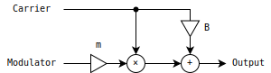
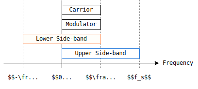

# AM のアンチエイリアシング
AM (amplitude modulation) のアンチエイリアシングを行います。入力信号は音声です。

## 略称
- 振幅変調 -> AM (amplitude modulation)
- 両側波帯 -> DSB (double side-band)
- 単側波帯 -> SSB (single side-band)
- 上側波帯 -> USB (upper side-band)
- 下側波帯 -> LSB (lower side-band)

両側波帯は素朴な AM と等価。

## 素朴な AM
以下は素朴な AM のブロック線図です。

<figure>

</figure>

以下はキャリアとモジュレータがどちらもサイン波のときの AM の式です。キャリアの振幅を 1 に正規化しています。

$$
\begin{aligned}
x_c(t) &= \sin(\omega_c t), \\
x_m(t) &= m \cos(\omega_m t + \phi), \\
y(t)
&= \big( B + x_m(t) \big) x_c(t) \\
&= B \sin(\omega_c t) + \frac{m}{2} \Big(
    \sin \big( (\omega_c + \omega_m) t + \phi \big)
  + \sin \big( (\omega_c - \omega_m) t - \phi \big)
\Big).
\end{aligned}
$$

- $t$ : 時間。
- $y$ : 出力信号。
- $x_c$ : キャリア信号。
- $x_m$ : モジュレータ信号。
- $\omega_c$ : キャリアの角周波数。
- $\omega_m$ : モジュレータの角周波数。
- $\phi$ : キャリアとモジュレータの位相差。
- $B$ : 出力にキャリアを混ぜる量。
- $m$ : モジュレータの振幅。

$B$ と $m$ によって変調の特性が変わります。参考にした [Wikipedia の記事](https://en.wikipedia.org/wiki/Amplitude_modulation)では $B = 1$ としています。

ここで上側波帯の成分と、下側波帯の成分を以下のようにまとめます。

$$
\begin{aligned}
U(t) &= \sin \big( (\omega_c + \omega_m) t + \phi \big). \\
L(t) &= \sin \big( (\omega_c - \omega_m) t - \phi \big). \\
\end{aligned}
$$

$U$ と $L$ を使えば出力 $y$ を以下のように書けます。

$$
y(t) = B x_c(t) + \frac{m}{2} \Big( U(t) + L(t) \Big).
$$

素朴な AM は、以下で紹介するシングルサイドバンドと区別するために、ダブルサイドバンドと呼ばれることがあります。

## シングルサイドバンド
キャリアとモジュレータを [analytic signal](https://en.wikipedia.org/wiki/Analytic_signal) に変換できれば上側波帯あるいは下側波帯のみを取り出すことができます。 Analytic signal は以下の式で計算できます。

$$
\mathtt{analytic} = x + j \mathcal{H}(x).
$$

- $\mathcal{H}$ : ヒルベルト変換。

以下はシングルサイドバンド AM の計算式です。

$$
\begin{aligned}
U(t)
&= \mathrm{Re}(\hat{x}_c) \mathrm{Re}(\hat{x}_m) - \mathrm{Im}(\hat{x}_c) \mathrm{Im}(\hat{x}_m)
= x_c x_m - \mathcal{H}(x_c) \mathcal{H}(x_m).
\\
L(t)
&= \mathrm{Re}(\hat{x}_c) \mathrm{Re}(\hat{x}_m) + \mathrm{Im}(\hat{x}_c) \mathrm{Im}(\hat{x}_m)
= x_c x_m + \mathcal{H}(x_c) \mathcal{H}(x_m).
\end{aligned}
$$

- $U$ : 上側波帯のみの出力信号。
- $L$ : 下側波帯のみの出力信号。
- $\hat{x}_c$ : キャリア信号の analytic signal 。
- $\hat{x}_m$ : モジュレータ信号の  analytic signal 。

$U$ と $L$ の式は analytic signal の定義より $\mathrm{Re}(\hat{x}_c) \mathrm{Re}(\hat{x}_m) = x_c x_m$ と簡略化できます。しかし、リアルタイムで動作する analytic signal への変換を近似するフィルタ (Hilbert フィルタ) では実部の信号も変化するので、実装では簡略化する前の形を使うことがあります。 Hilbert フィルタについては「[AM による周波数シフト](https://ryukau.github.io/filter_notes/am_pitchshift/am_pitchshift.html)」で実装例を紹介しています。

以下は `scipy.signal.hilbert` を使った Python 3 によるシングルサイドバンド AM の実装です。

```python
import scipy.signal as signal
import numpy as np

def upperAM(carrior, modulator):
    c0 = signal.hilbert(carrior)
    m0 = signal.hilbert(modulator)
    return c0.real * m0.real - c0.imag * m0.imag

def lowerAM(carrior, modulator):
    c0 = signal.hilbert(carrior)
    m0 = signal.hilbert(modulator)
    return c0.real * m0.real + c0.imag * m0.imag
```

以下はリアルタイム向けの実装へのリンクです。

- [C++ によるシングルサイドバンド AM の実装 (github.com)](https://github.com/ryukau/UhhyouPluginsJuce/blob/de064bf68c1a7080251cad3ba075fdf2472d6a1a/AmplitudeModulator/dsp/am.hpp#L324-L364)
- [JavaScript によるシングルサイドバンド AM の実装 (github.com)](https://github.com/ryukau/UhhyouWebSynthesizers/blob/4c1fd63413b2626fd4cd0f224029c45d9cfbc8e7/common/dsp/analyticsignalfilter.js#L85-L102)

## アンチエイリアシング
音声信号は直流からナイキスト周波数までの全帯域が使われることが普通です。したがって AM をかけると全帯域に渡るエイリアシングが起きます。

以下は処理の各段階で現れる信号の周波数帯を示した図です。ここでのアンチエイリアシングは $\left[ -\dfrac{1}{2} f_s, 0 \right)$ と $\left[ \dfrac{1}{2} f_s, f_s \right)$ の成分を 0 にします。実装では [`rfft`](https://numpy.org/doc/stable/reference/generated/numpy.fft.rfft.html) を使うので負の周波数は扱っていません。

<figure>

</figure>

#### 上側波帯
上側波帯は 1.5 倍のアップサンプリングを行った後に変調することでアンチエイリアシングができます。以下の図の $\dfrac{3}{4} f_s$ が 1.5 倍のアップサンプリング後のナイキスト周波数です。赤で塗りつぶした部分が折り返しますが、ダウンサンプリングで $\left[ \dfrac{1}{2} f_s, \dfrac{3}{4} f_s \right)$ の範囲を 0 にするので $\left[ 0, \dfrac{1}{2} f_s \right)$ の範囲には折り返しません。

<figure>

</figure>

以下はリアルタイム向けの処理のブロック線図です。効率よく 1.5 倍のアップサンプリングを行う方法がわからないので 2 倍のアップサンプリングを使っています。

<figure>

</figure>

以下は Python 3 によるオフライン実装です。

```python
def antiAliasedUpperAM(carrior, modulator):
    upCar = signal.resample(carrior, 2 * len(carrior))
    upMod = signal.resample(modulator, 2 * len(modulator))
    return signal.resample(upperAM(upCar, upMod), len(carrior))
```

以下は `signal.resample` をリアルタイムで動く[ハーフバンド楕円フィルタ](https://ryukau.github.io/filter_notes/iir_halfband_decimator/iir_halfband_decimator.html)に置き換えた実装へのリンクです。

- [C++ による USB-AM の実装 (github.com)](https://github.com/ryukau/UhhyouPluginsJuce/blob/de064bf68c1a7080251cad3ba075fdf2472d6a1a/AmplitudeModulator/dsp/am.hpp#L366-L390)

#### 下側波帯
下側波帯は以下の手順でアンチエイリアシングができます。 $f_N$ は元の信号のナイキスト周波数です。

1. 2 倍のアップサンプリング。
2. $f_N$ の周波数シフト。
3. $[0, f_N)$ の成分をハイパスで除去。
4. $-f_N$ の周波数シフト。
5. 1/2 倍のダウンサンプリング。

周波数シフトについては「[AM による周波数シフト](https://ryukau.github.io/filter_notes/am_pitchshift/am_pitchshift.html)」で手法を紹介しています。

以下はリアルタイム向けの処理のブロック線図です。

<figure>

</figure>

以下は Python 3 によるオフライン実装です。

```python
def applySpectrumBandpass(sig, lowerCutoff, upperCutoff):
    spectrum = np.fft.rfft(sig)

    # Highpass.
    lowerIndex = int(len(spectrum) * 2 * lowerCutoff)
    spectrum[: min(lowerIndex, len(spectrum))] = 0

    # Lowpass.
    upperIndex = int(len(spectrum) * 2 * upperCutoff)
    spectrum[max(0, upperIndex) :] = 0

    return np.fft.irfft(spectrum)

def frequencyShift(sig, normalizedFreq):
    analytic = signal.hilbert(sig)
    norm = np.abs(analytic)
    theta = np.angle(analytic)
    time = np.linspace(0, len(analytic), len(analytic))
    return norm * np.cos(theta + 2 * np.pi * normalizedFreq * time)

def antiAliasedLowerAM(carrior, modulator):
    upCar = signal.resample(carrior, 2 * len(carrior))
    upMod = signal.resample(modulator, 2 * len(modulator))

    shiftedCar = frequencyShift(upCar, 0.25)
    am = lowerAM(shiftedCar, upMod)
    filtered = applySpectrumBandpass(am, 0.25, 0.5)
    result = frequencyShift(filtered, -0.25)

    return signal.resample(result, len(carrior))
```

以下はリアルタイム向けの実装へのリンクです。

- [C++ による LSB-AM の実装 (github.com)](https://github.com/ryukau/UhhyouPluginsJuce/blob/de064bf68c1a7080251cad3ba075fdf2472d6a1a/AmplitudeModulator/dsp/am.hpp#L392-L428)

変調後にかけるハイパスフィルタは楕円フィルタのストップバンドゲインを高め (-140 dB ではなく -60 dB) に設定することでフォールオフを急峻にしています。人間の聴覚は低い周波数の解像度がいいので、低減の開始が 20 Hz 前後、折り返しは 100 Hz 以下でストップバンドゲインに到達するように設計しました。

#### 素朴な AM
素朴な AM は以下の手順でアンチエイリアシングができます。上側波帯と下側波帯が両方出るのでアップサンプリングの倍率を 3 倍にする点が異なります。上側波帯のアンチエイリアシングと同様に、理論上は 2.5 倍のアップサンプリングで十分ですが、実装では 3 倍にしたほうが楽です。

1. 3 倍のアップサンプリング。
2. $f_N$ の周波数シフト。
3. $[0, f_N)$ の成分をハイパスで除去。
4. $[2 f_N, 3 f_N)$ の成分をローパスで除去。
5. $-f_N$ の周波数シフト。
6. 1/3 倍のダウンサンプリング。

以下はリアルタイム向けの処理のブロック線図です。

<figure>

</figure>

以下は Python 3 によるオフライン実装です。

```python
def antiAliasedAMFull(carrior, modulator):
    upCar = signal.resample(carrior, 3 * len(carrior))
    upMod = signal.resample(modulator, 3 * len(modulator))

    shiftedCar = frequencyShift(upCar, 1 / 6)
    am = shiftedCar * (1 + upMod)
    filtered = applySpectrumBandpass(am, 1 / 6, 2 / 6)
    result = frequencyShift(filtered, -1 / 6)

    return signal.resample(result, len(carrior))
```

以下はリアルタイム向けの実装です。

- [C++ による AM アンチエイリアシングの実装 (github.com)](https://github.com/ryukau/UhhyouPluginsJuce/blob/de064bf68c1a7080251cad3ba075fdf2472d6a1a/AmplitudeModulator/dsp/am.hpp#L282-L322)
- [JavaScript による AM アンチエイリアシングの実装 (github.com)](https://github.com/ryukau/UhhyouWebSynthesizers/blob/4c1fd63413b2626fd4cd0f224029c45d9cfbc8e7/common/dsp/analyticsignalfilter.js#L123-L279)

## その他
以下にリンクした GitHub のリポジトリで AM のアンチエイリアシングを実装した AmplitudeModulator というプラグインのソースコードを配布しています。

- [GitHub - ryukau/UhhyouPluginsJuce: Audio plugins.](https://github.com/ryukau/UhhyouPluginsJuce/tree/main)

## 参考サイト
- [Amplitude modulation - Wikipedia](https://en.wikipedia.org/wiki/Amplitude_modulation)
- [Single-sideband modulation - Wikipedia](https://en.wikipedia.org/wiki/Single-sideband_modulation)

## 変更点
- 2024/02/18
  - 「ハーフバンド楕円フィルタ」へのリンクを追加。
  - 素朴な AM のアンチエイリアシングのブロック線図のリンクを修正。
