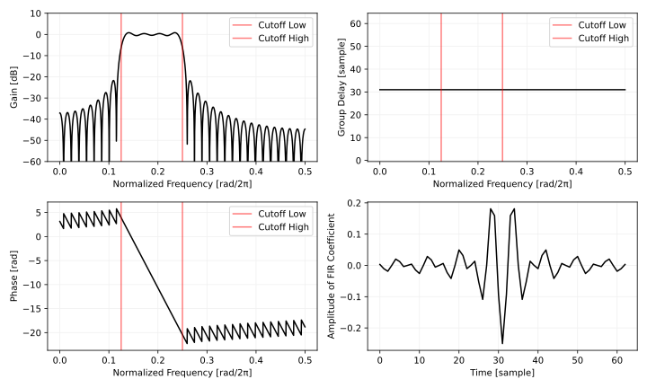

# お手軽なFIRフィルタのレシピ
[FIR](https://en.wikipedia.org/wiki/Finite_impulse_response) のローパス、ハイパス、バンドパス、バンドリジェクトフィルタを作ります。

以下はプロットを含む完全な Python 3 のコードへのリンクです。

- [filter_notes/basic_fir/basic_fir.py at master · ryukau/filter_notes · GitHub](https://github.com/ryukau/filter_notes/blob/master/basic_fir/basic_fir.py)

## 記号

- $f_s$ : [サンプリング周波数](https://en.wikipedia.org/wiki/Sampling_(signal_processing)#Sampling_rate)。
- $f_c$ : [カットオフ周波数](https://en.wikipedia.org/wiki/Cutoff_frequency)。ここでは慣例とは異なり、カットオフ周波数でのゲインが $1/\sqrt{2}$ とはならない。
- $f_l$ : 低いほうの[カットオフ周波数](https://en.wikipedia.org/wiki/Cutoff_frequency)。バンドパスとバンドリジェクトで使う。
- $f_h$ : 高いほうカットオフ周波数。バンドパスとバンドリジェクトで使う。
- $\omega_\square$ : 角周波数。 $2 \pi f_\square / f_s$ 。

$f$ の単位は Hz 、 $\omega$ の単位は rad です。

[通過域](https://en.wikipedia.org/wiki/Passband)の振幅（[Amplitude](https://en.wikipedia.org/wiki/Amplitude)）は 1 とします。

## ローパスフィルタ
<figure>

</figure>

$$
A_{LP}(\omega) =
\begin{cases}
1, & (-\omega_c \leq \omega \leq \omega_c) \\
0, & \text{otherwise}.
\end{cases}
$$

$A_{LP}(\omega)$ を[逆フーリエ変換](https://en.wikipedia.org/wiki/Discrete-time_Fourier_transform)します。 $A_{LP}$ の定義より範囲を $-\omega_c$ から $\omega_c$ に狭めることができます。この式は sinc 関数とも呼ばれます。また、理想ローパスフィルタ (ideal low-pass filter) と呼ばれることもあります。

$$
\begin{align}
\frac{1}{2\pi}\int^{\infty}_{-\infty} A_{LP}(\omega) e^{j\omega x} d\omega
&= \frac{1}{2\pi}\int^{\omega_c}_{-\omega_c} e^{j\omega x} d\omega \\
&= \frac{\sin(\omega_c x)}{\pi x}.
\end{align}
$$

式 1 は以下の [Maxima](https://maxima.sourceforge.io/) のコードで解きました。

```maxima
ift(low, high) := integrate(exp(%i * ω * x) / (2 * %pi), ω, low, high);
expand(demoivre(ift(-ω_c, ω_c)));
```

Python 3 のコードに変えます。 NumPy には [`numpy.sinc`](https://numpy.org/doc/stable/reference/generated/numpy.sinc.html) がありますが、ここでは例として sinc 関数を実装しています。

```python
import numpy as np

def modifiedSinc(x, cutoff):
    if x == 0:
        return 2 * cutoff
    return np.sin(np.pi * 2 * cutoff * x) / (np.pi * x)


def lowpassFir(length: int, cutoff: float):
    length -= (length + 1) % 2  # 係数の数を奇数にする。
    mid = length // 2

    fir = np.zeros(length)
    for i in range(length):
        x = i - mid
        fir[i] = modifiedSinc(x, cutoff)
    return fir
```

以下は `length = 63, cutoff = 0.25` としたときの周波数特性のプロットです。

<figure>

</figure>

## ハイパスフィルタ
<figure>

</figure>

$$
A_{HP}(\omega) =
\begin{cases}
1, & (\omega \leq -\omega_c) \\
1, & (\omega_c \leq \omega) \\
0, & \text{otherwise}.
\end{cases}
$$

逆フーリエ変換が Maxima と SymPy では解けなかったので、式変形のトリックを使います。すべての周波数で振幅が 1 となる特性からローパスフィルタの特性を減算することでハイパスになります。そして、すべての周波数で振幅が 1 となる特性を持つ信号として [Dirac のデルタ関数](https://en.wikipedia.org/wiki/Dirac_delta_function)が使えます。したがって以下のように $A_{HP}$ の逆フーリエ変換ができます。

$$
\begin{align}
\frac{1}{2\pi}\int^{\infty}_{-\infty} A_{HP}(\omega) e^{j\omega x} d\omega
&= \frac{1}{2\pi}\int^{\infty}_{-\infty} e^{j\omega x} d\omega - \mathcal{F}^{-1} (A_{LP}) \\
&= \delta(x) - \frac{\sin(\omega_c x)}{\pi x}.
\end{align}
$$

Python 3 のコードに変えます。デルタ関数の扱いが問題になりますが、実装のトリックとして $x=0$ となる時点のフィルタ係数からフィルタ係数の総和 (`sum(fir)`) を減算すればうまく動きます。ローパスフィルタのコードを流用しています。

```python
def highpassFir(length: int, cutoff: float):
    fir = -lowpassFir(length, cutoff)
    mid = length // 2
    fir[mid] -= np.sum(fir)
    return fir
```

以下は `length = 63, cutoff = 0.125` としたときの周波数特性のプロットです。

<figure>

</figure>

## バンドパスフィルタ
<figure>

</figure>

$$
A_{BP}(\omega) =
\begin{cases}
1, & (-\omega_h \leq \omega \leq -\omega_l) \\
1, & (\omega_l \leq \omega \leq \omega_h) \\
0, & \text{otherwise}.
\end{cases}
$$

$A_{BP}(\omega)$ を逆フーリエ変換します。

$$
\begin{align}
\frac{1}{2\pi}\int^{\infty}_{-\infty} A_{BP}(\omega) e^{j\omega x} d\omega
&= \frac{1}{2\pi} \biggl ( \int^{-\omega_l}_{-\omega_h} e^{j\omega x} d\omega
 + \int^{\omega_h}_{\omega_l} e^{j\omega x} d\omega \biggr ) \\
&= \frac{\sin(\omega_h x)}{\pi x} - \frac{\sin(\omega_l x)}{\pi x}.
\end{align}
$$

式 5 は以下の [Maxima](https://maxima.sourceforge.io/) のコードで解きました。

```maxima
ift(low, high) := integrate(exp(%i * ω * x) / (2 * %pi), ω, low, high);
expand(demoivre(ift(-ω_h, -ω_l) + ift(ω_l, ω_h)));
```

Python 3 のコードに変えます。

```python
def bandpassFir(length: int, cutoffLow: float, cutoffHigh: float):
    length -= (length + 1) % 2  # 係数の数を奇数にする。
    mid = length // 2

    fir = np.zeros(length)
    for i in range(length):
        x = i - mid
        fir[i] = modifiedSinc(x, cutoffLow) - modifiedSinc(x, cutoffHigh)
    return fir
```

以下は `length = 63, cutoffLow = 0.125, cutoffHigh = 0.25` としたときの周波数特性のプロットです。

<figure>

</figure>

## バンドリジェクトフィルタ
バンドストップフィルタとも呼ばれます。

<figure>

</figure>

$$
A_{BR}(\omega) =
\begin{cases}
1, &  (\omega \leq -\omega_h) \\
1, & (-\omega_l \leq \omega \leq \omega_l) \\
1, & (\omega_h \leq \omega) \\
0, & \text{otherwise}.
\end{cases}
$$

ハイパスと同様に、デルタ関数の振幅特性からバンドパスフィルタの振幅特性を減算すればバンドリジェクトフィルタになります。

$$
\begin{aligned}
\frac{1}{2\pi}\int^{\infty}_{-\infty} A_{BR}(\omega) e^{j\omega x} d\omega
&= \frac{1}{2\pi}\int^{\infty}_{-\infty} e^{j\omega x} d\omega - \mathcal{F}^{-1} (A_{BP}) \\
&= \delta(x) - \left( \frac{\sin(\omega_h x)}{\pi x} - \frac{\sin(\omega_l x)}{\pi x} \right).
\end{aligned}
$$

Python 3 のコードに変えます。バンドパスフィルタのコードを流用しています。

```python
def bandrejectFir(length: int, cutoffLow: float, cutoffHigh: float):
    fir = -bandpassFir(length, cutoffLow, cutoffHigh)
    mid = length // 2
    fir[mid] -= np.sum(fir)
    return fir
```

以下は `length = 63, cutoffLow = 0.125, cutoffHigh = 0.25` としたときの周波数特性のプロットです。

<figure>

</figure>

## FIRフィルタの畳み込み方
「[レイテンシのない畳み込み](../convolution_without_latency/convolution_without_latency.html)」で畳み込みの方法について紹介しています。フィルタ係数の数が 16 ほどであれば素朴に畳み込めば十分に速いです。フィルタ係数の数が多いときは FFT を使った高速な畳み込みのアルゴリズムがあります。

以下は C++ による素朴な畳み込みの例です。

```c++
#include <algorithm>
#include <array>
#include <numeric>

struct FirFilterShort {
  std::array<float, 16> fir{/* フィルタ係数。 */};
  std::array<float, 16> buffer{};

  float process(float input) {
    std::rotate(buffer.begin(), buffer.begin() + 1, buffer.end());
    buffer.back() = input;
    return std::inner_product(fir.begin(), fir.end(), buffer.begin(), float(0));
  }
};
```

## 窓関数法
上で出てきた式はフィルタ係数の数が無限です。無限に長いフィルタは計算できないので長さを切り詰めて使うことになりますが、副作用として周波数特性が歪みます。窓関数法とは長さを切り詰めたフィルタ係数に[窓関数](https://en.wikipedia.org/wiki/Window_function)を乗算することで、この周波数特性の歪みを調整する手法です。

ここで紹介しているフィルタ係数の計算方法に窓関数をかけるフィルタの設計方法のことを、特に windowed-sinc と言います。

窓関数の違いによってロールオフの急峻さとカットオフ周波数の低さの間でのトレードオフがあります。つまり、より急峻な特性にするとカットオフ周波数が高くなってしまい、カットオフ周波数をできる限り理想に近づけようとするとロールオフが緩やかになってしまうということです。

カットオフ周波数を低くしたいときは切り詰めた係数をそのまま使います。このことは矩形窓をかけるとも呼ばれます。

急峻なロールオフを得るときには Kaiser 窓や DPSS 窓を使ってパラメータを調整します。

他にもいろいろな窓関数がありますが、単純な用途では上記の 2 つのケースだけ押さえておけばとりあえず何とかなります。

## Computer Algebra System の利用
手で式を解くと間違えることがあるので [Computer Algebra System (CAS)](https://en.wikipedia.org/wiki/Computer_algebra_system) を利用します。

今回のような簡単な式であれば[Wolfram Alpha](https://www.wolframalpha.com/)が便利です。Wolfram Alphaでは数字でない下付き文字が使えないようなので $\omega_l$ を $L$ に置き換えています。以降のCASのコードも同じ置き換えを使います。

```wolfram
(integral e^(i*omega*x) for omega from -L to L) / (2pi)
```

[Maxima](http://maxima.sourceforge.net/)は式の整理について指定する必要があります。コードの `demoivre` で `exp(%i*x)` を `%i * sin(x) + cos(x)` に置き換えています。

```maxima
expand(demoivre(integrate(exp(%i * omega * x) / (2 * pi), omega, -L, L)));
```

[SymPy](http://www.sympy.org/en/index.html)も使えますが少し長めです。 `rewrite(sin)` でオイラーの公式を適用しています。 `n = Symbol('n', positive=True)` が無いとコードの `integrate(...)` を解いてくれません。

```python
# SymPy 1.1.1
from sympy import *
x = Symbol('x', positive=True)
L = Symbol('L')
omega = Symbol('omega')
answer = simplify(integrate(exp(I * omega * x), (omega, -L, L)).rewrite(sin))
pprint(answer)
```

## フィルタ係数の計算について
FIR フィルタ係数は周波数特性 $A$ を逆フーリエ変換することで得られます。

$$
\frac{1}{2\pi}\int^{\infty}_{-\infty} A(\omega) e^{j\omega x} d\omega
$$

ここまでに出てきた周波数特性の図では負の周波数の範囲を省略していました。負の周波数特性は、正の周波数特性の鏡像になっています。以下は鏡像を含めたローパスフィルタの特性の例です。

<figure>

</figure>

正と負の周波数特性が異なるフィルタの例としてはヒルベルト変換が挙げられます。ヒルベルト変換は周波数シフトなどへの応用があります。

## その他
式を解かなくても周波数特性を逆離散フーリエ変換すればフィルタは作れます。ただし、逆フーリエ変換したときとは周波数特性が変わります。

フィルタ係数が固定のときは[SciPy](https://www.scipy.org/)や[Octave](https://www.gnu.org/software/octave/)などを使って設計するほうが楽で確実です。

## 参考サイト
- [The Ideal Lowpass Filter](https://ccrma.stanford.edu/~jos/sasp/Ideal_Lowpass_Filter.html)
- [Maxima: Expand e to cos and i sin? - Stack Overflow](https://stackoverflow.com/questions/42454464/maxima-expand-e-to-cos-and-i-sin)

## 変更点
- 2024/07/22
  - 内容を大幅に改訂。多くの間違いを修正。
