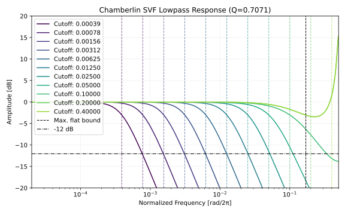
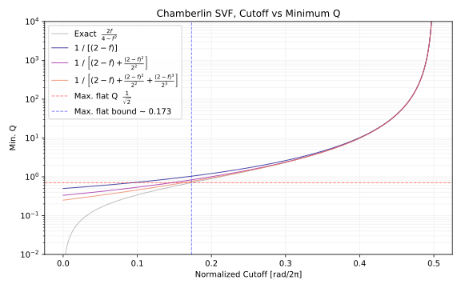
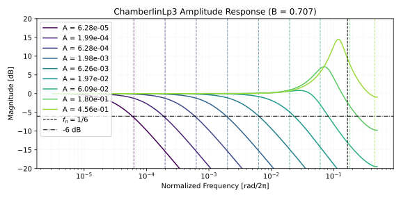

# Chamberlin SVF
[Chamberlin SVF](https://www.musicdsp.org/en/latest/Filters/142-state-variable-filter-chamberlin-version.html) は 2 次のマルチモードフィルタです。以下はフィルタの計算を示す実装例です。例外処理を省いているのでそのままでは使えません。完全な実装は「[Python による実装](#python-による実装)」に掲載してます。

```python
import numpy as np

class ChamberlinSVF:
    def __init__(self):
        self.lp = 0
        self.bp = 0

    def process(self, x0, cutoffNormalized, Q):
        """
        cutoffNormalized in [0, 0.5). [rad/2π].
        """
        f = 2 * np.sin(np.pi * cutoffNormalized)

        hp = x0 - self.lp - self.bp / Q
        self.bp += f * hp
        self.lp += f * self.bp

        return self.lp
```

以下は検証に使ったコードへのリンクです。

- [filter_notes/chamberlin_svf at master · ryukau/filter_notes · GitHub](https://github.com/ryukau/filter_notes/tree/master/chamberlin_svf)

## 伝達関数
以下は Chamberlin SVF の差分方程式です。

```
hp = x0 - lp - bp / Q
bp += f * hp
lp += f * bp
```

数式にします。 $n$ はサンプル数で表された時刻です。 $n-1$ は 1 サンプル前です。  $h$ は `hp` 、 $b$ は `bp` 、 $l$ は `lp` に対応します。 $x$ は入力信号です。

$$
\begin{aligned}
h[n] &= x[n] - l[n-1] - \frac{1}{Q} \cdot b[n-1] \\
b[n] &= f \cdot h[n] + b[n-1] \\
l[n] &= f \cdot b[n] + l[n-1]. \\
\end{aligned}
$$

$k$ サンプルの遅延を $z^{-k}$ に置き換えます。つまり $[n] \to 1$ 、 $[n-1] \to z^{-1}$ とします。

1. $h = x - l z^{-1} - \dfrac{1}{Q} b z^{-1}$.
2. $b = f h + b z^{-1}$.
3. $l = f b + l z^{-1}$.

式 2 を $b$ について解きます。

$$
b = \frac{f}{1 - z^{-1}} h.
$$

式 3 を $l$ について解きます。

$$
l = \frac{f}{1 - z^{-1}} b = \frac{f^2}{(1 - z^{-1})^2} h.
$$

式 1 に $b, l$ を代入します。

$$
h = x - \frac{f^2}{(1 - z^{-1})^2} h z^{-1} - \frac{1}{Q} \frac{f}{1 - z^{-1}} h z^{-1}.
$$

両辺に $(1 - z^{-1})^2$ を乗算して $h$ について解きます。

$$
h = \frac{x (1 - z^{-1})^2}{(1 - z^{-1})^2 + f^2 z^{-1} + \dfrac{1}{Q} (1 - z^{-1}) f z^{-1}}.
$$

整理します。

$$
h = \frac{
  x (1 - z^{-1})^2
}{
  1 + \left( - 2 + f^2 + \dfrac{f}{Q}\right) z^{-1} + \left( 1 - \dfrac{f}{Q} \right) z^{-2}
}.
$$

この形は $h \to Y(z),\,x \to X(z)$ と捉えるとハイパスの伝達関数になっています。上の $h$ を $b, l$ に代入するとそれぞれバンドパス、ローパスの伝達関数が得られます。以下は Chamberlin SVF の伝達関数です。 $f_c$ がカットオフ周波数、 $f_s$ がサンプリング周波数です。

$$
\begin{aligned}
H_{LP}(z) &= \frac{f^2}{A(z)}, \quad
H_{BP}(z) = \frac{f(1 - z^{-1})}{A(z)}, \quad
H_{HP}(z) = \frac{(1 - z^{-1})^2}{A(z)},
\\
A(z) &= 1 + \left( f^2 + \frac{f}{Q} - 2 \right)z^{-1} + \left( 1 - \frac{f}{Q} \right)z^{-2},
\\
f &= 2 \sin \left(\pi \frac{f_c}{f_s} \right).
\end{aligned}
$$

## 安定条件
安定条件から $f$ と $Q$ の範囲を決めます。

まずは $Q$ の範囲を決めます。 $A(z) = 0$ の解の絶対値が 1 以下なら安定です。式を立てます。

$$
\begin{aligned}
  1 &> \left| \frac{-b \pm \sqrt{b^2 - 4ac}}{2a} \right|, \\
  a &= 1 - \frac{f}{Q}, \quad
  b = f^2 + \frac{f}{Q} - 2, \quad
  c = 1. \\
\end{aligned}
$$

Maxima で解きます。

```maxima
a: 1 - f / Q;
b: f^2 + f / Q - 2;

case1: (2*a + b)^2 = +b^2 - 4*a;
case2: (2*a + b)^2 = -b^2 + 4*a;
case3: (2*a - b)^2 = -b^2 + 4*a;
case4: (2*a - b)^2 = +b^2 - 4*a;

solve(case1, Q);
solve(case2, Q);
solve(case3, Q);
solve(case4, Q);
```

`case4` の解の 1 つが安定条件です。

$$
Q > \frac{2f}{4 - f^2}.
$$

## カットオフ周波数の範囲
Chamberlin SVF は $Q = \dfrac{1}{\sqrt{2}}$ であれば maximally flat な特性となります。振幅特性をプロットします。

<figure>

</figure>

カットオフ周波数がナイキスト周波数に近づくと振幅特性がおかしくなっています。ここでは振幅特性がおかしくならない上限を求めます。安定条件に $Q = \dfrac{1}{\sqrt{2}}$ を代入して解くことで maximally flat となるカットオフ周波数の上限を求めます。

$$
\frac{1}{\sqrt{2}} > \frac{2f}{4 - f^2} \implies f < \sqrt{6} - \sqrt{2}.
$$

$f = 2 \sin(\pi f_c/f_s)$ なので、正規化されたカットオフ周波数の上限は以下になります。

$$
\frac{f_c}{f_s} < \frac{1}{\pi} \arcsin \left( \frac{\sqrt{6} - \sqrt{2}}{2} \right) \approx 0.1731886233119285.
$$

以下は正規化されたカットオフ周波数の上限の計算に使ったコードです。

```python
from mpmath import mp
mp.dps=50
print(float(mp.asin((mp.sqrt(6) - mp.sqrt(2)) / 2) / mp.pi))
```

## $Q$ の下限の簡略化
安定な $Q$ の下限を再掲します。

$$
Q > \frac{2f}{4 - f^2}.
$$

$Q < \dfrac{1}{\sqrt{2}}$ の範囲を使わなくていいのであれば、下限を簡略化できます。

$$
Q > \frac{1}{2 - f}.
$$

さらに除算を避けるように $q = \dfrac{1}{Q}$ とすれば音楽用途では十分な形が得られます。

$$
q < 2 - f.
$$

$2 - f$ を導出します。安定条件の右辺の逆数から始めます。 $x = 2 - f$ とします。

$$
q = \frac{1}{Q} < \frac{4 - f^2}{2f}
= \frac{(2 - f) (2 + f)}{2f}
= \frac{x (4 - x)}{2 (2 - x)}
= x \left( \frac{1}{2} - \frac{1}{x - 2} \right)
= x \left( \frac{1}{2} + \frac{1/2}{1 - x/2} \right).
$$

$\dfrac{1/2}{1 - x/2}$ について、 $f \in [0, 2)$ より $|x/2| < 1$ なので [geometric series](https://mathworld.wolfram.com/GeometricSeries.html) に変えられます。

$$
\begin{aligned}
x \left( \frac{1}{2} + \frac{1/2}{1 - x/2} \right)
&= x \left(
  \frac{1}{2} + \frac{1}{2} \left( \sum_{k=0}^\infty \left( \frac{x}{2} \right)^k \right)
\right) \\
&= \frac{x}{2} + \frac{x}{2} \left( 1 + \frac{x}{2^1} + \frac{x^2}{2^2} + \frac{x^3}{2^3} + \dots \right) \\
&= x + \frac{x^2}{2^2} + \frac{x^3}{2^3} + \frac{x^4}{2^4} + \dots
\end{aligned}
$$

$x$ を展開すると近似式が得られます。

$$
q \lesssim \sum_{i=1}^\infty \frac{(2 - f)^i}{2^{i-1}}
= (2 - f) + \frac{(2 - f)^2}{2^2} + \frac{(2 - f)^3}{2^3} + \frac{(2 - f)^4}{2^4} + \dots
$$

以下は $Q$ の下限のプロットです。近似式の項を増やすと `Exact` に近づいていることが確認できます。この近似は除算を避けられることが利点ですが、カットオフ周波数が低いときに $Q$ を大きく下げることはできなくなります。

<figure>

</figure>

## 高速な $f$ の計算
$f$ の式を再掲します。

$$
f = 2 \sin \left(\pi \frac{f_c}{f_s} \right).
$$

Chamberlin SVF では $\dfrac{f_c}{f_s} \in [0, 0.5)$ なので、 sin のレンジリダクションなどを省いて高速に実装できます。以下は minimax polynomial を用いた高速な $f$ の実装例です。 cl.exe では `/O2` 、 g++ などでは `-mfma` を明示的に指定すれば `std::sin` より高速です。

```c++
#include <cmath>

inline float chamberlin_svf_sin(float x) noexcept {
    const float t = x * x;
    float res =  0.15512077399924159f;
    res = std::fma(res, t, -1.1964842528437377f);
    res = std::fma(res, t,  5.100139452670464f);
    res = std::fma(res, t, -10.335419369597881f);
    res = std::fma(res, t,  6.283185273790786f);
    return x * res;
}

inline double chamberlin_svf_sin(double x) noexcept {
    const double t = x * x;
    double res = -0.000042245905984219777;
    res = std::fma(res, t,  0.0009319552340645613);
    res = std::fma(res, t, -0.014740722143372288);
    res = std::fma(res, t,  0.16429175651310609);
    res = std::fma(res, t, -1.1985290575514195);
    res = std::fma(res, t,  5.100328079719553);
    res = std::fma(res, t, -10.335425560099505);
    res = std::fma(res, t,  6.283185307179586);
    return x * res;
}
```

以下は $x \in [0, 0.5)$ についての大まかな誤差の最大値です。

```
--- float32
linspace - [0, 0.5), Max ULP: 2.09, x: 0.4995349943637848
Fuzzing  - [0, 0.5), Max ULP: 2.10, x: 0.4992143511772156

--- float64
linspace - [0, 0.5), Max ULP: 3.57, x: 0.46310463104631044
Fuzzing  - [0, 0.5), Max ULP: 3.68, x: 0.46471753209606476
```

以下は誤差の測定コードへのリンクです。

- [filter_notes/chamberlin_svf/sin_approx/accuracy.py at master · ryukau/filter_notes · GitHub](https://github.com/ryukau/filter_notes/blob/master/chamberlin_svf/sin_approx/accuracy.py)

この近似は Gemini 3.5 Flash に以下のプロンプトを入力して得られました。

```
Find a fast and accurate approximation of $2 \sin(\pi x)$ where $x \in [0, 0.5]$. Start from finding a minimax polynomial. Python, scalar function, f32 and f64. 4 or less ULP errors in the target region.
```

## Python による実装
この実装は C++ へのポートを前提に書かれた検証用のコードです。

```python
import numpy as np

class ChamberlinSVF:
    def __init__(self):
        self.lp = 0
        self.bp = 0

    def process_fast(self, x0, cutoffNormalized, Q):
        cut = np.clip(cutoffNormalized, 0, 0.1731886233119285)
        f = 2 * np.sin(np.pi * cut)

        q = min(1 / Q, 2 - f)

        hp = x0 - self.lp - self.bp * q
        self.bp += f * hp
        self.lp += f * self.bp
        return self.lp

    def process_full_range(self, x0, cutoffNormalized, Q):
        cut = np.clip(cutoffNormalized, np.finfo(np.float64).eps, 0.4997)
        f = 2 * np.sin(np.pi * cut)

        q = np.clip(1 / Q, 0, ((2 - f) * (2 + f)) / (2 * f))

        hp = x0 - self.lp - self.bp * q
        self.bp += f * hp
        self.lp += f * self.bp
        return self.lp
```

## C++ による実装
C++20 です。 `process` がメインの実装です。

```c++
#include <algorithm>
#include <cmath>
#include <concepts>
#include <numbers>
#include <limits>

template<std::floating_point T> class ChamberlinSvf {
private:
  T lp = 0;
  T bp = 0;

public:
  void reset() {
    lp = 0;
    bp = 0;
  }

  // cutoffNormalized [rad/2π] in [0, ~0.17].
  // q = 1 / Q. Low q creates high resonance. Maximally flat when q = sqrt(2).
  T process(T input, T cutoffNormalized, T q) {
    const T cut = std::clamp(cutoffNormalized, T(0), T(0.1731886233119285));
    const T f = T(2) * std::sin(std::numbers::pi_v<T> * cut);

    q = std::clamp(q, T(0), T(2) - f);

    const T hp = std::fma(-q, bp, input - lp);
    bp = std::fma(f, hp, bp);
    lp = std::fma(f, bp, lp);
    return lp;
  }

  // cutoffNormalized [rad/2π] in [eps, 0.5).
  T process_full_range(T input, T cutoffNormalized, T q) {
    constexpr T eps = std::numeric_limits<T>::epsilon();
    const T cut = std::clamp(cutoffNormalized, eps, T(0.4997));
    const T f = T(2) * std::sin(std::numbers::pi_v<T> * cut);

    q = std::clamp(q, T(0), std::fma(-f, f, T(4)) / (T(2) * f));

    const T hp = std::fma(-q, bp, input - lp);
    bp = std::fma(f, hp, bp);
    lp = std::fma(f, bp, lp);
    return lp;
  }
};
```

「高速な $f$ の計算」に掲載した `chamberlin_svf_sin` を使うのであれば `T(2) * std::sin(std::numbers::pi_v<T> * cut)` を `chamberlin_svf_sin(cut)` とします。

`std::fma` が使えないときは以下のように書けます。

```c++
// process_full_range の Q の下限は因数分解した形のほうが f ~ 2 のときに正確。
q = std::clamp(q, T(0), ((T(2) - f) * (T(2) + f)) / (T(2) * f));

// 以下は process, process_full_range で共通。
const T hp = input - lp - bp * q;
bp += f * hp;
lp += f * bp;
return lp;
```

## 異なるチューニング
以下の `Lp3` と `ChamberlinLp3` は計算誤差を除けば等価です。 `Lp3` は「[3-pole ローパスフィルタ](../3pole_lowpass/3pole_lowpass.html)」で紹介したフィルタで、 -6 dB/oct のスロープかつレゾナンスが調節できるフィルタです。リンク先の記事で導入しているパラメータ $\alpha$ を 1 に固定しているので、以下の実装では `Lp3` と言いつつ 3-pole ではなく 2-pole になっています。

```python
import math

class Lp3:
    def __init__(self):
        self.reset()

    def reset(self):
        self.s0 = 0.0
        self.s1 = 0.0
        self.s2 = 0.0
        self.x1 = 0.0

    def process(self, x0, A, B):
        self.s0 = A * self.s1 + B * self.s0
        self.s1 -= self.s0 + x0 - self.x1
        self.s2 -= self.s1 * A / (1.0 - B)
        self.x1 = x0
        return self.s2

class ChamberlinLp3:
    def __init__(self):
        self.reset()

    def reset(self):
        self.lp = 0
        self.bp = 0

    def process(self, x0, A, B):
        f = math.sqrt(A)
        q = (1 - B) / f

        hp = x0 - self.lp - q * self.bp
        self.bp += f * hp
        self.lp += f * self.bp

        return self.lp + B * self.bp / q
```

`ChamberlinLp3` の `A` はカットオフ、 `B` はレゾナンスです。上の実装は `Lp3` との対応をとるために安全対策をいくつか省略しています。

- `A` は exponential moving average (EMA) フィルタのカットオフの設定方法が流用可。
- `A` が 0 のときに `q` の計算で 0 除算が起こる。
- `B` の範囲は $[0, 1)$ 。 `B ~ 0.99` あたりが発散しない上限。

以下は上記の要素の実装例です。

```python
import numpy as np

def ema_alpha(cutoff_normalized):
    sn = np.sin(np.pi * cutoff_normalized)
    result = 2 * sn / (np.sqrt(sn * sn + 1) + sn)
    return result

class ChamberlinLp3:
    def __init__(self):
        self.reset()

    def reset(self):
        self.lp = 0
        self.bp = 0

    def process(self, x0, cutoff_normalized, B):
        B = min(max(B, 0), 0.99)  # `bp / q` での 0 除算を避ける。

        f = math.sqrt(ema_alpha(cutoff_normalized))
        q = (1 - B) / max(f, np.finfo(np.float64).eps)  # `f == 0` での 0 除算を避ける。

        hp = x0 - self.lp - q * self.bp
        self.bp += f * hp
        self.lp += f * self.bp

        return self.lp + B * self.bp / q
```

以下は振幅特性です。カットオフ周波数が低いとレゾナンスが付かないので、音楽用のフィルタとしては癖があります。 `B = 0` とすると単調な振幅特性が得られます。

<figure>

</figure>

## 参考文献
- [State Variable Filter (Chamberlin version) — Musicdsp.org documentation](https://www.musicdsp.org/en/latest/Filters/142-state-variable-filter-chamberlin-version.html)
- [svf.pdf (ccrma.stanford.edu/~jos)](https://ccrma.stanford.edu/~jos/svf/svf.pdf)
- [[2111.05592] Improving the Chamberlin Digital State Variable Filter (arxiv.org)](https://arxiv.org/abs/2111.05592)

## 変更点
- 2026-07-02
  - $f_s$ を $f_x$ としていた typo を修正。
