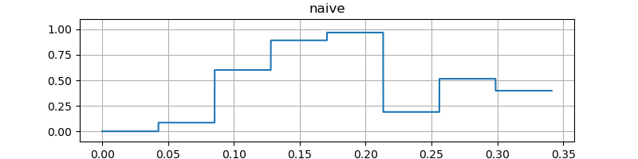
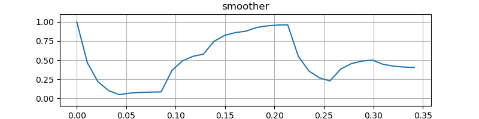
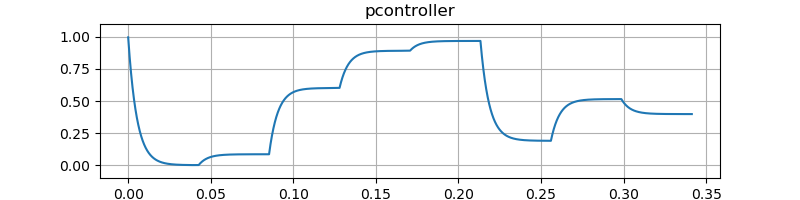
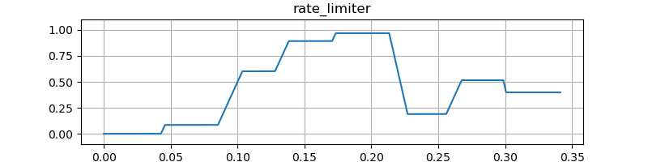
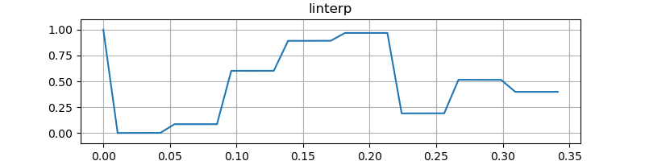

# オーディオプラグインの UI から入力された値の補間
VST 3 や LV2 ではオーディオ処理のメソッドが呼び出されるたびに UI (ユーザインタフェース) で変更されたパラメータが渡されます。更新するバッファ内で一定の値を使うだけだと滑らかでなくなるので補間します。

## 素朴なパラメータの受け取り
オーディオ処理のメソッドが呼び出される頻度のことをコントロールレートと呼ぶことがあります。オーディオデバイスのバッファの長さを $L$ 、サンプリング周波数を $f_s$ とするとコントロールレートは $f_s / L$ です。

次のコードはバッファ単位で `process` を呼び出す例です。バッファに書き込み直す処理を `main` 内の `for` ループで回していますが、実際にはオーディオデバイスによる割り込みに応じて DAW のオーディオスレッドから呼び出されます。

```cpp
// naive.cpp
#include <cstring>
#include <random>
#include <vector>

constexpr float sampleRate = 48000.0f;
constexpr size_t nFrame = 512; // 式中の L 。
constexpr size_t nBuffer = 32;

struct DSP {
  float gain = 1.0f; // 適当なパラメータ。

  void process(const float frame, float *out) // オーディオ処理のメソッド
  {
    for (size_t i = 0; i < frame; ++i) out[i] = gain;
  }
};

int main()
{
  std::vector<float> wav(nFrame * nBuffer);

  float out[nFrame]; // VST 3 や LV2 にならってバッファに C の配列を使う。

  std::minstd_rand rng{0};
  std::uniform_real_distribution<float> gainDist(0.0f, 1.0f);
  DSP dsp;

  float gainValue = 1.0f;
  for (size_t idx = 0; idx < nBuffer; ++idx) {
    if (idx % 4 == 0) gainValue = gainDist(rng); // パラメータの更新頻度を下げる。
    dsp.gain = gainValue;
    dsp.process(nFrame, out);
    std::memcpy(&wav[idx * nFrame], out, sizeof(float) * nFrame);
  }

  return writeWave("snd/naive.wav", wav, sampleRate);
}
```

`writeWave` の実装を含む完成したコードは次のリンクに掲載しています。コンパイルには [libsndfile]([libsndfile](http://www.mega-nerd.com/libsndfile/)) が必要です。

- [filter_notes/naive.cpp at master · ryukau/filter_notes · GitHub](https://github.com/ryukau/filter_notes/blob/master/control_rate_interpolation/demo/naive.cpp)

コンパイルして実行します。

```bash
g++ -lsndfile -O3 naive.cpp
./a.out
```

実行結果の波形です。

<figure>

</figure>

図の波形に 100 Hz の正弦波を掛け合わせた音です。

<figure>
  <figcaption>Naive</figcaption>
  <audio controls>
    <source src="snd/sin_naive.wav" type="audio/wav">
  </audio>
</figure>

バッファの境界で値が不連続に変化しているので、そのまま使うとノイズが乗ることがあります。

不連続点が目立ってしまうパラメータの例としては、音量、フィルタのカットオフ周波数、ディレイ時間、オシレータの周波数などが挙げられます。特に IIR フィルタのカットオフ周波数を急激に変更すると発散することがあるので、パラメータを補間せずに使うことは避けたいです。

パラメータによって変更される値が 1 サンプルあたりの変化量を表しているときは不連続点が目立たないことがあります。実装によりますが、エンベロープの傾きなどが例として挙げられます。

## バッファ内で線形補間
サンプリング周波数とバッファサイズが固定なら、パラメータが変化したときだけ次のバッファまで線形補間することでノイズが大きく減ります。

デスクトップ環境では設定によってサンプリング周波数とバッファサイズが変わります。そこで、古い値から新しい値へと更新される時間を指定できるようにします。

まずはサンプリング周波数 $f_s$ とユーザが指定した新しい値へと更新される秒数 $t$ から、新しい値へと更新されるサンプル数 $n$ を求めます。

$$
n = t f_s
$$

次に、新しく受け取ったパラメータの値 $p$ 、 1 つ前のバッファの終端でのパラメータの値 $p_1$ 、 バッファの長さ $L$ を使って、現在のバッファの終端でのパラメータの値 $p_0$ を計算します。

$$
p_0 = \frac{L}{n} (p - p_1) + p_1
$$

そして、バッファ内でのパラメータの値 $p_i$ を、バッファの先頭から経過したサンプル数 $i$ を使って計算します。この式は $p_1$ と $p_0$ の線形補間です。

$$
p_i = p_1 + \frac{i}{L} (p_0 - p_1)
$$

この計算は指定した時間で目的の値に到達しませんが、シンセサイザで使うには十分です。より正確に指定したいときはパラメータチューニングの項を参照してください。

実装します。

```cpp
constexpr float sampleRate = 48000.0f;
constexpr size_t nFrame = 512;
constexpr size_t nBuffer = 32;

template<typename Sample> class Smoother {
public:
  void setSampleRate(Sample sampleRate, Sample time = 0.04)
  {
    this->sampleRate = sampleRate;
    setTime(time);
  }

  void setTime(Sample seconds) { timeInSamples = seconds * sampleRate; }
  void setBufferSize(Sample bufferSize) { this->bufferSize = bufferSize; }
  inline Sample getValue() { return value; }

  void push(Sample newTarget) // newTarget は式中の p 。
  {
    p1 = p0;
    p0 = (timeInSamples >= bufferSize) && (fabs(p0 - newTarget) >= Sample(1e-5))
      ? (newTarget - p0) * bufferSize / timeInSamples + p0
      : newTarget;
  }

  Sample process(float index) { return value = p1 + index / bufferSize * (p0 - p1); }

protected:
  Sample sampleRate = 44100;
  Sample timeInSamples = -1; // 式中の n 。
  Sample bufferSize = 0;     // 式中の L 。
  Sample p0 = 1;
  Sample p1 = 1;
  Sample value = 0;          // 1 フレーム内で計算結果を 2 回以上使うときに必要。
};

struct DSP {
  Smoother<float> gain;

  void process(const size_t frame, float *out)
  {
    for (size_t i = 0; i < frame; ++i) out[i] = gain.process(i);
  }
};

int main()
{
  std::vector<float> wav(nFrame * nBuffer);

  float out[nFrame];

  std::minstd_rand rng{0};
  std::uniform_real_distribution<float> gainDist(0.0f, 1.0f);
  DSP dsp;
  dsp.gain.setSampleRate(sampleRate, 0.02f);

  float gainValue = 1.0f;
  for (size_t idx = 0; idx < nBuffer; ++idx) {
    if (idx % 4 == 0) gainValue = gainDist(rng); // パラメータの更新頻度を下げる。
    dsp.gain.setBufferSize(nFrame);
    dsp.gain.push(gainValue);
    dsp.process(nFrame, out);
    std::memcpy(&wav[idx * nFrame], out, sizeof(float) * nFrame);
  }

  return writeWave("snd/smoother.wav", wav, sampleRate);
}
```

完成したコードへのリンクです。

- [filter_notes/smoother.cpp at master · ryukau/filter_notes · GitHub](https://github.com/ryukau/filter_notes/blob/master/control_rate_interpolation/demo/smoother.cpp)

実行結果です。

<figure>

</figure>

### パラメータチューニング
$p_0$ の振る舞いは指数関数的減衰 (exponential decay) になります。経過したバッファ数を $j$ として、 $L, n, p$ を固定します。さらに $\alpha = L / n,\ p_1 = 0$ とすれば次のように書き直せます。

$$
p_0 = \alpha^j p
$$

$\alpha^j$ が適当なしきい値 $\epsilon$ に到達する時間を求めます。

$$
\begin{aligned}
\epsilon &= \alpha^j \\
j &= \frac{\log \epsilon}{\log \alpha}
\end{aligned}
$$

また $\epsilon$ と $j$ が分かっているとき、 $\alpha = \epsilon^{\frac{1}{j}}$ です。

### 異なる計算方法
Uhhyou Plugins では以前、異なる計算方法を使っていたので記録しておきます。

`Smoother::process()` での計算式を再掲します。

```cpp
value = p1 + index / bufferSize * (p0 - p1);
```

`index` はバッファ内のインデックスです。 1 サンプルあたりに `value` が増える量を事前に計算しておけば、バッファ内のインデックスを使わずに計算できます。

```cpp
template<typename Sample> class SmootherRamp {
public:
  void setSampleRate(Sample sampleRate, Sample time = 0.04)
  {
    this->sampleRate = sampleRate;
    timeInSamples = seconds * sampleRate;
  }

  void setBufferSize(Sample bufferSize) { this->bufferSize = bufferSize; }

  void push(Sample newTarget)
  {
    target = newTarget;
    if (timeInSamples < bufferSize)
      value = target;
    else
      ramp = (target - value) / timeInSamples;
  }

  Sample process()
  {
    if (value == target) return value;
    value += ramp;
    if (fabs(value - target) < 1e-5) value = target;
    return value;
  }

protected:
  Sample sampleRate = 44100;
  Sample timeInSamples = -1;
  Sample bufferSize = 0;
  Sample value = 1.0;
  Sample target = 1.0;
  Sample ramp = 0.0; // 1 サンプルあたりに value が増える量。
};
```

指定されたスムーシング時間がバッファ長よりも短いときは `push()` の条件分岐によってスムーシングを無効にしています。

`process()` の条件分岐 `fabs(value - target) < 1e-5` でオーバーシュートを防いでいます。 `1e-5` は適当に決めた値です。パラメータの値の範囲が広いときは `1e-5` をより大きな値に変えないと上手く動かない可能性があるので、この実装は危険です。

1 サンプルあたりの増加量を使う方法は、バッファ内のインデックスを使う方法よりも遅いです。スムーシング時間が固定で、オーバーシュートがあってもいいなら `process()` 内の条件分岐を消せるので使えるかもしれません。

ベンチマークに使ったコードを次のリンクに掲載しています。

- [filter_notes/bench_smoother.cpp at master · ryukau/filter_notes · GitHub](https://github.com/ryukau/filter_notes/blob/master/control_rate_interpolation/demo/bench_smoother.cpp)

## P Controller
思いつきで PID コントローラの P だけを取り出して使っていたので P controller と名前をつけていますが、 exponential moving average filter あるいは exponentially weighted moving average filter と呼ぶほうが一般的です。エンベロープを滑らかにするときなどにも使えます。

P controller の の素朴な実装です。

```cpp
template<typename Sample> class PController {
public:
  void setup(Sample p) { kp = std::clamp<Sample>(p, Sample(0), Sample(1)); }
  void reset() { value = 0; }
  Sample process(Sample input) { return value += kp * (input - value); }

private:
  Sample kp = 1; // Range in [0, 1].
  Sample value = 0;
};
```

### 周波数特性
`PController` の伝達関数を出します。 `process()` での計算式です。

```cpp
value += kp * (input - value);
```

$n$ を経過サンプル数とすると `value` は $y[n - 1]$ 、 `input` は $x[n]$ となります。出力は $y[n]$ です。 `process()` の計算式の記号を置き換えます。

$$
\begin{aligned}
y[n] &= y[n - 1] + k_p (x[n] - y[n - 1]) \\
y[n] + (k_p - 1) y[n - 1] &= k_p x[n]
\end{aligned}
$$

出力 $y$ の項だけを集めた左辺で、入力 $x$ の項だけを集めた右辺を割ることで伝達関数が得られます。

$$
H(z) = \frac{k_p}{1 + (k_p - 1) z^{-1}}
$$

`PController` の振幅特性です。ローパスに近い特性です。

<figure>

</figure>

`PController` の位相特性です。

<figure>

</figure>

### $k_p$ からカットオフ周波数を求める
伝達関数 $H(z)$ からカットオフ周波数 $\omega$ を求めます。

$$
\begin{aligned}
|H(e^{j \omega})|
  = \frac{1}{\sqrt{2}}
  &= \left| \frac{k_p}{1 + (k_p - 1) e^{-j \omega}} \right| \\
\end{aligned}
$$

Maxima で $\omega$ について解きます。

```maxima
ω_eq: solve(1/2 = (k_p / (1 + (k_p - 1) * exp(-%i * ω)))^2, ω);
ratsimp(ω_eq);
```

出力です。2つの解が出てきたので $\omega_1$ と $\omega_2$ という名前をつけています。

$$
\omega_1 = -j \log{\left( -\frac{\sqrt{2}\, {{{k_p}}^{2}}+\left( -\sqrt{2}-1\right) \, {k_p}+1}{2 {{{k_p}}^{2}}-1}\right) }
\operatorname{,}\quad
\omega_2 = -j \log{\left( \frac{\sqrt{2}\, {{{k_p}}^{2}}+\left( 1-\sqrt{2}\right) \, {k_p}-1}{2 {{{k_p}}^{2}}-1}\right) }
$$

$\omega_1$ は虚数 $j$ を外してプロットするとそれらしい曲線が出てきます。カットオフ周波数は縦軸です。 $\pi$ を超えているのは、そういうものなのか計算誤差なのか判断できていません。

```maxima
plot2d(-log(-(sqrt(2)*k_p^2+(-sqrt(2)-1)*k_p+1)/(2*k_p^2-1)), [k_p, 0, 1.1]);
```

<figure>

</figure>

### カットオフ周波数から $k_p$ を求める

$\omega$ の式を $k_p$ について解きます。

```maxima
k_eq: solve(1/2 = (k_p / (1 + (k_p - 1) * exp(-%i * ω)))^2, k_p);
```

出力です。試しに計算したところ $k_{p,2}$ を使うと正しい値が得られました。

$$
\begin{aligned}
k_{p,1} &= -\frac{\sqrt{2} e^{2 j \omega} + (-\sqrt{2} - 1) e^{j \omega} + 1}{2 e^{2 j \omega} - 1} \\
k_{p,2} &= \frac{\sqrt{2} {e^{2 j \omega}} + (1 - \sqrt{2}) e^{j \omega} - 1}{2 e^{2 j \omega} - 1}
\end{aligned}
$$

次の図の縦線がカットオフ周波数 $\omega$ を表しています。同じ色の曲線は振幅特性です。対応するカットオフ周波数と振幅特性が全て -3 dB で交差しているので正しく計算できています。

<figure>

</figure>

### 複素数を使わずにカットオフ周波数から $k_p$ 求める式
dsp.stackexchange.com で回答を見つけました。 $f_c$ はカットオフ周波数、 $f_s$ はサンプリング周波数です。

$$
k_p = -y + \sqrt{y^2 + 2y}, \quad y = 1 - \cos(2 \pi f_c / f_s)
$$

Maxima で解くときは `cabs` と `trigsimp` が使えます。

```maxima
H_ω: k_p / (1 - (1 - k_p) * exp(-%i * ω));
H_ω_abs: trigsimp(cabs(H_ω));
solve(1 / 2 = H_ω_abs^2, k_p);
```

$$
\left| H(e^{j \omega}) \right| = \frac{\left| {k_p}\right| }{\sqrt{\left( 2 {k_p}-2\right)  \cos{\left( \omega \right) }+{{{k_p}}^{2}}-2 {k_p}+2}}
$$

$$
{k_p}=-\sqrt{{{\cos{\left( \omega \right) }}^{2}}-4 \cos{\left( \omega \right) }+3}+\cos{\left( \omega \right) }-1\operatorname{,}\quad {k_p}=\sqrt{{{\cos{\left( \omega \right) }}^{2}}-4 \cos{\left( \omega \right) }+3}+\cos{\left( \omega \right) }-1
$$

- [Single-pole IIR low-pass filter - which is the correct formula for the decay coefficient? - Signal Processing Stack Exchange](https://dsp.stackexchange.com/questions/54086/single-pole-iir-low-pass-filter-which-is-the-correct-formula-for-the-decay-coe)
- [digital filters - Exponential weighted moving average time constant - Signal Processing Stack Exchange](https://dsp.stackexchange.com/questions/28308/exponential-weighted-moving-average-time-constant/28314#28314)
- [How frequency response related to a transfer function - Signal Processing Stack Exchange](https://dsp.stackexchange.com/questions/26941/how-frequency-response-related-to-a-transfer-function)
- [Exponential-Moving-Average.pdf](https://tttapa.github.io/Pages/Mathematics/Systems-and-Control-Theory/Digital-filters/Exponential%20Moving%20Average/Exponential-Moving-Average.pdf)

### 実装
C++ です。カットオフ周波数から $k_p$ を求めるメソッドが追加されています。

```cpp
template<typename Sample> class PController {
public:
  // float 型での cutoffHz の下限は 3~4 Hz 程度。
  static Sample cutoffToP(Sample sampleRate, Sample cutoffHz)
  {
    auto omega_c = Sample(twopi) * cutoffHz / sampleRate;
    auto y = Sample(1) - cos(omega_c);
    return -y + sqrt((y + Sample(2)) * y);
  }

  void setup(Sample p) { kp = std::clamp<Sample>(p, Sample(0), Sample(1)); }
  void reset() { value = 0; }
  Sample process(Sample input) { return value += kp * (input - value); }

private:
  Sample kp = 1; // Range in [0, 1].
  Sample value = 0;
};
```

`cutoffHz = 30` としたときの出力です。

<figure>

</figure>

テストに使ったコードへのリンクです。

- [filter_notes/pcontroller.cpp at master · ryukau/filter_notes · GitHub](https://github.com/ryukau/filter_notes/blob/master/control_rate_interpolation/demo/pcontroller.cpp)

## Rate Limiter
mathworks.com で紹介されていた Rate Limiter を実装します。 Rate Limiter を通った信号は 1 サンプルあたりの増加量が制限されます。出力波形は線形補間と同じですが、パラメータとして傾きを指定する点が異なります。

- [Limit rate of change of signal - Simulink](https://www.mathworks.com/help/simulink/slref/ratelimiter.html)

### 仕様
まず 1 サンプルあたりの増加量 $\mathrm{rate}$ を計算します。

$$
\mathrm{rate} = \frac{x[i] - y[i - 1]}{\Delta t}, \quad \Delta t = t[i] - t[i - 1].
$$

$x$ は入力信号、 $y$ は出力信号、 $t$ は秒数、 インデックス $i$ は経過したサンプル数です。インデックス $i - 1$ は 1 サンプル前の値を表しています。

$\mathrm{rate}$ を使って出力 $y[i]$ を計算します。

$$
\begin{aligned}
y[i] =& \begin{cases}
  \Delta t \cdot R + y[i - 1] & \text{if} \enspace \mathrm{rate} > R, \\
  \Delta t \cdot F + y[i - 1] & \text{if} \enspace \mathrm{rate} < F, \\
  x[i]                        & \text{otherwise.}
\end{cases}
\\
& R > 0, \quad F < 0.
\end{aligned}
$$

$R$ は <ruby>Rising slew rate<rt>ライジング スルー レート</rt></ruby> 、 $F$ は <ruby>Falling slew rate<rt>フォーリング スルー レート</rt></ruby> です。どちらもユーザが指定する実数です。

### 実装
C++ です。

```cpp
template<typename Sample> class RateLimiter {
public:
  void setup(Sample sampleRate) { dt = Sample(1) / sampleRate; }
  void reset() { y1 = 0; }

  void setRate(Sample risingSlewRate, Sample fallingSlewRate)
  {
    rise = risingSlewRate;
    fall = fallingSlewRate;
  }

  Sample process(Sample input)
  {
    auto rate = (input - y1) / dt;
    if (rate > rise)
      y1 += dt * rise;
    else if (rate < fall)
      y1 += dt * fall;
    else
      y1 = input;
    return y1;
  }

private:
  Sample dt = 1.0 / 44100.0;
  Sample y1 = 0;
  Sample rise = 10000;  // 正の値であるべき。
  Sample fall = -10000; // 負の値であるべき。
};
```

`rise = 26.041666, fall = -52.083332` としたときの出力です。

<figure>

</figure>

テストに使ったコードへのリンクです。

- [filter_notes/rate_limiter.cpp at master · ryukau/filter_notes · GitHub](https://github.com/ryukau/filter_notes/blob/master/control_rate_interpolation/demo/rate_limiter.cpp)

## 比較
出力を比較しやすいように再掲します。

素朴な実装の結果の再掲です。

<figure>

</figure>

パラメータが変更されたバッファのみ線形補間したときの結果も掲載します。手間を省きたいときは線形補間で十分です。

<figure>

</figure>

`linterp` のコードへのリンク: [filter_notes/linterp.cpp at master · ryukau/filter_notes · GitHub](https://github.com/ryukau/filter_notes/blob/master/control_rate_interpolation/demo/linterp.cpp)


バッファ内で線形補間の節で実装した `Smoother` の実行結果です。

<figure>

</figure>

PController の出力です。 `Smoother` よりも滑らかですが、完全に 0 や 1 になるには時間がかかります。

<figure>

</figure>

Rate Limiter の出力です。 `linterp` とほぼ同じですが、立ち上がりと立ち下りの傾きを独立に指定できます。

<figure>

</figure>

図の波形に 100 Hz のサイン波を掛け合わせた音です。素朴な実装と比べるとどれもポップノイズが減っています。

<figure>
  <figcaption>Naive</figcaption>
  <audio controls>
    <source src="snd/sin_naive.wav" type="audio/wav">
  </audio>
</figure>

<figure>
  <figcaption>Linterp</figcaption>
  <audio controls>
    <source src="snd/sin_linterp.wav" type="audio/wav">
  </audio>
</figure>

<figure>
  <figcaption>Smoother</figcaption>
  <audio controls>
    <source src="snd/sin_smoother.wav" type="audio/wav">
  </audio>
</figure>

<figure>
  <figcaption>PController</figcaption>
  <audio controls>
    <source src="snd/sin_pcontroller.wav" type="audio/wav">
  </audio>
</figure>

<figure>
  <figcaption>Rate Limiter</figcaption>
  <audio controls>
    <source src="snd/sin_rate_limiter.wav" type="audio/wav">
  </audio>
</figure>

## その他
Slew limiter と呼ばれるアナログシンセサイザのモジュールが挙動や用途としては近そうです。

- [A-170](http://www.doepfer.de/a170.htm)
- [Q105 Slew Limiter - Analog Modular Synthesizers for Electronic Music by Synthesizers.com](https://www.synthesizers.com/q105.html)
- [Slew rate - Wikipedia](https://en.wikipedia.org/wiki/Slew_rate)

## 変更点
- 2020-03-26
  -  文章の整理。
  - `P Controller` を `直線の ADSR エンベロープ` から移動。
  - `Rate Limiter` を追加。
  - `比較` を追加。
