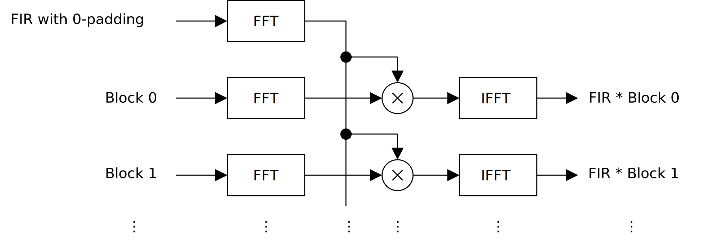
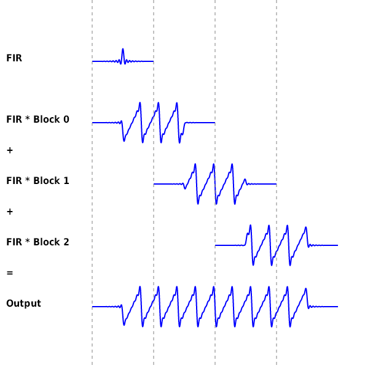
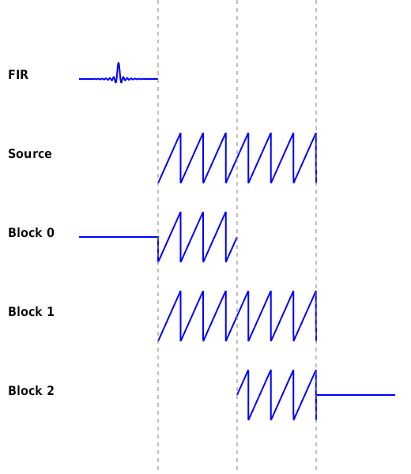
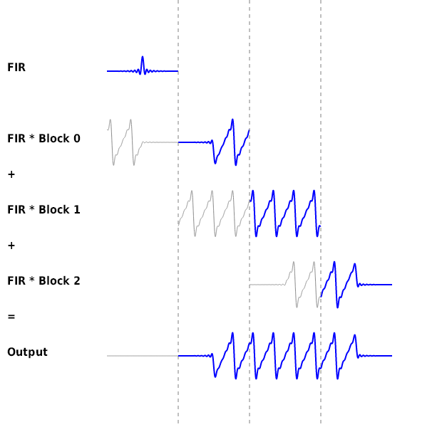
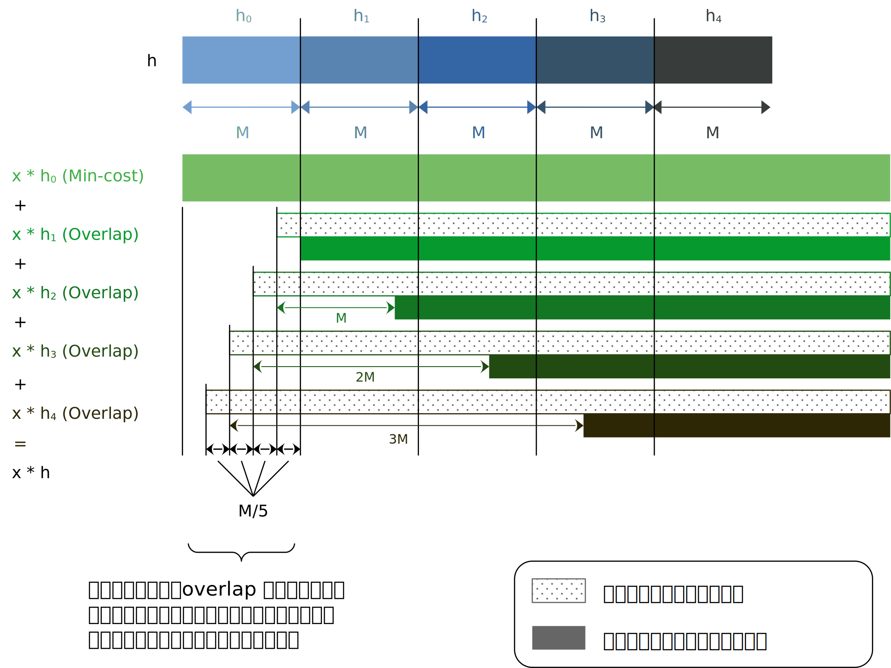
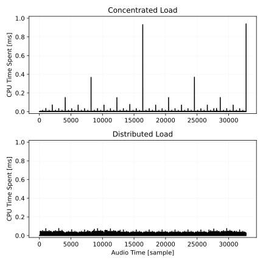

# レイテンシのない畳み込み
[MiniCliffEQ](https://ryukau.github.io/VSTPlugins/index.html#minicliffeq) の FIR フィルタの畳み込みに素朴な overlap-add を使っていたのですが、レイテンシがあまりにも大きかったので何とかならないかと調べたところ William G. Gardner さんによる ["Efficient Convolution Without Latency"](http://alumni.media.mit.edu/~adamb/docs/ConvolutionPaper.pdf) という資料を見つけました。

以下はこの文章で紹介している畳み込みの手法の一覧です。

- 素朴な畳み込み
- FFT による一括畳み込み
- Overlap-add
- Overlap-save
- レイテンシのない畳み込みの最小計算コスト法
- レイテンシのない畳み込みの改変した一定計算コスト法

改変した一定計算コスト法は "Efficient Convolution Without Latency" で紹介されている一定計算コスト法 (constant demand solution) に基づいた方法です。

## 素朴な畳み込み
離散信号の 1 サンプルあたりの畳み込みは以下の式で表されます。

$$
y[n] = \sum_{i=0}^{N-1} h[i] \, x[n - i].
$$

- $n$ : 時刻。単位はサンプル数。
- $N$ : FIR フィルタの長さ。
- $h$ : FIR フィルタ係数。
- $x$ : 入力信号。
- $y$ : 出力信号。

$h$ は FIR フィルタ係数に限らず、任意の離散信号を使うこともできます。 FIR 以外の畳み込みの応用としては、自己相関や相互相関の計算が挙げられます。

素朴な畳み込みの計算量は $O(n^2)$ です。以下のコードで計算できます。

```python
import numpy as np
import scipy.signal as signal

samplerate = 48000

fir = signal.firwin(15, 1000, fs=samplerate)
source = signal.sawtooth(np.linspace(0, 2 * np.pi * 10, samplerate))

convoluted = np.zeros(len(fir) + len(source))
for i in range(len(convoluted)):
    for j in range(len(fir)):
        if i + j >= len(source):
            break
        convoluted[i] += fir[j] * source[i + j]
```

CPython は `for` が遅いので、書いてあるコードをそのまま使うことはお勧めしません。オフラインなら `scipy.signal.convolve` 、リアルタイムなら CPython ではない実装あるいは別の言語を使うことをお勧めします。

素朴な畳み込みは遅いですが、 FIR が短いときは FFT を使う畳み込みよりも速くなることがあります。以降で紹介しますが、リアルタイムかつレイテンシが許容できないときは FIR の畳み込みの一部を素朴に計算する必要があります。

以下は C++ による実装の一例へのリンクです。

- [C++ による素朴な畳み込みの実装 (github.com)](https://github.com/ryukau/filter_notes/blob/master/convolution_without_latency/cpp/test.cpp#L289-L316)

## FFT による一括畳み込み
入力信号 $x$ と FIR $h$ の長さが同じときは、以下の式のように FFT で周波数領域に変換してから畳み込むことで高速に計算できます。

$$
y = \mathtt{ifft}(\mathtt{fft}(h) \times \mathtt{fft}(x)),
\quad \text{where} \quad
a \times b = (a_0 b_0, a_1 b_1, a_2 b_2, \dots).
$$

$h$ と $x$ の長さが異なっているときは、短いほうの後ろに 0 を継ぎ足して長さを揃えることで計算できます。以下はコード例です。

```python
def fft_convolve(h: np.ndarray, x: np.ndarray) -> np.ndarray:
    size = max(len(h), len(x))
    H = np.fft.rfft(h, size)
    X = np.fft.rfft(x, size)
    return np.fft.irfft(H * X)
```

FFT による畳み込みの計算量は $O(n \log n)$ です。ただし FFT と逆 FFT の計算によるオーバーヘッドがあるので、 $n$ が小さいときは素朴な畳み込みのほうが速くなることがあります。適切な $n$ を決めるためには、対象となる環境でベンチマークを取ることを推奨します。

## Overlap-Add
FFT による一括畳み込みは入力信号が事前にすべて分かっていないと計算できないのでリアルタイムでは使えません。この問題を解決するために overlap-add と呼ばれる計算方法が使えます。 FIR が十分に長いときは、素朴な畳み込みよりも overlap-add のほうが高速です。オフライン計算においても FFT 一括畳み込みだとメモリが足りなくなる、という場面で利用できます。

以下は overlap-add の計算手順です。

1. FIR の後ろにブロック長だけ 0 を継ぎ足して周波数領域に変換しておく。
2. FIR 長ごとに、入力信号を分割。
3. 分割した入力信号のすべてのブロックの後ろに、同じ長さの 0 を継ぎ足す。
4. 各ブロックに FFT による畳み込みで FIR を適用。
5. すべてのブロックを分割されたときと同じ時点に置いて加算。

以下は手順 2 と 3 を表した図です。

<figure>

</figure>

以下は手順 1 と 4 を表した図です。

<figure>

</figure>

以下は手順 5 を表した図です。

<figure>

</figure>

上の図からは明らかではありませんが、 FIR によって生じるレイテンシに加えて、 1 ブロック分の長さのレイテンシが生じます。 FFT を行うためには入力信号がバッファの半分まで書き込まれることを待つ必要があることが原因です。例えば `FIR * Block 0` が得られるのは手順 2 と 3 を表した図の左から 2 つめの縦線の時点 (あるいは図中の FIR の終端) になります。

### 実装
入力バッファを 1 つ、出力バッファを 2 つ用意します。すべてリングバッファです。また、出力バッファの読み取り位置はブロック長だけずらしておきます。

2 つの出力バッファの出力を足し合わせた値が、畳み込みの出力となります。

以下はバッファの更新の手続きです。

1. 入力信号を入力バッファの前から順に書き込む。
2. 入力バッファが半分まで埋まったら FFT 畳み込みを行い、結果を出力バッファの片方に書き込む。
3. 入力バッファの書き込み位置をバッファの先頭に戻す。
4. 次に FFT 畳み込みの結果を書き込む、出力バッファを入れ替える。
5. 1 に戻る。

以下は C++ による実装へのリンクです。 FFTW3 を使っています。

- [C++ による overlap-add の実装 (github.com)](https://github.com/ryukau/filter_notes/blob/master/convolution_without_latency/cpp/test.cpp#L430-L535)

## Overlap-Save
Overlap-save は overlap-add と比べるとブロックの長さを FIR の長さ以上に設定できる点が異なります。ブロックを長くするほど計算量は減りますが、トレードオフとしてレイテンシが増えます。レイテンシを最小にすると overlap-add と同じように振る舞います。

以下は計算手順です。

1. FIR の後ろにブロック長だけ 0 を継ぎ足して周波数領域に変換しておく。
2. 入力信号を分割。
   - 分割の幅は、ブロック長 + FIR 長。
   - 各ブロックは FIR の長さだけ、次のブロックと重なる。
3. 各ブロックに FFT による畳み込みで FIR を適用。
4. 各ブロックの始点からフィルタ長だけ進んだ部分までを捨てる
5. すべてのブロックを分割されたときと同じ時点に置いて出力に加算。

以下は手順 2 を表した図です。最初のブロックは入力信号の開始地点の前に 0 を付け足している点に注意してください。また、ブロックと FIR の長さを同じにしています。

<figure>

</figure>

以下は手順 1 と 3 を表した図です。ここは overlap-add の FFT による畳み込みの手順 (1, 4) と同じです。

<figure>

</figure>

以下は手順 4 と 5 を表した図です。灰色の部分は加算せずに捨てています。

<figure>

</figure>

上の図ではブロック長と FIR 長を同じにしているので少し紛らわしいですが、 overlap-save では FIR の長さだけレイテンシが生じます。

### 実装
入力バッファを 2 つ、出力バッファを 1 つ用意します。すべてリングバッファです。また、入力バッファの書き込み位置はブロック長だけずらしておきます。

出力バッファからの出力が、そのまま畳み込みの出力となります。

以下はバッファの更新の手続きです。

1. 入力信号を 2 つの入力バッファに書き込む。
2. 片方の入力バッファが最後まで埋まったら、その入力バッファについて FFT 畳み込みを行い、結果を出力バッファに書き込む。
3. 最後まで埋まった入力バッファの書き込み位置をバッファの先頭に戻す。
4. 1 に戻る。

以下は C++ による実装へのリンクです。

- [C++ による overlap-save の実装 (github.com)](https://github.com/ryukau/filter_notes/blob/master/convolution_without_latency/cpp/test.cpp#L318-L428)

### Overlap-add との比較
今回の実装かつ、私の環境では overlap-save のほうが overlap-add よりもわずかに高速でした。

どちらも単精度の浮動小数点数で実装したのですが、倍精度の `scipy.signal.convolve` と差を取って比較すると overlap-save のほうが overlap-add よりもわずかに誤差が少なかったです。

音のプラグインであれば無視できる差なので、 overlap-add と overlap-save を両方実装して比較する、というところまで手間をかけなくてもいいかもしれません。速さにこだわるのであれば環境や実装ごとにベンチマークを取って確認したほうがよさそうです。

## レイテンシのない畳み込み - 最小計算コスト法
Overlap-add と overlap-save は、 FIR のレイテンシとは別に、ブロック長のレイテンシが導入されてしまうという問題点がありました。 William G. Gardner さんによる "Efficient Convolution Without Latency" では、この問題の解決法が紹介されています。まずは実装が簡単な最小計算コスト法 (minimum computation cost solution) を紹介します。

以降で部品として使うので、ここまでに出てきた畳み込みの方法を整理します。

- 素朴な畳み込み: 計算が遅いが、レイテンシは生じない。
- Overlap-add: 計算が速いが、レイテンシが生じる。
- Overlap-save: ブロック長に応じた計算量とレイテンシのトレードオフがある。レイテンシ最小のときは overlap-add と同じ。

ここではレイテンシを最小にしたいので overlap-add と overlap-save の間にほとんど差はありません。以降では 2 つをまとめて overlap 法と呼ぶことにします。

レイテンシのない畳み込みのアイデアの根底にあるのは FIR フィルタの分割です。最も単純な最小計算コスト法の実装は FIR を 2 つに分割することで実現できます。以下は計算手順です。入力信号を $x$ 、 FIR フィルタ係数を $h$ としています。

1. $h$ を半分に分割。前を $h_0$ 、後ろを $h_1$ とする。
2. $h_0 * x$ 素朴な畳み込みで計算。
3. $h_1 * x$ を overlap 法で計算。
4. 2 と 3 の結果を加算。

以下は上の計算手順を表した図です。

<figure>

</figure>

$h$ が長いときは $h_0$ の計算が追いつかなくなるので、さらに分割する必要があります。このときの分割は、前半分をさらに半分に分割することを素朴な畳み込みを行う部分 (下図の $h_0$) が十分に短くなるまで繰り返します。以下は分割を 3 回行ったときの畳み込みのずれを示した図です。

<figure>

</figure>

### 実装
以下は C++ による実装へのリンクです。

- [C++ による最小計算コスト法による畳み込みの実装 (github.com)](https://github.com/ryukau/filter_notes/blob/master/convolution_without_latency/cpp/test.cpp#L590-L672)

## レイテンシのない畳み込み - 改変した一定計算コスト法
最小計算コスト法は FFT を計算する時点に計算量が集中するので、オーディオバッファの長さが短いときは計算が間に合わずに音が止まる (underrun) おそれがあります。そこで計算量を時間軸に沿って、できる限り均一に分散する必要があります。

"Efficient Convolution Without Latency" で紹介されているオリジナルの一定計算コスト法は FIR フィルタ係数を分割する長さが 2 倍づつ増えていきます。そのままだと最小計算コスト法と同様に計算量の集中が現れてしまいますが、 FFT の計算を分解して分散することで問題を避けています。つまり FFT の部分をライブラリに頼らず、自前で実装する必要があります。ただし、資料の方法では radix-2 Cooley–Tukey を基にしているので、 [Kiss FFT](https://github.com/mborgerding/kissfft) より低いパフォーマンスとなることが予想されます。

今回は FFT を自前で実装することを避けたかったので、最小計算コスト法によるレイテンシのない畳み込み、 overlap 法による畳み込み、整数ディレイを部品として使うことで、それなりに計算量を分散することにしました。この文章では、 FFT の計算の分散までは行わない方法を、改変した一定計算コスト法と呼んでいます。

記号を定義します。

- $N$ : FIR フィルタ係数の長さ。単位はサンプル数。 (再掲)
- $M$ : ブロック長。単位はサンプル数。
- $K$ : ブロック数。

ここで $N = MK$ とします。

以下を材料として用意します。畳み込み器という言葉は convolver の勝手な訳語です。

- 長さ $M$ の最小計算コスト法による畳み込み器、 1 個。 `mincost` 。
- 長さ $M$ の overlap 法による畳み込み器、 $K - 1$ 個。 `overlap[i]` 。
- ディレイ時間が $(0, M, 2M, 3M, \dots, )$ の整数ディレイ、 $K - 1$ 個。 `delay[i]` 。

以下は計算の概要を示した図です。

<figure>

</figure>

Overlap 法による畳み込み器はインデックスに応じて書き込みの開始位置を均等にずらしておきます。このずれによって計算量が分散されます。以下は、書き込みの開始位置のずれと、ディレイ時間の設定を示したコードの例です。

```c++
for (size_t i = 0; i < overlap.size(); ++i) {
  size_t offset = (i + 1) * M / K;
  overlap[i].setOffset(offset);
  delay[i].resize(i * M);
}
```

以下は FIR フィルタ係数の設定手順です。

```c++
// fir は長さ N の FIR フィルタ係数。
//
// setFir(a, b, c) の引数の意味は以下の通り。
// a. FIR フィルタ係数
// b. ブロックの始点のサンプル数
// c. ブロックの終端のサンプル数
//
mincost.setFir(fir, 0, M);
for (size_t i = 0; i < overlap.size(); ++i) {
  overlap[i].setFir(fir, (i + 1) * M, (i + 2) * M);
}
```

以下は 1 サンプル当たりの計算手順です。

```c++
float process(float input)
{
  auto output = mincost.process(input);
  for (size_t i = 0; i < overlap.size(); ++i) {
    output += delay[i].process(overlap[i].process(input));
  }
  return output;
}
```

### 実装
以下は C++ による実装へのリンクです。

- [C++ による改変した一定計算コスト法による畳み込みの実装 (github.com)](https://github.com/ryukau/filter_notes/blob/master/convolution_without_latency/cpp/test.cpp#L682-L748)

実装では一つ目の overlap 法による畳み込み器はディレイが不要なので省略しています。また、 overlap-save による畳み込み器の出力が 1 サンプル早いので、その分だけディレイ時間を調整しています。

### パフォーマンスの検討
以下は各サンプルにおける計算時間の比較です。上の図が最小計算コスト法、下の図が改変した一定計算コスト法による結果です。

<figure>

</figure>

改変した一定計算コスト法では、ブロック長とブロック数の比率をどう決めるかという問題があります。ブロック長を短くすると平均負荷が上がりますが、計算量がより分散されます。このとき、ブロック数は増え、上の distributed load の図に近くなります。逆にブロック長を長くすると平均負荷は下がりますが、計算量の集中が問題となってきます。

原則としてはベンチマークを取って決めるしかありません。私の環境では FIR の長さが `2^15 = 32768` のときに、 FFT の長さを 2048 とするとバランスがいいパフォーマンスとなりました。

## その他
### Overrun, Underrun, Xrun
Overrun 、 underrun 、 xrun はアプリケーションのオーディオ処理がリアルタイムの締め切りに間に合っていない状態を表す言葉です。以下はそれぞれの意味です。

- Overrun: アプリケーションがリングバッファから入力を読み取りきる前に、オーディオインターフェイスがリングバッファの値を上書きしてしまう状態。
- Underrun: アプリケーションがリングバッファに出力を書き込みきる前に、オーディオインターフェイスがリングバッファの値を読み取ってしまう状態。
- Xrun: Overrun と underrun をまとめて表す言葉。つまり、アプリケーションのオーディオ処理が入出力のどちらかの締め切りに間に合っていない状態。

以下の記事の "Over and Under Run" という節を参考にしています。

- [Introduction to Sound Programming with ALSA | Linux Journal](https://www.linuxjournal.com/article/6735)

## 参考文献
- William G. Gardner, 1993-11-11, ["Efficient Convolution Without Latency"](http://alumni.media.mit.edu/~adamb/docs/ConvolutionPaper.pdf)
- [The Scientist and Engineer's Guide to Digital Signal Processing FFT Convolution - dsp_book_ch18.pdf](http://www.analog.com/media/en/technical-documentation/dsp-book/dsp_book_ch18.pdf)
- "FFT Signal Processing: The Overlap-Add (OLA) Method for Fourier Analysis, Modification, and Resynthesis", by Julius O. Smith III, (From Lecture Overheads, Music 421).
  - [HTML](https://ccrma.stanford.edu/~jos/OLA/OLA.html)
  - [PDF](https://ccrma.stanford.edu/~jos/OLA/OLA_4up.pdf)

## 変更点
- 2022/09/02
  - 改変した一定計算コスト法の問題点が解決できたので消去。
  - オリジナルの一定計算コスト法の説明を追加。
  - 文章の整理。
