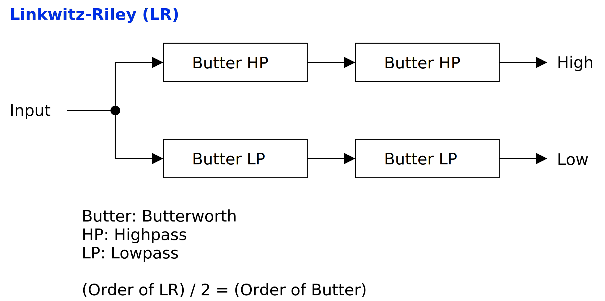
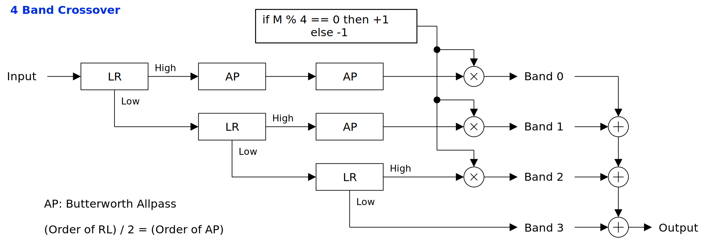
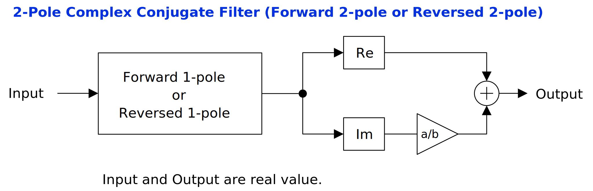
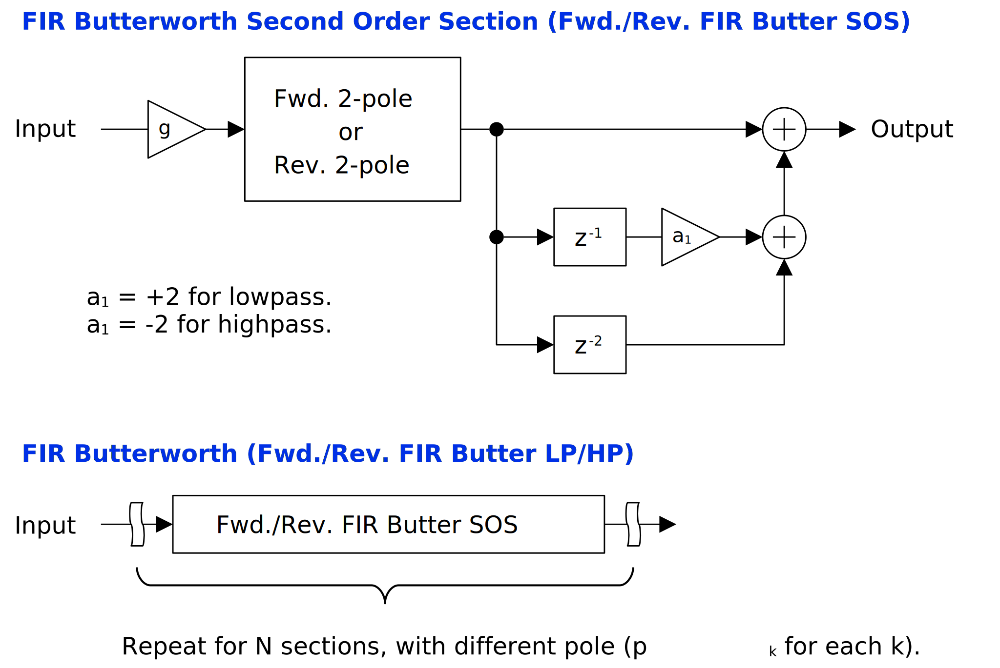
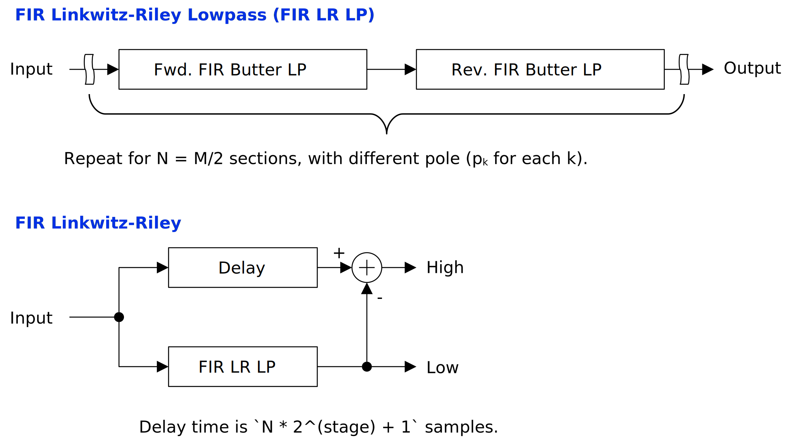

# クロスオーバーフィルタの実装
周波数帯域の分割に用いるクロスオーバーフィルタを実装します。

## 概要
かなりややこしいので概要を設けました。ページ上部の Table of Contents も多少は役に立つかと思います。

以下の 3 つのフィルタを実装します。

- 素朴な FIR フィルタ
- IIR の Linkwitz-Riley フィルタ
- FIR の Linkwitz-Riley フィルタ

IIR の Linkwitz-Riley フィルタは以下の属性の組み合わせによって実装の詳細が 6 つに分かれます。

- フィルタが偶数次あるいは奇数次。
- 2 バンド、 3 バンド以上かつ汎用的、 3 バンド以上かつ効率重視。

偶数次、奇数次によってフィルタ係数の計算が変わります。 2 バンドでは補正オールパスフィルタが不要ですが、 3 バンド以上では補正オールパスフィルタが必要となってきます。また補正オールパスフィルタを計算するタイミングで汎用性と計算効率のトレードオフがあります。

FIR の Linkwitz-Riley フィルタの節では小さい部品から順にクロスオーバーフィルタを組み立てています。つまり:

- 1 次の複素数フィルタの FIR 近似から 2 次の複素共役フィルタの FIR 近似が組み立てられる。
- 2 次の複素共役フィルタの FIR 近似から Butterworth フィルタ の FIR 近似が組み立てられる。
- Butterworth フィルタ の FIR 近似から線形位相 FIR Linkwitz-Riley フィルタが組み立てられる。

という流れになっています。

## 素朴な FIR フィルタ
フィルタ係数が左右対称な線形位相の FIR フィルタはクロスオーバーフィルタとして使えます。

素朴な線形位相 FIR フィルタの利点は多様な設計方法が確立していることと実装が簡単なことです。欠点はカットオフ周波数の変更時の計算量が多く、レイテンシが生じることです。カットオフ周波数を変更するとフィルタ係数をすべて書き換える必要があります。また線形位相フィルタは出力の遅れを補正するためにレイテンシが生じます。

窓関数法 (windowed sinc) で使うローパスの線形位相 FIR フィルタ係数は以下の式で計算できます。

$$
\begin{equation}
\mathtt{fir\_lp}(n) = \frac{\sin(2\pi n f_0 / f_s)}{\pi n},
\quad n \in [-\mathtt{ceil}(N_{\mathrm{FIR}}/2), \mathtt{floor}(N_{\mathrm{FIR}}/2)].
\end{equation}
$$

- $f_s$: サンプリング周波数 Hz 。
- $f_0$: カットオフ周波数 Hz 。
- $N_{\mathrm{FIR}}$: フィルタ係数の数。タップ数。

さらに窓関数をかけることで周波数特性を変更できます。以下はパラメータ $\alpha$ で手軽に特性を変更できる [Kaiser 窓](https://en.wikipedia.org/wiki/Kaiser_window)の近似計算式です。

$$
\begin{equation}
w_n = \frac{\cosh \left[ \alpha \sqrt{1-\left(\dfrac{n-K}{N_{\mathrm{FIR}}}\right)^2} \right]}{\cosh(\alpha)}
\label{Kaiser}
\end{equation}
$$

式 $\ref{Kaiser}$ は [Oboe の Resampler](https://github.com/google/oboe/blob/main/src/flowgraph/resampler/KaiserWindow.h) で参照されている [dsp.stackexchange.com の回答](https://dsp.stackexchange.com/a/37720)に掲載されていました。 Windows の VC++ か、 Linux の GCC 環境なら、式 $\ref{Kaiser}$ の近似を使わなくても C++ 17 で追加された `<cmath>` の [`cyl_bessel_k`](https://en.cppreference.com/w/cpp/numeric/special_functions) で直接 Kaiser 窓を実装することができます。しかし、この記事を書いた時点では Mac の Xcode (Apple Clang) では数学特殊関数が使えなかったので式 $\ref{Kaiser}$ の近似を掲載しています。

FIR の畳み込みの計算については「[レイテンシのない畳み込み](https://ryukau.github.io/filter_notes/convolution_without_latency/convolution_without_latency.html)」に詳細を掲載しています。ここでは省略します。

### 実装
以下は C++ 20 による実装へのリンクです。

- [C++ による素朴な FIR の実装を読む (github.com)](https://github.com/ryukau/filter_notes/blob/ebf401bd95eea9d361650e83a1abd891db6bfae6/crossover_filter/code/cpp/benchmark.cpp#L359-L406)

フィルタ係数が短いときは上のリンク先のように `std::inner_product` や単純な `for` によって簡単に実装できます。フィルタ係数が長いときは「レイテンシのない畳み込み」で紹介しているような FFT を用いた畳み込みで効率よく計算しなければリアルタイムの締め切りに間に合いません。

## IIR の Linkwitz-Riley フィルタ
Linkwitz-Riley フィルタは Butterworth を 2 つ直列につないだ IIR フィルタです。以下は Linkwitz-Riley フィルタのブロック線図です。

<figure>

</figure>

任意の次数の Butterworth フィルタについて、ローパスを `LP` 、ハイパスを `HP` とすると Linkwitz-Riley フィルタによるクロスオーバーは `(LP -> LP) + (HP -> HP) = AP` と表せます。ここで `->` は直列接続、 `AP` はオールパスです。つまり、分割した `(LP -> LP)` と `(HP -> HP)` を足し合わせても振幅特性が平坦なまま、ということです。

Linkwitz-Riley フィルタの次数は内部で使われる Butterworth フィルタの 2 倍となります。以降では Linkwitz-Riley フィルタの次数を $M$ 、内部で使われる Butterworth フィルタの次数を $N = M/2$ とします。 2 つの Butterworth を直列につなぐため $M$ は常に偶数です。

3 バンド以上の Linkwitz-Riley フィルタの実装は $M = 4n$ のときと $M = 4n + 2$ で場合分けされます。これは位相の補正に使うオールパスフィルタの実装が奇数次と偶数次で変わるためです。

分割した信号を投げっぱなしにせず、併合時に再び処理を行えるときは補正オールパスフィルタの数を減らして効率よく計算できます。

### 実装
#### 2 つ直列につないだ Butterworth フィルタ
$N$ 個の 2 次セクション (second order sections, sos) を直列につなぐことで 2 つ直列につないだ Butterworth フィルタを実装できます。すべてのセクションのカットオフ周波数はクロスオーバー周波数をそのまま使います。 $Q$ 値は [earlevel.com の "Cascading filters"](https://www.earlevel.com/main/2016/09/29/cascading-filters/) という記事で紹介されていた以下の式で計算します。

$$
\begin{equation}
Q_k = 0.5 \sin \left((k + 0.5)\dfrac{\pi}{N} \right), \quad k \in [0, N).
\end{equation}
$$

2 次セクションは biquad フィルタのローパスとハイパスが使えます。「[Biquad フィルタの比較](https://ryukau.github.io/filter_notes/biquad_filter_comparison/biquad_filter_comparison.html)」で実装を紹介しています。

以下は C++ による実装へのリンクです。テンプレートパラメータの `filterType` を `lowpass` あるいは `highpass` とすると 2 つ直列につないだ Butterworth フィルタとなります。

- [C++ による 2 つ直列につないだ Butterworth フィルタの実装を読む (github.com)](https://github.com/ryukau/filter_notes/blob/ebf401bd95eea9d361650e83a1abd891db6bfae6/crossover_filter/code/cpp/benchmark.cpp#L68-L107)

#### 補正オールパスフィルタ
$M = 4n$ と $M = 4n + 2$ の場合で実装が変わります。どちらの場合でも、すべてのカットオフ周波数にはクロスオーバー周波数を使います。

2 次セクションは biquad オールパスを使います。 TPT (topology-preserving transform) という離散化に基づいた biquad オールパスの実装を以下のリンク先に掲載しています。 [Audio EQ Cookbook](https://www.w3.org/TR/audio-eq-cookbook/) のレシピでも動きます。

- [C++ による TPT biquad フィルタの実装を読む (github.com)](https://github.com/ryukau/filter_notes/blob/ebf401bd95eea9d361650e83a1abd891db6bfae6/crossover_filter/code/cpp/benchmark.cpp#L15-L66)

##### $M = 4n$
2 次セクションの数は $N_{\mathrm{AP}} = N/2$ 個です。 $Q$ 値は 2 つ直列につないだ Butterworth フィルタと同じ式が使えますが、 $N$ が $N_{\mathrm{AP}}$ に置き換わります。以下は $Q$ 値を計算する式の再掲です。

$$
\begin{equation}
Q_k = 0.5 \sin \left((k + 0.5)\dfrac{\pi}{N_{\mathrm{AP}}} \right), \quad k \in [0, N_{\mathrm{AP}}).
\end{equation}
$$

以下は C++ による実装へのリンクです。テンプレートパラメータの `filterType` を `allpass` とすると $M = 4n$ のときの補正オールパスフィルタとなります。

- [C++ による $M = 4n$ のときの補正オールパスフィルタの実装を読む (github.com)](https://github.com/ryukau/filter_notes/blob/ebf401bd95eea9d361650e83a1abd891db6bfae6/crossover_filter/code/cpp/benchmark.cpp#L68-L107)

##### $M = 4n + 2$
1 つの 1 次オールパスと $\mathtt{floor}(N/2)$ 個の 2 次セクションの組み合わせとなります。 $M = 2$ のとき 2 次セクションは 0 個です。

###### 1 次オールパス
1 次オールパスは以下の伝達関数で表されます。

$$
\begin{equation}
H_{\mathrm{AP}1} (z) = \frac{a + z^{-1}}{1 + z^{-1}}.
\end{equation}
$$

$a$ はカットオフ周波数 $f_c$ とサンプリング周波数 $f_s$ から以下の式で計算できます。厳密にはオールパスの場合はカットオフ周波数とは言わず、ブレーク周波数 (break frequency) と言うそうです。ブレーク周波数は位相シフトの量が最大の半分となる周波数のことです。

$$
\begin{equation}
a = \frac{t - 1}{t + 1}, \quad t = \tan(\pi f_c / f_s).
\end{equation}
$$

差分方程式にします。

```
y0 = a * (x0 - y1) + x1;
```

- `x0`: 現在の入力値。
- `x1`: 1 サンプル前の入力値。
- `y0`: 現在の出力値。
- `y1`: 1 サンプル前の出力値。

これで計算できる形になりました。

###### 2 次セクションの $Q$
2 次セクションの $Q$ 値は以下の[正規化された Butterworth 多項式](https://en.wikipedia.org/wiki/Butterworth_filter) (normalzied Butterworth polynomial) で計算します。

$$
\begin{equation}
Q = -2 \cos \left( \frac{2 k + N - 1}{2 N} \pi \right), \quad k \in [1, N_{\mathrm{AP}}].
\end{equation}
$$

$k$ の範囲が 1 から始まり、終端は含めていることに注意してください。

以下は Python 3 による実装へのリンクです。

- [Python 3 による $M = 4n + 2$ のときの補正オールパスフィルタの実装を読む (github.com)](https://github.com/ryukau/filter_notes/blob/ebf401bd95eea9d361650e83a1abd891db6bfae6/crossover_filter/code/linkwitzriley.py#L98-L104)

#### 分割と併合
3 バンド以上の分割と併合について 2 つの方法を紹介します。原則としては汎用的な実装を行い、クロスオーバーがボトルネックとなっていれば効率のいい実装を使うことが考えられます。

2 バンドでは補正オールパスフィルタが不要なので以下の処理は実装しなくていいです。

##### 汎用的な実装
汎用的な帯域分割は補正オールパスの総数が分割するバンド数に応じた[三角数](https://en.wikipedia.org/wiki/Triangular_number) (triangular number) となりますが、単純な加算で併合を行える特長があります。つまりバンド数が多いと分割の計算が重たくなりますが、分割後の使い勝手はこちらのほうがいいです。

<figure>

</figure>

処理を書き下します。

0. 入力を Linkwitz-Riley に通過させて high と low に分割。
1. ここまでで得られた high をそれぞれ新たなオールパスに通過させる。
2. Low を Linkwitz-Riley に通過させて high と low に分割。
3. 所望のバンド数が得られるまで 1 に戻って分割を繰り返す。
4. 所望のバンド数が得られたら、ここまでで得られたすべての high について以下の係数を乗算する。
   - Linkwitz-Riley の次数が $4m + 0$ なら $+1$ を乗算。 (何もしない)
   - Linkwitz-Riley の次数が $4m + 2$ なら $-1$ を乗算。

以下は Python 3 による実装へのリンクです。クロスオーバー周波数のリスト `cutoffsHz` の長さがバンド数となります。

- [Python 3 による汎用的な Linkwitz-Riley クロスオーバーの分割と併合の実装を読む (github.com)](https://github.com/ryukau/filter_notes/blob/ebf401bd95eea9d361650e83a1abd891db6bfae6/crossover_filter/code/linkwitzriley.py#L554-L568)

##### 効率のいい実装
分割後の信号を再取得できるときは以下のブロック線図のようにオールパスの数を `(バンド数) - 1` に減らすことができます。例えば 1 つの音のプラグインの内部で分割と併合の処理を両方行うときに使えます。この方法は出力を投げっぱなしにできないため汎用性は落ちます。

<figure>

</figure>

処理を書き下します。まずは分割します。

0. Low に入力を代入する。
1. Low を Linkwitz-Riley に通過させて high と low に分割。
2. High を出力のキューに加える。
3. 現在の出力のキューの長さに low の 1 を加えた数が所望のバンド数でなければ手順 1 に戻る。

キューに格納された各帯域に任意の処理を施したあと、以下の併合の処理を行います。

0. 変数 `y` を用意して 0 に初期化。
1. キューの先頭を取り出し、新たなオールパスに通過させ、出力を `y` に加算。
2. キューの長さが 1 で無ければ手順 1 に戻る。
3. `y` に以下の係数を乗算。
   - Linkwitz-Riley の次数が $4m + 0$ なら $+1$ を乗算。 (何もしない)
   - Linkwitz-Riley の次数が $4m + 2$ なら $-1$ を乗算。
4. キューの最後の要素を取り出し、 `y` に加算して出力とする。

## FIR の Linkwitz-Riley フィルタ
Martin Vicanek さんによる ["A New Reverse IIR Filtering Algorithm"](https://vicanek.de/articles/ReverseIIR.pdf) で Linkwitz-Riley フィルタを線形位相の FIR フィルタとして効率よく近似する方法が紹介されています。

Vicanek の論文では 2 次の複素共役フィルタの FIR を効率よく近似して、時間反転フィルタに変換する方法が紹介されています。ここで時間反転 (time reversal) とはインパルス応答の前後を逆向きにすることです。元の前向きフィルタと時間反転フィルタを直列につなぎ合わせることで線形位相フィルタを構築することができます。

Linkwitz-Riley フィルタは、次数の同じ 2 つの Butterworth フィルタを直列につないだフィルタです。つまり 2 つの Butterworth フィルタの片方を前向きフィルタ、もう片方を逆向きフィルタとすることで線形位相 FIR にできます。また Butterworth フィルタは 2 次の複素共役フィルタの組み合わせとして実装できます。

### 実装
#### 1 次の複素数フィルタの FIR 近似
まずは以降で部品として使う 1 次の複素数フィルタの FIR 近似を実装します。以下は "A New Reverse IIR Filtering Algorithm" の式 1 として記載されている、 1 次の複素数フィルタの伝達関数です。 $c$ は複素数です。

$$
\begin{align}
H_{\mathrm{c}}(z) = \frac{1}{1 - cz^{-1}} &= 1 + c z^{-1} + c^2 z^{-2} + c^3 z^{-3} \dots
\label{LR-FIR-expanded}
\\
&= (1 + cz^{-1})(1 + c^2 z^{-2})(1 + c^4 z^{-4})(1 + c^8 z^{-8}) \dots
\label{LR-FIR-factorized}
\end{align}
$$

何をしているのかというと、 $\dfrac{1}{1 - cz^{-1}}$ という IIR フィルタの伝達関数を式 $\ref{LR-FIR-expanded}$ でインパルス応答に変形して、式 $\ref{LR-FIR-factorized}$ で多項式の因数分解を行っています。式 $\ref{LR-FIR-expanded}$ の IIR (無限インパルス応答) を適当に打ち切れば FIR フィルタとして計算できます。それだけだと嬉しくありませんが、式 $\ref{LR-FIR-factorized}$ のように因数分解することで計算量を圧縮するというのがアイデアです。

時間反転を行うときは式 $\ref{LR-FIR-factorized}$ の $(1 + c^n z^{-n})$ を $(c^n + z^{-n})$ に置き換えます。

$$
\begin{equation}
\mathrm{reverse}(H_{\mathrm{c}}(z)) = (c + z^{-1})(c^2 + z^{-2})(c^4 + z^{-4})(c^8 + z^{-8}) \dots
\label{LR-FIR-factorized-reversed}
\end{equation}
$$

以下は式 $\ref{LR-FIR-factorized}, \ref{LR-FIR-factorized-reversed}$ で示された 1 次の複素数フィルタの FIR 近似のブロック線図です。

<figure>

</figure>

この節の式やブロック線図では $8 = 2^3$ 次の因数 (factor) までしか計算していませんが、より高い次数を計算することで精度が上がります。以降では $2^N$ 次まで計算することを $N - 1$ ステージの計算と呼ぶことにします。

#### 2 次の複素共役フィルタの FIR 近似
2 次の複素共役フィルタの FIR 近似は 1 次の複素数フィルタの FIR 近似を使って効率よく実装できます。以下は 2 次の複素共役フィルタの伝達関数です。 $c$ は複素数、 $\bar{c}$ は複素数 $c$ の複素共役です。

$$
\begin{equation}
H_{\mathrm{c.c.}}(z) = \frac{1}{(1 - cz^{-1}) (1 - \bar{c}z^{-1})}.
\end{equation}
$$

$\bar{c} = a - ib$ とすると、適当な入力サンプル $x$ について以下のように伝達関数を変形できます。

$$
\begin{equation}
H_{\mathrm{c}} x = (1 - a z^{-1} + i b z^{-1}) H_{\mathrm{c.c.}} x.
\end{equation}
$$

ここで 1 次の複素数フィルタの出力を $H_{\mathrm{c}} x = u + iv$ として実部 $u$ と虚部 $v$ に分解すると以下の式が得られます。

$$
\begin{equation}
u = (1 - a z^{-1}) H_{\mathrm{c.c.}} x, \quad v = b z^{-1} H_{\mathrm{c.c.}} x.
\end{equation}
$$

$v$ の式を $z^{-1}$ について解き、 $u$ の式に代入すると以下の式が得られます。

$$
\begin{equation}
H_{\mathrm{c.c.}} x = u + \frac{a}{b} v.
\end{equation}
$$

上の式は "A New Reverse IIR Filtering Algorithm" の式 11 で示されている 2 次の複素共役フィルタの FIR 近似の効率のいい計算方法です。以下はこの計算のブロック線図です。

<figure>

</figure>

以下は C++ と Python 3 による実装へのリンクです。 `ComplexIIR` クラスの `process1PoleForward` と `process1PoleReversed` が 1 次の複素数フィルタの FIR 近似の計算、 `process2PoleForward` と `process2PoleReversed` が 2 次の複素共役フィルタの FIR 近似の計算です。

- [C++ による複素数フィルタの FIR 近似の実装を読む (github.com)](https://github.com/ryukau/filter_notes/blob/ebf401bd95eea9d361650e83a1abd891db6bfae6/crossover_filter/code/cpp/benchmark.cpp#L177-L262)
- [Python 3 による複素数フィルタの FIR 近似の実装を読む (github.com)](https://github.com/ryukau/filter_notes/blob/ebf401bd95eea9d361650e83a1abd891db6bfae6/crossover_filter/code/linkwitzriley.py#L150-L194)

C++ の実装はステージ数をテンプレートパラメータ `stage` として指定するために、[テンプレートの再帰](https://stackoverflow.com/a/8992939)を使っています。理由はよくわかりませんが、再帰を展開した実装よりも、テンプレートの再帰を使った実装のほうが `cl.exe` (Version 19.36.32532 for x64) では速くなりました。

#### Butterworth フィルタ の FIR 近似
2 次の複素共役フィルタの FIR 近似を用いて Butterworth フィルタの FIR 近似を行います。この節では「[ステップ応答が S 字を描くフィルタ](https://ryukau.github.io/filter_notes/s_curve_step_response_filter/s_curve_step_response_filter.html#%E6%AC%A1%E3%82%BB%E3%82%AF%E3%82%B7%E3%83%A7%E3%83%B3%E3%81%B8%E3%81%AE%E5%88%86%E5%89%B2)」に掲載した Bessel フィルタを 2 次セクションに分割する手法を流用しています。 Butterworth フィルタも Bessel フィルタと同様に全極フィルタなので同じ手法で 2 次セクションに分割できます。

バイリニア変換した離散系の $N$ 次の Butterworth フィルタは以下の 2 次セクションで表されます。

$$
\begin{align}
H_{\mathrm{Butter.} N}(z) &= G \prod_{k=1}^{N/2} \frac{1 + 2 z^{-1} + z^{-2}}{1 - 2 \mathrm{Re}(p_k) z^{-1} + |p_k|^2 z^{-2}}, \\
G &= \prod_{k=1}^{N/2} \frac{1 - 2 \mathrm{Re}(p_k) + |p_k|^2}{4}.
\label{allpole-sos-gain}
\end{align}
$$

$p_k$ は 2 次セクションの極の片方、 $G$ はフィルタ全体のゲインです。 Butterworth フィルタの 2 次セクションの極は複素共役となるので、 2 次の複素共役フィルタの伝達関数の分母と一致します。以下は 2 次の複素共役フィルタの伝達関数の再掲です。

$$
\begin{equation}
H_{\mathrm{c.c.}}(z) = \frac{1}{(1 - cz^{-1}) (1 - \bar{c}z^{-1})}.
\end{equation}
$$

ここで Butterworth の 2 次セクションと 2 次の複素共役フィルタに違いがあります。 Butterworth の 2 次セクションは分子が $1 + 2 z^{-1} + z^{-2}$ ですが、 2 次の複素共役フィルタの分子は $1$ です。つまり $1 + 2 z^{-1} + z^{-2}$ の部分を追加で計算する必要があります。

Butterworth フィルタの複素共役を除いた極 $p_k$ は以下の式で計算できます。 $f_c$ はカットオフ周波数、 $f_s$ はサンプリング周波数です。

$$
p_k = - 2 \pi \frac{f_c}{f_s} \exp \left( i \frac{\pi (2 k - N + 1)}{2 N} \right), \quad k \in [0, N/2).
$$

さらに数値計算の安定性を高めるために $G$ を以下の式で各セクションのゲイン $g$ に分割します。

$$
g = G^{\frac{1}{N/2}}.
$$

式 \ref{allpole-sos-gain} を変形して 2 次セクションごとに適切なゲインを設定することもできますが、保持する変数が増えます。

ここまでをまとめると以下のブロック線図となります。フィルタは線形なので $g$ の位置を `Output` の直前に動かしても動作します。

<figure>

</figure>

以下は C++ による実装へのリンクです。

- [C++ による Butterworth フィルタ の FIR 近似の実装を読む (github.com)](https://github.com/ryukau/filter_notes/blob/ebf401bd95eea9d361650e83a1abd891db6bfae6/crossover_filter/code/cpp/benchmark.cpp#L264-L331)

#### 線形位相 FIR Linkwitz-Riley
線形位相なのでハイパスは遅延した入力からローパスを減算すれば得られます。つまりハイパスの計算は省略できます。分割と併合についても IIR の Linkwitz-Riley のような補正オールパスは不要です。

<figure>

</figure>

以下は C++ による実装へのリンクです。

- [C++ による FIR Linkwitz-Riley の実装を読む (github.com)](https://github.com/ryukau/filter_notes/blob/ebf401bd95eea9d361650e83a1abd891db6bfae6/crossover_filter/code/cpp/benchmark.cpp#L333-L357)

## 比較
😀 は良、 👹 は悪を表しています。

|                | 素朴な FIR |   Linkwitz-Riley IIR    | Linkwitz-Riley FIR |
|:--------------:|:---------:|:-----------------------:|:------------------:|
|    線形位相    |    😀     |           👹            |         😀         |
|     レイテンシ      |    👹     |           😀            |         👹         |
|   実装の容易さ   |    😀     | 2 バンド 😀 / 3 バンド以上 👹 |         👹         |
| クロスオーバーの対称性 |    👹     |           😀            |         😀         |

低レイテンシが要件なら Linkwitz-Riley IIR が適しています。線形位相が要件かつ手軽に実装したいなら素朴な FIR 、実装に手間をかけてもいいなら Linkwitz-Riley FIR が適しています。

クロスオーバーの対称性はフィルタの振幅特性のスロープやストップバンドでの低減率などがローパスとハイパスで対称かということです。非対称を 👹 としています。

### 2 バンドのベンチマーク
素朴な FIR 、 Linkwitz-Riley IIR 、 FIR Linkwitz-Riley の 3 つについて、 2 バンドの場合の簡単なベンチマークを取りました。

| Name                    | Elapsed [ms] |
|-------------------------|-------------:|
| LinkwitzRileyIIR2Band4n |       1.4590 |
| LinkwitzRileyFIR2Band4n |       2.4562 |
| WindowedFIR2Band        |       2.8668 |


以下はベンチマークに使ったコードへのリンクです。

- [filter_notes/crossover_filter/code/cpp/benchmark.cpp at master · ryukau/filter_notes · GitHub](https://github.com/ryukau/filter_notes/blob/master/crossover_filter/code/cpp/benchmark.cpp)

以下はパラメータの設定です。

- Linkwitz-Riley IIR
  - 4 次
- Linkwitz-Riley FIR
  - 4 次
  - 8 ステージ (2^8 サンプルの FIR と等価)
- 素朴な FIR
  - 255 サンプル

結果を見ると IIR の Linkwitz-Riley が速く、 FIR の実装はあまり差がありません。ただし、素朴な FIR は畳み込みの計算について大いに改善の余地があります。また Linkwitz-Riley FIR のステージ数や、素朴な FIR のフィルタ係数の数によって結果が変わることが予想されます。

このベンチマークは実は素朴な FIR で十分ではないか、という疑問を解消するために行ったのでパラメータを細かく変えてトレンドを調べていません。クロスオーバー周波数をリアルタイムで変更する用途であれば、素朴な FIR のフィルタ係数の更新がかなりの負荷になるので、 Linkwitz-Riley FIR の利用価値はあるように見えます。クロスオーバー周波数が固定なら素朴な FIR でも十分な気がします。

## 参考文献
- [Linkwitz–Riley filter - Wikipedia](https://en.wikipedia.org/wiki/Linkwitz%E2%80%93Riley_filter)
- [Active Filters](https://linkwitzlab.com/filters.htm)
- [Building higher order filters with Biquads | CamillaDSP](https://github.com/HEnquist/camilladsp/blob/master/filterfunctions.md)
- [Cascading filters | EarLevel Engineering](https://www.earlevel.com/main/2016/09/29/cascading-filters/)
- [Bessel filter second-order sections Q and Fc multiplier derivation - Signal Processing Stack Exchange](https://dsp.stackexchange.com/questions/7830/bessel-filter-second-order-sections-q-and-fc-multiplier-derivation)
- Martin Vicanek, ["A New Reverse IIR Filtering Algorithm"](https://vicanek.de/articles/ReverseIIR.pdf), revised 2022-01-05. Obtained from [MV’s Plugins Articles](https://vicanek.de/articles.htm) in 2023-06-16.
- [Kaiser window approximation - Signal Processing Stack Exchange](https://dsp.stackexchange.com/questions/37714/kaiser-window-approximation/37720#37720)
- [oboe/src/flowgraph/resampler/KaiserWindow.h at main · google/oboe · GitHub](https://github.com/google/oboe/blob/main/src/flowgraph/resampler/KaiserWindow.h)
- [Allpass Filter: All You Need To Know - WolfSound](https://thewolfsound.com/allpass-filter/)

## 変更点
- 2024/04/30
  - 分子とするべきところで分母と書いていた誤りを修正。
- 2023/10/30
  - 概要の追加。
  - 「2 つ直列につないだ Butterworth フィルタ」の式の出典を文中に追加。
  - 文章の整理。
