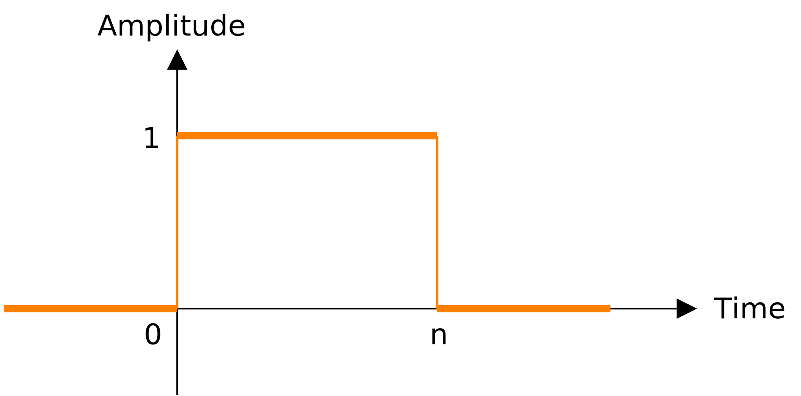
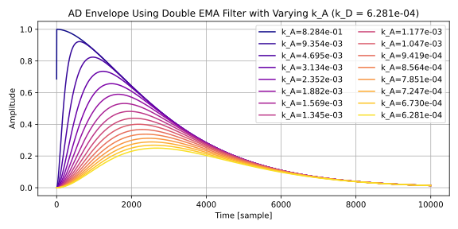
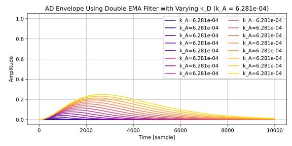
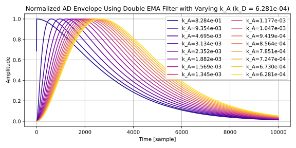
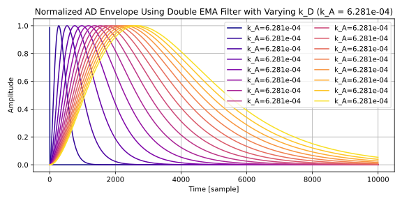

# 二重 EMA フィルタによる AD エンベロープ
Exponential moving average (EMA) フィルタを 2 つ直列につないだフィルタを使って AD エンベロープを作ります。

以下に完全なテストコードと、プロットに使ったコードを掲載しています。

- [Python3 によるテストコード (github.com)](https://github.com/ryukau/filter_notes/blob/master/double_ema_filter/test.py)
- [Python3 によるプロットに使ったコード (github.com)](https://github.com/ryukau/filter_notes/blob/master/double_ema_filter/img/plot.py)

以下は ClangSynth で使った C++ による二重 EMA フィルタによる AD エンベロープの実装です。

- [C++ による二重 EMA フィルタを使った AD エンベロープの実装 (github.com)](https://github.com/ryukau/VSTPlugins/blob/master/ClangSynth/source/dsp/envelope.hpp)

## 二重 EMA フィルタ
### 伝達関数
以下は EMA フィルタの伝達関数です。 $k$ は範囲 $[0, 1]$ のフィルタ係数です。

$$
H(z) = \frac{k}{1 + (k - 1)z^{-1}}
$$

以下は EMA フィルタを 2 つ直列につないだときの伝達関数です。

$$
\begin{aligned}
H(z)
&= \frac{k}{1 + (k - 1)z^{-1}} \times \frac{k}{1 + (k - 1)z^{-1}} \\
&= \frac{k^2}{1 + 2(k - 1) z^{-1} + (k - 1)^2 z^{-2}}
\end{aligned}
$$

この文章では、上の伝達関数を持つフィルタのことを二重 EMA フィルタと呼ぶことにします。二重 EMA フィルタは、 EMA フィルタと同様にステップ応答がオーバーシュートしないのでエンベロープへの応用に適しています。

以下は Python3 による二重 EMA フィルタの実装です。

```python
class DoubleEMA:
    def __init__(self, k=1, value=0):
        self.k = k
        self.v0 = value
        self.v1 = value

    def reset(self, value=0):
        self.v0 = value
        self.v1 = value

    def process(self, x0):
        self.v0 += self.k * (x0 - self.v0)
        self.v1 += self.k * (self.v0 - self.v1)
        return self.v1
```

### インパルス応答
Wolfram Alpha を使って二重 EMA フィルタの伝達関数を逆 Z 変換したところ、以下の式が得られました。逆 Z 変換によって得られた式はインパルス応答を表しています。

$$
x[n] = k^2 (n + 1)(1 - k)^n \\
$$

- [Wolfram Alpha での結果へのリンク](https://www.wolframalpha.com/input?i=inverse+Z+transform+calculator&assumption=%7B%22F%22%2C+%22InverseZTransformCalculator%22%2C+%22transformfunction%22%7D+-%3E%22k%5E2%2F%281%2B2*%28k-1%29*z%5E-1+%2B+%28k-1%29%5E2*z%5E-2%29%22&assumption=%7B%22F%22%2C+%22InverseZTransformCalculator%22%2C+%22variable1%22%7D+-%3E%22z%22&assumption=%7B%22F%22%2C+%22InverseZTransformCalculator%22%2C+%22variable2%22%7D+-%3E%22n%22)

### ゲート信号への応答
ここでの目的はエンベロープへの応用なのでゲート信号への応答の形に式を変形します。ここではゲート信号を、時間が 0 サンプルから n サンプルの区間で振幅 1 、それ以外では振幅 0 となる信号と定義しています。以下はゲート信号の図です。

<figure>

</figure>

試行錯誤したところ Python3 で実装した以下の関数が、伝達関数の形で実装した二重 EMA フィルタの出力と一致しました。アイデアとしては、インパルスの現れる時間をずらした複数のインパルス応答の総和を取っています。

```python
def doubleEmaClosed(n, k, init=0, gain=1):
    value = 0
    for i in range(0, n + 1):
        value += k * k * (i + 1) * (1 - k)**i
    return init + gain * value
```

`n` はゲートが開く時間の長さです。今回の応用ではノートオンからノートオフまでの間隔を表しています。また `n` が無限大のときにステップ応答となります。

数式にします。 $V$ は初期値、 $G$ はゲインです。総和を取り除いた形は Wolfram Alpha から取得しました。

$$
\begin{aligned}
x(k, V, G)[n]
  &= V + G \sum_{i=0}^{n} k^2 (i + 1) (1 - k)^i \\
  &= V + G \Big( k^2 (n + 1) (1 - k)^n - k n (1 - k)^n - (1 - k)^n + 1 \Big) \\
  &= V + G \Big( 1 + (1 - k)^n (k^2 (n + 1) - k n - 1) \Big) \\
  &= V + G \Big( 1 - (1 - k)^{n + 1} (k n + k + 1) \Big)
\end{aligned}
$$

## AD エンベロープ
2 つの二重 EMA フィルタを乗算して、ターゲットとなる AD エンベロープ $E$ の式を作ります。 $k_A$ はアタック、 $k_D$ はディケイのフィルタ係数です。

$$
\begin{aligned}
E[n] &= x(k_A, 0, 1)[n] \times x(k_D, 1, -1)[n]
\\
&=
  \Big( 1 - (1 - k_A)^{n + 1} (k_A n + k_A + 1) \Big)
  \Bigg( 1 - \Big( 1 - (1 - k_D)^{n + 1} (k_D n + k_D + 1) \Big) \Bigg)
\\
&=
  \Big( 1 - (1 - k_A)^{n + 1} (k_A n + k_A + 1) \Big)
  (1 - k_D)^{n + 1} (k_D n + k_D + 1)
\end{aligned}
$$

Python 3 に翻訳します。 `samplesToKp` の導出については [Matt L. さんによる Signal Processing Stack Exchange での回答](https://dsp.stackexchange.com/a/54088) を参照してください。

```python
def doubleEmaEnvelopeD0(n, k_A, k_D):
    A = (1 - k_A)**(n + 1) * (k_A * n + k_A + 1)
    D = (1 - k_D)**(n + 1) * (k_D * n + k_D + 1)
    return (1 - A) * D

def samplesToKp(timeInSamples):
    y = 1 - np.cos(2 * np.pi / timeInSamples)
    return -y + np.sqrt(y * (y + 2))

n = np.arange(10000)
k_A = samplesToKp(1000)
k_D = samplesToKp(20000)
envelope = doubleEmaEnvelopeD0(n, k_A, k_D)
```

以下は $k_A$ と $k_D$ を適当に変えたときのエンベロープの出力とコードです。縦軸は振幅、横軸はサンプル数であらわされた時間です。

<figure>

</figure>

<figure>

</figure>

### ピークの探索
エンベロープとして使いたいので $k_A$ と $k_D$ の値によらず、ピークの値が 1 となるように正規化します。ここでは数値計算によって $E$ の最大値を求め、逆数にして乗算することで正規化を行います。 $E$ を微分した式を使うことも試みたのですが、得られた式が煩雑な形になったので諦めました。

以下は Python3 によるピークを正規化したエンベロープの計算を行うコードです。変数が 1 つだけの任意の関数の最小値を求めるときは [`scipy.optimize.minimize_scalar`](https://docs.scipy.org/doc/scipy/reference/generated/scipy.optimize.minimize_scalar.html#scipy.optimize.minimize_scalar) が使えます。求まる値はあくまでも最小値なので `doubleEmaEnvelopeD0` の正負の符号を逆転した `doubleEmaEnvelopeD0Negative` を使っています。あとは得られた `peakValue` の逆数を AD エンベロープの出力に乗算すればピークの値が 1 に正規化された出力が得られます。

```python
# `samplesToKp` と `doubleEmaEnvelopeD0` については一つ前のコードスニペットを参照。

import scipy.optimize as optimize

def doubleEmaEnvelopeD0Negative(n, k_A, k_D):
    A = (1 - k_A)**(n + 1) * (k_A * n + k_A + 1)
    D = (1 - k_D)**(n + 1) * (k_D * n + k_D + 1)
    return (A - 1) * D

k_A = samplesToKp(1000)
k_D = samplesToKp(20000)

result = optimize.minimize_scalar(
    doubleEmaEnvelopeD0Negative,
    args=(k_A, k_D),
)
peakTime = result.x
peakValue = -result.fun

n = np.arange(10000)
envelope = doubleEmaEnvelopeD0(n, k_A, k_D)
```

以下はピークを正規化したエンベロープの $k_A$ と $k_D$ を適当に変えたときの出力です。縦軸は振幅、横軸はサンプル数であらわされた時間です。

<figure>

</figure>

<figure>

</figure>

### 正規化の誤差
エンベロープの出力は $[0, 1]$ の範囲内であることが望ましいです。また、伝達関数が表す差分方程式による計算と、 `doubleEmaEnvelopeD0` が表す閉じた形の解 (closed-form solution) による計算では浮動小数点数の挙動によって計算結果がずれることが考えられます。そこで気になってくるのが正規化したピークが 1 を超えないかどうかです。

以下のリンク先のコードによって調べました。

- [Python3 による正規化の誤差を調べるコード (github.com)](https://github.com/ryukau/filter_notes/blob/3032c174aaa8d5b1fb7b9e0089da898fd9ba0221/double_ema_filter/img/plot.py#L97)

以下は適当に $k_A$ と $k_D$ を変えたときの正規化したピーク値のプロットです。縦軸は正規化したピーク値、横軸は $k_D$ の値です。縦軸のスケールは `1e-8` 、オフセットは `+9.9999999e-1` です。つまり左上の `1.00` を超えていなければ正規化したピークは 1 以内に収まっているということです。

<figure>

</figure>

傾向としては $k_A$ と $k_D$ が小さいときは、正規化したピークも小さくなるようです。また、調べた範囲では正規化したピークが 1 を超えるケースは見つかりませんでした。

## その他
### 再帰のない EMA フィルタの計算式
EMA フィルタの伝達関数を再掲します。

$$
H(z) = \frac{k}{1 + (k - 1)z^{-1}}
$$

Wolfram Alpha で EMA フィルタの伝達関数を逆 Z 変換したところ、以下の式が得られました。

$$
x[n] = k(1-k)^n
$$

### 二重 EMA フィルタの微分
$x(k, V, G)[n]$ の微分です。とりあえず微分したものの、用途が見当たりませんでした。

```
diff(V + G * ((k^2*(n+1) - k*n - 1)*(1-k)^n + 1), n);  // maxima
diff V + G * ((k^2*(n+1) - k*n - 1)*(1-k)^n + 1) for n // wolfram alpha
```

$$
\begin{aligned}
\frac{dx[n]}{dn}
&= G (\log(1-k) (1-k)^n (k^2 (n+1)-k n-1)+(1-k)^n (k^2-k)) \\
&= G (k - 1) (1-k)^n ((k n + k + 1) \log(1-k) + k) \\
&= -G (1 - k)^{n + 1} ((k n + k + 1) \log(1-k) + k) \\
\end{aligned}
$$

### AD エンベロープの式の微分
AD エンベロープのピークの値を取得するために使えるかと思ったのですが、式の整理が困難だったので、このアプローチは諦めました。

Wolfram Alpha で微分します。

```
diff (1 - (1 - k_A)^{n + 1} * (k_A * n + k_A + 1)) * (1 - k_D)^{n + 1} * (k_D * n + k_D + 1) for n
```

以下は得られた出力です。

```
d/dn((1 - (1 - k_A)^(n + 1) (k_A n + k_A + 1)) (1 - k_D)^(n + 1) (k_D n + k_D + 1))
=
k_D (1 - (1 - k_A)^(n + 1) (k_A n + k_A + 1)) (1 - k_D)^(n + 1) + (1 - (1 - k_A)^(n + 1) (k_A n + k_A + 1)) (k_D n + k_D + 1) (1 - k_D)^(n + 1) log(1 - k_D) + (k_D n + k_D + 1) (1 - k_D)^(n + 1) (-k_A (1 - k_A)^(n + 1) - (k_A n + k_A + 1) (1 - k_A)^(n + 1) log(1 - k_A))


k_D * (1 - (1 - k_A)^(n + 1) * (k_A * n + k_A + 1)) * (1 - k_D)^(n + 1) + (1 - (1 - k_A)^(n + 1) * (k_A * n + k_A + 1)) * (k_D * n + k_D + 1) * (1 - k_D)^(n + 1) * log(1 - k_D) + (k_D * n + k_D + 1) * (1 - k_D)^(n + 1) * (-k_A (1 - k_A)^(n + 1) - (k_A * n + k_A + 1) * (1 - k_A)^(n + 1) * log(1 - k_A))
```

数式に変換して整理します。

$$
\begin{aligned}
&
\frac{d}{dn} \Bigg(
  \Big( 1 - (1 - k_A)^{n + 1} (k_A n + k_A + 1) \Big)
  (1 - k_D)^{n + 1} (k_D n + k_D + 1)
\Bigg)
\\ & \quad
=
k_D (1 - (1 - k_A)^{n + 1} (k_A n + k_A + 1)) (1 - k_D)^{n + 1}
\\ & \qquad
+ (1 - (1 - k_A)^{n + 1} (k_A n + k_A + 1)) (k_D n + k_D + 1) (1 - k_D)^{n + 1} \log(1 - k_D)
\\ & \qquad
+ (k_D n + k_D + 1) (1 - k_D)^{n + 1} (-k_A (1 - k_A)^{n + 1} - (k_A n + k_A + 1) (1 - k_A)^{n + 1} \log(1 - k_A))
\\ & \quad
=
+ D_0 (1 - A_0 A_1) k_D
\\ & \qquad
+ D_0 D_1 (1 - A_0 A_1) D_2
\\ & \qquad
- D_0 D_1 A_0 k_A
\\ & \qquad
- D_0 D_1 A_0 A_1 A_2
\\ & \quad
=
D_0 \Bigg(
  (k_D + D_1 D_2) (1 - A_0 A_1)
- D_1 A_0 (k_A + A_1 A_2)
\Bigg)
\end{aligned}
$$

導入した記号は以下の通りです。

$$
\begin{array}{llll}
& D_0 = (1 - k_D)^{n + 1} && A_0 = (1 - k_A)^{n + 1} \\
& D_1 = k_D n + k_D + 1   && A_1 = k_A n + k_A + 1 \\
& D_2 = \log(1 - k_D)     && A_2 = \log(1 - k_A) \\
\end{array}
$$

上の式の $n$ を 0 について解けば AD エンベロープのピークの時点が得られるはずです。 Wolfram Alpha と Maxima で試したのですが、式の形がとても煩雑になるので整理は困難です。

以下は Python3 による実装です。

```python
def doubleEmaEnvelopeD1(n, k_A, k_D):
    D_0 = (1 - k_D)**(n + 1)
    A_0 = (1 - k_A)**(n + 1)
    D_1 = k_D * n + k_D + 1
    A_1 = k_A * n + k_A + 1
    D_2 = np.log(1 - k_D)
    A_2 = np.log(1 - k_A)
    return D_0 * ((k_D + D_1 * D_2) * (1 - A_0 * A_1) - D_1 * A_0 * (k_A + A_1 * A_2))
```

## 参考サイト
- [scipy.optimize.minimize_scalar — SciPy v1.9.1 Manual](https://docs.scipy.org/doc/scipy/reference/generated/scipy.optimize.minimize_scalar.html#scipy.optimize.minimize_scalar)
- [Deriving a Closed-Form Solution of the Fibonacci Sequence using the Z-Transform – ML & Stats](https://markusthill.github.io/deriving-a-closed-form-solution-of-the-fibonacci-sequence/)
- [Closed form solution of Fibonacci-like sequence - Mathematics Stack Exchange](https://math.stackexchange.com/questions/167957/closed-form-solution-of-fibonacci-like-sequence)
- [Single-pole IIR low-pass filter - which is the correct formula for the decay coefficient? - Signal Processing Stack Exchange](https://dsp.stackexchange.com/questions/54086/single-pole-iir-low-pass-filter-which-is-the-correct-formula-for-the-decay-coe)
