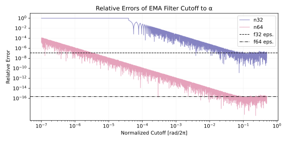
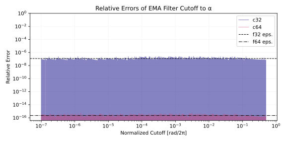
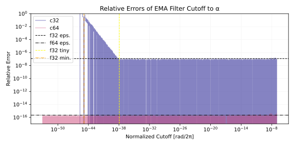
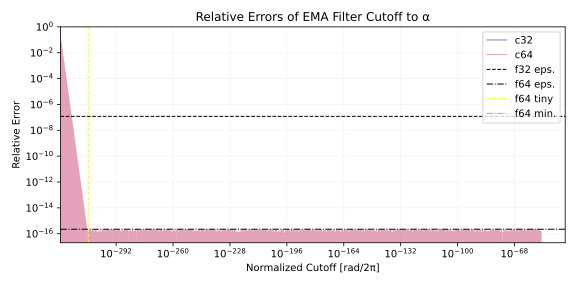
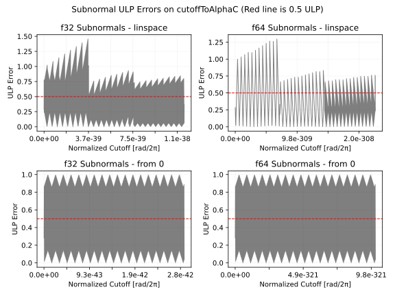
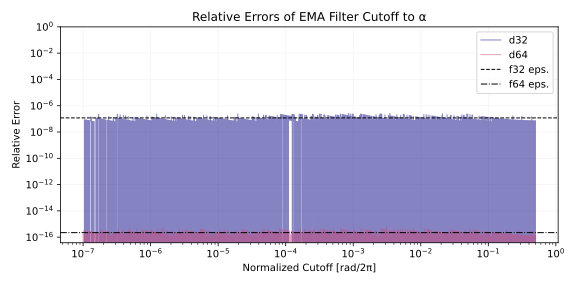
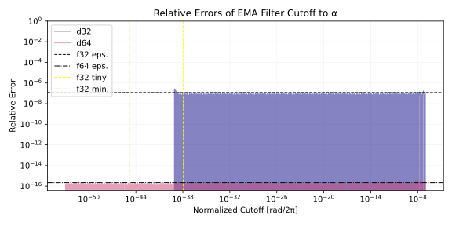
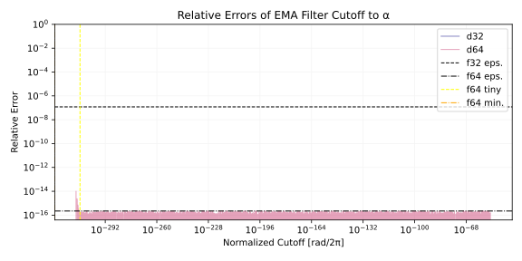
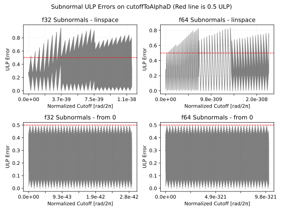

# EMA フィルタのカットオフの正確な計算
Exponential moving average (EMA) フィルタのカットオフ周波数からフィルタ係数を正確に計算する方法を紹介します。

以下は Python 3 による実装へのリンクです。 `cutoffToAlphaC` と `cutoffToAlphaD` が正確な計算を行う実装です。

- [filter_notes/ema_cutoff/emaaccuratecutoff.py at master · ryukau/filter_notes · GitHub](https://github.com/ryukau/filter_notes/blob/master/ema_cutoff/emaaccuratecutoff.py)

## 素朴な計算
以下は C++20 による EMA フィルタの実装です。 `x` は入力信号、 `y` は出力信号、 `alpha` は EMA フィルタ係数です。

```c++
template<std::floating_point T> struct EmaLowpass {
  T y = 0;
  T process(T x, T alpha) { return y += alpha * (x - y); }
};
```

以下はカットオフ周波数 $f_c$ からフィルタ係数 `alpha` を計算する式です。 $f_s$ はサンプリング周波数、 $\omega_c$ は単位 rad の角周波数で表されたカットオフ周波数です。

$$
\alpha = \sqrt{(y + 2) y} - y, \quad y = 1 - \cos(\omega_c), \quad \omega_c = 2 \pi \frac{f_c}{f_s}.
$$

- [digital filters - Exponential weighted moving average time constant - Signal Processing Stack Exchange](https://dsp.stackexchange.com/questions/28308/exponential-weighted-moving-average-time-constant/28314#28314)

以下は上の式の実装です。 `cutoffNormalized` は範囲 [0, 0.5) に正規化されたカットオフ周波数で $f_c/f_s$ と等価です。

```c++
template<std::floating_point T> T cutoffToAlphaNaive(T cutoffNormalized) {
  T y = T(1) - std::cos(T(2) * std::numbers::pi_v<T> * cutoffNormalized);
  return std::sqrt((y + T(2)) * y) - y;
}
```

`T` が `double` (f64) であれば音の計算では問題はほぼ起きないのですが、 `float` (f32) のときは `cutoffNormalized` がおよそ 1e-4 を下回ると完全におかしい値が出ます。

Python に翻訳して相対誤差をプロットします。相対誤差は参照値を `r` 、近似値を `a` とすると `(r - a) / r` で計算できます。参照値 (reference) の計算には任意精度計算ライブラリの mpmath を使っています。

```python
import numpy as np
import matplotlib.pyplot as plt
from mpmath import mp
from numpy.typing import DTypeLike as Dtl

def cutoffToAlphaReference(cutoffNormalized: float, dtype: Dtl = np.float64) -> float:
    with mp.workdps(720):
        cn = mp.mpf(float(dtype(cutoffNormalized)))
        y = 1 - mp.cos(2 * mp.pi * cn)
        result = mp.sqrt((y + 2) * y) - y
        return float(dtype(result))

def cutoffToAlphaNaive(cutoffNormalized: float, dtype: Dtl = np.float64) -> float:
    y = 1 - np.cos(2 * np.pi * cutoffNormalized, dtype=dtype)
    result = np.sqrt((y + 2) * y, dtype=dtype) - y
    return float(result)
```

プロットのコードは長いので以下の詳細の下に隠しています。

<details>
<summary>プロットのコード (クリックして開く)</summary>

```python
def plotError():
    x = np.geomspace(1e-7, 0.5, 8193)
    ref = [cutoffToAlphaReference(fc) for fc in x]

    print(f"--- Value at f_c = 0\nref:  {cutoffToAlphaReference(0)}")

    data = {
        "n32": lambda f: cutoffToAlphaNaive(f, np.float32), # n -> naive
        "n64": lambda f: cutoffToAlphaNaive(f, np.float64),
    }

    plt.figure(figsize=(8, 4))
    cmap = plt.get_cmap("plasma")
    for idx, (key, func) in enumerate(data.items()):
        print(f"{key}:  {func(0)}") # Test values at 0.

        y = [func(fc) for fc in x]
        relativeError = 1 - np.array(y) / np.array(ref)
        plt.plot(
            x,
            relativeError,
            color=cmap(idx / len(data)),
            alpha=0.5,
            lw=1,
            label=key,
        )

    plt.axhline(
        np.finfo(np.float32).eps,
        color="black",
        lw=1,
        ls="--",
        label="f32 eps.",
    )
    plt.axhline(
        np.finfo(np.float64).eps,
        color="black",
        lw=1,
        ls="-.",
        label="f64 eps.",
    )
    plt.title("Relative Errors of EMA Filter Cutoff to α")
    plt.xlabel("Normalized Cutoff [rad/2π]")
    plt.ylabel("Relative Error")
    plt.xscale("log")
    plt.yscale("log")
    plt.yticks(np.geomspace(1e-16, 1, 9))
    plt.legend()
    plt.grid(color="#f4f4f4")
    plt.tight_layout()
    plt.show()
```

</details>

以下は相対誤差のプロットです。

<figure>

</figure>

n32 が単精度 (f32) 、 n64 が倍精度 (f64) での誤差です。 n は naive (素朴な実装) の略です。 相対誤差がマシンイプシロンを下回っていれば正確と言えます。つまり、単精度では f32 eps. 、 倍精度では f64 eps. のラインを下回る必要があります。 n32, n64 ともに正規化されたカットオフ周波数が 0.1 を下回るところから正確さが落ち始めています。これはサンプリング周波数が 48000 Hz のときにカットオフ周波数が 4800 Hz を下回ると正確に計算できないということです。また n32 はおよそ 3e-5 から 4e-5 の間で相対誤差が 1 に達しています。相対誤差が 1 になるということは完全に異なる値が出ているということです。実際に計算してみると 0 にならないはずの入力で 0 が出ています。

```python
x = 3e-5
cutoffToAlphaReference(3e-5, np.float32) # ref: 0.00018847778846975416
cutoffToAlphaNaive(x, np.float32)        # n32: 0.0
```

## 桁落ち (Catastrophic Cancellation)
`cutoffToAlphaNaive` が不正確な理由は減算による桁落ち ([catastrophic cancellation](https://en.wikipedia.org/wiki/Catastrophic_cancellation)) が原因です。桁落ちとは、値が近い 2 つの近似値を減算したときに有効桁数が落ちる計算誤差のことです。

$1 - \cos(x)$ を例に計算してみます。

```
x : 1.000000047e-03

1 - cos(x) (mp)  : 4.999999987e-07
1 - cos(x) (f32) : 4.768371582e-07 # 😱

Rel Error :  4.63e-02
ULP Error :  4.07e+05
```

mp が任意精度で計算した正確な値、 f32 が単精度 (32-bit float) で計算した値です。 😱 で示した行が単精度の計算結果です。 `4` までの 1 桁だけ正確という、とんでもない桁落ちが起きています。

<details>
<summary>計算に使った Python のコード</summary>

インタープリタに貼り付けると動作します。 NumPy と mpmath が必要です。

```python
import numpy as np
from mpmath import mp

dtype = np.float32
mp.dps = 50

x = dtype(1e-3)

y_mp = mp.mpf(1) - mp.cos(mp.mpf(float(x)))
y_np = dtype(1 - np.cos(x))

rel = float(abs(y_mp - y_np) / y_mp)
ulp = float(abs(y_mp - y_np) / np.spacing(dtype(y_mp), dtype=dtype))

text = f"""
x : {x:.9e}

1 - cos(x) (mp)  : {dtype(y_mp):.9e}
1 - cos(x) (f32) : {y_np:.9e}

Rel Error : {rel: .2e}
ULP Error : {ulp: .2e}
"""

print(text)
```

</details>

## 正確な計算
桁落ちを避けるために、減算を使わないように式変形します。 $\alpha$ の計算式を再掲します。

$$
\alpha = \sqrt{(y + 2) y} - y, \quad y = 1 - \cos(\omega_c), \quad \omega_c = 2 \pi \frac{f_c}{f_s}.
$$

ここで三角関数の倍角の公式 (double-angle formula) より $y$ における減算を避けられます。

$$
y = 1 - \cos(\omega_c) = 2 \sin^2(\omega_c/2).
$$

また、 $\alpha$ について以下の等式が成り立ちます。 $(\sqrt{(y + 2) y} - y) (\sqrt{(y + 2) y} + y) = 2y$ という関係を利用しています。

$$
\alpha = \sqrt{(y + 2) y} - y = \frac{2y}{\sqrt{(y + 2) y} + y}.
$$

$y = 2 \sin^2(\omega_c/2)$ を代入して整理すると以下の式が得られます。式の簡略化のため $s = \sin^2(\omega_c/2)$ と置きます。

$$
\begin{aligned}
\alpha
&= \frac{2y}{\sqrt{(y + 2) y} + y} \\
&= \frac{4 s^2}{\sqrt{4 s^4 + 4 s^2} + 2s^2} \\
&= \frac{2 s}{\sqrt{s^2 + 1} + s}.
\end{aligned}
$$

実装します。

```python
def cutoffToAlphaC(cutoffNormalized: float, dtype: Dtl = np.float64) -> float:
    sn = np.sin(np.pi * cutoffNormalized, dtype=dtype)
    result = 2 * sn / (np.sqrt(sn * sn + 1, dtype=dtype) + sn)
    return float(result)
```

以下は相対誤差のプロットです。正規化されたカットオフ周波数が \[1e-7, 0.5) の範囲であれば、ほぼ正確です。 1e-7 は単精度のマシンイプシロンに近い値です。

<figure>

</figure>

以下は入力が \[1e-53, 1e-7\] のときの誤差のプロットです。 f32 tiny は単精度のノーマル数 (normal number) の最小値、 f32 min. は単精度のサブノーマル数 (subnormal number) の最小値です。つまり f32 はノーマル数の範囲であれば正確です。サブノーマル数の範囲については相対誤差ではうまく誤差を表現できないので、以降の ULP 誤差のプロットを参照してください。

<figure>

</figure>

以下は入力が \[0, 1e-53\] のときの誤差のプロットです。 f64 は f32 と同様にノーマル数の範囲であれば正確です。

<figure>

</figure>

以下はサブノーマル数の範囲における ULP 誤差のプロットです。

<figure>

</figure>

サブノーマル数の範囲では値が小さくなるほど 1 ULP の誤差の重みが大きくなるため、 0 に近づくほど不正確になります。工学的な視点から見ると、サブノーマル数の範囲が単調でさえあればフィルタの計算に差し支えないので `cutoffToAlphaC` は十分に正確です。 $\alpha$ がサブノーマル数ということは非常に低いカットオフ周波数となるわけですが、信号処理の視点から言えばサンプリング周波数を下げるなど、より効率のいい対処法が考えられます。

## サブノーマル
サブノーマルの範囲を正確に計算するために 0 の周りでテイラー展開を行います。 SymPy を使います。

```python
import sympy as sp

def f(omega):
    s = sp.sin(omega / 2)
    return 2 * s / (sp.sqrt(s**2 + 1) + s)

ω = sp.Symbol("ω") # ω = 2 * pi * x
print(f(ω).series(ω, 0, 3))
```

$$
\alpha = \frac{2 s}{\sqrt{s^2 + 1} + s} \approx ω - \frac{ω^{2}}{2} + O\left(ω^{3}\right).
$$

$s = \sin(\omega)$ 、 $\omega = 2\pi x$ 、 $x$ は正規化されたカットオフ周波数です。

2 次の展開までしか表示していないのは $x$ がサブノーマル数のときに $x^2$ を計算すると 0 にアンダーフローするため、計算する意味がないからです。 $\omega (1 - \omega/2)$ の形で計算すると $(1 - \omega/2)$ が $1$ あるいは $1 - \epsilon$ に丸められます。 $1$ に丸められるときは意味のない計算となります。 $1 - \epsilon$ の場合についてはここでは検討していません。

よって、サブノーマル数の範囲をカバーするための近似式は以下となります。

$$
\alpha \approx ω.
$$

相対誤差を 2 次の項を近似式で除算した値として近似します。マシンイプシロン $\epsilon$ を下回るように不等式を立てます。

$$
\frac{1}{\omega} \cdot \frac{ω^{2}}{2} \lessapprox \epsilon.
$$

$\omega$ について解けば分岐点の近似が得られます。近似というのは 3 次以降の項を無視しているので厳密な分岐点ではないということです。

$$
\omega \lessapprox 2 \epsilon.
$$

上の式に遊びを持たせた $\epsilon$ を分岐点にします。実装します。

```python
def cutoffToAlphaD(cutoffNormalized: float, dtype: Dtl = np.float64) -> float:
    pi = dtype(np.pi)
    twopi = dtype(2.0 * pi)
    cn = dtype(cutoffNormalized)

    omega = twopi * cn
    if omega < np.finfo(dtype).eps:
        return float(omega)

    sn = np.sin(pi * cn, dtype=dtype)
    result = 2 * sn / (np.sqrt(sn * sn + 1, dtype=dtype) + sn)
    return float(result)
```

以下は相対誤差のプロットです。

<figure>

</figure>

<figure>

</figure>

<figure>

</figure>

以下はサブノーマル数の範囲における ULP 誤差のプロットです。 0 に近い範囲では誤差が下がっています。

<figure>

</figure>

サブノーマル数の範囲について `nextafter` を使って数え上げる形で簡単に検証したところ、 0 に近い値では誤差が減っていました。

```python
def listSubnormalsFrom0(n: int, start: float = 0.0, dtype=np.float64):
    def generate(n: int, start: float = 0.0, dtype=np.float64):
        dtype = np.dtype(dtype)
        v = dtype.type(start)
        target = dtype.type(np.inf)
        for _ in range(n):
            v = np.nextafter(v, target)
            yield v

    return np.array(list(generate(n, start, dtype)), dtype=dtype)


def sweep():
    dtype = np.float64
    x = listSubnormalsFrom0(100000, dtype=dtype)

    for v in x:
        v = float(v)
        r = cutoffToAlphaReference(v)
        a = cutoffToAlphaD(v)
        ulp = ulp_error(r, a, dtype)
        if ulp > 0:
            rel = relative_error(r, a, dtype)
            if rel >= np.finfo(dtype).eps:
                print(v, r, a, ulp, rel)

    print(v)
```

以下はサブノーマル数の範囲で 0.5 ULP を超える誤差が現れる既知の最小の引数です。

```python
dtype = np.float32
x = 1.1675765e-41
cutoffToAlphaReference(x, dtype) # 7.335937591e-41
cutoffToAlphaD(x, dtype)         # 7.336077720e-41

dtype = np.float64
x = 5.48450035e-316
cutoffToAlphaReference(x, dtype) # 3.44601320688363855e-315
cutoffToAlphaD(x, dtype)         # 3.44601320194298209e-315
```

## その他
### mpmath のサブノーマル数のバグ
mpmath 1.4.1 では `float(mpf)` の形でキャストを行うと、 `mpf` がサブノーマル数に丸められるときに不正確な値となることがあるバグがあります。 1.5 以降では修正されるようです。

- [Correct to_float() conversion for subnormals by skirpichev · Pull Request #1082 · mpmath/mpmath · GitHub](https://github.com/mpmath/mpmath/pull/1082)

### FMA
Fused multiply-add (FMA) を使うと `a * b + c` の丸め誤差を減らすことができます。今回の関数では `sn * sn + 1` を `math.fma(sn, sn, 1)` と置き換える形で試してみましたが関数全体としての誤差は減らなかったです。 `math.fma` は Python 3.13 で導入されました。

## 変更点
- 2028/07/06
  - 桁落ちの例を $\pi - \dfrac{355}{113}$ から $1 - \cos(x)$ に変更。
  - ULP 誤差のプロットを追加。
- 2028/06/27
  - 文章の整理。
- 2026/06/22
  - 「桁落ち」の相対誤差の計算を修正。
  - 「サブノーマル」の項の 2 次の項のアンダーフローに関する段落の式を修正。
  - 文章の整理。
