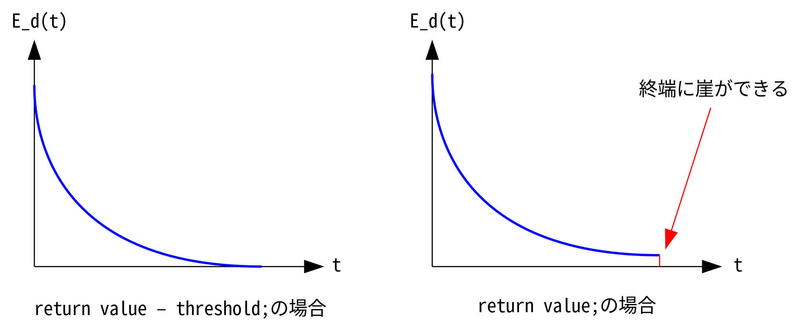
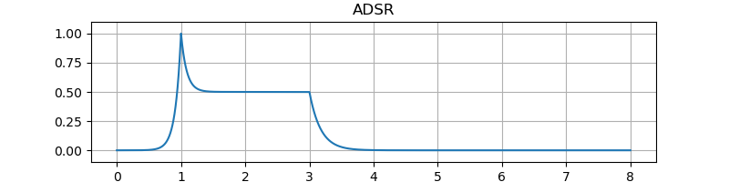
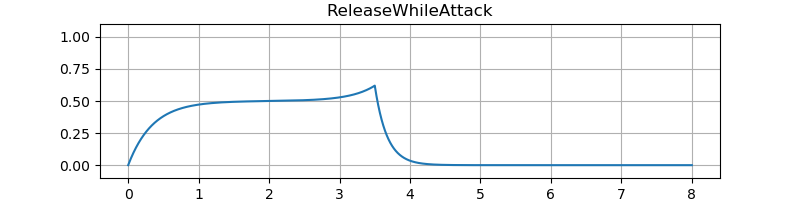
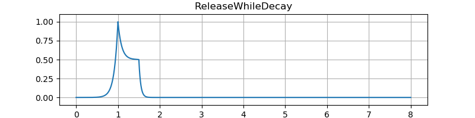
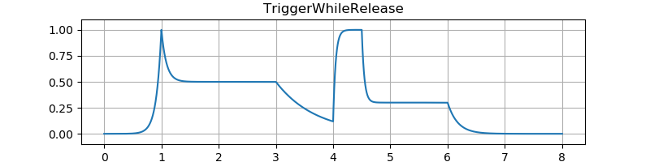
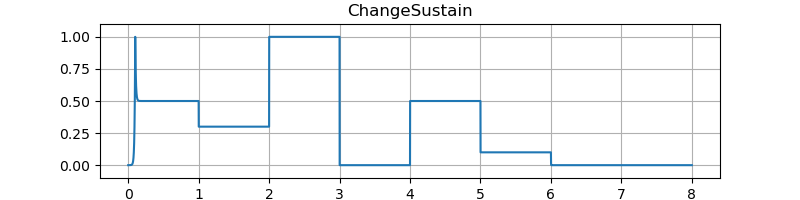
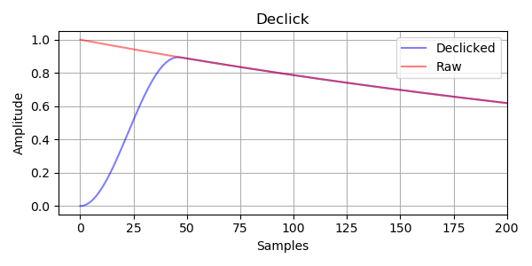

# 指数曲線のエンベロープ
指数曲線 (Exponential Curve) を使ったエンベロープを作ります。

## 減衰する指数曲線
値が 1 から 0 に向かって減衰する指数曲線 $E_d(t)$ は次の式で表されます。 $\alpha$ は減衰の速さを決める任意の値、 $t$ は単位が秒数の時間です。

$$
E_d(t) = \alpha^t, \quad 0 \leq \alpha \leq 1
$$

ユーザから指定された減衰時間 $\tau$ から $\alpha$ を決めます。

$0 < \alpha$ のとき $t = +\infty$ でようやく $E_d$ が 0 になります。つまり、いつまで経っても 0 になりません。そこで、 0 の代わりに十分に小さな値 $\epsilon$ に到達する時間を求めます。

$$
E_d(\tau) = \alpha^\tau = \epsilon
$$

時間の単位を秒数 $\tau$ からサンプル数 $n_\tau$ に置き換えます。サンプリング周波数を $f_s$ とすると次の式で表されます。

$$
n_\tau = \tau f_s
$$

よって、 $\tau$ と $\epsilon$ が与えられたとき $\alpha$ は次の式で求めることができます。

$$
\alpha = \epsilon^{\frac{1}{\tau f_s}}
$$

$\epsilon$ の値は適当でいいですが、この文章では `1e-5` を使っています。 10 進数では `float` は大体 7 桁、 `double` は 16 桁の精度があります。

- [floating point - How many significant digits do floats and doubles have in java? - Stack Overflow](https://stackoverflow.com/questions/13542944/how-many-significant-digits-do-floats-and-doubles-have-in-java)

実装します。

```cpp
#include <cmath>

template<typename Sample> class ExpDecayCurve {
public:
  void reset(Sample sampleRate, Sample seconds)
  {
    value = Sample(1);
    set(sampleRate, seconds);
  }

  void set(Sample sampleRate, Sample seconds)
  {
    alpha = pow(threshold, Sample(1) / (seconds * sampleRate));
  }

  bool isTerminated() { return value <= threshold; }

  Sample process()
  {
    if (value <= threshold) return Sample(0);
    value *= alpha;
    return value - threshold;
  }

protected:
  const Sample threshold = 1e-5;
  Sample value = 0;
  Sample alpha = 0;
};
```

`reset()` は再トリガ時、 `set()` はコントロールレートで呼び出されます。

`isTerminated()` は複数の曲線を組み合わせて ADSR エンベロープなどを作るとき、状態遷移を行うために使います。

`process()` の最後で `threshold` を引いているのは、エンベロープの終端の不連続点を小さくするためです。この処理によって出力の範囲は `[0, 1 - threshold]` になります。

<figure>

</figure>

## 増加する指数曲線
増加する指数曲線 $E_a(t)$ は次のように表されます。

$$
E_d(\tau) = \epsilon \alpha^\tau = 1
$$

$\alpha$ について解きます。

$$
\alpha = \left( \frac{1}{\epsilon} \right)^{\frac{1}{\tau f_s}}
$$

実装します。

```cpp
template<typename Sample> class ExpAttackCurve {
public:
  void reset(Sample sampleRate, Sample seconds)
  {
    value = threshold;
    set(sampleRate, seconds);
  }

  void set(Sample sampleRate, Sample seconds)
  {
    alpha
      = pow(Sample(1) / threshold, Sample(1) / (seconds * sampleRate));
  }

  bool isTerminated() { return value >= Sample(1); }

  Sample process()
  {
    value *= alpha;
    if (value >= Sample(1)) return Sample(1 - threshold);
    return value - threshold;
  }

protected:
  const Sample threshold = 1e-5;
  Sample value = 0;
  Sample alpha = 0;
};
```

## 減衰する指数曲線の反転
$1 - E_d(t)$ として減衰する指数曲線を上下反転して使う方法があります。

実装です。

```cpp
// 1 - ExpDecayCurve.process();
template<typename Sample> class NegativeExpAttackCurve {
public:
  void reset(Sample sampleRate, Sample seconds)
  {
    value = Sample(1);
    set(sampleRate, seconds);
  }

  void set(Sample sampleRate, Sample seconds)
  {
    alpha = pow(threshold, Sample(1) / (seconds * sampleRate));
  }

  bool isTerminated() { return value <= threshold; }

  Sample process()
  {
    if (value <= threshold) return Sample(1 - threshold);
    value *= alpha;
    return Sample(1 - threshold) - value;
  }

protected:
  const Sample threshold = 1e-5;
  Sample value = 0;
  Sample alpha = 0;
};
```

## 指数曲線を使った ADSR エンベロープ
実装です。

このエンベロープは [IterativeSinCluster](https://ryukau.github.io/VSTPlugins/manual/IterativeSinCluster/IterativeSinCluster_ja.html) で使われています。 `sustain` をスムーシングしていないので、サステイン中にサステイン音量を変更するとノイズが乗ります。

`reset()` の `curve` の値で `ExpAttackCurve` と `NegativeExpAttackCurve` を入れ替えられるようにしています。

```cpp
#include <algorithm>
#include <cmath>

// t in [0, 1].
template<typename Sample> inline Sample cosinterp(Sample t)
{
  return 0.5 * (1.0 - cos(pi * t));
}

template<typename Sample> class ExpADSREnvelope {
public:
  void setup(Sample sampleRate)
  {
    this->sampleRate = sampleRate;
    declickLength = int32_t(0.001 * sampleRate);
  }

  Sample adaptTime(Sample seconds, Sample noteFreq)
  {
    const Sample cycle = Sample(1) / noteFreq;
    return seconds < cycle ? cycle : seconds;
  }

  void reset(
    Sample attackTime,
    Sample decayTime,
    Sample sustainLevel,
    Sample releaseTime,
    Sample noteFreq,
    Sample curve)
  {
    if (declickCounter >= declickLength || state == State::terminated) declickCounter = 0;
    state = State::attack;

    sustain = std::clamp<Sample>(sustainLevel, Sample(0), Sample(1));

    offset = value;
    range = Sample(1) - value;

    this->curve = std::clamp<Sample>(curve, Sample(0), Sample(1));

    attackTime = adaptTime(attackTime, noteFreq);
    atk.reset(sampleRate, attackTime);
    atkNeg.reset(sampleRate, attackTime);
    dec.reset(sampleRate, decayTime);
    rel.reset(sampleRate, adaptTime(releaseTime, noteFreq));
  }

  void set(
    Sample attackTime,
    Sample decayTime,
    Sample sustainLevel,
    Sample releaseTime,
    Sample noteFreq)
  {
    switch (state) {
      case State::attack:
        attackTime = adaptTime(attackTime, noteFreq);
        atk.set(sampleRate, attackTime);
        atkNeg.set(sampleRate, attackTime);
        // Fall through.

      case State::decay:
        dec.set(sampleRate, decayTime);
        // Fall through.

      case State::sustain:
        sustain = std::clamp<Sample>(sustainLevel, Sample(0), Sample(1));
        // Fall through.

      case State::release:
        rel.set(sampleRate, adaptTime(releaseTime, noteFreq));
        // Fall through.

      default:
        break;
    }
  }

  void release()
  {
    range = value;
    state = State::release;
  }

  bool isAttacking() { return state == State::attack; }
  bool isReleasing() { return state == State::release; }
  bool isTerminated() { return state == State::terminated; }

  inline Sample declickIn(Sample input)
  {
    if (declickCounter >= declickLength) return input;
    declickCounter += 1;
    return input * cosinterp<Sample>(declickCounter / Sample(declickLength));
  }

  Sample process()
  {
    switch (state) {
      case State::attack: {
        const auto atkPos = atk.process();
        const auto atkMix = atkPos + curve * (atkNeg.process() - atkPos);
        value = range * declickIn(atkMix) + offset;
        if (atk.isTerminated()) {
          state = State::decay;
          range = Sample(1) - sustain;
        }
      } break;

      case State::decay:
        value = range * declickIn(dec.process()) + sustain;
        if (value <= sustain) state = State::sustain;
        break;

      case State::sustain:
        value = declickIn(sustain);
        break;

      case State::release:
        value = range * declickIn(rel.process());
        if (rel.isTerminated()) state = State::terminated;
        break;

      default:
        return 0;
    }
    return value;
  }

protected:
  enum class State : int32_t { attack, decay, sustain, release, terminated };

  int32_t declickLength;
  int32_t declickCounter = 0;

  ExpAttackCurve<Sample> atk{};
  NegativeExpAttackCurve<Sample> atkNeg{};
  ExpDecayCurve<Sample> dec{};
  ExpDecayCurve<Sample> rel{};

  State state = State::terminated;
  Sample value = 0;
  Sample curve = 0;
  Sample sampleRate = 44100;
  Sample offset = 0;
  Sample range = 1;
  Sample sustain = 1;
};
```

テストに使ったコードへのリンクです。

- TODO リンク

テスト結果です。図の縦軸は振幅、横軸は秒数です。音のサンプルはエンベロープを 100 Hz のサイン波の音量に適用しています。

<figure>

</figure>

<figure>

</figure>

<figure>

</figure>

<figure>

</figure>

<figure>

</figure>

<figure>
  <figcaption>ADSR</figcaption>
  <audio controls>
    <source src="snd/tone_ADSR.wav" type="audio/wav">
  </audio>
</figure>

<figure>
  <figcaption>ReleaseWhileAttack</figcaption>
  <audio controls>
    <source src="snd/tone_ReleaseWhileAttack.wav" type="audio/wav">
  </audio>
</figure>

<figure>
  <figcaption>testReleaseWhileDecay</figcaption>
  <audio controls>
    <source src="snd/tone_ReleaseWhileDecay.wav" type="audio/wav">
  </audio>
</figure>

<figure>
  <figcaption>TriggerWhileRelease</figcaption>
  <audio controls>
    <source src="snd/tone_TriggerWhileRelease.wav" type="audio/wav">
  </audio>
</figure>

<figure>
  <figcaption>ChangeSustain</figcaption>
  <audio controls>
    <source src="snd/tone_ChangeSustain.wav" type="audio/wav">
  </audio>
</figure>

### デクリック (declick)
エンベロープのデクリックとはアタック時間やディケイ時間などがとても短いときにでるプチノイズを低減することです。 Image-Line の [Sytrus](https://www.image-line.com/plugins/Synths/Sytrus/) というシンセサイザで declick という言葉が使われていたので、それにならっています。

ここでは 1 ミリ秒の短いアタックを持つ副エンベロープを用意して指数曲線を使った主エンベロープに掛け合わせています。また、[直線の ADSR エンベロープ](https://ryukau.github.io/filter_notes/linear_envelope/linear_envelope.html)で紹介した `adaptTime()` も組み合わせて使っています。

図は副エンベロープによるデクリックを行ったエンベロープ出力の例です。副エンベロープのアタックカーブは $0.5 + 0.5 \cos(n)$ で、 $n$ は $-\pi$ から $0$ に向かって増加しています。

<figure>

</figure>

1000 Hz のサイン波の音量に適用した音のサンプルです。プチノイズが聞き取りやすいようにサイン波の初期位相を $\dfrac{\pi}{2}$ にしています。

<figure>
  <figcaption>declick_on</figcaption>
  <audio controls>
    <source src="snd/declick_on.wav" type="audio/wav">
  </audio>
</figure>

<figure>
  <figcaption>declick_off</figcaption>
  <audio controls>
    <source src="snd/declick_off.wav" type="audio/wav">
  </audio>
</figure>
