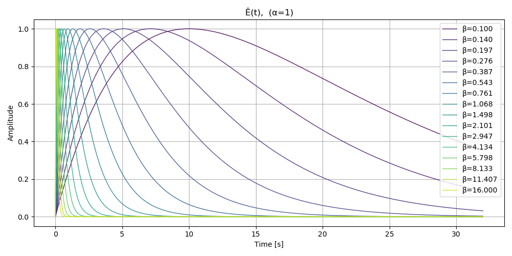
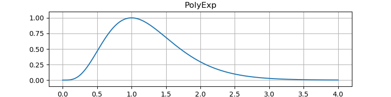

# ExpPoly エンベロープ
[WobblingMetalBoard](https://ryukau.github.io/WobblingMetalBoard/) を作っているときに次のエンベロープを思いつきました。

$$
E(t) = t^\alpha e^{-\beta t}
$$

$t$ は時間、 $\alpha,\beta$ は任意の定数です。簡単に性質を調べて実装します。

## 性質
### $E(t)$ が最大となる $t$
$E(t)$ を $t$ について微分します。 Maxima を使います。

```maxima
env(t) := t^α * exp(-β * t);
env_d1: diff(env(t), t);
env_d2: diff(env_d1, t);
```

$$
\begin{aligned}
\dot{E}(t)
&= (- \beta t^\alpha + \alpha t^{\alpha - 1}) e^{-\beta t}
\\
\ddot{E}(t)
&= (
  \beta^2 t^\alpha
  - 2 \alpha \beta t^{\alpha - 1}
  + \left( \alpha - 1 \right) \alpha t^{\alpha - 2}
) e^{-\beta t}
\end{aligned}
$$

$\dot{E}(t)$ の傾きが 0 になるときの $t$ を求めます。

```maxima
solve(env_d1 = 0, t);
```

次の解が得られました。

$$
t = \dfrac{\alpha}{\beta}
$$

実際に計算してみると $t = \dfrac{\alpha}{\beta}$ のとき $E(t)$ が最大となります。つまりアタックの長さは $\dfrac{\alpha}{\beta}$ です。

アタックの長さから振幅を $[0, 1]$ に正規化した $\hat{E}(t)$ を求めることができます。

$$
\hat{E}(t) = \frac{E(t)}{E \left( \dfrac{\alpha}{\beta} \right)}
$$

NumPy を使った実装例です。

```python
import numpy

def expPoly(α, β, time):
    return time**α * numpy.exp(-β * time)

def expPolyNormalized(α, β, time):
    normalize = expPoly(α, β, α / β)
    return time**α * numpy.exp(-β * time) / normalize

time = numpy.linspace(0, 16, 1024)
envelope = expPolyNormalized(1, 1, time)
```

$\beta = 1$ に固定して $\alpha$ を変えたときの $\hat{E}(t)$ のプロットです。

<figure>

</figure>

$\alpha = 1$ に固定して $\beta$ を変えたときの $\hat{E}(t)$ のプロットです。

<figure>

</figure>

### $E(t)$ の振幅から時間を求める
$E(t)$ は $t$ が $+\infty$ に到達すると $0$ になります。適当に計算を打ち切るために $\hat{E}(t) = x$ となる時間 $t$ を求めます。 $x = \dfrac{t^\alpha e^{-\beta t}}{E \left( \dfrac{\alpha}{\beta} \right)}$ を $t$ について解いてみます。この問題は Maxima では解けなかったので Wolfram Alpha を使いました。

```wolfram
solve x = t^a * exp(-b * t) / eta for t
```

結果です。 $W$ は [Lambert W-function](http://mathworld.wolfram.com/LambertW-Function.html) あるいは product log function と呼ばれている関数です。

$$
t = -\frac{\alpha W \left( - \dfrac{\beta (x \eta)^{1 / \alpha}}{\alpha} \right)}{\beta}, \quad \eta = E \left( \frac{\alpha}{\beta} \right)
$$

正しい値がでるのか試しました。

```python
import numpy
import matplotlib.pyplot as pyplot
import scipy.special.lambertw as lambertw

def getTime(α, β, x, normalize, k=0):
    return -α * lambertw(-β * (x * normalize)**(1 / α) / α, k) / β

def expPoly(α, β, time):
    return time**α * numpy.exp(-β * time)

def expPolyNormalized(α, β, time):
    normalize = expPoly(α, β, α / β)
    return (
        time**α * numpy.exp(-β * time) / normalize,
        normalize,
    )

samplerate = 48000
duration = 8

time = numpy.linspace(0, duration, duration * samplerate)
alpha = 1
beta = 1

curve, normalize = expPolyNormalized(alpha, beta, time)

xx = numpy.linspace(1, 0, 10)
tt0 = getTime(alpha, beta, xx, normalize, 0)
value_tt0, _ = expPolyNormalized(alpha, beta, tt0)

# k = 0 以外の場合は省略。

pyplot.plot(time, curve)
pyplot.scatter(tt0, value_tt0, color="red", label="k=0")
pyplot.show()
```

結果です。 $k$ は Lambert W-function の引数で、適当な整数です。図を見ると、振幅から時間を求めるときはアタックの区間で $k=0$ 、ディケイの区間では $k=-1$ を使えば良さそうです。

<figure>

</figure>

- [scipy.special.lambertw — SciPy v1.2.0 Reference Guide](https://docs.scipy.org/doc/scipy-1.2.0/reference/generated/scipy.special.lambertw.html)
- [GitHub - DarkoVeberic/LambertW: C++ implementation of the Lambert W(x) function](https://github.com/DarkoVeberic/LambertW)

### 計算可能な $t^\alpha$ の範囲
$E(t)$ に含まれる $t^\alpha$ は浮動小数点数で計算するとそのうち `inf` になります。そこで $t$ がどこまで進むと $t^\alpha \approx +\infty$ となるのかを調べます。

$+\infty$ になる時点を $t_{\mathrm{max}}$ 、浮動小数点数で表現できる最大値を $F$ とすると、次の式が立ちます。

$$
t_{\mathrm{max}} = F^{1 / \alpha}
$$

$\alpha$ が 1 より小さいとき、 $t_{\mathrm{max}}$ は $F$ より大きいので、 $t$ が `nan` や `inf` でなければ取り得る全ての値の範囲で計算に問題が無いことが分かります。 $\alpha$ が 1 以上のときの $t_{\mathrm{max}}$ を計算してみます。

```python
import numpy

def printTimeMax(dtype):
    fmax = numpy.finfo(dtype).max
    alpha = numpy.array([2**i for i in range(1, 16)], dtype=dtype)
    timeMax = numpy.power(fmax, dtype(1) / alpha, dtype=dtype)
    print(dtype)
    for a, t in zip(alpha, timeMax):
        print(f"{a:9.1f}, {t}")

printTimeMax(numpy.float32)
printTimeMax(numpy.float64)
```

整形した出力です。左の列が $\alpha$ 、右の列が $t_{\mathrm{max}}$ です。単精度のときは $\alpha$ が 64.0 のときに 4.0 秒しかレンダリングできないことが分かります。

```
<class 'numpy.float32'>
      2.0, 1.8446742974197924e+19
      4.0, 4294967296.0
      8.0, 65536.0
     16.0, 256.0
     32.0, 16.0
     64.0, 4.0
    128.0, 2.0
    256.0, 1.4142135381698608
    512.0, 1.1892070770263672
   1024.0, 1.0905077457427979
   2048.0, 1.0442737340927124
   4096.0, 1.0218971967697144
   8192.0, 1.0108892917633057
  16384.0, 1.0054298639297485
  32768.0, 1.002711296081543

<class 'numpy.float64'>
      2.0, 1.3407807929942596e+154
      4.0, 1.157920892373162e+77
      8.0, 3.402823669209385e+38
     16.0, 1.8446744073709552e+19
     32.0, 4294967296.0
     64.0, 65536.0
    128.0, 256.0
    256.0, 16.0
    512.0, 4.0
   1024.0, 2.0
   2048.0, 1.4142135623730951
   4096.0, 1.189207115002721
   8192.0, 1.0905077326652577
  16384.0, 1.0442737824274138
  32768.0, 1.0218971486541166
```

正規化係数 $E \left( \dfrac{\alpha}{\beta} \right)$ を求めることができる $\beta$ の範囲です。

$$
\begin{aligned}
t_{\mathrm{max}} &\geq \dfrac{\alpha}{\beta} \\
\beta &\geq \dfrac{\alpha}{F^{1 / \alpha}}
\end{aligned}
$$

## 実装
C++ による実装例です。

```cpp
#include <cmath>
#include <cfloat>

class ExpPolyEnvelope {
public:
  // attack の単位は秒。
  // curve は任意の値。 β に相当。
  // attack と curve が大きいと計算結果が inf になるときがあるので注意。
  void reset(double sampleRate, double attack, double curve)
  {
    alpha = attack * curve;

    auto betaMin = alpha / getTerminationTime();
    if (curve < betaMin) curve = betaMin;

    peak = pow(alpha / curve, alpha) * exp(-alpha);
    gamma = exp(-curve / sampleRate);
    tick = 1.0 / sampleRate;

    time = 0.0;
    value = 1.0;
  }

  bool isReleasing() { return time >= attack; }
  double getTerminationTime() { return pow(DBL_MAX, 1.0 / alpha); }

  double process()
  {
    auto output = pow(time, alpha) * value / peak;
    if (!std::isfinite(output)) return 0.0; // 念のため。
    time += tick;
    value *= gamma;
    return output;
  }

protected:
  double value = 0;
  double peak = 1;
  double gamma = 0;
  double attack = 0;
  double tick = 0;
  double alpha = 0;
  double time = 0;
};
```

テストコードへのリンクです。

- [filter_notes/test.cpp at master · ryukau/filter_notes · GitHub](https://github.com/ryukau/filter_notes/blob/master/exppoly_envelope/demo/test.cpp)

テスト結果です。

<figure>

</figure>

## その他
$E(t)$ は [Gamma distribution](https://en.wikipedia.org/wiki/Gamma_distribution) の PDF の一部と同じ形です。

- [calculus - Integrating $\rm x^ae^{-bx}$. - Mathematics Stack Exchange](https://math.stackexchange.com/questions/1562012/integrating-rm-xae-bx)
- [Finding z transform of this function. - Mathematics Stack Exchange](https://math.stackexchange.com/questions/855226/finding-z-transform-of-this-function)
- [Exponential polynomial - Wikipedia](https://en.wikipedia.org/wiki/Exponential_polynomial)

## 変更点
- 2020-03-26
  - 既存の用語 exponential polynomial にならって名前を PolyExp から ExpPoly に変更。
  - 文章の整理。
