# FDN の結合
スネアドラムの合成のために、複数の feedback delay network (FDN) を 1 つの大きな FDN に結合 (coupling) する方法について調べます。

FDN はドラムの膜や胴のような音が出せます。また FDN のフィードバック行列が直交行列であれば発振します。 1 つの膜や 1 つの胴などの部品を、それぞれ 1 つの FDN で表現できるとすると、以下のようなフィードバック行列を構築することで結合できると考えられます。

$$
W = \begin{bmatrix}
  a_0 A_0 &         & \cdots  &        \\
          & a_1 A_1 &         &        \\
  \vdots  &         & a_2 A_2 &        \\
          &         &         & \ddots \\
\end{bmatrix}
,\qquad W W^T = I.
$$

$I$ は単位行列、 $W$ は直交行列です。以降では主に $W$ の非対角成分を決める方法について調べています。

$i$ を行列の要素のインデックスとします。 $a_i$ は範囲 $[-1, 1]$ のスカラーで、各 FDN のフィードバックゲインを表しています。 $A_i$ はそれぞれ任意の直交行列です。以降ではアルファベットの大文字は行列、小文字はスカラーを表すことにします。

以下は確認に使った Python 3 のコードへのリンクです。

- [filter_notes/fdn_coupling_by_feedback_matrix/test.py at master · ryukau/filter_notes · GitHub](https://github.com/ryukau/filter_notes/blob/master/fdn_coupling_by_feedback_matrix/test.py)

## 大きさの等しい直交行列を対角に並べた直交行列
### 2 つの直交行列からの構築 (非対角成分が 0)
大きさが等しい 2 つの直交行列 $A, D$ から大きな直交行列を組み立てます。

簡単な場合から始めます。以下の $E$ のように非対角成分が 0 なら直交行列です。

$$
E = \begin{bmatrix}A & 0 \\ 0 & D\end{bmatrix}.
$$

以下は $E$ が直交行列となることを示した式変形です。 $^T$ は転置の演算子です。

$$
\begin{aligned}
E E^T
=
\begin{bmatrix}A & 0 \\ 0 & D\end{bmatrix}
\begin{bmatrix}A & 0 \\ 0 & D\end{bmatrix}^T
=
\begin{bmatrix}A & 0 \\ 0 & D\end{bmatrix}
\begin{bmatrix}A^T & 0 \\ 0 & D^T\end{bmatrix}
=
\begin{bmatrix}A A^T & 0 \\ 0 & D D^T\end{bmatrix}
=
\begin{bmatrix}I & 0 \\ 0 & I\end{bmatrix}.
\end{aligned}
$$

### 2 つの直交行列からの構築 (非対角成分が 0 でない)
対角成分が 0 でない場合を調べます。 2 つのスカラー $a, d$ を用意して、以下のより一般的な形の行列を用意します。

$$
F = \begin{bmatrix}a A & B \\ C & d D\end{bmatrix}.
$$

$a, d$ が 1 でないときに $F$ が直交行列となる $B$ と $C$ を求めたいです。直交行列の性質より $F F^T = I$ なので、とりあえず $F F^T$ を展開します。

$$
\begin{aligned}
F F^T
&=
\begin{bmatrix}a A & B \\ C & d D\end{bmatrix}
\begin{bmatrix}a A & B \\ C & d D\end{bmatrix}^T
\\&=
\begin{bmatrix}a A   & B   \\ C   & d D  \end{bmatrix}
\begin{bmatrix}a A^T & C^T \\ B^T & d D^T\end{bmatrix}
\\&=
\begin{bmatrix}
  a^2 A A^T +   B B^T  & a A C^T + B   d D^T \\
  C   a A^T + d D B^T  &   C C^T + d^2 D D^T
\end{bmatrix}
\\&=
\begin{bmatrix}
  (a^2 + 1) I  & a A C^T + B   d D^T \\
  C   a A^T + d D B^T  &   (d^2 + 1) I
\end{bmatrix}
\end{aligned}
$$

上の式展開より、 $F$ を直交行列にするには $a = d$ として、 $\dfrac{1}{a^2 + 1}$ を乗算する必要があります。また、以下の条件が得られました。

- $a A   C^T + d D^T B   = 0.$
- $a A^T C   + d D   B^T = 0.$

以下の 2 つの場合に条件を満たすことができます。 (別解あり。後述。)

$$
\begin{matrix}
\begin{aligned}
\text{If} \quad C &= -A \quad\text{and}\quad B = D,\\
& a A   (-A)^T + d D^T D   = -a I + d I = 0,\\
& a A^T (-A)   + d D   D^T = -a I + d I = 0.\\
\end{aligned}
&\qquad
\begin{aligned}
\text{If} \quad C &= A \quad\text{and}\quad B = -D,\\
& a A   A^T + d D^T (-D)   = a I - d I = 0,\\
& a A^T A   + d D   (-D)^T = a I - d I = 0.\\
\end{aligned}
\end{matrix}
$$

整理します。

$$
F_1 = \frac{1}{\sqrt{a^2 + 1}} \begin{bmatrix}a A &  D \\ -A & a D\end{bmatrix},
\quad
F_2 = \frac{1}{\sqrt{a^2 + 1}} \begin{bmatrix}a A & -D \\  A & a D\end{bmatrix}.
$$

Python 3 で実装してテストします。 `np.testing.assert_almost_equal` で止まらなければ、正しく動作しています。

```python
import numpy as np
from scipy.stats import ortho_group

seed = 421378561
rng = np.random.default_rng(seed)

size = 16
A = ortho_group.rvs(size, random_state=rng)
D = ortho_group.rvs(size, random_state=rng)

ratio = 1                               # 式中の a
scaler = 1 / np.sqrt(ratio * ratio + 1) # 式中の 1 / sqrt(a^2 + 1)

F1 = scaler * np.block([[ratio * A, D], [-A, ratio * D]])
F2 = scaler * np.block([[ratio * A, -D], [A, ratio * D]])

# F * F^T = I をテスト。 @ は NumPy の行列の乗算 (numpy.matmul) 。
np.testing.assert_almost_equal(F1 @ F1.T, np.identity(F1.shape[0]))
np.testing.assert_almost_equal(F2 @ F2.T, np.identity(F2.shape[0]))
```

### 3 つの直交行列からの構築
以下は構築したい行列 $G$ の定義です。対角成分の $A_{ii}$ は任意の直交行列です。 $i \neq j$ となる行列 $A_{ij}$ を決めて $G$ を直交行列にします。 $i, j$ はインデックスです。

$$
G = \begin{bmatrix}
  a A_{11} &   A_{12} &   A_{13} \\
    A_{21} & a A_{22} &   A_{23} \\
    A_{31} &   A_{32} & a A_{33} \\
\end{bmatrix}, \qquad G G^T = I.
$$

$G G^T$ を展開します。

$$
\begin{aligned}
G G^T
&=
\begin{bmatrix}
  a A_{11} &   A_{12} &   A_{13} \\
    A_{21} & a A_{22} &   A_{23} \\
    A_{31} &   A_{32} & a A_{33} \\
\end{bmatrix}
\begin{bmatrix}
  a A_{11}^T   &   A_{21}^T &   A_{31}^T \\
    A_{12}^T   & a A_{22}^T &   A_{32}^T \\
    A_{13}^T   &   A_{23}^T & a A_{33}^T \\
\end{bmatrix}
\\&=
\begin{bmatrix}
  a^2 A_{11} A_{11}^T +   A_{12} A_{12}^T +   A_{13} A_{13}^T &
  a   A_{11} A_{21}^T + a A_{12} A_{22}^T +   A_{13} A_{23}^T &
  a   A_{11} A_{31}^T +   A_{12} A_{32}^T + a A_{13} A_{33}^T
  \\
  a A_{21} A_{11}^T + a   A_{22} A_{12}^T +   A_{23} A_{13}^T &
    A_{21} A_{21}^T + a^2 A_{22} A_{22}^T +   A_{23} A_{23}^T &
    A_{21} A_{31}^T + a   A_{22} A_{32}^T + a A_{23} A_{33}^T
  \\
  a A_{31} A_{11}^T +   A_{32} A_{12}^T + a   A_{33} A_{13}^T &
    A_{31} A_{21}^T + a A_{32} A_{22}^T + a   A_{33} A_{23}^T &
    A_{31} A_{31}^T +   A_{32} A_{32}^T + a^2 A_{33} A_{33}^T
\end{bmatrix}.
\end{aligned}
$$

$G$ が直交行列になりそうな非対角成分を推定します。以下は上の式展開を眺めて適当に決めた値です。

- $A_{12} = A_{32} = p A_{22}$
- $A_{21} = q A_{11}$
- $A_{23} = r A_{33}$
- $A_{13} = s A_{33}$
- $A_{31} = t A_{11}$

代入します。以下の式中の $\otimes$ はクロネッカー積 ([Kronecker product](https://en.wikipedia.org/wiki/Kronecker_product)) の演算子です。

$$
\begin{aligned}
G G^T
&=
\begin{bmatrix}
  a A_{11} & p A_{22} & s A_{33} \\
  q A_{11} & a A_{22} & r A_{33} \\
  t A_{11} & p A_{22} & a A_{33} \\
\end{bmatrix}
\begin{bmatrix}
  a A_{11}^T   & q A_{11}^T & t A_{11}^T \\
  p A_{22}^T   & a A_{22}^T & p A_{22}^T \\
  s A_{33}^T   & r A_{33}^T & a A_{33}^T \\
\end{bmatrix}
\\&=
\begin{bmatrix}
  a^2 I + p^2 I + s^2 I &
  a q I + a p I + r s I &
  a t I + p^2 I + a s I
  \\
  a q I + a p I + r s I &
  q^2 I + a^2 I + r^2 I &
  q t I + a p I + a r I
  \\
  a t I + p^2 I + a s I &
  q t I + a p I + a r I &
  t^2 I + p^2 I + a^2 I
\end{bmatrix}
\\&=
\begin{bmatrix}
  a^2 + p^2 + s^2 &
  a q + a p + r s &
  a t + p^2 + a s
  \\
  a q + a p + r s &
  q^2 + a^2 + r^2 &
  q t + a p + a r
  \\
  a t + p^2 + a s &
  q t + a p + a r &
  t^2 + p^2 + a^2
\end{bmatrix} \otimes I.
\end{aligned}
$$

連立方程式が得られました。 $y$ は対角成分に共通する何らかのスカラーです。

- $y = a^2 + p^2 + s^2$
- $y = q^2 + a^2 + r^2$
- $y = t^2 + p^2 + a^2$
- $0 = a q + a p + r s$
- $0 = a t + p^2 + a s$
- $0 = q t + a p + a r$

SymPy と Maxima で解きます。

```python
# SymPy, Python 3
from sympy import solve
from sympy.abc import a, p, q, r, s, t, y

solve(
  [
    a*a + p*p + s*s - y,
    q*q + a*a + r*r - y,
    t*t + p*p + a*a - y,
    a*q + a*p + r*s - 0,
    a*t + p*p + a*s - 0,
    q*t + a*p + a*r - 0,
  ],
  p, q, r, s, t, y,
  dict=True,
)
```

```maxima
/* Maxima */
solve(
  [y = a*a + p*p + s*s,
   y = q*q + a*a + r*r,
   y = t*t + p*p + a*a,
   0 = a*q + a*p + r*s,
   0 = a*t + p*p + a*s,
   0 = q*t + a*p + a*r],
  [p, q, r, s, t, y]
);
```

以下は得られた解です。上が SymPy 、下が Maxima の出力です。見やすさのために整形しています。

```
[
  {p: 0,            q: 0,              r: 0,              s: 0,    t: 0,    y: a**2},
  {p: -2*a,         q: -2*a,           r: -2*a,           s: -2*a, t: -2*a, y: 9*a**2},
  {p: 2*a,          q: 2*a,            r: 2*a,            s: -2*a, t: -2*a, y: 9*a**2},
  {p: -sqrt(2)*I*a, q: sqrt(2)*I*a/2,  r: sqrt(2)*I*a/2,  s: a,    t: a,    y: 0},
  {p: sqrt(2)*I*a,  q: -sqrt(2)*I*a/2, r: -sqrt(2)*I*a/2, s: a,    t: a,    y: 0}
]
```

```
[
  [p=0,               q=0,                 r=0,                 s=0,      t=0,      y=a^2],
  [p=2*a,             q=2*a,               r=2*a,               s=-(2*a), t=-(2*a), y=9*a^2],
  [p=-(2*a),          q=-(2*a),            r=-(2*a),            s=-(2*a), t=-(2*a), y=9*a^2],
  [p=-(sqrt(2)*%i*a), q=(%i*a)/sqrt(2),    r=(%i*a)/sqrt(2),    s=a,      t=a,      y=0],
  [p=sqrt(2)*%i*a,    q=-((%i*a)/sqrt(2)), r=-((%i*a)/sqrt(2)), s=a,      t=a,      y=0]
]
```

SymPy の出力の $\TeX$ 表記です。

$$
\begin{aligned}
& \left\{ p : 0, \  q : 0, \  r : 0, \  s : 0, \  t : 0, \  y : a^{2}\right\},\\
& \left\{ p : - 2 a, \  q : - 2 a, \  r : - 2 a, \  s : - 2 a, \  t : - 2 a, \  y : 9 a^{2}\right\},\\
& \left\{ p : 2 a, \  q : 2 a, \  r : 2 a, \  s : - 2 a, \  t : - 2 a, \  y : 9 a^{2}\right\},\\
& \left\{ p : - \sqrt{2} i a, \  q : \frac{\sqrt{2} i a}{2}, \  r : \frac{\sqrt{2} i a}{2}, \  s : a, \  t : a, \  y : 0\right\},\\
& \left\{ p : \sqrt{2} i a, \  q : - \frac{\sqrt{2} i a}{2}, \  r : - \frac{\sqrt{2} i a}{2}, \  s : a, \  t : a, \  y : 0\right\}.
\end{aligned}
$$

### 一般化
以下は構築したい行列 $H$ の定義です。対角成分の $A_{ii}$ は任意の直交行列です。

$$
H = \begin{bmatrix}
  a A_{11} &   A_{12} & \cdots &   A_{1n} \\
    A_{21} & a A_{22} &        &   A_{2n} \\
  \vdots   &          & \ddots & \vdots   \\
    A_{n1} &   A_{n2} & \cdots & a A_{nn} \\
\end{bmatrix}.
$$

$A_{ij} = h_{ij} A_{jj}$ と置換します。また、式変形を分かりやすくするために $a = h_{ii}$ と置換します。

$$
H = \begin{bmatrix}
  h_{11} A_{11} & h_{12} A_{22} & \cdots & h_{1n} A_{nn} \\
  h_{21} A_{11} & h_{22} A_{22} &        & h_{2n} A_{nn} \\
  \vdots        &               & \ddots & \vdots        \\
  h_{n1} A_{11} & h_{n2} A_{22} & \cdots & h_{nn} A_{nn} \\
\end{bmatrix}.
$$

$H H^T$ を展開します。

$$
\begin{aligned}
H H^T
&=
\begin{bmatrix}
  h_{11} A_{11} & h_{12} A_{22} & \cdots & h_{1n} A_{nn} \\
  h_{21} A_{11} & h_{22} A_{22} &        & h_{2n} A_{nn} \\
  \vdots        &               & \ddots & \vdots        \\
  h_{n1} A_{11} & h_{n2} A_{22} & \cdots & h_{nn} A_{nn} \\
\end{bmatrix}
\begin{bmatrix}
  h_{11} A_{11}^T & h_{21} A_{11}^T & \cdots & h_{n1} A_{nn}^T \\
  h_{12} A_{22}^T & h_{22} A_{22}^T &        & h_{n2} A_{nn}^T \\
  \vdots          &                 & \ddots & \vdots          \\
  h_{1n} A_{nn}^T & h_{2n} A_{nn}^T & \cdots & h_{nn} A_{nn}^T \\
\end{bmatrix}
\\&=
\begin{bmatrix}
\sum_{k=1}^n h_{1k} h_{1k} &
\sum_{k=1}^n h_{1k} h_{2k} &
\cdots &
\sum_{k=1}^n h_{1k} h_{nk}
\\
\sum_{k=1}^n h_{2k} h_{1k} &
\sum_{k=1}^n h_{2k} h_{2k} &
\cdots &
\sum_{k=1}^n h_{2k} h_{nk}
\\
\vdots &
&
\ddots &
\vdots
\\
\sum_{k=1}^n h_{nk} h_{1k} &
\sum_{k=1}^n h_{nk} h_{2k} &
\cdots &
\sum_{k=1}^n h_{nk} h_{nk}
\end{bmatrix} \otimes I
.
\end{aligned}
$$

以下はインデックス $(i, j)$ の式の形です。

$$
A_{ij} = \sum_{k=1}^n h_{ik} h_{jk}.
$$

以下の連立方程式の解が、問題の一般解です。見やすさのために総和を行列の外に出しています。対角成分を境として対称性があるので上下どちらかの三角行列にあたる式だけを連立すれば十分です。また、 $y$ も方程式の変数です。

$$
y I =
\sum_{k=1}^n
\begin{bmatrix}
h_{1k} h_{1k} & h_{1k} h_{2k} & \cdots & h_{1k} h_{nk} \\
h_{2k} h_{1k} & h_{2k} h_{2k} & \cdots & h_{2k} h_{nk} \\
\vdots        &               & \ddots & \vdots        \\
h_{nk} h_{1k} & h_{nk} h_{2k} & \cdots & h_{nk} h_{nk}
\end{bmatrix}.
$$

SymPy で解きます。そのままだと計算が終わらなさそうだったので、適当に $h_{ij} = b$ としました。したがって、この節の以降の結果は一般解ではありません。

```python
def solveCoefficientsFull(dim: int) -> dict:
    a = sympy.Symbol("a")
    b = sympy.Symbol("b")
    y = sympy.Symbol("y")

    # h_ij をすべて b にしてしまうことで、とりあえず使える解を出す。
    h = {
        i: {j: b if i != j else a for j in range(1, dim + 1)} for i in range(1, dim + 1)
    }

    eq = []
    for i in range(1, dim + 1):
        for j in range(i, dim + 1):
            expr = 0
            for k in range(1, dim + 1):
                expr += h[i][k] * h[j][k]
            if i == j:
                expr -= y
            eq.append(expr)

    variables = set([elem for row in h.values() for elem in row.values()])
    variables.remove(a)
    variables.add(y)

    return sympy.solve(eq, *variables, dict=True)
```

以下は上のコードで `dim` を 2 から 128 まで変えたときの結果です。

- [`dim` を 2 から 128 まで変えたときの特殊解 (github.com)](https://github.com/ryukau/filter_notes/blob/master/fdn_coupling_by_feedback_matrix/out_all_b.json)

一般解を得たいときは `h` の定義を以下のように変えます。ただし `dim >= 3` のときに計算が終わらないかもしれません。

```python
# 一般化された形。
h = {
    i: {j: sympy.Symbol(f"h_{i},{j}") if i != j else a for j in range(1, dim + 1)}
    for i in range(1, dim + 1)
}
```

`dim == 3` のケースであれば、以下のように $h_{1n} = h_{n1} = b$ とすれば、いくつかの解が得られます。

```python
# 一般化された形と同じ。
h = {
    i: {j: sympy.Symbol(f"h_{i},{j}") if i != j else a for j in range(1, dim + 1)}
    for i in range(1, dim + 1)
}

h[1][dim] = b
h[dim][1] = b
```

### 0 を含む形
前節までの形ではドラムの部品が下の図のように[完全グラフ](https://en.wikipedia.org/wiki/Complete_graph)として結合されます。

<figure>

</figure>

しかし、本物のスネアドラムは直接は部品がつながっていない部分があります。

<figure>

</figure>

必要なエッジのみに結合を減らすことはできないか調べます。

構築したい行列 $L$ を定義します。対角成分に隣接する区画以外は $0$ です。

$$
L = \begin{bmatrix}
  h_{11} A_{11} & h_{12} A_{22} & 0             & 0             & 0             &        \\
  h_{21} A_{11} & h_{22} A_{22} & h_{23} A_{33} & 0             & 0             &        \\
  0             & h_{32} A_{22} & h_{33} A_{33} & h_{34} A_{44} & 0             & \cdots \\
  0             & 0             & h_{43} A_{33} & h_{44} A_{44} & h_{45} A_{55} &        \\
  0             & 0             & 0             & h_{54} A_{44} & h_{55} A_{55} &        \\
                &               & \vdots        &               &               & \ddots \\
\end{bmatrix}.
$$

$L L^T$ を展開します。

$$
\begin{aligned}
L L^T
&=
\begin{bmatrix}
  h_{11} A_{11} & h_{12} A_{22} & 0             & 0             & 0             &        \\
  h_{21} A_{11} & h_{22} A_{22} & h_{23} A_{33} & 0             & 0             &        \\
  0             & h_{32} A_{22} & h_{33} A_{33} & h_{34} A_{44} & 0             & \cdots \\
  0             & 0             & h_{43} A_{33} & h_{44} A_{44} & h_{45} A_{55} &        \\
  0             & 0             & 0             & h_{54} A_{44} & h_{55} A_{55} &        \\
                &               & \vdots        &               &               & \ddots \\
\end{bmatrix}
\begin{bmatrix}
  h_{11} A_{11}^T & h_{21} A_{11}^T & 0               & 0               & 0               &        \\
  h_{12} A_{22}^T & h_{22} A_{22}^T & h_{32} A_{22}^T & 0               & 0               &        \\
  0               & h_{23} A_{33}^T & h_{33} A_{33}^T & h_{43} A_{33}^T & 0               & \cdots \\
  0               & 0               & h_{34} A_{44}^T & h_{44} A_{44}^T & h_{54} A_{44}^T &        \\
  0               & 0               & 0               & h_{45} A_{55}^T & h_{55} A_{55}^T &        \\
                  &                 & \vdots          &                 &                 & \ddots \\
\end{bmatrix}
\\&=
\begin{bmatrix}
\sum_{k=1}^2 h_{1k} h_{1k} & \sum_{k=1}^2 h_{1k} h_{2k} & 0                          & 0                          & 0                          &        \\
\sum_{k=1}^2 h_{2k} h_{1k} & \sum_{k=1}^3 h_{2k} h_{2k} & \sum_{k=2}^3 h_{2k} h_{3k} & 0                          & 0                          &        \\
0                          & \sum_{k=2}^3 h_{3k} h_{2k} & \sum_{k=2}^4 h_{3k} h_{3k} & \sum_{k=3}^4 h_{3k} h_{4k} & 0                          & \cdots \\
0                          & 0                          & \sum_{k=3}^4 h_{4k} h_{3k} & \sum_{k=3}^5 h_{4k} h_{4k} & \sum_{k=4}^5 h_{4k} h_{5k} &        \\
0                          & 0                          & 0                          & \sum_{k=4}^5 h_{5k} h_{4k} & \sum_{k=4}^6 h_{5k} h_{5k} &        \\
                           &                            & \vdots                     &                            &                            & \ddots \\
\end{bmatrix} \otimes I.
\end{aligned}
$$

以下はインデックス $(i, j)$ の式の形です。

$$
\begin{aligned}
\hat{h}_{ij}
&=
\begin{cases}
\sum_{k=i-1}^i     h_{ik} h_{jk} & \text{if} \enspace j = i - 1, \\
\sum_{k=i-1}^{i+1} h_{ik} h_{jk} & \text{if} \enspace j = i,     \\
\sum_{k=i}^{i+1}   h_{ik} h_{jk} & \text{if} \enspace j = i + 1, \\
0                          & \text{otherwise}.
\end{cases}
\\&=
\begin{cases}
         h(i, i-1) h(i-1          , i-1) +  h(i, i) h(i-1          , i)                                   & \text{if} \enspace j = i - 1, \\
         h(i, i-1) h(i\phantom{-1}, i-1) +  h(i, i) h(i\phantom{-1}, i) + h(i, i+1) h(i\phantom{+1}, i+1) & \text{if} \enspace i = j,     \\
\phantom{h(i, i-1) h(i-1          , i-1) +} h(i, i) h(i+1          , i) + h(i, i+1) h(i+1          , i+1) & \text{if} \enspace j = i + 1, \\
0                                                                                                         & \text{otherwise}.
\end{cases}
\end{aligned}
$$

SymPy で解きます。

```python
def solveCoefficientsMostlyDiag(dim: int) -> dict:
    a = sympy.Symbol("a")
    y = sympy.Symbol("y")
    h = {
        i: {j: sympy.Symbol(f"h_{i},{j}") if i != j else a for j in range(1, dim + 1)}
        for i in range(1, dim + 1)
    }

    def confinedRange(dim, start, end):
        if start < 1:
            start = 1
        if end > dim + 1:
            end = dim + 1
        return range(start, end)

    eq = set([])
    for i in range(1, dim + 1):
        for j in range(i - 1, i + 2):
            if j < 1 or j > dim:
                continue

            expr = 0
            if j == i - 1:
                for k in confinedRange(dim, i - 1, i + 1):
                    expr += h[i][k] * h[j][k]
            elif j == i:
                for k in confinedRange(dim, i - 1, i + 2):
                    expr += h[i][k] * h[j][k]
            elif j == i + 1:
                for k in confinedRange(dim, i, i + 2):
                    expr += h[i][k] * h[j][k]
            else:
                raise Exception("Shouldn't reach here, but just in case.")

            if i == j:
                expr -= y

            eq.add(expr)

    variables = set([elem for row in h.values() for elem in row.values()])
    variables.remove(a)
    variables.add(y)

    return sympy.solve(eq, *variables, dict=True)
```

対角でない区画の係数がすべて 0 となる解しか得られなかったです。また、行列の大きさが 4 以上の偶数のときは解が得られなかったです。

## 大きさが異なる直交行列を対角成分に並べた行列は直交行列にならない
以降での表記の簡略化のために、行列を以下のように行ベクトル $\vec{a}$ の集まりとして表します。

$$
A = \begin{bmatrix}
a_{11} & a_{12} & \cdots & a_{1n} \\
a_{21} & a_{22} &        & a_{2n} \\
\vdots &        & \ddots & \vdots \\
a_{n1} & a_{n2} & \cdots & a_{nn} \\
\end{bmatrix}
= \begin{bmatrix}
\vec{a}_1 \\ \vec{a}_2 \\ \cdots \\ \vec{a}_n
\end{bmatrix}
,\quad\text{where}\quad
\vec{a}_i = \begin{bmatrix}
a_{i1} & a_{i2} & \cdots & a_{in}
\end{bmatrix}.
$$

行ベクトル表記を使うと直交行列の性質を以下のように書けます。中点 $\cdot$ は内積 (dot product) です。

$$
A A^T =
\begin{bmatrix}
\vec{a}_1 \\ \vec{a}_2 \\ \cdots \\ \vec{a}_n
\end{bmatrix}
\begin{bmatrix}
\vec{a}^T_1 & \vec{a}^T_2 & \cdots & \vec{a}^T_n
\end{bmatrix}
=
\begin{bmatrix}
\vec{a}_1 \cdot \vec{a}^T_1 & \vec{a}_1 \cdot \vec{a}^T_2 & \cdots & \vec{a}_1 \cdot \vec{a}^T_n \\
\vec{a}_2 \cdot \vec{a}^T_1 & \vec{a}_2 \cdot \vec{a}^T_2 &        & \vec{a}_2 \cdot \vec{a}^T_n \\
\vdots &        & \ddots & \vdots \\
\vec{a}_n \cdot \vec{a}^T_1 & \vec{a}_n \cdot \vec{a}^T_2 & \cdots & \vec{a}_n \cdot \vec{a}^T_n \\
\end{bmatrix}
=
\begin{bmatrix}
1      & 0      & \cdots & 0      \\
0      & 1      &        & 0      \\
\vdots &        & \ddots & \vdots \\
0      & 0      & \cdots & 1      \\
\end{bmatrix}
= I.
$$

以下の性質が見えます。

$$
\vec{a}_i \cdot \vec{a}^T_j = \begin{cases}
1 & i = j, \\
0 & i \neq j. \\
\end{cases}
$$

ここからは、本題となる 2 つの異なる大きさの直交行列を 1 つの直交行列にまとめる方法について調べます。

記号を定義します。

- $n \times n$ の直交行列 $A.$
- $m \times m$ の直交行列 $D.$
- $n \neq m.$

以下の行列 $P$ が直交行列となるように $B, G$ の値を決めたいです。色は見やすさのために加えています。記号の大きさは行列の大きさが異なることの強調です。

$$
\newcommand{\cA}[1] {\textcolor{black}{\vec{#1}}}
\newcommand{\cB}[1] {\textcolor{red}{\vec{#1}}}
\newcommand{\cG}[1] {\textcolor{green}{\vec{#1}}}
\newcommand{\cD}[1] {\textcolor{blue}{\vec{#1}}}
$$

$$
\begin{aligned}
P P^T
&=
\begin{bmatrix}
  \Huge{A}  & \small{B} \\
  \small{G} & \large{D}
\end{bmatrix}
\begin{bmatrix}
  \Huge{A}^{\normalsize{T}} & \small{G}^T \\
  \small{B}^T               & \large{D}^T
\end{bmatrix}
\\&=
\begin{bmatrix}
a_{11} & \cdots & a_{1n} & b_{11} & \cdots & b_{1m} \\
\vdots &        & \vdots & \vdots &        & \vdots \\
a_{n1} & \cdots & a_{nn} & b_{n1} & \cdots & b_{nm} \\
g_{11} & \cdots & g_{1n} & d_{11} & \cdots & d_{1m} \\
\vdots &        & \vdots & \vdots &        & \vdots \\
g_{m1} & \cdots & g_{mn} & d_{m1} & \cdots & d_{mm} \\
\end{bmatrix}
\begin{bmatrix}
a_{11} & \cdots & a_{n1} & g_{11} & \cdots & g_{m1} \\
\vdots &        & \vdots & \vdots &        & \vdots \\
a_{1n} & \cdots & a_{nn} & g_{1n} & \cdots & g_{mn} \\
b_{11} & \cdots & b_{n1} & d_{11} & \cdots & d_{m1} \\
\vdots &        & \vdots & \vdots &        & \vdots \\
b_{1m} & \cdots & b_{nm} & d_{1m} & \cdots & d_{mm} \\
\end{bmatrix}
\\&=
\begin{bmatrix}
  (\cA{a}_1 \cdot \cA{a}_1 + \cB{b}_1 \cdot \cB{b}_1) &
  \cdots                                  &
  (\cA{a}_1 \cdot \cA{a}_n + \cB{b}_1 \cdot \cB{b}_n) &
  (\cA{a}_1 \cdot \cG{g}_1 + \cB{b}_1 \cdot \cD{d}_1) &
  \cdots                                  &
  (\cA{a}_1 \cdot \cG{g}_m + \cB{b}_1 \cdot \cD{d}_m)
\\
  \vdots &        & \vdots & \vdots &        & \vdots
\\
  (\cA{a}_n \cdot \cA{a}_1 + \cB{b}_n \cdot \cB{b}_1) &
  \cdots                                  &
  (\cA{a}_n \cdot \cA{a}_n + \cB{b}_n \cdot \cB{b}_n) &
  (\cA{a}_n \cdot \cG{g}_1 + \cB{b}_n \cdot \cD{d}_1) &
  \cdots                                  &
  (\cA{a}_n \cdot \cG{g}_m + \cB{b}_n \cdot \cD{d}_m)
\\
  (\cG{g}_1 \cdot \cA{a}_1 + \cD{d}_1 \cdot \cB{b}_1) &
  \cdots                                  &
  (\cG{g}_1 \cdot \cA{a}_n + \cD{d}_1 \cdot \cB{b}_n) &
  (\cG{g}_1 \cdot \cG{g}_1 + \cD{d}_1 \cdot \cD{d}_1) &
  \cdots                                  &
  (\cG{g}_1 \cdot \cG{g}_m + \cD{d}_1 \cdot \cD{d}_m)
\\
  \vdots &        & \vdots & \vdots &        & \vdots
\\
  (\cG{g}_m \cdot \cA{a}_1 + \cD{d}_m \cdot \cB{b}_1) &
  \cdots                                  &
  (\cG{g}_m \cdot \cA{a}_n + \cD{d}_m \cdot \cB{b}_n) &
  (\cG{g}_m \cdot \cG{g}_1 + \cD{d}_m \cdot \cD{d}_1) &
  \cdots                                  &
  (\cG{g}_m \cdot \cG{g}_m + \cD{d}_m \cdot \cD{d}_m)
\end{bmatrix}
\end{aligned}
$$

$A$ は直交行列なので、 $\cA{a}_i \cdot \cA{a}_j$ は $i \neq j$ のとき 0 です。 $D$ についても同様です。

上の展開式より、以下の条件が見えます。

1. $\cA{a}_i \cdot \cG{g}_j$ はすべて 0 。
2. $\cD{d}_i \cdot \cB{b}_j$ はすべて 0 。
3. $\cB{b}_i \cdot \cB{b}_j$ と $\cG{g}_i \cdot \cG{g}_j$ について、
   - $i = j$ なら、すべての $i$ について何らかの定数。
   - $i \neq j$ なら、 0 。

- 条件 1 より $\cG{g}_i = \cA{a}_k$ 。 $k$ は $[1, n]$ の範囲で $i$ と等しくなければなんでもいい。つまり $G$ は $A$ の行を抜き出して順序を入れ換えた行列。
- 条件 2 より $\cB{b}_i = \cD{d}_k$ 。 $k$ は $[1, m]$ の範囲で $i$ と等しくなければなんでもいい。つまり $B$ は $D$ の行を抜き出して順序を入れ換えた行列。
- 条件 3 を満たすには上記の $k$ について同じ値を 2 回以上使わなければいい。つまり $B, G$ のすべての行が異なっていればいい。

ここで問題があります。 $n > m$ のときに条件 2 の構築を行うと、 $D$ の行数より $B$ の行数が多くなるので、 $B$ に重複する行が現れます。 $n < m$ のときは $G$ について同様です。この重複があると非対角成分に 0 でない要素が現れてしまうので、構築は不可に見えます。

この問題は正方でない直交行列が構築できるかという問題と関連しています。以下のリンク先では上の結論と同様に、正方でない行列 $B$ について、 $B B^T = I$ としたいとき、 $B$ の行数が列数よりも大きいときは条件が満たせないと言われています。

- [matrices - "Orthogonal" Rectangular Matrix - Mathematics Stack Exchange](https://math.stackexchange.com/questions/1121812/orthogonal-rectangular-matrix)

## 2 つの直交行列のクロネッカー積は直交行列
[クロネッカー積](https://en.wikipedia.org/wiki/Kronecker_product)は mixed-product property と呼ばれる以下の性質を持ちます。

$$
(A \otimes B) (C \otimes D) = (A C) \otimes (B D)
$$

また、転置について以下の性質を持ちます。

$$
(A \otimes B)^T = A^T \otimes B^T
$$

したがって $A, B$ を直交行列とすると以下の式変形ができます。

$$
\begin{aligned}
(A \otimes B) ((A \otimes B)^T)
= (A \otimes B) (A^T \otimes B^T)
= (A A^T) \otimes (B B^T)
= I \otimes I
= I
\end{aligned}
$$

よって 2 つの直交行列のクロネッカー積は直交行列です。

以下のコードでテストしたところ、計算もうまくいくことがわかりました。

```python
seed = 568785145
rng = np.random.default_rng(seed)

size = 16
A = ortho_group.rvs(size, random_state=rng)
B = ortho_group.rvs(size, random_state=rng)
C = np.kron(A, B)  # この行列は直交行列？
np.testing.assert_almost_equal(C @ C.T, np.identity(C.shape[0]))
```

## その他
「0 を含む形」でいい結果が出なかったので、この手法はドラムの合成については筋がいいとは言えない気がします。とりあえず [CoupledSnare](https://ryukau.github.io/UhhyouWebSynthesizers/CoupledSnare/synth.html) というスネアドラムのシンセサイザで 2x2 の場合について実装したので、興味があれば試してみてください。リンク先の `Misc. -> Coupling Gain` で FDN のカップリングを調整できます。

一通り調べてから "FDN coupling" で検索したところ、以下の論文を見つけました。

1. Das, Orchisama, and Jonathan S. Abel. "[Grouped feedback delay networks for modeling of coupled spaces.](https://ccrma.stanford.edu/~orchi/Documents/JAES21_GFDN.pdf)" Journal of the Audio Engineering Society 69.7/8 (2021): 486-496.
2. Das, Orchisama, Sebastian J. Schlecht, and Enzo De Sena. "[Grouped feedback delay networks with frequency-dependent coupling.](https://acris.aalto.fi/ws/portalfiles/portal/113021875/Grouped_Feedback_Delay_Networks_With_Frequency_Dependent_Coupling.pdf)" IEEE/ACM Transactions on Audio, Speech, and Language Processing 31 (2023): 2004-2015.
