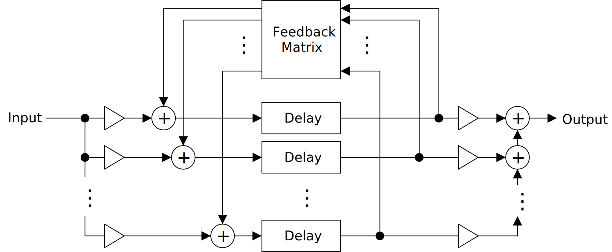
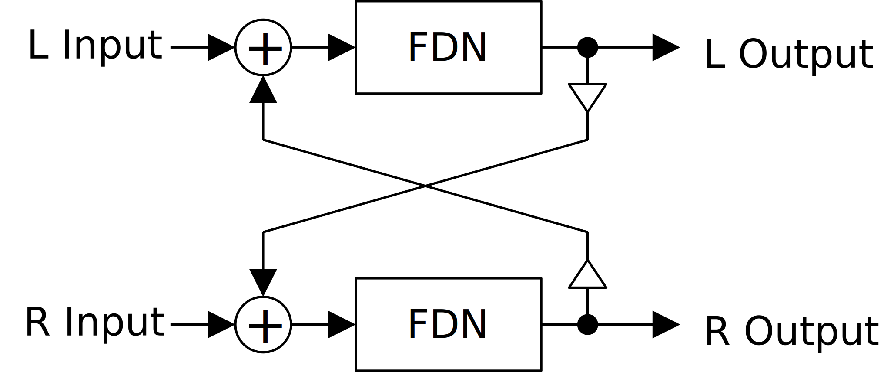

# Feedback Delay Network の実装
Feedback Delay Network (FDN) は以下のブロック線図で表される、ディレイの接続方法です。

<figure>

</figure>

FDN は $N$ 個のディレイの接続を一般化したものです。パラメータとしては、入力を分割するゲイン、出力を足し合わせるゲイン、ディレイ時間、 $N \times N$ のフィードバック行列があります。

この文章では適当にフィードバック行列をランダマイズしてリバーブを作ります。

## 実装
FDN に使うディレイの実装については以下のリンク先にまとめています。ここではリンク先の「レートリミッタ」の節で紹介している `Delay` を使います。

- [ディレイの実装 (github.io)](https://ryukau.github.io/filter_notes/delay/delay.html#%E3%83%AC%E3%83%BC%E3%83%88%E3%83%AA%E3%83%9F%E3%83%83%E3%82%BF)

以下は C++ による FDN の実装例です。

```c++
template<typename Sample, size_t length> struct FeedbackDelayNetwork {
  size_t bufIndex = 0;
  std::array<std::array<Sample, length>, 2> buf{};
  std::array<std::array<Sample, length>, length> matrix{};
  std::array<Delay<Sample>, length> delay;
  std::array<RateLimiter<Sample>, length> delayTimeSample;

  // feedback の範囲は [-1.0, 1.0] 。範囲外だと発散。
  Sample process(Sample input, Sample feedback)
  {
    bufIndex ^= 1;
    auto &front = buf[bufIndex];
    auto &back = buf[bufIndex ^ 1];

    front.fill(0);
    for (size_t i = 0; i < length; ++i) {
      for (size_t j = 0; j < length; ++j) front[i] += matrix[i][j] * back[j];
    }

    input /= Sample(length); // 例を簡単にするため、入力は均等に分配。
    for (size_t idx = 0; idx < length; ++idx) {
      auto &&sig = input + feedback * front[idx];
      front[idx] = delay[idx].process(sig, delayTimeSample[idx].process());
    }

    return std::accumulate(front.begin(), front.end(), Sample(0));
  }
};
```

リセット関連のメソッドは省略しています。より完全な実装は以下のリンクを参照してください。

- [FDN リバーブの完全な実装を読む (github.com)](https://github.com/ryukau/VSTPlugins/blob/master/FDN64Reverb/source/dsp/fdnreverb.hpp)

`process` の最初の空行までがフィードバックを受け取るバッファの入れ替え、 2 つ目の空行までがフィードバック行列の計算、 残りがディレイへの入出力の計算です。

引数 `feedback` はフィードバック行列の値をまとめて変更する係数 ([スカラー](https://en.wikipedia.org/wiki/Scalar_multiplication)) です。 FDN が発振するようにフィードバック行列を設計できれば、 `feedback` をコムフィルタのフィードバックと同じ感覚で扱うことができます。ただし `Delay` は線形補間を行っているのでディレイ時間がぴったり整数でなければ徐々に出力が減衰します。

テンプレートパラメータの `length` が大きいときは `std::vector` を使うように書き換えてください。 `dim` が大きいと、少なくとも cl.exe では指定した値よりも配列の長さが短くなることがありました。今回のテスト環境では `dim=200` あたりが正しく動作する上限でした。

## 行列のランダマイズ
Schlecht と Habets の ["On lossless feedback delay networks"](https://arxiv.org/pdf/1606.07729) によると、 FDN が発散しないためには、フィードバック行列を[ユニタリ行列](https://mathworld.wolfram.com/UnitaryMatrix.html)か[三角行列](https://mathworld.wolfram.com/TriangularMatrix.html)にするといいそうです。 FDN が発散しないフィードバック行列の中にはユニタリ行列でも三角行列でもないものがあるそうですが、安定性がディレイ時間に依存する、数値計算で行列を求めることが難しい、といった問題が論文中で示されているのでここでは扱っていません。

ユニタリ行列は複素数を含むことがありますが、今回の実装では複素数を使う意味がないので、[直交行列](https://mathworld.wolfram.com/OrthogonalMatrix.html)が得られれば十分です。音は大して変わらないのですが、[特殊直交行列](https://mathworld.wolfram.com/SpecialOrthogonalMatrix.html)のランダマイズもアルゴリズムを見つけたので掲載しています。また、値を $\dfrac{1}{\sqrt{N}}$ に正規化した[アダマール行列](https://mathworld.wolfram.com/HadamardMatrix.html)も使えます。 Rocchesso と Smith による ["Circulant and Elliptic Feedback Delay Networks for Artificial Reverberation"](https://www.di.univr.it/documenti/ArticoloRivista/allegato/allegato574545.pdf) では直交な[巡回行列](https://mathworld.wolfram.com/CirculantMatrix.html)を生成する方法が紹介されています。

三角行列については対角成分の絶対値が 1 より小さければ発散はしないようです。対角成分を $t_{ii}$ とすると $|t_{ii}| < 1$ と書けます。ユニティゲインを得るためには "Circulant and Elliptic Feedback Delay Networks for Artificial Reverberation" の式 (23) 、 (24) と似たような計算が使えます。また、 Shroeder リバーブと呼ばれる構造も三角行列で表すことができます。

Schlecht と Habets による ["Time-varying feedback matrices in feedback delay networks and their application in artificial reverberation"](https://scholar.archive.org/work/buwf5krnhjgpxipnvg4owci52e/access/wayback/https://www.audiolabs-erlangen.de/content/05-fau/professor/00-habets/03-publications/Schlecht2015.pdf) にはオールパスフィルタの入れ子を表すフィードバック行列が式 (10) に掲載されています。

Google Scholar で FDN について検索していると [Sebastian J. Schlecht](https://www.sebastianjiroschlecht.com/) さんという方の名前を何度も見かけました。 FDN 関連のテクニックを探すときは Schlecht さんの名前で検索するといいかもしれません。

### 実装
以下はテストに使ったコードへのリンクです。行列の値を JSON 形式で書き出して Python 3 で `mat.dot(mat.T)` として生成した行列 `mat` とその転地のドットプロダクトを計算することで直交行列であることを確認しています。

- [C++ によるフィードバック行列生成のコードを読む (github.com)](https://github.com/ryukau/filter_notes/blob/master/feedback_delay_network/cpp/test.cpp)
- [Python 3 によるテストコードを読む (github.com)](https://github.com/ryukau/filter_notes/blob/master/feedback_delay_network/cpp/randomunitary.py)

#### 直交行列
フィードバック行列 $\mathbf{A}$ が直交行列なら FDN は安定です。 $\mathbf{A}$ が直交行列のとき、以下の性質があります。

$$
\mathbf{A} \mathbf{A}^\mathrm{T} = \mathbf{I}
$$

$\mathbf{A}^\mathrm{T}$ は $\mathbf{A}$ の転置、 $\mathbf{I}$ は単位行列です。この計算はフィードバック行列の安定性の判定に使えます。ただし、直行行列でなくても安定なフィードバック行列とディレイの組は存在します。

[`scipy.stats.ortho_group.rvs()`](https://docs.scipy.org/doc/scipy/reference/generated/scipy.stats.ortho_group.html) に直交行列をランダマイズする Python 3 の実装があります。ドキュメンテーションでは Mezzadri による ["How to generate random matrices from the classical compact groups"](https://arxiv.org/abs/math-ph/0609050v2) が参考文献としてあげられています。

以下の実装は `scipy.stats.ortho_group.rvs()` を C++ に翻訳したものです。引数 `H` にフィードバック行列を指定して使います。 [`pcg64`](https://github.com/imneme/pcg-cpp) は [PCG](https://www.pcg-random.org/) という種類の乱数生成器で、 C++ の標準ライブラリ `<random>` の乱数生成器と同じように使えます。音の合成が目的なので `std::minstd_rand` などの [LCG](https://en.wikipedia.org/wiki/Linear_congruential_generator) でも十分そうですが、行列の生成なので念のために変えました。 PCG を選んだのは NumPy の [`default_rng()`](https://numpy.org/doc/stable/reference/random/generator.html) で使われていたからです。

```c++
template<size_t dim>
void randomOrthogonal(unsigned seed, std::array<std::array<Sample, dim>, dim> &H)
{
  pcg64 rng{};
  rng.seed(seed);
  std::normal_distribution<Sample> dist{}; // mean 0, stddev 1.

  H.fill({});
  for (size_t i = 0; i < dim; ++i) H[i][i] = Sample(1);

  std::array<Sample, dim> x;
  for (size_t n = 0; n < dim; ++n) {
    auto xRange = dim - n;
    for (size_t i = 0; i < xRange; ++i) x[i] = dist(rng);

    Sample norm2 = 0;
    for (size_t i = 0; i < xRange; ++i) norm2 += x[i] * x[i];

    Sample x0 = x[0];

    Sample D = x0 >= 0 ? Sample(1) : Sample(-1);
    x[0] += D * std::sqrt(norm2);

    Sample denom = std::sqrt((norm2 - x0 * x0 + x[0] * x[0]) / Sample(2));
    for (size_t i = 0; i < xRange; ++i) x[i] /= denom;

    for (size_t row = 0; row < dim; ++row) {
      Sample dotH = 0;
      for (size_t col = 0; col < xRange; ++col) dotH += H[col][row] * x[col];
      for (size_t col = 0; col < xRange; ++col) {
        H[col][row] = D * (H[col][row] - dotH * x[col]);
      }
    }
  }
}
```

#### 特殊直交行列
以下の実装は [`scipy.stats.special_ortho_group.rvs()`](https://docs.scipy.org/doc/scipy/reference/generated/scipy.stats.special_ortho_group.html) を C++ に翻訳したものです。

```c++
template<size_t dim>
void randomSpecialOrthogonal(unsigned seed, std::array<std::array<Sample, dim>, dim> &H)
{
  pcg64 rng{};
  rng.seed(seed);
  std::normal_distribution<Sample> dist{}; // mean 0, stddev 1.

  H.fill({});
  for (size_t i = 0; i < dim; ++i) H[i][i] = Sample(1);

  std::array<Sample, dim> x;
  std::array<Sample, dim> D;
  for (size_t n = 0; n < dim; ++n) {
    auto xRange = dim - n;
    for (size_t i = 0; i < xRange; ++i) x[i] = dist(rng);

    Sample norm2 = 0;
    for (size_t i = 0; i < xRange; ++i) norm2 += x[i] * x[i];

    Sample x0 = x[0];

    D[n] = x0 >= 0 ? Sample(1) : Sample(-1);
    x[0] += D[n] * std::sqrt(norm2);

    Sample denom = std::sqrt((norm2 - x0 * x0 + x[0] * x[0]) / Sample(2));
    for (size_t i = 0; i < xRange; ++i) x[i] /= denom;

    for (size_t row = 0; row < dim; ++row) {
      Sample dotH = 0;
      for (size_t col = 0; col < xRange; ++col) dotH += H[col][row] * x[col];
      for (size_t col = 0; col < xRange; ++col) H[col][row] -= dotH * x[col];
    }
  }

  size_t back = dim - 1;
  D[back] = (back & 0b1) == 0 ? Sample(1) : Sample(-1);
  for (size_t i = 0; i < back; ++i) D[back] *= D[i];

  for (size_t row = 0; row < dim; ++row) {
    for (size_t col = 0; col < dim; ++col) H[col][row] *= D[row];
  }
}
```

#### Householder 行列
"[What Is a Householder Matrix?](https://nhigham.com/2020/09/15/what-is-a-householder-matrix/)" によると $n \times n$ の Householder 行列 $\mathbf{P}$ は以下の式で表されます。

$$
\mathbf{P} = \mathbf{I} - \frac{2}{\mathbf{v}^\mathrm{T} \mathbf{v}} \mathbf{v} \mathbf{v}^\mathrm{T},
\qquad
\mathbf{0} \neq \mathbf{v} \in \mathbb{R}^n.
$$

$\mathbf{I}$ は単位行列、 $\mathbf{v}$ は少なくとも 1 つの要素が 0 でない列ベクトルです。

Householder 行列の特徴は、 $n$ 個の乱数から直行行列を組み立てられることと、対称行列 ($\mathbf{P} = \mathbf{P}^\mathrm{T}$) となることです。先に紹介した `scipy.stats.ortho_group.rvs()` と `scipy.stats.special_ortho_group.rvs()` では $n$ についての[三角数](https://en.wikipedia.org/wiki/Triangular_number)、つまり $n(n+1)/2$ 個の乱数が要りますが、対称行列になるとは限りません。

以下は実装です。

```c++
template<size_t dim>
void randomHouseholder(unsigned seed, std::array<std::array<Sample, dim>, dim> &matrix)
{
  pcg64 rng{};
  rng.seed(seed);
  std::uniform_real_distribution<Sample> dist{Sample(0), Sample(1)};

  std::array<Sample, dim> vec{};
  for (size_t i = 0; i < dim; ++i) vec[i] = dist(rng);

  Sample denom = 0;
  for (size_t i = 0; i < dim; ++i) denom += vec[i] * vec[i];

  // Return identity matrix if `vec` is all 0.
  if (denom <= std::numeric_limits<Sample>::epsilon()) {
    for (size_t i = 0; i < dim; ++i) {
      for (size_t j = 0; j < dim; ++j) {
        matrix[i][j] = i == j ? Sample(1) : Sample(0);
      }
    }
    return;
  }

  auto scale = Sample(-2) / denom;

  for (size_t i = 0; i < dim; ++i) {
    // Diagonal elements.
    matrix[i][i] = Sample(1) + scale * vec[i] * vec[i];

    // Non-diagonal elements.
    for (size_t j = i + 1; j < dim; ++j) {
      auto value = scale * vec[i] * vec[j];
      matrix[i][j] = value;
      matrix[j][i] = value;
    }
  }
}
```

#### 巡回行列
以下は "Circulant and elliptic feedback delay networks for artificial reverberation." で紹介されていた FDN が発散しない巡回行列の式です。

$$
\mathbf{A} = \begin{bmatrix}
\dfrac{2 \Gamma_1}{\Gamma_J} - 1
& \dfrac{2 \sqrt{\Gamma_1 \Gamma_2}}{\Gamma_J}
& \dots
& \dfrac{2 \sqrt{\Gamma_1 \Gamma_N}}{\Gamma_J}
\\
\dfrac{2 \sqrt{\Gamma_2 \Gamma_1}}{\Gamma_J}
& \dfrac{2 \Gamma_2}{\Gamma_J} - 1
& \dots
& \dfrac{2 \sqrt{\Gamma_2 \Gamma_N}}{\Gamma_J}
\\
\vdots
&
& \ddots
& \vdots
\\
\dfrac{2 \sqrt{\Gamma_N \Gamma_1}}{\Gamma_J}
& \dfrac{2 \sqrt{\Gamma_N \Gamma_2}}{\Gamma_J}
& \dots
& \dfrac{2 \Gamma_N}{\Gamma_J} - 1
\end{bmatrix}
,\qquad
\Gamma_J = \sum_{i=1}^N \Gamma_i.
$$

$\mathbf{A}$ はフィードバック行列、 $N$ はフィードバック行列の大きさです。 $\Gamma_i$ は $[0, 1)$ の範囲でランダムに生成すれば発散しません。

以下のコードはフィードバック行列に使えるランダムな巡回行列を生成します。パラメータ `band` で 0 要素の多さを変更できます。 `band` が 1 のときは対角行列を 1 列だけ右にシフトした行列、 `dim` 以上のときは密な行列 (dense matrix) になります。右シフトがないとコムフィルタになるのでショートディレイが目立つ金属的な音になります。

```c++
template<size_t dim>
void randomCirculantOrthogonal(
  unsigned seed, size_t band, std::array<std::array<Sample, dim>, dim> &mat)
{
  pcg64 rng{};
  rng.seed(seed);
  std::uniform_real_distribution<Sample> dist{Sample(0), Sample(1)};

  size_t left = 0;
  if (band >= length) {
    band = length;
  } else {
    left = 1;
  }

  std::array<Sample, length> source{};
  Sample sum = 0;
  do {
    sum = 0;
    for (size_t i = left; i < band; ++i) {
      source[i] = dist(rng);
      sum += source[i];
    }
  } while (sum == 0); // Avoid 0 division.

  Sample scale = Sample(2) / sum;

  std::array<Sample, length> squared;
  for (size_t i = 0; i < length; ++i) squared[i] = std::sqrt(source[i]);

  for (size_t row = 0; row < length; ++row) {
    for (size_t col = 0; col < length; ++col) {
      mat[row][col] = row == col ? scale * source[row] - Sample(1)
                                  : scale * squared[row] * squared[col];
    }
  }
}
```

#### 三角行列
フィードバック行列が三角行列のとき、すべての対角要素の絶対値が 1 より小さければ発散はしません。ただしゲインがものすごいことになるので実用的にはユニティゲインとなるような値の正規化が必要です。試行錯誤したところ、以下の式で発散しなくなりました。

$$
\mathbf{A} = \begin{bmatrix}
S_1 a_{11} - 1
& S_1 a_{12}
& S_1 a_{13}
& \dots
& S_1 a_{1N}
\\
0
& S_2 a_{22} - 1
& S_2 a_{23}
& \dots
& S_2 a_{2N}
\\
0
& 0
& S_3 a_{33} - 1
& \dots
& S_2 a_{3N}
\\
\vdots
&
&
& \ddots
& \vdots
\\
0
& 0
& 0
& \dots
& S_N a_{NN} - 1
\end{bmatrix}
,\qquad
S_n = \frac{2}{\sum_{i=n}^N a_{ni}}
\enspace \text{for}\enspace n \enspace \text{in} \enspace [1, N].
$$

以下は FDN 向けのランダムな上三角行列を生成するコードです。転置した下三角行列も FDN に使えます。 `low` と `high` でランダマイズの範囲を変更できます。範囲は `[0, 1]` と `[-1, 0]` なら発散しなかったのですが、 `[-1, 1]` にすると発散しました。

```c++
template<size_t dim>
void randomUpperTriangular(
  unsigned seed, Sample low, Sample high, std::array<std::array<Sample, dim>, dim> &mat)
{
  pcg64 rng{};
  rng.seed(seed);
  if (low > high) std::swap(low, high);
  std::uniform_real_distribution<Sample> dist{low, high};

  mat.fill({});

  for (size_t row = 0; row < length; ++row) {
    for (size_t col = row; col < length; ++col) mat[row][col] = dist(rng);
  }
  for (size_t col = 0; col < length; ++col) {
    Sample sum = 0;
    for (size_t row = 0; row < col + 1; ++row) sum += mat[row][col];
    Sample scale = Sample(2) / sum;
    mat[col][col] = scale * mat[col][col] - Sample(1);
    for (size_t row = 0; row < col; ++row) mat[row][col] *= scale;
  }
}
```

#### Schroeder リバーブ行列
"On lossless feedback delay networks." では Schroeder リバーブを再現するフィードバック行列 (Schroeder リバーブ行列) が紹介されています。 Schroeder リバーブ行列はディレイ時間の変更では発散しないのですが、 2 つの FDN を用意して、以下のブロック線図のようにフィードバックを互い違いにかけると発散することがあります。

<figure>

</figure>

以下の式は互い違いのフィードバックがかけられたときでも発散しないように変更した Schroeder リバーブ行列です。

$$
\mathbf{A} = \begin{bmatrix}
 g_1 &    0 &    0 &    0 &       0 &       0 \\
   0 &  g_2 &    0 &    0 &       0 &       0 \\
   0 &    0 &  g_3 &    0 &       0 &       0 \\
   0 &    0 &    0 &  g_4 &       0 &       0 \\
 s_5 &  s_5 &  s_5 &  s_5 & s_5 g_5 &       0 \\
 v_6 &  v_6 &  v_6 &  v_6 & s_6 G_6 & s_6 g_6 \\
\end{bmatrix}
,\qquad
\begin{aligned}
s_5 &= \frac{2}{N - 2 + g_5},\\
s_6 &= \frac{2}{(N - 2) g_5 + G_6 + g_6},\\
v_6 &= -s_6 g_5,\\
G_6 &= 1 - g_5^2.\\
\end{aligned}
$$

$g_n$ の範囲は $(-1, 1)$ で発散しません。 -1 あるいは 1 を含めると発振します。

以下は C++ による実装です。

```c++
template<size_t dim>
void randomSchroeder(
  unsigned seed, Sample low, Sample high, std::array<std::array<Sample, dim>, dim> &mat)
{
  static_assert(
    length >= 2, "FeedbackDelayNetwork::randomSchroeder(): length must be >= 2.");

  pcg64 rng{};
  rng.seed(seed);
  if (low > high) std::swap(low, high);
  std::uniform_real_distribution<Sample> dist{low, high};

  mat.fill({});

  for (size_t idx = 0; idx < length; ++idx) mat[idx][idx] = dist(rng);

  auto &&paraGain = mat[length - 2][length - 2];
  auto &&lastGain = Sample(1) - paraGain * paraGain;
  auto scale2 = Sample(2) / (Sample(length - 2) + paraGain);
  auto scale1 = Sample(2)
    / (Sample(length - 2) * paraGain + lastGain + matrix[length - 1][length - 1]);
  for (size_t col = 0; col < length - 1; ++col) {
    mat[length - 2][col] = scale2;
    mat[length - 1][col] = -paraGain * scale1;
  }
  mat[length - 1][length - 2] = lastGain * scale1;
}
```

#### 吸収オールパス行列
以下は "Time-varying feedback matrices in feedback delay networks and their application in artificial reverberation." で紹介されている吸収オールパス行列 (absorbent allpass matrix) の式です。

$$
\mathbf{A}_{\mathrm{AP}} = \begin{bmatrix}
- \mathbf{A} \mathbf{G} & \mathbf{A} \\
\mathbf{I} - \mathbf{G} & \mathbf{G}
\end{bmatrix}
,\qquad
\begin{array}{cl}
\mathbf{A} & \enspace \text{is} \enspace M \times M \enspace \text{orthogonal matrix,}\\
\mathbf{I} & \enspace \text{is} \enspace M \times M \enspace \text{identity matrix,}\\
\mathbf{G} & \enspace \text{is} \enspace  \mathrm{diag}([g_1, g_2, \dots, g_M]),\\\\
           & \text{where} \enspace M = \dfrac{N}{2}.
\end{array}
$$

$M = \dfrac{N}{2}$ です。 $g_n$ はオールパスフィルタの係数なので $[-1, 1]$ の範囲なら収束します。

以下は C++ による実装です。 `randomOrthogonal` に依存しています。

```c++
template<size_t dim>
void randomAbsorbent(
  unsigned seed, Sample low, Sample high, std::array<std::array<Sample, dim>, dim> &mat)
{
  static_assert(dim >= 2, "randomAbsorbent(): dim must be >= 2.");
  static_assert(dim % 2 == 0, "randomAbsorbent(): dim must be even.");

  pcg64 rng{};
  rng.seed(seed);
  if (low > high) std::swap(low, high);
  std::uniform_real_distribution<Sample> dist{low, high};
  std::uniform_int_distribution<unsigned> seeder{
    0, std::numeric_limits<unsigned>::max()};

  constexpr size_t half = length / 2;

  mat.fill({});

  std::array<std::array<Sample, half>, half> A;
  randomOrthogonal(seeder(rng), A);

  for (size_t col = 0; col < half; ++col) {
    auto gain = dist(rng);
    mat[half + col][half + col] = gain;             // Fill lower right.
    mat[half + col][col] = Sample(1) - gain * gain; // Fill lower left.
    for (size_t row = 0; row < half; ++row) {
      mat[row][half + col] = A[row][col];  // Fill top right.
      mat[row][col] = -A[row][col] * gain; // Fill top left
    }
  }
}
```

#### アダマール行列
ここでは Sylvester's construction と呼ばれる手法で[アダマール行列](https://en.wikipedia.org/wiki/Hadamard_matrix)を作ります。

まず初期状態として以下の行列 $\mathbf{H}_1$ があります。

$$
\mathbf{H}_1 = \begin{bmatrix} 1 \end{bmatrix}.
$$

そして再帰的に $\mathbf{H}_{n}$ をタイルすることで $\mathbf{H}_{n^2}$ が作れます。

$$
\mathbf{H}_{n^2} = \begin{bmatrix}
\mathbf{H}_{n} &  \mathbf{H}_{n}\\
\mathbf{H}_{n} & -\mathbf{H}_{n}
\end{bmatrix}.
$$

この計算は $\begin{bmatrix}1 & 1 \\ 1 & -1 \end{bmatrix}$ の[クロネッカー積](https://en.wikipedia.org/wiki/Kronecker_product)を繰り返すと説明されていることもあります。

タイリングは回転させても直行行列になります。ただし、アダマール行列ではなくなります。

$$
\overset{\tiny \triangle}{\mathbf{{H}}}_{n^2} = \begin{bmatrix}
 \overset{\tiny \triangle}{\mathbf{{H}}}_{n} & \overset{\tiny \triangle}{\mathbf{{H}}}_{n}\\
-\overset{\tiny \triangle}{\mathbf{{H}}}_{n} & \overset{\tiny \triangle}{\mathbf{{H}}}_{n}
\end{bmatrix}
,\quad \text{or} \quad
\overset{\tiny \checkmark}{\mathbf{{H}}}_{n^2} = \begin{bmatrix}
 \overset{\tiny \checkmark}{\mathbf{{H}}}_{n} & -\overset{\tiny \checkmark}{\mathbf{{H}}}_{n}\\
 \overset{\tiny \checkmark}{\mathbf{{H}}}_{n} &  \overset{\tiny \checkmark}{\mathbf{{H}}}_{n}
\end{bmatrix}
,\quad \text{or} \quad
\overset{\tiny \heartsuit}{\mathbf{{H}}}_{n^2} = \begin{bmatrix}
-\overset{\tiny \heartsuit}{\mathbf{{H}}}_{n} & \overset{\tiny \heartsuit}{\mathbf{{H}}}_{n}\\
 \overset{\tiny \heartsuit}{\mathbf{{H}}}_{n} & \overset{\tiny \heartsuit}{\mathbf{{H}}}_{n}
\end{bmatrix}
.
$$

以下は C++ の実装です。初期値に 1 を使うとゲインが `dim` 倍になるので、代わりに `1 / sqrt(dim)` を使っています。

```c++
template<size_t dim>
void constructHadamardSylvester(std::array<std::array<Sample, dim>, dim> &mat)
{
  static_assert(
    dim && ((dim & (dim - 1)) == 0),
    "FeedbackDelayNetwork::constructHadamardSylvester(): dim must be power of 2.");

  mat[0][0] = Sample(1) / std::sqrt(Sample(dim));

  size_t start = 1;
  size_t end = 2;
  while (start < dim) {
    for (size_t row = start; row < end; ++row) {
      for (size_t col = start; col < end; ++col) {
        auto &&value = mat[row - start][col - start];
        mat[row - start][col] = value; // Upper right.
        mat[row][col - start] = value; // Lower left.
        mat[row][col] = -value;        // Lower right.
      }
    }
    start *= 2;
    end *= 2;
  }
}
```

#### Conference 行列
ここでは Paley のアダマール行列の構築法で使われる [conference 行列](https://en.wikipedia.org/wiki/Conference_matrix)を生成します。

##### 大きさの設定
まずは conference 行列の大きさを決めます。 Conference 行列の大きさは以下の条件を満たす整数 $n$ です。

- $n = 2 \bmod 4.$
- $n - 1$ は 2 つの平方数 ([square number](https://en.wikipedia.org/wiki/Square_number)) の和。 ([OEIS A286636](https://oeis.org/A286636))

以降では式の簡略化のために $n - 1 = k$ とします。

##### Quadratic Residue
$k$ をモジュロとして [quadratic residue](https://www.mit.edu/~shint/handouts/QuadraticResidues.pdf) の集合を作ります。 Quadratic residue の計算がわかりにくかったので、以下に例を作りました。

モジュロを $5$ とします。このとき以下の計算ですべての quadratic residue を求められます。

$$
\begin{aligned}
1^2 \bmod 5 &= 1, \\
2^2 \bmod 5 &= 4, \\
3^2 \bmod 5 &= 4, \\
4^2 \bmod 5 &= 1. \\
\end{aligned}
$$

つまりモジュロが 5 のとき、 1 と 4 は quadratic residue です。 [Set-builder 記法](https://en.wikipedia.org/wiki/Set-builder_notation)では以下のように書けます。

$$
\mathrm{QR}(k) = \{i^2 \bmod k \mid i \in \{1, 2, \dots, k - 1\}\}.
$$

Python 3 では以下のように書けます。

```python
modulo = 5
quadraticResidue = set([(i * i) % modulo for i in range(1, modulo)])
```

##### Legendre Symbol
得られた quadratic residue をもとに、以下の式でモジュロ $k$ についての [Legendre symbol](https://mathworld.wolfram.com/LegendreSymbol.html) の配列を求めます。 Symbol とついているので紛らわしいですが、 Legendre symbol は $\sin$ や $\log$ と同じように関数の名前を表しています。

$$
\begin{aligned}
\mathrm{LS}(k) &= \left[ \left( \frac{i}{k} \right) \mid i \in \mathbb{Z}/k\mathbb{Z} \right].\\
\left( \frac{i}{k} \right) &= \begin{cases}
 1 & \text{if}\enspace i \in \mathrm{QR}(k), \\
-1 & \text{if}\enspace i \notin \mathrm{QR}(k), \\
 0 & \text{if}\enspace i = 0.
\end{cases}
\end{aligned}
$$

ここで $\left( \dfrac{i}{k} \right)$ が Legendre symbol です。以下は $k=5$ のときの例です。

$$
\begin{matrix}
\mathrm{QR}(5) = \{1, 4\}.
\\\\
0 \enspace \text{is special},&
1 \in \mathrm{QR}(5),&
2 \notin \mathrm{QR}(5),&
3 \notin \mathrm{QR}(5),&
4 \in \mathrm{QR}(5).&
\\\\
\left( \dfrac{0}{5} \right) = 0,&
\left( \dfrac{1}{5} \right) = 1,&
\left( \dfrac{2}{5} \right) = -1,&
\left( \dfrac{3}{5} \right) = -1,&
\left( \dfrac{4}{5} \right) = 1,&
\end{matrix}
$$

$\mathbb{Z}/k\mathbb{Z}$ はモジュロ $k$ より小さい 0 以上の整数の集合です。言い換えると、すべての整数について $a \bmod k$ という計算を行ったときに出てくる結果の集合です。以下の式のようにかけます。

$$
\begin{aligned}
\mathbb{Z}/k\mathbb{Z} &= \{a \bmod k \mid \forall a \in \mathbb{Z} \}\\
&= \{0, 1, 2, \dots, k - 1\}.
\end{aligned}
$$

Legendre symbol の集合の計算は Python 3 では以下のように書けます。

```python
# quadraticResidue は set() 。
legendreSymbol = [
    0 if i == 0 else (1 if i in quadraticResidue else -1)
    for i in range(modulo)
]
```

##### 行列の組み立て
$\mathrm{LS}(k)$ を配列に変えて回転させることで以下の行列 $\mathbf{R}$ を作ります。

$$
\mathbf{L} = [
  \left( \dfrac{0}{k} \right),
  \left( \dfrac{1}{k} \right),
  \dots,
  \left( \dfrac{k-1}{k} \right)
]
,\qquad
\mathbf{R} = \begin{bmatrix}
\mathtt{rotate}(\mathbf{L}, 0)\\
\mathtt{rotate}(\mathbf{L}, 1)\\
\vdots\\
\mathtt{rotate}(\mathbf{L}, k - 1)\\
\end{bmatrix}.
$$

$\mathtt{rotate}(\mathbf{x}, r)$ は [`numpy.roll(x, r)`](https://numpy.org/doc/stable/reference/generated/numpy.roll.html) と同じ操作です。

$\mathbf{R}$ を使って以下のように行列を作れば conference 行列の完成です。

$$
\mathbf{A} = \begin{bmatrix}
                   0  & \mathbf{1} \\
\mathbf{1}^\mathrm{T} & \mathbf{R} \\
\end{bmatrix}
,\qquad
\mathbf{1} = \underbrace{[1, 1, \dots, 1]}_{k}.
$$

##### C++ のコード
今回は conference 行列に使える大きさを判定する手間を省くために OEIS の [数列 A000952](https://oeis.org/A000952) を conference 行列の候補として、そのまま使うことにしました。 `candidate` に格納しています。

`static_assert` の条件は `dim == 2^n` であることをチェックしています。以下の Stack Overflow の回答を参考にしました。

- [c++ - How do I check if a template parameter is a power of two? - Stack Overflow](https://stackoverflow.com/questions/10585450/how-do-i-check-if-a-template-parameter-is-a-power-of-two/19399478#19399478)

```c++
template<size_t dim>
void constructConference(std::array<std::array<Sample, dim>, dim> &mat)
{
  constexpr std::array<size_t, 13> candidates{
    62, 54, 50, 46, 42, 38, 30, 26, 18, 14, 10, 6, 2,
  };

  auto found = std::find_if(
    candidates.begin(), candidates.end(), [](size_t size) { return size <= dim; });
  if (found == candidates.end()) return; // mat が小さすぎるときは何もしない。

  size_t dimension = *found;
  size_t modulo = dimension - 1;

  std::set<size_t> quadraticResidue;
  for (size_t i = 1; i < modulo; ++i) quadraticResidue.emplace((i * i) % modulo);
  quadraticResidue.erase(0); // 念のため。

  Sample value = Sample(1) / std::sqrt(Sample(modulo));
  std::vector<Sample> symbol; // modulo についての Legendre symbol の集合。
  symbol.reserve(modulo);
  symbol.push_back(0);
  for (size_t i = 1; i < modulo; ++i) {
    symbol.push_back(quadraticResidue.count(i) ? value : -value);
  }

  mat.fill({});
  mat[0][0] = 0;
  for (size_t i = 1; i < dimension; ++i) {
    mat[0][i] = value;
    mat[i][0] = value;
  }
  for (size_t row = 1; row < dimension; ++row) {
    std::copy(symbol.begin(), symbol.end(), mat[row].begin() + 1);
    std::rotate(symbol.rbegin(), symbol.rbegin() + 1, symbol.rend());
  }
}
```

## 音についての所感
ここまで紹介した中で、 Householder を除く行列は VST 3 プラグインの [FDN64Reverb](https://ryukau.github.io/VSTPlugins/index.html#fdn64reverb) に実装したので、興味のある方は試してみてください。

三角行列と Schroeder リバーブ行列はショートディレイが目立つ金属的な音になることがほとんどです。リバーブとしてはいまいちですが、変調をかけると逆に味が出ます。どちらも FDN を使わないほうが効率よく実装できるので、特殊化したプラグインを作ったほうが CPU 消費の点から使いやすくなりそうです。

直交行列、特殊直交行列、吸収オールパス行列、アダマール行列はショートディレイが目立つことが比較的少ないです。直交行列と特殊直交行列の違いは聞き取れませんでした。吸収オールパス行列については FDN を使わないほうが効率よく実装できます。アダマール行列はランダムな直交行列と似たような音です。

巡回行列は細長い管を伝わってきたような音に聞こえることが多いです。上にあげた 2 つのグループの中間といったところです。

Conference 行列はとてもいい音だと感じました。対角成分が 0 なので、単純なコムフィルタになっている部分がないというのがミソなのかと思います。行列の大きさに制約がある点はマイナスです。

行列の値を固定してしまうなら、アダマール行列か conference 行列を使うのはいい選択に見えます。どちらも -1, 0, 1 の 3 つの値しかとらないので整数演算にもフレンドリーです。

直交行列と特殊直交行列についてはランダマイズのときに対角成分の大きさを調整できるようにすれば質感のコントロールができそうです。

## その他
### 単位行列に近いランダムな特殊直交行列の生成
特殊直交行列をランダムに生成するとき、以下の行で乱数を使っています。

```c++
for (size_t i = 0; i < xRange; ++i) x[i] = dist(rng);
```

この行を以下のように変更することで、どれくらい単位行列に近くなるかということを設定できます。

```c++
x[0] = Sample(1);
for (size_t i = 1; i < xRange; ++i) x[i] = identityAmount * dist(rng);
```

`identityAmount` は 0 より大きい実数です。 0 に近づくほど生成された特殊直交行列が単位行列に近づきます。 1 を大きく超えると対角成分が他の成分に比べて小さくなります。負の値も使えますが、 `dist(rng)` は 0 で対称な正規分布から値を引いてくるので特に意味はないです。

この方法を調べたきっかけは、以下の式のように FDN フィードバック行列 $M$ を回転行列 $R$ で 1 サンプルごとに変更するとどうなるかということが気になったからです。 $n$ は現在処理中のサンプル、 $n-1$ は 1 サンプル前の結果を表しています。

$$
M_n = R M_{n-1}
$$

なぜ単位行列に近づけたかったのかというと、乗算による値の変化が大きいときに出るポップノイズを抑えたかったからです。特殊直交行列は回転を表しています。そして単位行列に近いということは、一回当たりの乗算による回転量が少ないと考えられます。結果としては単にトレモロのような音になるだけで、計算コストに効果が見合っていないと感じました。また、乗算のたびに誤差の影響で特殊直交行列からかけ離れていくという問題もあります。

### ランダムな直交行列のソート
今回は使っていませんが、 FDN への応用では以下のように直交行列をソートすることで扱いやすくなることがあるかもしれません。

```python
from scipy.stats import special_ortho_group

axis = 0  # 0, 1 のどちらでもいい。

source = special_ortho_group.rvs(4)
sorted_indices = np.argmax(np.abs(source), axis=axis)
mat = np.take(source, sorted_indices, axis)  # ソートしても直交行列。
```

### Weighing 行列
[Weighing 行列](https://en.wikipedia.org/wiki/Weighing_matrix)を使うと異なる形の conference 行列が作れるそうです。構築法がよくわからなかったので実装はあきらめました。

## 参考文献
- [Schlecht, Sebastian J., and Emanuel AP Habets. "On lossless feedback delay networks." IEEE Transactions on Signal Processing 65.6 (2016): 1554-1564.](https://arxiv.org/pdf/1606.07729)
- [Rocchesso, Davide, and Julius O. Smith. "Circulant and elliptic feedback delay networks for artificial reverberation." IEEE Transactions on Speech and Audio Processing 5.1 (1997): 51-63.](https://www.di.univr.it/documenti/ArticoloRivista/allegato/allegato574545.pdf)
- [Schlecht, Sebastian J., and Emanuël AP Habets. "Time-varying feedback matrices in feedback delay networks and their application in artificial reverberation." The Journal of the Acoustical Society of America 138.3 (2015): 1389-1398.](https://scholar.archive.org/work/buwf5krnhjgpxipnvg4owci52e/access/wayback/https://www.audiolabs-erlangen.de/content/05-fau/professor/00-habets/03-publications/Schlecht2015.pdf)
- [Schlecht, Sebastian J., and Emanuël AP Habets. "Scattering in feedback delay networks." IEEE/ACM Transactions on Audio, Speech, and Language Processing 28 (2020): 1915-1924.](https://arxiv.org/pdf/1912.08888)
- [Schlecht, Sebastian J., and Emanuël AP Habets. "Sign-agnostic matrix design for spatial artificial reverberation with feedback delay networks." Audio Engineering Society Conference: 2018 AES International Conference on Spatial Reproduction-Aesthetics and Science. Audio Engineering Society, 2018.](https://www.researchgate.net/profile/Sebastian-Schlecht/publication/329041566_Sign-agnostic_matrix_design_for_spatial_artificial_reverberation_with_feedback_delay_networks/links/5bf2d85f299bf1124fde51dc/Sign-agnostic-matrix-design-for-spatial-artificial-reverberation-with-feedback-delay-networks.pdf)
- [Smith, J.O. Physical Audio Signal Processing - Feedback Delay Networks (FDN),
http://ccrma.stanford.edu/~jos/pasp/, online book,
2010 edition, accessed 2022-05-12](https://ccrma.stanford.edu/~jos/pasp/Feedback_Delay_Networks_FDN.html)
- [Getting Started With Reverb Design, Part 2: The Foundations - Valhalla DSP](https://valhalladsp.com/2021/09/22/getting-started-with-reverb-design-part-2-the-foundations/)
- [Michael Gerzon, Synthetic Stereo Reverberation (Part 1). Studio Sound, December 1971, pp. 632-635. (start from p.28 in linked PDF)](https://worldradiohistory.com/Archive-All-Audio/Archive-Studio-Sound/70s/Studio-Sound-1971-12.pdf)
- [Michael Gerzon, Synthetic Studio Reverberation (Part 2). Studio Sound, January 1972, pp. 24-28.](https://worldradiohistory.com/Archive-All-Audio/Archive-Studio-Sound/70s/Studio-Sound-1972-01.pdf)
- [Mezzadri, Francesco. "How to generate random matrices from the classical compact groups." arXiv preprint math-ph/0609050 (2006).](https://arxiv.org/abs/math-ph/0609050v2)
- [Unitary Matrix -- from Wolfram MathWorld](https://mathworld.wolfram.com/UnitaryMatrix.html)
- [Orthogonal Matrix -- from Wolfram MathWorld](https://mathworld.wolfram.com/OrthogonalMatrix.html)
- [Special Orthogonal Matrix -- from Wolfram MathWorld](https://mathworld.wolfram.com/SpecialOrthogonalMatrix.html)
- [scipy.stats.unitary_group — SciPy v1.8.0 Manual](https://docs.scipy.org/doc/scipy/reference/generated/scipy.stats.unitary_group.html)
- [scipy.stats.ortho_group — SciPy v1.8.0 Manual](https://docs.scipy.org/doc/scipy/reference/generated/scipy.stats.ortho_group.html)
- [scipy.stats.special_ortho_group — SciPy v1.8.0 Manual](https://docs.scipy.org/doc/scipy/reference/generated/scipy.stats.special_ortho_group.html)
- [What Is a Householder Matrix? – Nick Higham](https://nhigham.com/2020/09/15/what-is-a-householder-matrix/)
- [10.4: Using Eigenvalues and Eigenvectors to Find Stability and Solve ODEs - Engineering LibreTexts](https://eng.libretexts.org/Bookshelves/Industrial_and_Systems_Engineering/Book%3A_Chemical_Process_Dynamics_and_Controls_(Woolf)/10%3A_Dynamical_Systems_Analysis/10.04%3A_Using_eigenvalues_and_eigenvectors_to_find_stability_and_solve_ODEs)
- [Conference matrix - Wikipedia](https://en.wikipedia.org/wiki/Conference_matrix)
- [Hadamard Matrices](http://lancaster.ac.uk/~fearn/documents/Group1A_Report.pdf)
- [Constructions of Hadamard Matrices - Constructions of Hadamard Matrices.pdf](https://trace.tennessee.edu/cgi/viewcontent.cgi?article=3302&context=utk_chanhonoproj)
- [Quadratic Residues](https://www.mit.edu/~shint/handouts/QuadraticResidues.pdf)
- [A000952 - OEIS](https://oeis.org/A000952)

## 変更点
- 2024/06/25
  - 実装の節の `std::array` の大きさが指定した値よりも短くなることについて、原因がはっきりしないので記述を変更。
- 2024/04/19
  - 文章の整理。
- 2023/11/09
  - Householder 行列を追加。
- 2022/06/11
  - FDN64Reverb の macOS ビルドが用意できたので、用意できていないとする記述を消去。
- 2022/05/16
  - FDN64Reverb へのリンクを更新。
