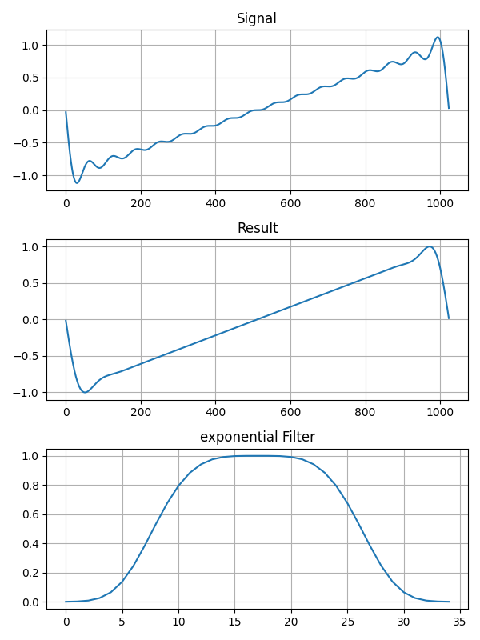
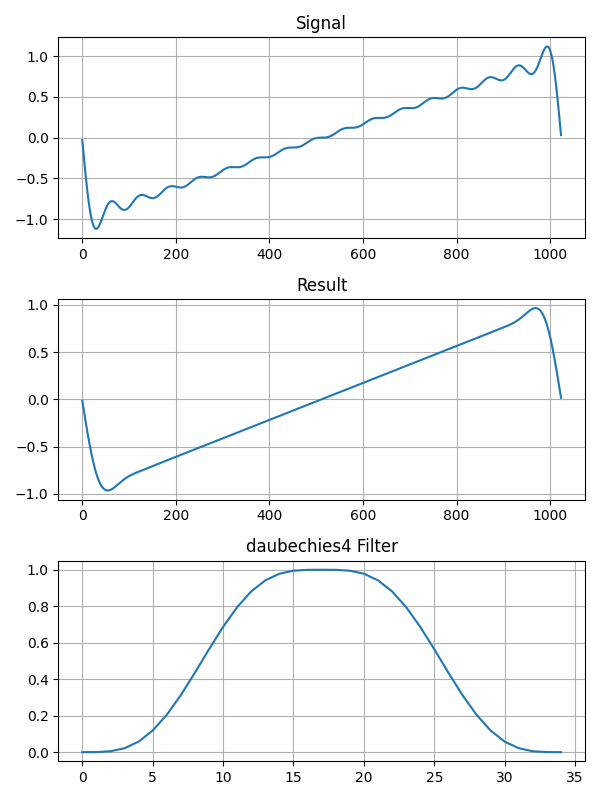
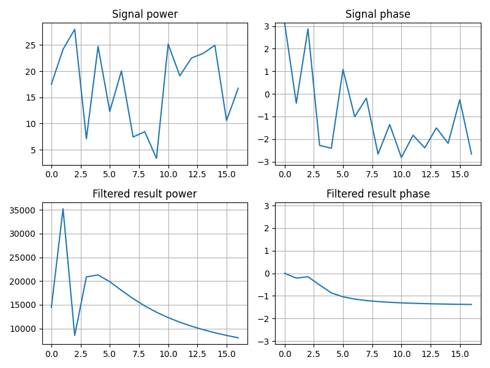
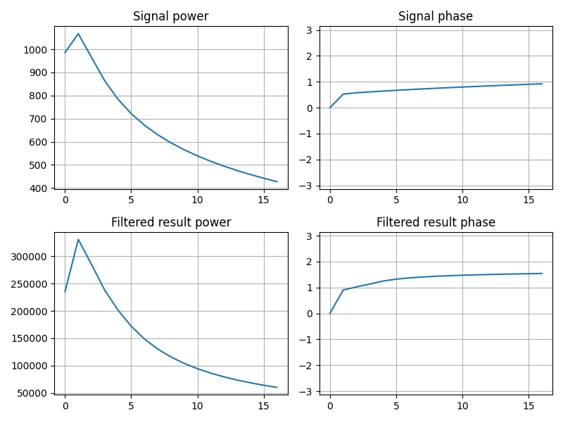

# ギブス現象を抑える
Gottleib と Shu の論文 ["ON THE GIBBS PHENOMENON AND ITS RESOLUTION"](https://citeseerx.ist.psu.edu/document?repid=rep1&type=pdf&doi=0aa153451c7fadf37cc0d2d48659e5bca0dec2e1) を基に[ギブス現象](https://en.wikipedia.org/wiki/Gibbs_phenomenon)を抑える方法を試します。

この文章で実装したコードを [GitHub で見る](https://github.com/ryukau/filter_notes/blob/master/gibbs/demo/gibbs.py)ことができます。実行するには [SciPy](https://www.scipy.org/) と [matplotlib](https://matplotlib.org/) が必要です。パラメータを変えて遊んでみてください。

[コードを見る (github.com)](https://github.com/ryukau/filter_notes/blob/master/gibbs/demo/gibbs.py)

## フィルタを使う方法
Gottleib と Shu の論文で先行研究として紹介されていた方法です。ここではFIRフィルタとして実装します。

フィルタを適用する部分を実装します。

```python
import numpy
import matplotlib.pyplot as pyplot
from scipy.special import eval_gegenbauer, gamma


def spectralLowpass(sig, numSeries):
    if numSeries >= len(sig):
        return sig
    spec = numpy.fft.rfft(sig)
    spec[numSeries + 1 : len(sig) - 1] = 0
    return numpy.fft.irfft(spec)


def additiveSaw(length, numSeries):
    return spectralLowpass(numpy.linspace(-1, 1, length), numSeries)


def applyFilter(source, filterFunc, numSeries, power=1):
    spec = numpy.fft.rfft(source)
    filt = numpy.zeros(len(spec))
    m = numSeries + 1
    for i in range(m):
        eta = i / m
        filt[i] = filterFunc(eta) ** power

    applied = numpy.fft.irfft(spec * filt)
    filt = numpy.append(filt[m:0:-1], filt[: m + 1])  # プロットに使用。

    return (applied, filt)


def plotGibbsSuppression(length, filterFunc, numSeries=16, power=1):
    source = additiveSaw(length, numSeries)
    suppressed, filt = applyFilter(source, filterFunc, numSeries, power)
    # 結果をプロットする。ここでは省略。
```

フィルタの適用は `plotGibbsSuppression` から行います。 `power` の値を大きくするとフィルタのカットオフ周波数が高くなります。入力信号は低いほうから `numSeries` 個の周波数成分を持つ鋸歯波です。

```python
# Lanczosフィルタの適用例。
plotGibbsSuppression(1024, lanczos, 16, 1)
```

### 1 次フィルタ
$$
\sigma_1(\eta) = 1 - \eta
$$

実装します。

```python
def fejer(eta):
    return 1 - eta
```

フィルタを適用した結果です。画像の Signal は入力信号、 Result はフィルタを適用した結果です。一番下の図は FIR フィルタの係数です。

<figure>

</figure>

### Lanczos フィルタ
$$
\sigma_2(\eta) = \frac{\sin(\pi\eta)}{\pi\eta}
$$

実装します。

```python
def lanczos(eta):
    return numpy.sinc(eta)
```

フィルタを適用した結果です。

<figure>

</figure>

### Raised Cosine フィルタ
$$
\sigma_3(\eta) = \frac{1}{2}(1 + \cos(\pi\eta))
$$

実装します。

```python
def raisedCosine(eta):
    return (1 + numpy.cos(numpy.pi * eta)) / 2
```

フィルタを適用した結果です。

<figure>

</figure>

### Sharpened Raised Cosine フィルタ
$$
\sigma_4(\eta) = \sigma_3^4(\eta)(35 - 84\sigma_3(\eta) + 70\sigma_3^2(\eta) - 20\sigma_3^3(\eta))
$$

実装します。

```python
def sharpendRaisedCosine(eta):
    s = raisedCosine(eta)
    return s**4 * (35 - 84 * s + 70 * s**2 - 20 * s**3)
```

フィルタを適用した結果です。

<figure>

</figure>

### Exponential フィルタ
$$
\sigma_5(\eta) = e^{-\alpha\eta^p}
$$

実装します。

```python
def exponential(eta, alpha=8, p=4):
    return numpy.exp(-alpha * eta**p)
```

フィルタを適用した結果です。

<figure>

</figure>

### Daubechies フィルタ
$$
\sigma_6(\eta) = 1 - \frac{(2p-1)!}{(p-1)!^2} \int_0^{\eta} [t(1-t)]^{p-1} dt
$$

[Maxima](https://maxima.sourceforge.io/) で展開します。 $p$ は任意の正の実数です。

```maxima
declare(eta, real, t, real);
p: 4;
I: integrate((t*(1 - t))**(4 - 1), t, 0, eta);
expand(1 - (2 * p - 1)! / (p - 1)!**2 * I);
```

適当に $p = 4$ として実装します。

```python
def daubechies4(eta):
    return 1 - 35 * eta**4 + 84 * eta**5 - 70 * eta**6 + 20 * eta**7
```

フィルタを適用した結果です。

<figure>

</figure>

## Gegenbauer Polynomial を使う方法
Gottleib と Shu の論文で提案されていた方法です。この方法はギブス現象が発生する前の信号が解析的な形で表現できるときに使えます。ここでの解析的な形とは $f(x) = a_0 + a_1 x + a_2 x^2 + a_3 x^3 + \dots$ というような形、つまり[多項式](https://en.wikipedia.org/wiki/Polynomial)のことです。

まず Gegenbauer 係数 $\hat{g}_k^{\lambda}$ を求めます。

$$
\begin{aligned}
\hat{g}_k^{\lambda} &= \frac{1}{h_k^{\lambda}}
\int_{-1}^{1} (1 - x^2)^{\lambda - \frac{1}{2}}f_N(x)C_k^{\lambda}(x)\,dx,
\\
h_k^{\lambda} &= \pi^{\frac{1}{2}}C_k^{\lambda}(x)
\frac{\Gamma(\lambda + \frac{1}{2})}{\Gamma(\lambda)(k + \lambda)},
\\
0 &\le k \le m.
\end{aligned}
$$

- $C_k^{\lambda}(x)$ : [Gegenbauer polynomials](https://en.wikipedia.org/wiki/Gegenbauer_polynomials)
- $f_N(x)$ : インデックスを $[-1, 1]$ の範囲に正規化した入力信号
- $N$ : 入力信号の周波数成分の数
- $m$ : 任意のGegenbauer係数の数
- $\lambda$ : $1/2$ より大きい任意の正の実数
- $h_k^{\lambda}$ : 正規化定数

Gegenbauer 係数 $\hat{g}_k^{\lambda}$ を用いて出力信号 $g^m(x)$ を合成します。

$$
g^m(x) = \sum_{k = 0}^m \hat{g}_k^{\lambda} C_k^{\lambda}(x)
$$

$g^m(x)$ は真の信号と比例関係にあるそうです。つまり出力信号の振幅を調整する必要があります。

$\lambda = N / 4$ 、 $m = N / 2$ として実装します。

```python
def gottliebShu(sig, N, L=0.25):
    """
    :param sig: numpy.array input signal.
    :param N: Number of spectral partial sum or number of overtone.
    :param L: Positive real constant.
    """
    lam = L * N  # N が大きいと eval_gegenbauerでオーバーフローする。

    x = numpy.linspace(-1.0, 1.0, len(sig))
    k = numpy.arange(0, int(N / 2))
    ggnbr = eval_gegenbauer(numpy.tile(numpy.vstack(k), len(sig)), lam, x)
    ggnbr_t = numpy.transpose(ggnbr)

    h_k_lam = (
        numpy.sqrt(numpy.pi) * ggnbr_t[-1] * gamma(lam + 0.5) / gamma(lam) / (k + lam)
    )

    g_hat = (
        numpy.sum(numpy.power(1 - x * x, numpy.abs(lam - 0.5)) * sig * ggnbr, axis=1)
        / h_k_lam
    )

    return (numpy.sum(g_hat * ggnbr_t, axis=1), g_hat)
```

適用した結果です。画像の一番下の図は $\hat{g}_k^{\lambda}$ です。

<figure>

</figure>

$C_1^{\lambda}$ の成分で完璧に再現できています。 $C_1^{\lambda}$ の成分は $y = ax$ の形の直線です。入力信号の鋸歯波も直線なので、これはどうやっても成功しそうです。

他の信号でも試してみます。

```python
def additiveNoise(length, numSeries):
    return spectralLowpass(numpy.random.uniform(-1, 1, length), numSeries)


def analyticSignal(length, numSeries):
    sig = numpy.linspace(-1, 1, length)
    noise = numpy.zeros(length)
    order = 128
    rand = numpy.random.random(order)
    for i in range(order):
        noise += rand[i] * sig**(i + 1)
    return spectralLowpass(noise, numSeries)


def plotGottleibShuNoise(length, signalFunc, numSeries=16):
    source = signalFunc(length, numSeries)
    suppressed, g_hat = gottliebShu(source, numSeries)
    regibbsed = spectralLowpass(suppressed, numSeries)
    # 結果をプロットする。ここでは省略。


plotGottleibShuNoise(1024, additiveNoise, 16)
plotGottleibShuNoise(1024, analyticSignal, 16)
```

以下は `additiveNoise` の結果です。 `additiveNoise` は乱数で生成したノイズにローパスフィルタをかけた信号です。画像の Filtered result はギブス現象を抑えた結果にフィルタをかけて、周波数成分の数を入力信号と揃えた信号です。

<figure>

</figure>

`additiveNoise` について入力信号と、ギブス現象を抑えた結果にフィルタをかけた信号の周波数の比較です。 power は周波数成分の大きさ、 phase は周波数成分の位相です。

<figure>

</figure>

`additiveNoise` ではギブス現象の抑制に失敗しています。乱数で生成したノイズは不連続点を含むので Gegenbauer Polynomial を使う方法をそのまま使うことはできません。

以下は `analyticSignal` の結果です。 `analyticSignal` は解析的な要素のみで合成した信号です。

<figure>

</figure>

`analyticSignal` について入力信号と、ギブス現象を抑えた結果にフィルタをかけた信号の周波数の比較です。

<figure>

</figure>

`analyticSignal` では理論どおりにギブス現象の抑制に成功していると言えそうです。ただし今回選んだパラメータでは目に見える誤差が出ています。 $m$ の値を大きくすれば誤差を減らすことができます。

### 問題点
$\hat{g}_k^{\lambda}$ を求める式の中にある $f_N(x)$ は $[-1, 1]$ の区間で連続であることが求められています。つまり、この方法を現実の信号に適用するには不連続点を見つけて、連続な区間ごとに信号を分割する必要があります。

$\lambda$ と $m$ についてのパラメータ調整が必要です。

$\lambda$ と $m$ が大きいと Gegenbauer Polynomial の計算でオーバーフローすることがあります。これが問題になるときは任意精度で実装するしかなさそうです。

## その他
Gegenbauer polynomial を使う方法の $m$ を増やしていくことで、 Gegenbauer polynomial による信号の加算合成ができます。ただし信号の両端の値が非常に大きくなるので [Tukey 窓](https://docs.scipy.org/doc/scipy/reference/generated/scipy.signal.tukey.html#scipy.signal.tukey)などを掛け合わせて抑える必要があります。また $\lambda = 1$ とすることで、ある程度はオーバーフローを避けることができます。

## 変更点
- 2024/05/06
  - Daubechies フィルタの式の間違いを修正。
- 2024/04/17
  - 文章の整理。
- 2024/04/16
  - [NukeKarasawa40298 さんによって修正されたコード](https://github.com/NukeKarasawa40298/NukeKarasawa40298.github.io/blob/main/gibbs/gibbs_.py)を用いて、フィルタを周波数領域でかけるように修正。
  - Daubechiesフィルタの Maxima のコードの間違いを修正。
  - Exponentialフィルタの Python 3 のコードの `alpha` のデフォルト値を変更。
  - Python 3 の依存関係を整理。
    - FFT を pyFFTW から NumPy のものに置換。
    - 不要な `import` を削除。
