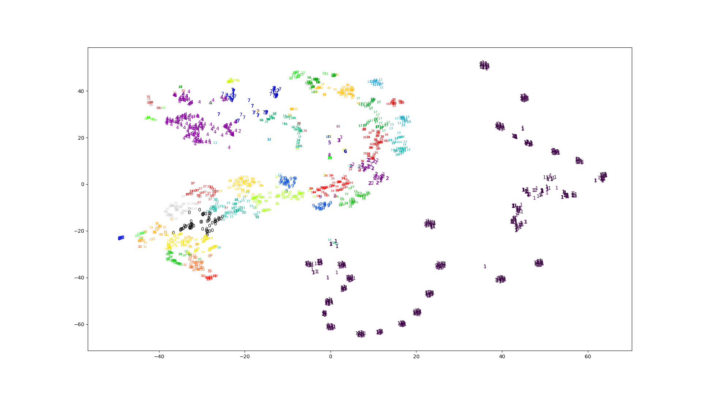
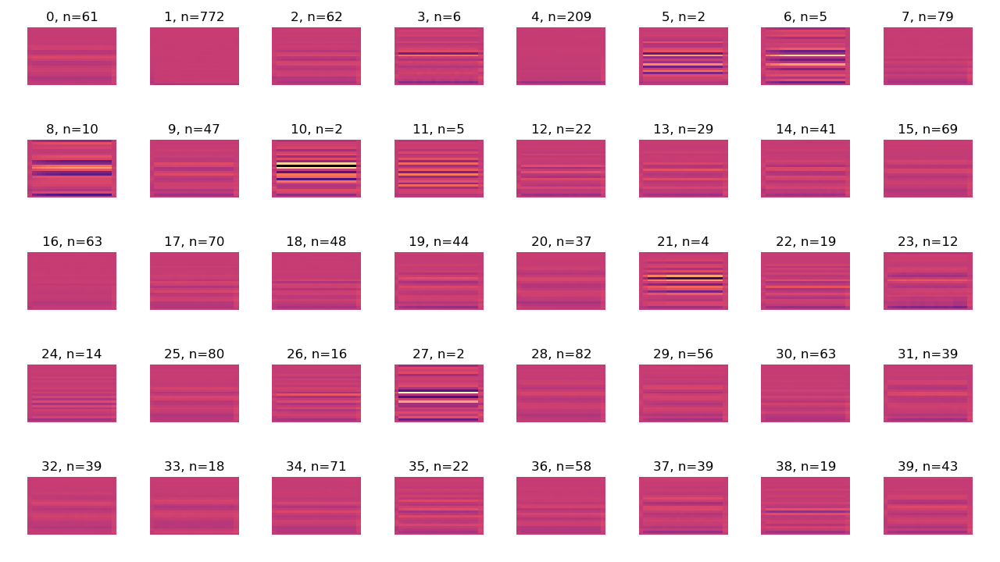
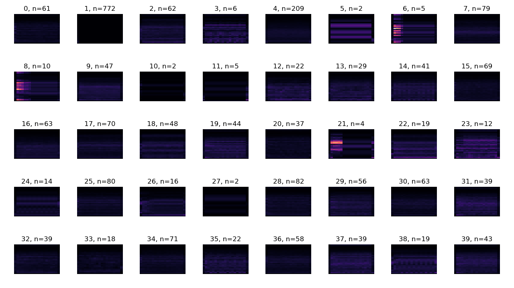

# Golly の Generations で作った音のクラスタリング
[Golly](http://golly.sourceforge.net/) の [Genrations](http://golly.sourceforge.net/Help/Algorithms/Generations.html) という[セルオートマトン](https://ja.wikipedia.org/wiki/%E3%82%BB%E3%83%AB%E3%83%BB%E3%82%AA%E3%83%BC%E3%83%88%E3%83%9E%E3%83%88%E3%83%B3)のルールを使って音を作りました。

<iframe width="640" height="360" src="https://www.youtube.com/embed/zlPi7BwqFwo" frameborder="0" allow="accelerometer; autoplay; encrypted-media; gyroscope; picture-in-picture" allowfullscreen></iframe>

似たような音に分類したくなったので、音の[MFCC](http://www.practicalcryptography.com/miscellaneous/machine-learning/guide-mel-frequency-cepstral-coefficients-mfccs/)を特徴として[K-Means](https://en.wikipedia.org/wiki/K-means_clustering)でクラスタリングしました。

## データセット
Golly の generations から生成した音のデータセットを次のリンクからダウンロードできます。

- [Golly generations data set (76MB)](https://drive.google.com/file/d/1wbyGz6bbGULksH3vOchL7za1bPzNSNHs/view?usp=sharing)

[7zip](https://www.7-zip.org/)で解凍できます。

```bash
$ 7z x golly_generations_cluster.7z
```

解凍してできる `cluster` 内の `generations` がデータセットです。その他のディレクトリはクラスタリングの結果です。

## プロトタイプ
手始めに次のようなコードを書きました。

`scipy.signal.spectrogram` から得たスペクトログラムを `numpy.ravel` で1次元にして `sklearn.cluster.KMeans` でクラスタリングしています。

計算に時間がかかるので `numpy.save` で計算結果を保存しています。

```python
import numpy
import scipy.signal
import sklearn.cluster
import shutil
import soundfile
from pathlib import Path

def extract_feature(path, n_frame=39):
    """
    スペクトログラムは2次元のデータ。
    sklearn.cluster で使えるように numpy.ravel で1次元にして返す。

    spectrogram.shape = (n_freq, n_frame)

    n_frame のデフォルト値はテストに使ったデータセットを調べて決めた。
    """
    data, samplerate = soundfile.read(str(path))
    frequency, time, spectrogram = scipy.signal.spectrogram(data, samplerate)

    if spectrogram.shape[1] < n_frame:
        zeros = numpy.zeros((spectrogram.shape[0],
                             n_frame - spectrogram.shape[1]))
        spectrogram = numpy.concatenate((spectrogram, zeros), axis=1)
    elif spectrogram.shape[1] > n_frame:
        spectrogram = spectrogram[:][0:n_frame]

    return numpy.ravel(numpy.transpose(spectrogram))

def write_result(output_directory, n_clusters, labels, filepath):
    if output_directory.exists():
        shutil.rmtree(output_directory)

    digits = len(str(abs(n_clusters - 1)))
    output_directories = [
        output_directory / Path(f"{index:0{digits}d}")
        for index in range(n_clusters)
    ]

    for directory in output_directories:
        directory.mkdir(parents=True, exist_ok=True)

    for label, path in zip(labels, filepath):
        shutil.copy(path, output_directories[label])

if __name__ == "__main__":
    directory_path = Path("generations")
    if not directory_path.is_dir():
        print("Invalid path.")

    filepath = [path for path in directory_path.glob("*.wav")]
    features = numpy.array([extract_feature(path) for path in filepath])

    n_clusters = 40
    cluster = sklearn.cluster.KMeans(n_clusters=n_clusters).fit(features)

    write_result(
        Path("cluster_spectrogram"), n_clusters, cluster.labels_, filepath)

    numpy.save("data/filepath.npy", filepath)
    numpy.save("data/features.npy", features)
    numpy.save("data/features_shape.npy", (39, 129))
    numpy.save("data/labels.npy", cluster.labels_)
    numpy.save("data/centers.npy", cluster.cluster_centers_)
```

- [scipy.signal.spectrogram — SciPy v1.1.0 Reference Guide](https://docs.scipy.org/doc/scipy/reference/generated/scipy.signal.spectrogram.html)
- [numpy.ravel — NumPy v1.15 Manual](https://docs.scipy.org/doc/numpy/reference/generated/numpy.ravel.html)
- [sklearn.cluster.KMeans — scikit-learn 0.20.1 documentation](https://scikit-learn.org/stable/modules/generated/sklearn.cluster.KMeans.html)

## クラスタリング手法の選定
耳で聞いた印象がいまいちだったので [`sklearn.cluster`](https://scikit-learn.org/stable/modules/classes.html#module-sklearn.cluster) の中から次のクラスタリング手法を試しました。

- `KMeans`
- `AffinityPropagation`
- `AgglomerativeClustering`
- `SpectralClustering`
- `DBSCAN`

`Agglomerative` と `KMeans` は似たような結果が出ました。

`AffinityPropagation` はアルゴリズム側でクラスタの数を自動的に決めてくれます。 `damping` をデフォルトの0.5にするとクラスタの数が多くなりすぎたので、適当に0.6としたところ119のサンプルに対して60ほどあったクラスタが15まで減りました。

`SpectralClustering` の結果は良くなかったです。

`DBSCAN` はサンプルの数と同じだけのクラスタができる結果となりました。[Visualizing DBSCAN Clustering](https://www.naftaliharris.com/blog/visualizing-dbscan-clustering/) を見ると空間を格子に区切って、格子内のデータポイントの数に応じてクラスタを作っています。今回のデータでは次元の高さに対してデータポイントの数が少なすぎるためにクラスタが形成されにくいのかもしれません。

ここでは Golly の generations で作った音のクラスタリングには `KMeans` で十分と判断しました。

クラスタリング手法では結果が改善しないこともわかったので特徴抽出を変えることにしました。

## MFCC
[`numpy.spectrogram`](https://docs.scipy.org/doc/scipy/reference/generated/scipy.signal.spectrogram.html) を使ったクラスタリングの結果に満足できなかったので [`python_speech_features`](https://python-speech-features.readthedocs.io/en/latest/) をインストールして [MFCC](http://www.practicalcryptography.com/miscellaneous/machine-learning/guide-mel-frequency-cepstral-coefficients-mfccs/) を使うことにしました。

プロトタイプの `extract_feature` を次のように変更しました。

```python
import python_speech_features

def extract_feature(path, n_frame=19):
    """
    mfcc.shape = (n_frame, n_cepstrum)
    """
    data, samplerate = soundfile.read(str(path))
    nfft = 1024
    mfcc = python_speech_features.mfcc(
        data,
        samplerate,
        winlen=nfft / samplerate,
        winstep=0.01,
        numcep=26,
        nfilt=52,
        nfft=nfft,
        preemph=0.97,
        ceplifter=22,
    )

    if mfcc.shape[0] < n_frame:
        zeros = numpy.zeros((n_frame - mfcc.shape[0], mfcc.shape[1]))
        mfcc = numpy.concatenate((mfcc, zeros), axis=0)
    elif mfcc.shape[0] > n_frame:
        mfcc = mfcc[0:n_frame]

    return numpy.ravel(mfcc)
```

`winlen * samplerate > nfft` のときにエラーが出るので `winlen` は `nfft` の値から決めています。

`numcep` と `nfilt` は適当にデフォルトの2倍にしました。

Golly の generations で作った音は低周波成分がそれなりに含まれるので、ルールと音の関係を調べるなら `preemph` は0でいいかもしれません。ここでは耳での聞こえ方で分類したかったのでデフォルト値を使っています。

Golly の generations で作った音のクラスタリングについては、MFCCを使うことでスペクトログラムを使うよりも私の主観では良い結果が出ました。データポイントの次元が減るので計算も早くなります。

- [Practical Cryptography - Mel Frequency Cepstral Coefficient (MFCC) tutorial](http://www.practicalcryptography.com/miscellaneous/machine-learning/guide-mel-frequency-cepstral-coefficients-mfccs/)
- [fir - Pre-emphasis filter for speech recognition - Signal Processing Stack Exchange](https://dsp.stackexchange.com/questions/45786/pre-emphasis-filter-for-speech-recognition)
- [Why is pre-emphasis (i.e. passing the speech signal through a first order high pass filter) required in speech processing and how does it work? - Quora](https://www.quora.com/Why-is-pre-emphasis-i-e-passing-the-speech-signal-through-a-first-order-high-pass-filter-required-in-speech-processing-and-how-does-it-work)

## Elbow Method
`KMeans` のパラメータ `n_clusters` を決めるために [elbow method](https://bl.ocks.org/rpgove/0060ff3b656618e9136b) を試しました。

`KMeans` の誤差はクラスタの数を増やすと小さくなります。また、クラスタの数が増えると誤差の減り方が緩やかになってきます。 Elbow method では誤差の減り方が十分に緩やかな範囲で最も小さいクラスタの数を使います。誤差の減り方が緩やかかどうかの判断はデータセットに応じて人間が適当に行うようです。

実装では `sklearn.cluster.KMeans.inertia_` がそのまま使えます。

```python
import matplotlib.pyplot as pyplot
import numpy
import python_speech_features
import sklearn.cluster
import soundfile
from pathlib import Path

def get_inertia(n_clusters, features):
    cluster = sklearn.cluster.KMeans(n_clusters=n_clusters).fit(features)
    return cluster.inertia_

if __name__ == "__main__":
    features = numpy.load("features.npy")

    x_range = (2, 101)
    errors = [get_inertia(k, features) for k in range(*x_range)]
    k_value = [k for k in range(*x_range)]

    pyplot.plot(k_value, errors, lw=1, color="gray")
    pyplot.plot(k_value, errors, "o", markersize=3, color="black")
    pyplot.xlabel("n_clusters")
    pyplot.ylabel("error")
    pyplot.xlim((x_range[0], x_range[1] - 1))
    pyplot.grid()
    pyplot.show()
```

出力されたプロットです。

<figure>

</figure>

滑らかで elbow となる傾きが急に変わる箇所がないように見えます。今回は特に目的も正解もなくクラスタリングしているので `k=40` くらいでいい気がします。

- [Using the elbow method to determine the optimal number of clusters for k-means clustering - bl.ocks.org](https://bl.ocks.org/rpgove/0060ff3b656618e9136b)
- [How can we choose a 'good' K for K-means clustering? - Quora](https://www.quora.com/How-can-we-choose-a-good-K-for-K-means-clustering)

## t-SNE で視覚化
いい評価方法が思いつかないので、とりあえず [t-SNE](https://en.wikipedia.org/wiki/T-distributed_stochastic_neighbor_embedding) で視覚化しました。

[`sklearn.manifold.TSNE`](https://scikit-learn.org/stable/modules/generated/sklearn.manifold.TSNE.html) を使います。

```python
import numpy
import sklearn.manifold

features = numpy.load("data/features.npy")
tsne = sklearn.manifold.TSNE(n_components=2).fit(features)
numpy.save("data/embedding.npy", tsne.embedding_)
```

計算結果のプロットです。図の数字はデータポイントの属するクラスタの番号と対応しています。

<figure>

</figure>

## 適当なプロット
クラスタの内容を調べるために適当に思いついたパラメータをプロットします。

中央値が表すMFCCです。各画像の縦が周波数で下から上に向かって大きくなります。横は時間で左から右に向かって進んでいます。明るい部分ほど係数が大きくなります。 `n` はクラスタに含まれるデータポイントの数を表しています。

<figure>

</figure>

K-Meansの中央値と対応するデータポイントとの間での平均絶対誤差 ([mean absolute error](https://en.wikipedia.org/wiki/Mean_absolute_error)) です。

<figure>

</figure>

以下は耳で聞いた印象です。

- 0, 2, 15, 20, 25, 28 は低めのトーン。
- 1, 11, 21 はプチノイズ。
- 4, 7, 16 はカラーノイズ。
- 3, 8, 9, 12, 13, 14, 19, 29, 31, 35, 39 は高いトーン。
- 17, 18, 30, 34, 36 は高めのカラーノイズと高めのトーンの中間のような音。
- 22, 23, 24, 26, 37, 38 はプチノイズと高いトーン。
- 32, 33 は低めのカラーノイズと低めのトーンの中間のような音。

## プロットギャラリー
特徴ベクトルを変えて出力したプロットを別ページにまとめました。

[プロットギャラリーを見る](gallery.html)

## その他
ここではクラスタリングの結果について、ざっくり耳で聞いた判断しか行っていません。

MFCCを試した後でスペクトログラムを改善できないか試しました。

- データポイントの最小値、最大値の範囲を [0, 1] に正規化。
- データポイントの最小値、最大値の範囲を [0, 1] に正規化してから `numpy.log` で対数に変換。

どちらもMFCCと比べて良くなったとは感じませんでした。

Elbow method はヒューリスティックのわりに計算に時間がかかります。今回のような正解となるデータセットがない状態でのクラスタリングでは `KMeans` よりも、自動的にクラスタの数を決めてくれる `AffinityPropagation` を使ったほうが楽かもしれません。
