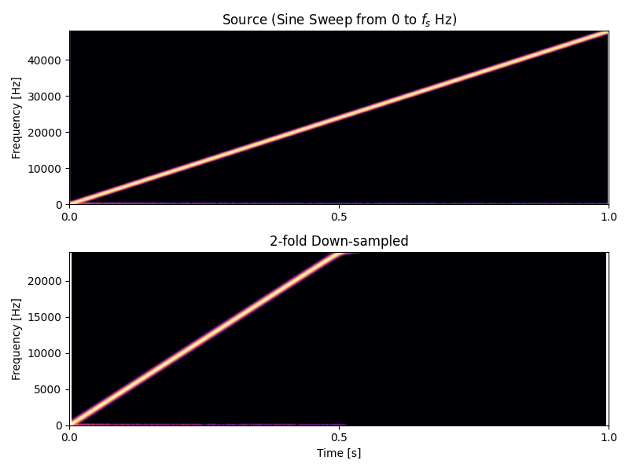
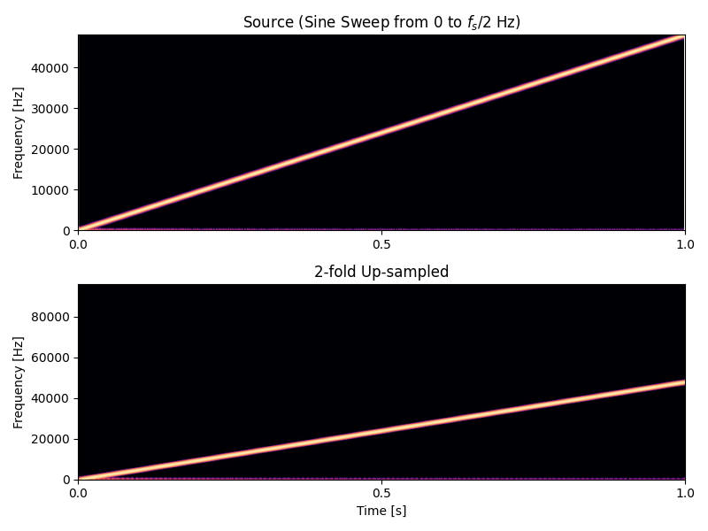

# ハーフバンド楕円フィルタの実装
ハーフバンド楕円フィルタは IIR ポリフェイズフィルタの一種です。 2 倍のアップサンプラあるいは 1/2 倍のダウンサンプラに応用できます。

IIR のポリフェイズフィルタについて調べていたところ robwasab さんによるハーフバンド楕円フィルタの設計コード [`half_band.py`](https://github.com/robwasab/HalfBand) を見つけました。ここでは robwasab さんによる `half_band.py` を改変したコードから得られた係数を使って、ハーフバンド楕円フィルタを C++ で実装します。

- [half_band.py を改変したコード (github.com)](https://gist.github.com/ryukau/07af221fe64465febbaa8ef69e19d845)

他にも paulfd さんによる [hiir-designer](https://github.com/paulfd/hiir-designer) という設計コードを見つけました。似たようなパラメータを入力してフィルタを設計したところ、ほぼ同じ係数が得られたので、こちらを利用してもよさそうです。

## フィルタ係数の取得
### パラメータの設定
`half_band.py` の冒頭にある以下の部分がパラメータです。コメントは日本語に変えています。

```python
# INPUTS:
#    fp = パスバンド周波数。 0 < fp < 0.4999 i.e 0.44
#    dp = パスバンドリップル。 i.e. 0.0001
#    ds = ストップバンドリップル。 i.e. 0.1

fp = 0.495
dp = 0.0000002
ds = 0.0000002
```

以下は `fp = 0.495, dp = 0.0000002, ds = 0.0000002` で `half_band.py` を実行して得られたハーフバンド楕円フィルタのフィルタ係数です。パラメータはストップバンドの低減が -140 dB になるように調整しています。

```json
{
  "h0": [
    0.0765690656031399, 0.264282270318935,
    0.47939467893641907, 0.661681722389424,
    0.7924031566294969, 0.8776927911111817,
    0.9308500986629166, 0.9640156636878193,
    0.9862978287283355
  ],
  "h1": [
    0.019911761024506557, 0.16170648261075027,
    0.37320978687920564, 0.5766558985008232,
    0.7334355636406803, 0.8399227128761151,
    0.9074601780285125, 0.9492937701934973,
    0.9760539731706528, 0.9955323321150525
  ]
}
```

## C++ で実装
### 伝達関数
記号を定義します。 $N_0$ と $N_1$ は異なる値になることがあるので分けています。

- $H_0, H_1$: ポリフェイズに分割したハーフバンド楕円フィルタ。
- $a_{0,i}$: $H_0$ のフィルタ係数。配列。 $i$ はインデックス。
- $a_{1,i}$: $H_1$ のフィルタ係数。配列。 $i$ はインデックス。
- $N_0$: $a_0$ の要素数。
- $N_1$: $a_1$ の要素数。

以下はハーフバンド楕円フィルタの伝達関数 $H$ です。 $H_0$ と $H_1$ はオールパスフィルタの直列接続です。

$$
\begin{aligned}
H(z) &= H_0(z) z^{-1} + H_1(z)\\
H_0(z) &= \prod_{i=0}^{N_0 - 1} \frac{a_{0,i} + z^{-2}}{1 + a_{0,i} z^{-2}} \\
H_1(z) &= \prod_{i=0}^{N_1 - 1} \frac{a_{1,i} + z^{-2}}{1 + a_{1,i} z^{-2}} \\
\end{aligned}
$$

### 1 次オールパスセクション
ポリフェイズフィルタとして使うときは [noble identities](https://ccrma.stanford.edu/~jos/sasp/Multirate_Noble_Identities.html) によって $z^{-2}$ が $z^{-1}$ に変わります。以下は $z^{-2}$ を $z^{-1}$ に変えたときの 1 次オールパスセクションの伝達関数です。

$$
H_{\mathrm{AP}}(z, a) = \frac{a + z^{-1}}{1 + a z^{-1}}
$$

出力 $y_0$ を計算する式に変形します。 $x$ は入力、 $y$ は出力を表しています。 $x$ と $y$ の下付き文字の数値は遅延のサンプル数を表しています。例えば $x_0$ は現在の入力、 $x_1$ は 1 サンプル前の入力です。

$$
\begin{aligned}
Y(z) &= H_{\mathrm{AP}}(z, a) X(z)\\
Y(z) &= \frac{a + z^{-1}}{1 + a z^{-1}} X(z)\\
Y(z) (1 + a z^{-1}) &= X(z) (a + z^{-1})\\
y_0 + a y_1 &= a x_0 + x_1\\
y_0 &= a (x_0 - y_1) + x_1\\
\end{aligned}
$$

コードにします。以下はポリフェイズフィルタとして実装するときの、 1 次オールパスセクションの実装です。 `nSection` は直列につなぐ数です。

```c++
template<typename Sample, size_t nSection> class FirstOrderAllpassSections {
private:
  std::array<Sample, nSection> x{};
  std::array<Sample, nSection> y{};

public:
  void reset()
  {
    x.fill(0);
    y.fill(0);
  }

  Sample process(Sample input, const std::array<Sample, nSection> &a)
  {
    for (size_t i = 0; i < nSection; ++i) {
      y[i] = a[i] * (input - y[i]) + x[i];
      x[i] = input;
      input = y[i];
    }
    return y.back();
  }
};
```

### IIR ポリフェイズフィルタ
フィルタ全体の伝達関数 $H$ を再掲します。

$$
H(z) = H_0(z) z^{-1} + H_1(z)
$$

$z^{-1}$ が $H_0(z)$ に掛けられているので、入力は $H_0, H_1, H_0, H_1, \dots$ と順に交代しながら 2 つの伝達関数に送られます。

例をあげて見ていきます。以下の入力信号があるとします。

```
s = [s0, s1, s2, s3, ...]
```

このとき以下の計算を行うとハーフバンド楕円フィルタをかけながら 1/2 倍にダウンサンプリングできます。

```
out0 = 0.5 * (H0.process(s0) + H1.process(s1))
out1 = 0.5 * (H0.process(s2) + H1.process(s3))
out2 = 0.5 * (H0.process(s4) + H1.process(s5))
...
```

0.5 をかけて入力と出力の振幅が一致するようにしています。 $H_0$ と $H_1$ はオールパスなので、足し合わせると位相特性が一致している周波数の出力振幅が入力の 2 倍になります。

コードにします。

```c++
#include <array>

template<typename T> struct HalfBandCoefficient {
  static constexpr std::array<T, 9> h0_a{
    T(0.0765690656031399), T(0.264282270318935),  T(0.47939467893641907),
    T(0.661681722389424),  T(0.7924031566294969), T(0.8776927911111817),
    T(0.9308500986629166), T(0.9640156636878193), T(0.9862978287283355),
  };
  static constexpr std::array<T, 10> h1_a{
    T(0.019911761024506557), T(0.16170648261075027), T(0.37320978687920564),
    T(0.5766558985008232),   T(0.7334355636406803),  T(0.8399227128761151),
    T(0.9074601780285125),   T(0.9492937701934973),  T(0.9760539731706528),
    T(0.9955323321150525),
  };
};

template<typename Sample, typename Coefficient> class HalfBandIIR {
private:
  FirstOrderAllpassSections<Sample, Coefficient::h0_a.size()> ap0;
  FirstOrderAllpassSections<Sample, Coefficient::h1_a.size()> ap1;

public:
  void reset()
  {
    ap0.reset();
    ap1.reset();
  }

  // ダウンサンプリング。 input[0] は input[1] よりも 1 サンプル前の値。
  Sample processDown(std::array<Sample, 2> &input)
  {
    auto s0 = ap0.process(input[0], Coefficient::h0_a);
    auto s1 = ap1.process(input[1], Coefficient::h1_a);
    return Sample(0.5) * (s0 + s1);
  }

  // アップサンプリング。
  std::array<Sample, 2> processUp(Sample input)
  {
    return {
      ap1.process(input, Coefficient::h1_a),
      ap0.process(input, Coefficient::h0_a),
    };
  }
};
```

### テスト
$0$ から $f_s$ までピッチベンドするサイン波を入力してテストしました。

以下はダウンサンプリングの結果です。上の図は入力信号のスペクトログラム、下の図はハーフバンド楕円フィルタを通して 1/2 倍にダウンサンプリングした出力信号のスペクトログラムです。ダウンサンプリング前なので、入力信号のサンプリング周波数は $2f_s$ です。出力信号のスペクトログラムにエイリアシングが出ていないので成功しています。

<figure>

</figure>

以下はアップサンプリングの結果です。上の図は入力信号のスペクトログラム、下の図はハーフバンド楕円フィルタを通して 2 倍にアップサンプリングした出力信号のスペクトログラムです。下の図の $[f_s/2, f_s)$ の範囲が真っ黒なので成功しています。

<figure>

</figure>

以下はテストコードへのリンクです。

- [C++ のテストコードを読む (github.com)](https://github.com/ryukau/filter_notes/blob/master/iir_halfband_decimator/cpp/halfband.cpp)

## 参考サイト
### robwasab による HalfBand
以下は robwasab さんによるハーフバンド楕円フィルタの係数を計算する Python2 のコードへのリンクです。

- [GitHub - robwasab/HalfBand: HalfBand IIR Filter](https://github.com/robwasab/HalfBand)

以下はスクリプト中に記載されていた設計方法の論文です。

- R. Ansari, ["Elliptic filter design for a class of generalized halfband filters,"](https://ieeexplore.ieee.org/abstract/document/1164709) in IEEE Transactions on Acoustics, Speech, and Signal Processing, vol. 33, no. 5, pp. 1146-1150, Oct 1985.

以下は `half_band.py` を Python 3 に翻訳した改変版です。

- [Python 3 translation of half_band.py: https://github.com/robwasab/HalfBand · GitHub](https://gist.github.com/ryukau/07af221fe64465febbaa8ef69e19d845)

#### 改変版のフィルタ係数のフォーマット
オリジナルの `half_band.py` では、以下のように `H0(z)` と `H1(z)` の伝達関数の分子と分母が互い違いになっています。

```python
h0s = [(z_2 + ai) / (ai * z_2 + 1.0) for ai in h0_ai]
h1s = [(ai * z_2 + 1.0) / (z_2 + ai) for ai in h1_ai]
```

改変版では C++ の実装でコードを減らすために `H0(z)` の値を逆数にしています。

```python
h0_ai = 1 / h0_ai  # 追加。

h0s = [(ai * z_2 + 1.0) / (z_2 + ai) for ai in h0_ai]
h1s = [(ai * z_2 + 1.0) / (z_2 + ai) for ai in h1_ai]
```

### paulfd による hiir-designer
以下は paulfd さんによるハーフバンド楕円フィルタの係数を計算する hiir-designer のコードへのリンクです。 C++ です。

- [GitHub - paulfd/hiir-designer: Designs oversampling stages adapted to HIIR from Laurent de Soras](https://github.com/paulfd/hiir-designer)

hiir-designer は Laurent de Soras さんによる HIIR というハーフバンドフィルタのライブラリから、フィルタ係数を計算する部分だけを抜き出したものです。以下は Laurent de Soras さんによる HIIR へのリンクです。

- [Laurent de Soras - Productions](http://ldesoras.free.fr/prod.html#src_audio)

以下は HIIR の `PolyphaseIir2Designer.h` に記載されていた参考文献です。

- Artur Krukowski - [Polyphase Two-Path Filter Designer in Java](http://www.cmsa.wmin.ac.uk/~artur/Poly.html)
-	R.A. Valenzuela, A.G. Constantinides, "Digital Signal Processing Schemes for Efficient Interpolation and Decimation," IEEE Proceedings, Dec 1983
-	Scott Wardle, ["A Hilbert-Transformer Frequency Shifter for Audio,"](http://www.iua.upf.es/dafx98/papers/WAR19.PS) International Conference on Digital Audio Effects (DAFx) 1998

#### パッチ
hiir-designer が 1 ステージのみでも係数を出力するようには、 `hiir-designer.cpp` を以下のように変更します。コミット `8a33c0f` の時点では 37 行目です。

```c++
if (n_stages < 1) { // 変更点。元の条件は n_stages < 2
    std::cerr << "The number of stages should be greater than 2 (" << n_stages << ")" << '\n';
    return -1;
}
```

#### フィルタ係数のフォーマット
出力されたフィルタ係数は $H_1$ と $H_0$ の係数が互い違いになっています。

```
{a1_0, a0_0, a1_1, a0_1, a1_2, a0_2, ...}
```

ここで紹介した実装で使うには以下のように並べ替えます。

```c++
template<typename T> struct HalfBandCoefficient {
  static constexpr std::array<T, 9> h0_a{
    T(a0_0), T(a0_1),  T(a0_2), // ...
  };
  static constexpr std::array<T, 10> h1_a{
    T(a1_0), T(a1_1), T(a1_2), // ...
  };
};
```

`PolyphaseIir2Designer.h` のコメントでも $H_0, H_1$ の表記が使われていますが、 `half_band.py` の表記とは 0 と 1 が入れ替わっているので注意してください。ここではすべて `half_band.py` の表記に合わせています。

## 変更点
- 2024/02/16
  - アップサンプリングの実装を追加。
