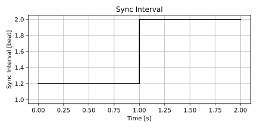
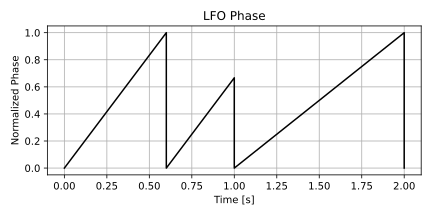
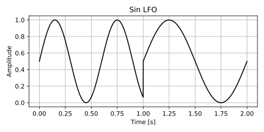
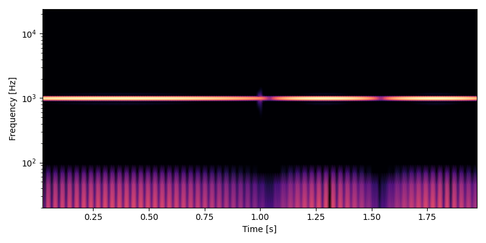
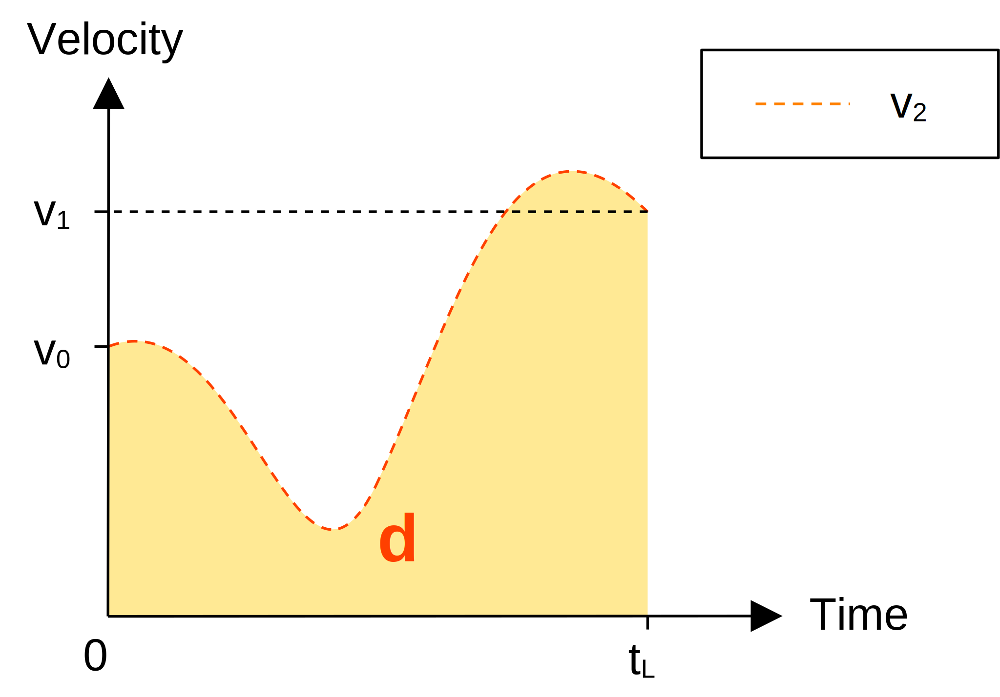

# LFO のテンポシンク
LFO を滑らかにテンポシンク (tempo synchronization) する方法について調べます。

ここでは拍単位でのテンポシンクのみを扱います。

## 素朴なテンポシンク
テンポシンクでは以下のパラメータを使います。ユーザはテンポと同期間隔を変更できます。

- $T$: テンポ \[beat/min\]
- $B$: 経過拍数 \[beat\]
- $S$: 同期間隔 \[beat\]

経過拍数 $B$ と同期間隔 $S$ から LFO の位相 $p$ を以下の式で計算できます。

$$
p = \frac{\mathrm{fmod}(B, S)}{S}
$$

上の式による位相の計算を、素朴なテンポシンクと呼ぶことにします。位相 $p$ は範囲 $[0, 1)$ の、のこぎり波の LFO として使えます。

### 評価
振幅変調を使って評価を行います。

#### 同期間隔の変更
以下のパラメータでテンポシンクを行います。

- テンポ 120 \[beat/min\]
- 同期間隔
  - 0~1 秒: 6/5 \[beat\]
  - 1~2 秒: 2 \[beat\]

次の図は同期間隔のプロットです。 1 秒の時点で同期間隔が 6/5 拍から 2 拍に変わります。

<figure>

</figure>

次の図は上記のパラメータから計算した、素朴なテンポシンクの位相 $p$ のプロットです。この信号は開始から 1 秒の時点で 1.0 に到達せずに 0.0 に巻き戻っているので、位相として使うには問題があります。

<figure>

</figure>

位相 $p$ をサイン波 $s_m$ に変換します。 1 秒の時点に不連続点があります。

$$
s_m = \sin(2 \pi p)
$$

<figure>

</figure>

次の図は 1000 Hz のサイン波をキャリア、 $s_m$ をモジュレータとして振幅変調をかけたときのスペクトログラムです。 1 秒の時点に入っている、明るい縦の線がポップノイズです。

<figure>

</figure>

音のサンプルです。

<figure>
  <figcaption>素朴にテンポシンクした LFO で 1000 Hz のサイン波に振幅変調をかけて、同期間隔を変更したときの音。</figcaption>
  <audio controls>
    <source src="snd/NaiveSyncChange.wav" type="audio/wav">
  </audio>
</figure>

#### テンポの変更
以下のパラメータでテンポシンクを行います。

- テンポ
  - 0~1 秒: 40 \[beat/min\]
  - 1~2 秒: 120 \[beat/min\]
- 同期間隔 1 \[beat\]

以下の図は 1 秒の時点でテンポが変更されたときの位相のプロットです。テンポが変更された時点で、位相の傾きが変わっています。

<figure>

</figure>

次の図は、上の図の位相を使ったサイン波をモジュレータとして、 1000 Hz のサイン波のキャリアに振幅変調をかけたときのスペクトログラムです。 1 秒の時点で少しだけ縦に伸びている線がポップノイズです。同期間隔を変更したときに比べるとポップノイズは目立ちません。

<figure>

</figure>

音のサンプルです。ポップノイズを聞き取ることは困難です。

<figure>
  <figcaption>素朴にテンポシンクされた LFO による振幅変調。テンポを変更。</figcaption>
  <audio controls>
    <source src="snd/NaiveTempoChange.wav" type="audio/wav">
  </audio>
</figure>

## 滑らかなテンポシンク
同期間隔やテンポが変更されたときにポップノイズを抑えながら新しい周期に移行するような方法を調べます。

### 問題の整理
ある時点で同期間隔が $S_0$ から $S_1$ に変わったとします。このとき、パラメータ変更前の位相の位置 $p_0$ と、パラメータ変更後の位相の位置 $p_1$ は以下の式で計算できます。

$$
\begin{aligned}
p_0 &= \frac{\mathrm{fmod}(B, S_0)}{S_0}\\
p_1 &= \frac{\mathrm{fmod}(B, S_1)}{S_1}\\
\end{aligned}
$$

同様にテンポが $T_0$ から $T_1$ に変わったとします。またサンプリング周波数を $f_s$ とします。このとき、パラメータ変更前の 1 サンプルあたりの位相の傾き $v_0$ と、パラメータ変更後の 1 サンプルあたりの位相の傾き $v_1$ は以下の式で計算できます。分母の 60 は 1 分間の秒数です。

$$
\begin{aligned}
v_0 &= \frac{T_0}{60 f_s S_0}\\
v_1 &= \frac{T_1}{60 f_s S_1}\\
\end{aligned}
$$

この問題の目的は、位置 $p_0$ かつ速度 $v_0$ の位相 $\phi_0$ を、位置 $p_1$ かつ速度 $v_1$ の位相 $\phi_1$ に並走させることです。以下は $\phi_0$ と $\phi_1$ の位置関係を示した図です。青が $\phi_0$ 、オレンジが $\phi_1$ を表しています。ここで扱っている位相は $0$ 未満あるいは $1$ 以上のときに $[0, 1)$ の範囲へと巻き戻されます。下図の $[-1, 0)$ と $[1, 2)$ の範囲に含まれる矢印は巻き戻す前の位相を表しています。

<figure>

</figure>


ここで $p_0$ から $p_1$ に滑らかに遷移するときの速度を $v_2$ とします。以下は $v_2$ に求められる性質を示した図です。 $v_2$ の初期値は $v_0$ で、任意の時間 $t_L$ が経過すると $v_1$ に到達します。そして、遷移開始時点から $t_L$ まで $v_2$ を積分したときの値が $d = p_1 - p_0$ となるようにします。言い換えると、図のオレンジで塗りつぶした領域の面積 $d$ が $p_1 - p_0$ と等しくなるようにします。

<figure>

</figure>

$v_0$ から $v_1$ をつなぐ曲線 $v_2$ は、以下の条件を満たせば自由に定義できます。

$$
\int_{0}^{t_L} v_2(t)\ dt = d
$$

### 設計
$t_L$ の値としてパラメータ変更後の LFO の 1 周期にかかるサンプル数 $n_L$ を使うことにします。以下は $n_L$ の計算式です。

$$
n_L = \frac{1}{v_1}
$$

$v_2$ は時点 $\dfrac{n_L}{2}$ に速度 $h$ の中間点を置いて、 $v_0, h, v_1$ を順につないだ直線を使います。以下は中間点を使う $v_2$ の図です。

<figure>

</figure>

以降では式の簡略化のために $m = \dfrac{n_L}{2}$ とします。

以下は中間点を使う曲線 $v_2$ の式です。

$$
\begin{aligned}
v_2(n) &= \begin{cases}
  v_0 + \dfrac{n}{m} (h - v_0)   & \text{if} \enspace n < m,\\\\
  h + \dfrac{n - m}{m} (v_1 - h) & \text{if} \enspace n \geq m.\\
\end{cases}
\end{aligned}
$$

$h$ の計算式を求めます。

$$
\begin{aligned}
\int_{0}^{t_L} v_2(t)\ dt
&= \int_{0}^{m} v_2(n)\ dn + \int_{m}^{n_L} v_2(n)\ dn\\
&= \frac{(v_0 + h)m}{2} + \frac{(h + v_1)m}{2} \\
&= d \\
\end{aligned}
$$

$h$ について解きます。

$$
h = \frac{d}{m} - \frac{v_0 + v_1}{2}
$$

Python 3 で実装して動作確認します。以下のコードを実行すると同期間隔が変更された時点から 1 秒後までの位相をレンダリングします。

```python
import numpy as np
import matplotlib.pyplot as plt

fs = 48000
tempo = 120
sync0 = 0.25 # 式中の S_0 。
sync1 = 1.0  # 式中の S_1 。

duration = 1
nFrame = int(fs * duration)

p0 = 0.5
p1 = 0.0

nLfo = fs * sync1 * 60 / tempo # 式中の n_L 。
mid = nLfo / 2                 # 式中の m 。

v1 = 1 / nLfo
v0 = tempo / (fs * sync0 * 60)

distance = p1 - p0                      # 式中の d 。
height = distance / mid - (v0 + v1) / 2 # 式中の h 。

velocity = np.interp(np.arange(nFrame), [0, mid, nLfo, nFrame], [v0, height, v1, v1])

phase1 = np.linspace(p1, p1 + v1 * nFrame, nFrame) % 1 # 素朴なテンポシンクの位相。
phase2 = (p0 + velocity.cumsum()) % 1 # 滑らかにした位相。

# プロットは省略。
```

プロットを含むテストコードは以下のリンク先で読めます。 `sync0, sync1, p0, p1` の値を変えることで動作を確認できます。

- [滑らかなテンポシンクのテストコードを読む (github.com, Python 3)](https://github.com/ryukau/filter_notes/blob/master/lfo_temposync/model.py)

実行結果のプロットです。位相方向の 0.0 と 1.0 の間は滑らかにつながっています。滑らかに遷移させた位相が一時的に逆走しています。

<figure>

</figure>

### 逆走の補正
位相の逆走は $h < 0$ のときに $v_2$ が負の値になるために起こります。以下は逆走が起きるときの $v_2$ を表した図です。

<figure>

</figure>


逆走を防ぐには $d$ の値を調節することが考えられます。 $d$ と $h$ の式を再掲します。

$$
\begin{aligned}
d &= p_1 - p_0\\
h &= \frac{d}{m} - \frac{v_0 + v_1}{2}\\
\end{aligned}
$$

$d$ は範囲 $[0, 1)$ の 2 つの位相の差です。位相は巻き戻しがあるので $\dots,\,d - 2,\,d - 1,\,d,\,d + 1,\,d + 2,\,\dots$ はすべて同じ距離を表していると考えることができます。よって適当な整数 $k$ を用意して $h$ の式を以下のように書き換えられます。

$$
h = \frac{d + k}{m} - \frac{v_0 + v_1}{2}
$$

$h \geq 0$ の条件をあてはめて $k$ について解きます。

$$
\begin{aligned}
0 &\leq \frac{d + k}{m} - \frac{v_0 + v_1}{2}\\
k &\geq \frac{v_0 + v_1}{2}m - d\\
\end{aligned}
$$

$k$ について解いた不等式の右辺に天井関数を付け加えた値を逆走を補正する整数として使います。

$$
k = \left\lceil \frac{v_0 + v_1}{2}m - d \right\rceil
$$

設計の節で掲載した Python 3 のコードの一部を以下のように変更します。

```python
k = np.ceil((v0 + v1) / 2 * mid - distance)
height = (distance + k) / mid - (v0 + v1) / 2
```

以下は変更後の実行結果の図です。逆走していないことが確認できます。

<figure>

</figure>

## 実装
### 経過拍数の外挿
ここまではテンポ、同期間隔、経過拍数が 1 サンプルごとに更新されることを前提にしていました。しかしプラグインで実装するときは DSP 処理の 1 サイクルごとにパラメータが更新されます。このときサイクル内での経過拍数の変化について[外挿](https://en.wikipedia.org/wiki/Extrapolation)を行う必要があります。

今回はテンポがサイクルの開始時点以外では変化しないことを前提とします。テンポが変化しないのであれば 1 サイクル内の経過拍数は直線を描くことが保証されるので簡単に外挿できます。

### 状態遷移
パラメータの変化も事前にわかっている前提で話を進めてきましたが、プラグインでは次にどのような値が入力されるかは分かりません。さらに初期化の時点では DAW からテンポの値が送られてこないことがあります。

パラメータの変化への対応は LFO に以下の 4 つの状態を持たせることで解決を図ります。

- 非同期状態 (free)
- 定常状態 (steady)
- 減速状態 (decelerating)
- 加速状態 (accelerating)

サイクルの開始時点で定常状態であれば位相の位置と速度を更新します。

非同期状態はホストの停止中に使うことを想定しています。停止中は経過拍数が増えないので位相の速度だけを更新します。

減速状態と加速状態はテンポや同期間隔の変更時に滑らかな遷移を行うための状態です。

以下は状態遷移の条件です。

- 初期状態は非同期状態。
- ホストの再生開始で定常状態に移行。
- 非同期状態でないときにテンポか同期間隔が変更されたら、減速状態に移行。
- 減速開始から $m$ サンプル経過したら、加速状態に移行。
- 加速開始から $m$ サンプル経過したら、定常状態に移行。
- ホストの停止で非同期状態に移行。

以下は状態遷移図です。図中の $n$ は状態遷移後からの経過サンプル数です。 $n$ は状態遷移のたびに 0 にリセットされます。

<figure>

</figure>

### 計算式の再掲
滑らかな遷移に使う計算式をまとめて再掲します。

- $T$: テンポ \[beat/min\]
- $B$: 経過拍数 \[beat\]
- $S$: 同期間隔 \[beat\]
- $p$: 位相の位置
- $v$: 位相の速度 (1 サンプルあたりの増加量)

下付き文字の $_0$ はパラメータ変更前の値、 $_1$ はパラメータ変更後の値を表しています。

$$
\begin{aligned}
p_0 &= \frac{\mathrm{fmod}(B, S_0)}{S_0}, && p_1 = \frac{\mathrm{fmod}(B, S_1)}{S_1},\\
v_0 &= \frac{T_0}{60 f_s S_0}, && v_1 = \frac{T_1}{60 f_s S_1}.\\
\end{aligned}
$$

- $n_L$: LFO の 1 周期にかかるサンプル数 (遷移時間)
- $m$: 中間点の時刻

$$
\begin{aligned}
n_L = \frac{1}{v_1}, && m = \frac{n_L}{2}.\\
\end{aligned}
$$

- $k$: 逆走を補正する巻き戻しの回数
- $h$: 中間点での位相の速度

$$
\begin{aligned}
k &= \left\lceil \frac{v_0 + v_1}{2}m - d \right\rceil\\
h &= \frac{d + k}{m} - \frac{v_0 + v_1}{2}\\
\end{aligned}
$$

- $v_2$: 遷移時の位相の速度を表す曲線
- $n$: 減速状態に移行してからの経過サンプル数

$$
\begin{aligned}
v_2(n) &= \begin{cases}
  v_0 + \dfrac{n}{m} (h - v_0)   & \text{if} \enspace n < m,\\\\
  h + \dfrac{n - m}{m} (v_1 - h) & \text{if} \enspace n \geq m.\\
\end{cases}
\end{aligned}
$$

### C++ での実装
実装します。

```c++
#include <cmath>

template<typename Sample> class TempoSynchronizer {
private:
  enum class State { free, steady, decelerating, accelerating };

  State state = State::free;
  Sample v1 = 0;
  Sample p1 = 0;
  Sample v2 = 0;
  Sample p2 = 0;
  Sample lastTempo = 0;
  Sample lastSync = 0;

  Sample midTime = 0; // In samples.
  Sample midVelocity = 0;
  Sample counter = 0;

public:
  // Only use this when DAW is not playing and the synth resets LFO for each note-on.
  void reset()
  {
    p1 = 0;
    p2 = 0;
  }

  void reset(Sample sampleRate, Sample tempo, Sample sync)
  {
    v1 = std::fabs(sync) <= std::numeric_limits<Sample>::min()
      ? 0
      : tempo / (Sample(60) * sampleRate * sync);
    p1 = 0;
    v2 = v1;
    p2 = 0;
    lastTempo = tempo;
    lastSync = sync;
  }

  // Must call this method at the start of each DSP processing cycle.
  void
  prepare(Sample sampleRate, Sample tempo, Sample sync, Sample beatsElapsed, bool isFree)
  {
    if (std::fabs(sync) <= std::numeric_limits<Sample>::min()) {
      v1 = 0;
      lastTempo = tempo;
      lastSync = sync;
      return;
    }

    v1 = tempo / (Sample(60) * sampleRate * sync);

    if (isFree) state = State::free;
    if (state == State::free) {
      if (!isFree) state = State::steady;
      lastTempo = tempo;
      lastSync = sync;
      return;
    }

    p1 = beatsElapsed / sync;
    p1 -= std::floor(p1);

    if (lastTempo != tempo || lastSync != sync) {
      if (std::fabs(lastSync) <= std::numeric_limits<Sample>::min()) {
        v2 = 0;
        p2 = p1;
      } else {
        v2 = lastTempo / (Sample(60) * sampleRate * lastSync);
        if (state == State::steady) {
          p2 = beatsElapsed / lastSync;
          p2 -= std::floor(p2);
        }
      }

      state = State::decelerating;

      midTime = Sample(0.5) / v1;
      auto distance = p1 - p2;
      auto k = std::ceil((v1 + v2) * Sample(0.5) * midTime - distance);
      midVelocity = (distance + k) / midTime - (v1 + v2) * Sample(0.5);

      counter = 0;
    }

    lastTempo = tempo;
    lastSync = sync;
  }

  Sample process()
  {
    Sample outPhase;
    switch (state) {
      default:
      case State::free:
      case State::steady: {
        outPhase = p1;

        p1 += v1;
        p1 -= std::floor(p1);
      } break;

      case State::decelerating: {
        outPhase = p2;

        p2 += v2 + (midVelocity - v2) * counter / midTime;
        p2 -= std::floor(p2);

        if (++counter >= midTime) {
          state = State::accelerating;
          counter = 0;
        }
      } break;

      case State::accelerating: {
        outPhase = p2;

        p2 += midVelocity + (v1 - midVelocity) * counter / midTime;
        p2 -= std::floor(p2);

        if (++counter >= midTime) {
          state = State::steady;
          p1 = p2;
        }
      } break;
    }
    return outPhase;
  }
};

#include <array>
#include <iostream>

int main()
{
  float sampleRate = 48000.0f;
  float tempo = 120.0f;
  float sync = 0.25f;
  float beatsElapsed = 0.0f;

  std::array<float, 2048> buffer{};

  // Example usage of TempoSynchronizer.
  TempoSynchronizer<float> lfo;

  for (size_t idx = 0; idx < buffer.size();) {
    lfo.prepare(sampleRate, tempo, sync, beatsElapsed, false);

    auto beatsDelta = tempo / (60.0f * sampleRate);
    for (size_t j = 0; j < 512; ++j) {
      if (idx >= buffer.size()) break;
      buffer[idx++] = lfo.process();
      beatsElapsed += beatsDelta;

      std::cout << idx - 1 << ": " << buffer[idx - 1] << "\n";
    }
  }

  // for (const auto &value : buffer) std::cout << value << "\n";

  return 0;
}
```

以下のリンク先により詳細なテストを掲載しています。

- [C++ 実装の詳細なテストコードを読む (github.com)](https://github.com/ryukau/filter_notes/blob/master/lfo_temposync/cpp/bench/bench.cpp)

## 音のサンプル
### 同期間隔の変更
素朴なテンポシンクでは 1 秒の時点でポップノイズが聞こえます。滑らかなテンポシンクではポップノイズは聞き取れません。

<figure>
  <figcaption>素朴にテンポシンクされた LFO による振幅変調</figcaption>
  <audio controls>
    <source src="snd/NaiveSyncChange.wav" type="audio/wav">
  </audio>
</figure>

<figure>
  <figcaption>滑らかにテンポシンクされた LFO による振幅変調</figcaption>
  <audio controls>
    <source src="snd/amout_Sync.wav" type="audio/wav">
  </audio>
</figure>

### テンポの変更
素朴なテンポシンク、滑らかなテンポシンクともにポップノイズは聞き取れません。滑らかなテンポシンクは位相の進み方を変えることによる癖がついているので、用途によっては素朴なテンポシンクのほうが適しているかもしれません。

<figure>
  <figcaption>素朴にテンポシンクされた LFO による振幅変調</figcaption>
  <audio controls>
    <source src="snd/NaiveTempoChange.wav" type="audio/wav">
  </audio>
</figure>

<figure>
  <figcaption>滑らかにテンポシンクされた LFO による振幅変調</figcaption>
  <audio controls>
    <source src="snd/amout_Tempo.wav" type="audio/wav">
  </audio>
</figure>

## その他
### 位相の計算式の変形
経過拍数 $B$ と同期間隔 $S$ は正の実数なので、位相 $p$ の計算式は以下のように変形できます。

$$
p = \frac{B}{S} - \left\lfloor \frac{B}{S} \right\rfloor
$$

C++ の実装では `std::fmod` よりも `std::floor` のほうが高速なので、この変形が役に立ちます。

### テンポシンクに必要な情報の取得
VST 3 では [`ProcessContext`](https://steinbergmedia.github.io/vst3_doc/vstinterfaces/structSteinberg_1_1Vst_1_1ProcessContext.html) から、テンポ、再生開始から経過した拍数、再生中かどうかの情報が提供されます。

- [VST 3 Interfaces: ProcessContext Struct Reference](https://steinbergmedia.github.io/vst3_doc/vstinterfaces/structSteinberg_1_1Vst_1_1ProcessContext.html)

LV2 では [Time](http://lv2plug.in/ns/ext/time) から必要な情報が提供されます。テンポは `beatsPerMinute` 、経過拍数は `beat` です。メトロノームプラグインの例である [`metro.c`](https://gitlab.com/lv2/lv2/-/blob/master/plugins/eg-metro.lv2/metro.c) に使い方が書いてあります。

- [Programming LV2 Plugins](https://lv2plug.in/book/#_metronome)
- [plugins/eg-metro.lv2/metro.c · master · LV2 / lv2 · GitLab](https://gitlab.com/lv2/lv2/-/blob/master/plugins/eg-metro.lv2/metro.c)

## 変更点
- 2021/05/09
  - C++ の実装で、減速中あるいは加速中にパラメータの変更によって減速状態に戻ったときにポップノイズが出る問題を修正。
  - 図と文章の整理と追加。
