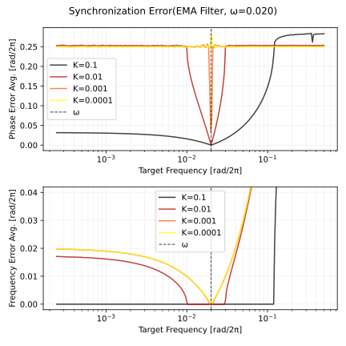
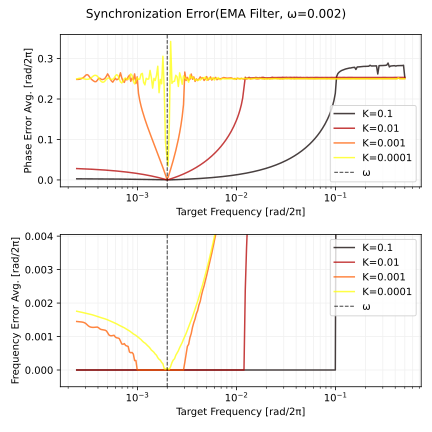
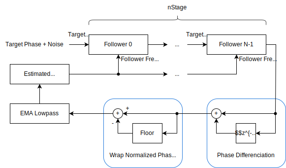
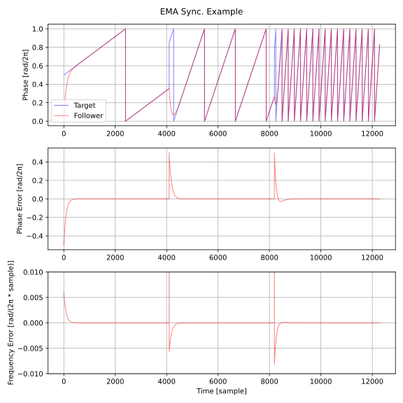
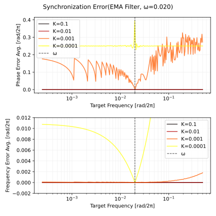
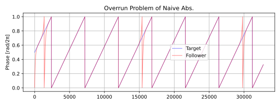
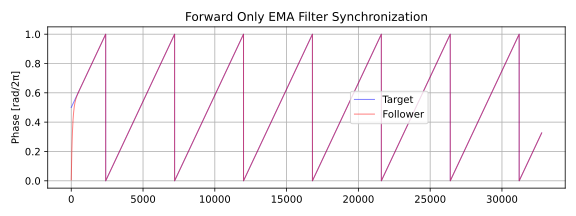

# より手軽な LFO のテンポシンク
「[LFO のテンポシンク](../lfo_temposync/lfo_temposync.html)」で紹介している方法よりも手軽な同期方法を見つけたのでまとめました。問題の詳細については「LFO のテンポシンク」に掲載しています。

以下は Python 3 による実装へのリンクです。

- [filter_notes/lfo_temposync_2/sync.py at master · ryukau/filter_notes · GitHub](https://github.com/ryukau/filter_notes/blob/master/lfo_temposync_2/sync.py)

以降では同期先をターゲット、同期されるオシレータをフォロワーと呼ぶことにします。

ここでは角速度を一致させることを周波数の同期と呼ぶことにします。また、位相の瞬時値を一致させることを位相の同期と呼ぶことにします。角速度とは位相を時間について微分した値です。角速度を $\omega$ 、位相を $\theta$ 、時間を $t$ とすると以下の関係があります。

$$
\omega = \frac{d \theta}{dt}.
$$

つまり周波数の同期とは $\omega = \omega_{\text{target}}$ 、位相の同期とは $\theta = \theta_{\text{target}}$ とすることです。ただし滑らかに遷移したいので、単に値をコピーすることはできません。

## 蔵本モデル
[蔵本モデル](https://en.wikipedia.org/wiki/Kuramoto_model) (Kuramoto model) は周波数の同期を表した数学のモデルです。以下はモデル内のオシレータの周波数の式です。 $N$ 個のオシレータが互いに影響を及ぼしあう形になっています。

$$
\begin{equation}
\frac{d \theta_i}{dt} = \omega_i + \frac{K}{N} \sum_{j=0}^{N-1} \sin(\theta_j - \theta_i).
\label{kuramotoModel}
\end{equation}
$$

- $N$ : オシレータの数。
- $i$ : オシレータのインデックス。範囲は $[0, N)$ 。
- $\theta_i$ : $i$ 番目のオシレータの位相。
- $\omega_i$ : $i$ 番目のオシレータの角速度。
- $K$ : 同期の速さを決める任意の実数。

ここでは 2 つのオシレータしか出てこないので、式 $\ref{kuramotoModel}$ をさらに簡略化できます。以下はフォロワーの位相を更新する簡略化した式です。  $n$ はサンプル数で表された時間です。

$$
\begin{equation}
\theta[n+1] = \theta[n] + \omega + K \sin(\theta_{\text{target}}[n] - \theta[n]).
\label{twoOscSync}
\end{equation}
$$

$K$ を実用的な範囲に制限します。まず、逆向きの同期 ($K < 0$) や過剰な同期 ($|K| > 1$) は行わないので $K \in [0, 1]$ とできます。また $1/N$ は $K$ に含めることで省略でき、オシレータの数は 2 なので $K \in [0, 1/2]$ まで範囲を狭められます。

Python 3 で実装します。

```python
import numpy as np

def syncKuramoto(targetPhase, followerFrequency, initialPhase, syncRate=0.01):
    out = np.zeros_like(targetPhase)
    phase = initialPhase - np.floor(initialPhase)
    freq = followerFrequency
    for i in range(len(targetPhase)):
        phase += freq + syncRate * np.sin(2 * np.pi * (targetPhase[i] - phase))
        phase -= np.floor(phase)
        out[i] = phase
    return out
```

引数の一覧です。記号は式 $\ref{twoOscSync}$ で使われているものです。

- `targetPhase` : $\theta_{\text{target}}$ 。 1 次元配列。
- `followerFrequency` : フォロワーの周波数 $\omega$ 。
- `initialPhase` : フォロワーの初期位相 $\theta[0]$ 。
- `syncRate` : $K$ 。

コードでは周波数の範囲を `[0, 0.5)` に正規化しています。これは Hz で表される周波数をサンプリング周波数で除算した値です。同様に位相の範囲も `[0.0, 1.0)` に正規化しています。

### 誤差の定義
評価のために誤差を定義します。位相の誤差はターゲット位相とフォロワー位相の差です。

実装では位相の範囲を \[0, 1\) に正規化しているので、位相の誤差の範囲は \[-0.5, 0.5\] になります。これは円周 1 の円の上にある 2 つの点の距離は -0.5 から 0.5 の範囲ですべて表せるからです。

```python
def calcPhaseError(target, follower):
    d = follower - target
    d[d < -0.5] += 1
    d[d > 0.5] -= 1
    return d
```

位相の誤差を微分すると周波数の誤差が得られます。 [`numpy.unwrap`](https://numpy.org/doc/stable/reference/generated/numpy.unwrap.html) で位相の巻き戻しを展開して、 [`numpy.diff`](https://numpy.org/doc/stable/reference/generated/numpy.diff.html) で微分を近似しています。

```python
def calcFrequencyError(target, follower):
    return np.diff(np.unwrap(follower - target, period=1))
```

平均を計算しやすくするために `calcPhaseError` と `calcFrequencyError` で位相の巻き戻しの扱いを変えています。誤差の平均は [`numpy.average`](https://numpy.org/doc/stable/reference/generated/numpy.average.html) で計算します。

### パラメータ設定
フォロワーの位相を更新する式を再掲します。

$$
\theta[n+1] = \theta[n] + \omega + K \sin(\theta_{\text{target}}[n] - \theta[n]).
$$

パラメータの一覧です。

- $\omega$ : フォロワーの角速度。
- $K$ : 同期の速さを決める任意の実数。

以下は蔵元モデルによる周波数の同期を示した図です。上から順に、 2 つのオシレータの位相 (phase) 、位相の誤差 (phase error) 、周波数の誤差 (frequency error) です。図を見やすくするために周波数の誤差の y 軸の範囲を狭めているため、スパイクの部分がはみ出ています。サンプリング周波数は 48000 Hz で、ターゲット周波数は前から順に 50, 200, 1000 Hz と変わっています。パラメータは `initialFrequency = 10 / 48000`, `initialPhase = 0`, `syncRate = 0.001` です。ターゲット周波数が 50 Hz と 200 Hz のときは周波数の誤差が 0 へと収束しているので、周波数の同期に成功しています。位相は誤差が 0 ではない値に収束しているため、一定のずれがあり同期できていません。ターゲット周波数が 1000 Hz のときは周波数の同期に失敗しています。

<figure>

</figure>

上の図より、周波数が高くなると同期に失敗することが分かります。そこで、次はどれくらい周波数が高くなると同期に失敗するかを調べました。

以下はフォロワー周波数を $\omega=0.02$ として、ターゲット周波数 $\omega_{\text{target}}$ を変えたときの誤差の平均のプロットです。上のプロットは位相の誤差、下のプロットは周波数の誤差です。同期の速さ $K$ の値を変えて誤差の様子を見ています。位相の誤差は $\omega$ の周りでだけ 0 に近づいています。周波数の誤差も同様に $\omega$ の周りでだけ 0 に近づいていますが、 $K$ が 0.1 と 0.01 のときは誤差がほとんど 0 となる範囲があります。周波数の誤差の平均はターゲット周波数が低くなると $\omega$ に収束するように見えます。

<figure>

</figure>

以下はフォロワー周波数が $ω=0.002$ のときの誤差の図です。 $ω=0.02$ のときと比べると $K$ が 0.001 のときに周波数の誤差がほとんど 0 になる範囲が増えています。

<figure>

</figure>

これ以外にも $\omega$ を変えて試してみたところ、以下のようにパラメータを設定すればいいように思えました。

- まずは $K$ の値を決める。音への応用であれば、ターゲット周波数の変更時にポップノイズが聞こえないような最大の $K$ を耳で選ぶ。
- 同期しなければならないターゲット周波数の範囲に応じて、できる限り低いフォロワー周波数 $\omega$ を決める。

### 周波数の推定
誤差の平均のプロットを見ると、フォロワー周波数がターゲット周波数と一致するときに位相の誤差がほぼ 0 になっています。したがってフォロワー周波数を何らかの形で補正できれば位相の同期もできそうです。

以下はフォロワー位相の差分からターゲット周波数を推定する実装です。出力の `out[i] = phase` を反復部の先頭に置いていることに注意してください。位置を変えると同期が前にずれます。

```python
def syncKuramoto2(targetPhase, initialFrequency, initialPhase, syncRate=0.01):
    out = np.zeros_like(targetPhase)
    phase = initialPhase - np.floor(initialPhase)
    freq = initialFrequency
    for i in range(len(targetPhase)):
        out[i] = phase

        p1 = phase
        phase += freq + syncRate * np.sin(2 * np.pi * (targetPhase[i] - phase))
        phase -= np.floor(phase)

        estimatedFreq = phase - p1
        estimatedFreq -= np.floor(estimatedFreq)
        freq += (1 / 2) * syncRate * (estimatedFreq - freq)
    return out
```

### ノイズに耐える実装
ここまでの実装はターゲット位相にノイズが乗っているとうまく動きません。試行錯誤したところ、同期後の位相を使ってさらに同期を行うことを繰り返せば、いくらかノイズに耐えられるようになることが分かりました。ここでのノイズは正規分布によるホワイトノイズです。

以下はノイズに耐える実装のブロック線図です。 Phase differenciation の部分で位相を周波数に変換しています。

<figure>

</figure>

以下は実装例です。 `nStage = 2` のときターゲット位相とノイズの比が 64 : 1 であれば動作しました。ノイズの割合が増えるごとに `nStage` を増やすといくらかは対応できます。 `syncRate` を小さくするほど低い周波数への同期ができるようになりますが、収束が遅くなります。 `freqSyncRate` の値は適当に決めています。

```python
def syncKuramoto3(targetPhase, initialFrequency, initialPhase, syncRate=0.01, nStage=4):
    freqSyncRate = (1 / 64) * syncRate

    out = np.zeros_like(targetPhase)
    phase = np.full(nStage, initialPhase - np.floor(initialPhase))
    freq = initialFrequency
    resultFreq = np.zeros_like(out)

    def increment(target, phase, freq):
        phase += freq + syncRate * np.sin(2 * np.pi * (target - phase))
        phase -= np.floor(phase)
        return phase

    for i in range(len(targetPhase)):
        out[i] = phase[-1]
        resultFreq[i] = freq

        phase[0] = increment(targetPhase[i], phase[0], freq)
        for j in range(1, nStage - 1):
            phase[j] = increment(phase[j - 1], phase[j], freq)

        p1 = phase[-1]
        phase[-1] = increment(phase[-2], phase[-1], freq)

        estimatedFreq = phase - p1
        estimatedFreq -= np.floor(estimatedFreq)
        freq += freqSyncRate * (estimatedFreq - freq)
    return (out, resultFreq)
```

以下はターゲット位相とノイズの S/N を 2/1 (≈ 6.02 dB) として同期を行ったときの図です。ところどころで周波数が揺れていますが、大枠としてはうまくいっています。ただし `nStage=40` として 40 個のフィルタを直列につないでいます。正規分布によるホワイトノイズの振幅は [68–95–99.7 rule](https://en.wikipedia.org/wiki/68%E2%80%9395%E2%80%9399.7_rule) に基づいて $\sigma = G / 3$ と設定しています。 $G$ はノイズの大まかな最大振幅です。

<figure>

</figure>

## EMA フィルタによる同期
EMA (exponential moving average) フィルタを使って同期します。この手法はターゲット周波数が分かっていないと使えません。以下は同期の大まかな流れを示したブロック線図です。

<figure>

</figure>

周波数の同期は単純に EMA フィルタで滑らかにしているだけです。位相の同期では、 2 つの位相の差の計算 (ブロック線図の Phase Difference) を行ってから EMA フィルタで滑らかにします。

Python 3 で実装します。計算順序が一部でも変わると位相が数サンプル前後することがあるので注意してください。

```python
def syncFilter(targetPhase, targetFreq, initialFreq, initialPhase, syncRate=0.01):
    out = np.zeros_like(targetPhase)
    phase = initialPhase - np.floor(initialPhase)
    delta = initialFreq
    for i in range(len(targetPhase)):
        phase += delta
        phase -= np.floor(phase)

        # 位相の同期。
        d1 = targetPhase[i] - phase
        if d1 < 0:
            d2 = d1 + 1
            phase += syncRate * (d2 if d2 < -d1 else d1)
        else:
            d2 = d1 - 1
            phase += syncRate * (d2 if -d2 < d1 else d1)

        # 周波数の同期。
        delta += syncRate * (targetFreq[i] - delta)

        out[i] = phase
    return out
```

### パラメータ設定
パラメータは EMA フィルタの係数 $K$ だけです。周波数の同期と位相の同期で異なる $K$ を使うこともできますが、調べた範囲では利点はなさそうでした。音に癖をつけたいときは使えるかもしれません。

以下は蔵元モデルによる周波数の同期を示した図です。フォロワーの位相が逆走している個所があります。位相の誤差と周波数の誤差はどちらも時間とともにほとんど 0 に収束しています。

<figure>

</figure>

以下はフォロワーの初期周波数を $\omega[0]=0.02$ として、ターゲット周波数 $\omega_{\text{target}}$ を変えたときの誤差の平均のプロットです。 $K$ が 0.1 と 0.01 のとき、位相の誤差と周波数の誤差はほとんど 0 になっています。

<figure>

</figure>

EMA フィルタによる同期のパラメータ設定は、ターゲット周波数の変更時にポップノイズが聞こえないような $K$ を耳で選ぶだけでよさそうです。

### 逆走の回避
位相の同期で `abs` によって負の値を `phase` に加えないようにすれば逆走を避けられます。以下の実装は「EMA フィルタによる同期」の `syncFilter` の位相の同期の部分を逆走しないようにしたコードです。

```python
d1 = targetPhase[i] - phase
if d1 < 0:
    d2 = d1 + 1
    phase += syncRate * abs(d2 if d2 < -d1 else d1) # 変更点
else:
    d2 = d1 - 1
    phase += syncRate * abs(d2 if -d2 < d1 else d1) # 変更点
```

上の実装で逆走は無くなるのですが、 `phase` が `targetPhase` を追い越したときに、 1 周だけ余計に位相が回ってしまいます。以下は追い越しによる余計な回転を示した図です。

<figure>

</figure>

この問題は少しの追い越しであれば逆走を許すことで緩和できます。以下は実装の一例です。

```python
small = 1 / 2**10
d1 = targetPhase[i] - phase
if d1 < 0:
    d2 = d1 + 1
    diff = d2 if d2 < -d1 else d1
    absed = abs(diff)
    phase += syncRate * (absed if absed >= small else diff)
else:
    d2 = d1 - 1
    diff = d2 if -d2 < d1 else d1
    absed = abs(diff)
    phase += syncRate * (absed if absed >= small else diff)
```

以下は少しの逆走は許す実装による位相の同期を示した図です。

<figure>

</figure>

以下はターゲット周波数を変えたときのプロットです。

<figure>

</figure>

## まとめ
LFO のテンポシンクではターゲットの周波数と位相のどちらも分かっているので EMA フィルタによる同期が適しています。

ターゲット周波数が分からないときは蔵元モデルが使えます。蔵元モデルによる同期は、位相の同期と、高い周波数への同期が苦手です。しかし、周波数の推定を加えることで問題点を解決できます。また、蔵元モデルによる同期を直列に何個も接続することで、ターゲット位相にホワイトノイズが乗ったときでもある程度は同期できます。

## 参考文献
- [Kuramoto model - Wikipedia](https://en.wikipedia.org/wiki/Kuramoto_model)
- [Exponential Moving Average](https://tttapa.github.io/Pages/Mathematics/Systems-and-Control-Theory/Digital-filters/Exponential%20Moving%20Average/Exponential-Moving-Average.html)
- Daniels, Bryan C. "[Synchronization of globally coupled nonlinear oscillators: the rich behavior of the Kuramoto model.](https://www.researchgate.net/profile/Bryan-Daniels-3/publication/251888882_Synchronization_of_Globally_Coupled_Nonlinear_Oscillators_the_Rich_Behavior_of_the_Kuramoto_Model/links/55e2722b08aecb1a7cc83a5b/Synchronization-of-Globally-Coupled-Nonlinear-Oscillators-the-Rich-Behavior-of-the-Kuramoto-Model.pdf)" Ohio Wesleyan Physics Dept., Essay 7, no. 2 (2005): 20.
