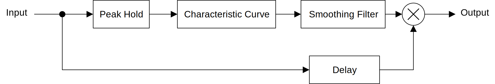
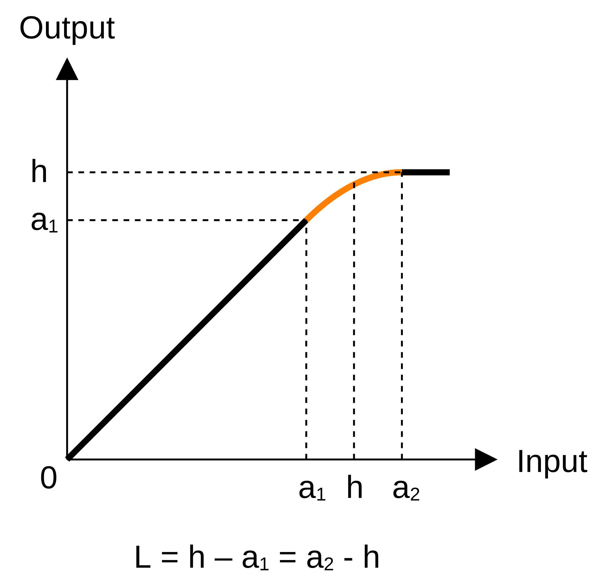
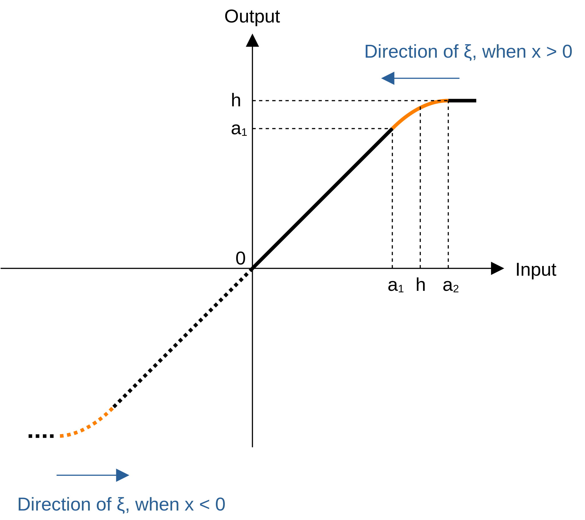

# リミッタの実装
シンセサイザやエフェクタの部品として使えるような簡易なリミッタを作ります。ここで作るリミッタはどんな入力ががあっても、振幅を必ずしきい値以下に制限することを目的とします。

Waves の L1 が発表されてから [25 年以上経っている](https://en.wikipedia.org/wiki/Waves_Audio#History)ので既存の実装と解説が 1 つくらい見つかるだろうと思っていたのですが、 "dynamic range limiter algorithm" でグーグル検索しても 1 次ローパスを使った振幅を完全に制限できない実装ばかり出てきました。そこで既存のプラグインを調べていたところ、 FL 付属の [Fruity Limiter](https://www.image-line.com/fl-studio-learning/fl-studio-online-manual/html/plugins/Fruity%20Limiter.htm) のマニュアルに [musicdsp.org](https://www.musicdsp.org/en/latest/index.html) へのクレジットがありました。この記事で紹介している実装は musicdsp.org の [Lookahead Limiter](https://www.musicdsp.org/en/latest/Effects/274-lookahead-limiter.html) とほとんど同じです。ただし、ピークホールドについては Lookahead Limiter の記事には詳細が書いていなかったので[試行錯誤して作りました](../peak_hold_envelope/peak_hold_envelope.html)。

## ブロック線図
今回実装するリミッタのブロック線図です。

<figure>

</figure>

以下の 4 つの部品が必要です。

- 特性曲線 (Characteristic Curve)
- [ピークホールド](../peak_hold_envelope/peak_hold_envelope.html) (Peak Hold)
- [スムーシングフィルタ](../s_curve_step_response_filter/s_curve_step_response_filter.html) (Smoothing Filter)
- [ディレイ](../delay/delay.html) (Delay)

ピークホールド、スムーシングフィルタ、ディレイについてはリンク先の記事で実装を紹介しています。

特性曲線は振幅についてのリミッタの入出力特性を表した曲線のことです。ここでは計算が簡単なハードクリッピングの特性を使います。入力を $x$ 、リミッタのしきい値を $h$ とすると以下の式でハードクリッピングの特性曲線 $C$ を計算できます。

$$
C(x) = \begin{cases}
  x & \text{if}\ |x| < h \\
  h & \text{otherwise}
\end{cases}
$$

## 実装
C++17 で実装します。

コンパイルには以下のインクルードが必要です。

```c++
#include <algorithm>
#include <cmath>
#include <vector>
```

### 二重移動平均フィルタ
二重移動平均フィルタはステップ応答が S 字になるフィルタです。フィルタ係数が[三角窓](https://en.wikipedia.org/wiki/Window_function#Triangular_window)の形をしています。リミッタは入力信号をエンベロープで AM 変調する部品なので、ステップ応答が S 字であれば変調が目立つときでもサイン波で AM 変調したような音になることを期待しています。

以下の実装は単純な畳み込みよりも出力がやや大きくなることがあります。

`Delay` の実装は「[ピークホールドによるエンベロープ](../peak_hold_envelope/peak_hold_envelope.html)」を参照してください。

```c++
template<typename Sample> struct DoubleAverageFilter {
  Sample sum1 = 0;
  Sample sum2 = 0;
  Sample buf = 0; // 出力が 1 サンプル前にずれるのを補正するディレイのバッファ。
  size_t halfDelayFrames = 0;
  Delay<Sample> delay1;
  Delay<Sample> delay2;

  void resize(size_t size)
  {
    delay1.resize(size / 2);
    delay2.resize(size / 2);
  }

  void reset()
  {
    sum1 = 0;
    sum2 = 0;
    buf = 0;
    delay1.reset();
    delay2.reset();
  }

  void setFrames(size_t frames)
  {
    halfDelayFrames = frames / 2;
    delay1.setFrames(halfDelayFrames);
    delay2.setFrames(halfDelayFrames);
  }

  Sample process(const Sample input)
  {
    sum1 += buf - delay1.process(buf);
    auto out1 = sum1 / halfDelayFrames;

    sum2 += out1 - delay2.process(out1);
    auto out2 = sum2 / halfDelayFrames;

    buf = input;
    return out2;
  }
};
```

### リミッタの実装
リミッタの実装です。 `Delay` と `PeakHold` の実装は「[ピークホールドによるエンベロープ](../peak_hold_envelope/peak_hold_envelope.html)」を参照してください。

```c++
template<typename Sample> struct Limiter {
  static constexpr Sample fixedGain = Sample(0.9965520801347684); // -0.03dB.
  static constexpr Sample releaseConstant = Sample(1e-5); // 適当な小さい値。

  Sample threshold = Sample(0.1);
  Sample gain = Sample(1);
  Sample release = 0; // 指数関数的増加のためのリリース係数。
  size_t attackFrames = 0;

  PeakHold<Sample> hold;
  DoubleAverageFilter<Sample> smoother;
  Delay<Sample> lookaheadDelay;

  size_t latency() { return attackFrames; }

  void resize(size_t size)
  {
    size += size % 2;
    hold.resize(size);
    smoother.resize(size);
    lookaheadDelay.resize(size);
  }

  void reset()
  {
    gain = Sample(1);
    hold.reset();
    smoother.reset();
    lookaheadDelay.reset();
  }

  void prepare(
    Sample sampleRate,
    Sample attackSeconds,
    Sample sustainSeconds,
    Sample releaseSeconds,
    Sample threshold)
  {
    auto prevAttack = attackFrames;
    attackFrames = size_t(sampleRate * attackSeconds);
    attackFrames += attackFrames % 2; // DoubleAverageFilter のために 2 の倍数にする。
    if (prevAttack != attackFrames) reset();

    release
      = std::pow(Sample(1 / releaseConstant), Sample(1 / (releaseSeconds * sampleRate)));

    this->threshold = threshold;

    hold.setFrames(attackFrames + size_t(sampleRate * sustainSeconds));
    smoother.setFrames(attackFrames);
    lookaheadDelay.setFrames(attackFrames);
  }

  inline Sample applyCharacteristicCurve(Sample x0)
  {
    return x0 > threshold ? threshold / x0 : Sample(1);
  }

  inline Sample softClip(Sample x0, Sample ratio)
  {
    const auto absed = std::fabs(x0);

    const auto a1 = threshold * ratio;
    if (absed <= a1) return x0;

    const auto a2 = 2 * threshold - a1;
    if (absed >= a2) return threshold;

    return std::copysign(
      threshold + (a2 - absed) * (a2 - absed) * Sample(0.25) / (a1 - threshold), x0);
  }

  Sample process(const Sample input)
  {
    auto holdGain = hold.process(std::fabs(input));
    auto candidate = applyCharacteristicCurve(holdGain);
    gain = std::min(gain * release, candidate);

    auto smoothed = smoother.process(gain);
    auto delayed = lookaheadDelay.process(input);
    return softClip(smoothed * delayed, fixedGain);
  }
};

#include <iomanip>
#include <iostream>
#include <limits>
#include <random>

int main() {
  constexpr size_t sampleRate = 48000;
  constexpr float maxPeak = 10.0f;

  // テスト信号の生成。
  std::random_device rd;
  std::mt19937_64 rng(rd());
  std::uniform_real_distribution<float> dist(-maxPeak, maxPeak);

  std::vector<float> input(sampleRate);
  for (size_t i = 0; i < input.size(); ++i) input[i] = dist(rng);

  // Limiter の使用例。
  Limiter<float> limiter;
  limiter.resize(65536);
  limiter.prepare(sampleRate, 0.002f, 0.002f, 0.1f, 0.5f);

  std::vector<float> output(input.size());
  for (size_t i = 0; i < input.size(); ++i) output[i] = limiter.process(input[i]);

  // 出力がしきい値以下に制限されているか確認。
  float max = 0;
  for (const auto &value : output) {
    auto absed = std::fabs(value);
    if (absed > limiter.threshold && absed > max) max = absed;
  }

  if (max == 0) {
    std::cout << "Limiting succeeded.\n";
  } else {
    std::cout << "Limiting failed.\n"
              << std::setprecision(std::numeric_limits<float>::digits10 + 1)
              << "threshold: " << limiter.threshold << "\n"
              << "max      : " << max << "\n";
  }
}
```

#### アタック時間の変更
`prepare` について見ていきます。

今回の実装ではアタック時間を変更すると一時的に振幅の制限が保証されなくなります。これはピークホールドが前から順にすべてのサンプルを入力しないと正しく動作しないことが原因です。そこで以下のコードのようにアタック時間が変更されたときはディレイのバッファをいったんリセットしています。リセットによってポップノイズが出てしまいますが、フィードバック経路で使うような場面ではリミッタのしきい値を超える振幅が出力されるよりは安全だと判断しています。

```c++
auto prevAttack = attackFrames;
attackFrames = size_t(sampleRate * attackSeconds);
attackFrames += attackFrames % 2;
if (prevAttack != attackFrames) reset();
```

#### リリース時間の設定
以下では `releaseSeconds` 秒後に `releaseConstant` から 1 に到達するような係数を設定しています。

```c++
release
  = std::pow(Sample(1 / releaseConstant), Sample(1 / (releaseSeconds * sampleRate)));
```

今回の実装では適当に `releaseConstant = 1e-5` としています。 `releaseConstant` は 0 に近い小さな値ならなんでもいいですが、小さくするとそれだけリリースが長くなります。

`release` を $R$ 、 `releaseConstant` を $C$ 、 `releaseSeconds * sampleRate` を $t$ と置くと以下の関係があります。

$$
1 = C R^t
$$

$R$ について解くと上のコードの計算式になります。

$$
R = \left( \frac{1}{C} \right)^{1/t}
$$

#### サステイン
ホールド時間だけを長くすることでサステインを加えられます。

```c++
hold.setFrames(attackFrames + size_t(sampleRate * sustainSeconds));
smoother.setFrames(attackFrames);
lookaheadDelay.setFrames(attackFrames);
```

#### 特性曲線とゲインの計算
`process` について見ていきます。

リミッタでは音量を下げたいので、特性曲線を計算するついでに入力の絶対値の逆数 `threshold / x0` を計算してゲインとしています。 `threshold` を 0 より大きい値に制限すれば 0 除算も防げます。 `applyCharacteristicCurve` の出力は必ず `[0, 1]` の範囲に収まります。

```c++
inline Sample applyCharacteristicCurve(Sample x0)
{
  return x0 > threshold ? threshold / x0 : Sample(1);
}

Sample process(const Sample input)
{
  // ...
  auto candidate = applyCharacteristicCurve(holdGain);
  // ...
}
```

#### リリースの計算
リリースの計算は先に計算した係数 `release` を毎サンプル掛け合わせるだけです。リリース中に大きなピークが入力されたときは `std::min` によってリリースが中断されます。 `gain` と `candidate` は入力が大きいほど 0 に近づきます。

```c++
gain = std::min(gain * release, candidate);
```

#### ソフトクリップ
上で紹介した `DoubleAverageFilter` は浮動小数点数の計算誤差によって単純な畳み込みよりも出力がやや大きくなります。ほとんど無視できる程度の誤差なのですが、リミッタではしきい値を超える振幅を出力してしまう問題の原因になります。しきい値を超える量については、今回使ったテスト音源だと例えばしきい値 1 に対して振幅 1.001 が出力されるといった具合でした。この問題の解決法として以下の 2 つの方法が考えられます。

- `threshold` を指定された値から少し下げる。
- 出力をクリッピングする。

今回は出力の最大振幅が間違いなくしきい値と一致するクリッピングを使いました。 `threshold` を下げる方法は、入力信号や `threshold` の下げ幅によって誤差が変わるという面倒な特性があるので、どれだけ下げればいいのかがよくわからなかったです。

今回は以下のソフトクリップ曲線を使いました。

<figure>

</figure>

以下は適当に作ったソフトクリップ曲線 $S$ の計算式です。上の図のオレンジの部分では 2 次曲線を使っていますが、[単調](https://en.wikipedia.org/wiki/Monotonic_function)かつ傾きが一致するように繋がれば何でもいいです。 $\mathrm{sgn}$ は[符号関数](https://en.wikipedia.org/wiki/Sign_function)です。

$$
\begin{aligned}
S(x) &= \begin{cases}
  x & \text{if}\ |x| < a_1
    && \text{(linear region)}\\
  h + \mathrm{sgn}(x) \dfrac{0.25 (a_2 - |x|)^2}{a_1 - h}  & \text{if}\ a_1 \leq|x| < a_2
    && \text{(2nd order region)}\\
  h & \text{if}\ a_2 \leq |x|
    && \text{(clipping region)}\\
\end{cases}
\\
a_1 &= rh\\
a_2 &= 2h - a_1
\end{aligned}
$$

変数の一覧です。

- $x$: 入力信号
- $h$: リミッタのしきい値
- $r$: しきい値以下の非線形領域の割合。

2 次曲線領域 (2nd order region) が前後と滑らかにつながることを確認します。まず $L = h - a_1 = a_2 - h$ と置きます。つまり 2 次曲線領域は入力に対して $2L$ 、出力に対して $L$ の幅を持っています。

$\xi = a_2 - |x|$ とすると、曲線 $S$ の 2 次曲線領域の式 $S_2$ は以下のように書き換えられます。

$$
S_2(x) = h - \mathrm{sgn}(x) \frac{0.25}{L} \xi^2
$$

$\xi$ について微分します。

$$
\frac{d S_2}{d \xi} = - \mathrm{sgn}(x) \frac{0.5}{L} \xi
$$

- $|x| = a_1$ のとき $\xi = a_2 - a_1 = 2L$ なので、傾きは $-\mathrm{sgn}(x)$ 。
- $|x| = a_2$ のとき $\xi = 0$ なので、傾きは 0 。

$-\mathrm{sgn}(x)$ は $x$ の符号が - のときに 1 、 + のときに -1 になります。上の曲線の図で言うと $x$ が負のときは左から右、 $x$ が正のときは右から左に向かって $\xi$ が増えるので線形領域と傾きが一致します。

<figure>

</figure>


以下はリミッタの実装から抜粋したソフトクリッピングのコードです。

```c++
inline Sample softClip(Sample x0, Sample ratio)
{
  const auto absed = std::fabs(x0);

  const auto a1 = threshold * ratio;
  if (absed <= a1) return x0;

  const auto a2 = 2 * threshold - a1;
  if (absed >= a2) return threshold;

  return std::copysign(
    threshold + (a2 - absed) * (a2 - absed) * Sample(0.25) / (a1 - threshold), x0);
}

Sample process(const Sample input)
{
  // ...
  return softClip(smoothed * delayed, fixedGain);
}
```

## その他
### Lookahead Limiter の記事の訳
musicdsp.org の Lookahead Limiter の記事の訳を別ページに掲載しています。

- [Lookahead Limiter の記事の訳を読む (github.io)](./musicdsp_lookahead_limiter.html)

### 継時マスキング
[継時マスキング](https://ja.wikipedia.org/wiki/%E7%B5%8C%E6%99%82%E3%83%9E%E3%82%B9%E3%82%AD%E3%83%B3%E3%82%B0) ([temporal masking](https://en.wikipedia.org/wiki/Auditory_masking#Temporal_masking)) は、突然大きな音がしたときは前後にある小さな音が聞こえにくくなるという人間の聴覚の性質です。リミッタはピークの前後をエンベロープで歪ませて振幅を制限します。ピークの前後は継時マスキングによってもともと聞こえていないので、歪ませても違和感が少ないと考えることができます。

継時マスキングは、[突然の大きい音の前では 20 ms 以下、後では 200 ms 以下の長さにわたって起こる](https://ccrma.stanford.edu/~bosse/proj/node21.html)そうです。よってリミッタを耳で評価するときはアタック時間を 20 ms 以下、リリース時間を 200 ms 以下に設定してドラムなどの音を入力したときに違和感を感じないことが一つの目安になります。アタックが遅い音は継時マスキングの条件から外れるので、より長いアタック時間やリリース時間が使えるかもしれません。

### MATLAB のリミッタ
既存のリミッタの実装を探していた時に MATLAB のリミッタを見つけました。下のほうにアルゴリズムが載っています。

- [Dynamic range limiter - MATLAB](https://www.mathworks.com/help/audio/ref/limiter-system-object.html)

実装して試してみたのですが入力信号によっては振幅がしきい値を超えるケースがありました。フィルタ出力がピーク振幅に到達するまでピークホールドを行っておらず、また入力にディレイをかけてピークを合わせてもいません。スムーシングには 1 次ローパス (exponential moving average フィルタ) が使われています。

多少なら振幅の制限に失敗しても問題が無いときは使えるかもしれません。

## 参考文献
- [Lookahead Limiter — Musicdsp.org documentation](https://www.musicdsp.org/en/latest/Effects/274-lookahead-limiter.html)
- [how to make a DIGITAL LIMITER](http://iem.at/~zmoelnig/publications/limiter/)
- [Dynamic range limiter - MATLAB](https://www.mathworks.com/help/audio/ref/limiter-system-object.html)

## 参考にしたプラグイン
- [yohng.com · W1 Limiter](http://www.yohng.com/software/w1limit.html)
- [Fruity Limiter - Effect Plugin](https://www.image-line.com/fl-studio-learning/fl-studio-online-manual/html/plugins/Fruity%20Limiter.htm)
