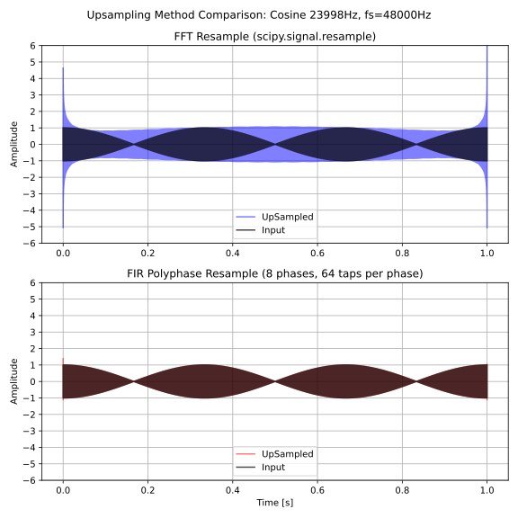
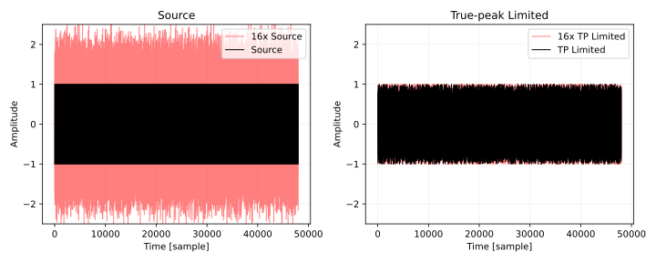
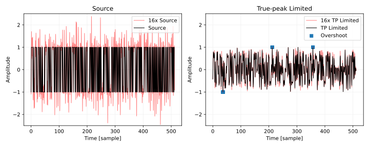
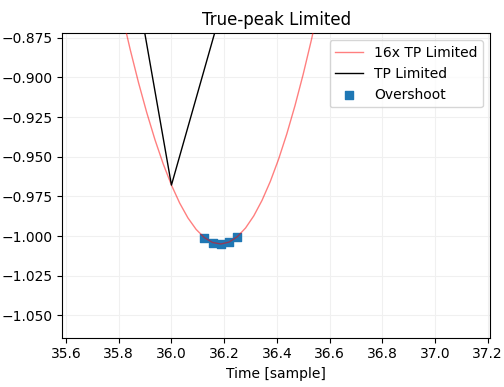
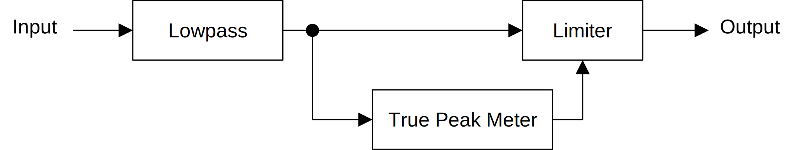
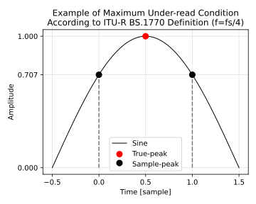
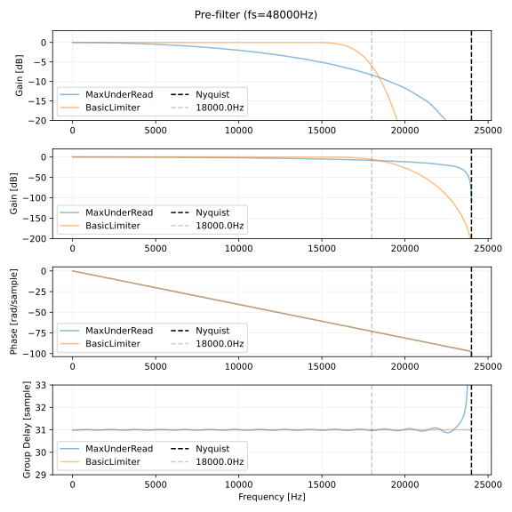

# リミッタの実装
シンセサイザやエフェクタの部品として使えるような簡易なリミッタを作ります。ここで作るリミッタはどんな入力があっても、振幅を必ずしきい値以下に制限することを目的とします。

Waves の L1 が発表されてから [25 年以上経っている](https://en.wikipedia.org/wiki/Waves_Audio#History)ので既存の実装と解説が 1 つくらい見つかるだろうと思っていたのですが、 "dynamic range limiter algorithm" でグーグル検索しても 1 次ローパスを使った振幅を完全に制限できない実装ばかり出てきました。そこで既存のプラグインを調べていたところ、 FL 付属の [Fruity Limiter](https://www.image-line.com/fl-studio-learning/fl-studio-online-manual/html/plugins/Fruity%20Limiter.htm) のマニュアルに [musicdsp.org](https://www.musicdsp.org/en/latest/index.html) へのクレジットがありました。この記事で紹介している実装は musicdsp.org の [Lookahead Limiter](https://www.musicdsp.org/en/latest/Effects/274-lookahead-limiter.html) とほとんど同じです。ただし、ピークホールドについては Lookahead Limiter の記事には詳細が書いていなかったので[試行錯誤して作りました](../peak_hold_envelope/peak_hold_envelope.html)。

Lookahead Limiter の記事の訳を別ページに掲載しています。

- [Lookahead Limiter の記事の訳を読む (github.io)](./musicdsp_lookahead_limiter.html)

以下は実際に動作する実装へのリンクです。

- C++ による実装: [VSTPlugins/BasicLimiterAutoMake/source/dsp/limiter.hpp at master · ryukau/VSTPlugins · GitHub](https://github.com/ryukau/VSTPlugins/blob/master/BasicLimiterAutoMake/source/dsp/limiter.hpp#L339)
- JavaScript による実装: [UhhyouWebSynthesizers/common/dsp/limiter.js at main · ryukau/UhhyouWebSynthesizers · GitHub](https://github.com/ryukau/UhhyouWebSynthesizers/blob/main/common/dsp/limiter.js)

## ブロック線図
今回実装するリミッタのブロック線図です。

<figure>

</figure>

以下の 4 つの部品が必要です。詳細はリンク先を参照してください。特性曲線については下で簡単に紹介します。

- [ピークホールド](../peak_hold_envelope/peak_hold_envelope.html) (Peak Hold)
- 特性曲線 (Characteristic Curve)
- [スムーシングフィルタ](../s_curve_step_response_filter/s_curve_step_response_filter.html) (Smoothing Filter)
- [ディレイ](../delay/delay.html) (Delay)

### 特性曲線
特性曲線は直流を一定時間入力したときの出力をプロットした曲線です。ここでは計算が簡単なハードクリップの特性を使います。入力を $x$ 、リミッタのしきい値を $T$ とすると以下の式でハードクリップの特性曲線 $C$ を計算できます。

$$
C(x) = \begin{cases}
  x & \text{if}\ |x| < T \\
  T & \text{if}\ |x| \geq T
\end{cases}
$$

実装では $x \to |x|$ と置き換えて、 $C$ を $|x|$ で除算すればゲインへの変換もまとめてしまえるので、以下のように書けます。

$$
G(x) = \begin{cases}
  1 & \text{if}\ |x| < T \\
  T / |x| & \text{if}\ |x| \geq T
\end{cases}
$$

上の式について $|x| \geq T$ のときに $\dfrac{R^{-1}(|x| - T) + T}{|x|}$ とすれば、レシオ $R$ のコンプレッサになります。

振幅の制限だけが目的であれば $|x| < T$ のときに $T$ を超える値さえ出てこなければ、どんな曲線でも使えます。例えば味付けとして、以下のように歪みを加えた曲線が考えられます。 $\epsilon$ はマシンイプシロンです。

$$
\begin{aligned}
G_{\tanh}(x) &= \begin{cases}
  1 & \text{if}\ |x| < \epsilon && \quad \text{(to avoid division by 0)}\\\\
  \dfrac{\tanh(|x|)}{|x|} & \text{if}\ \epsilon \leq |x| < T \\\\
  \tanh(T) & \text{if}\ |x| \geq T
\end{cases}
\end{aligned}
$$

#### ソフトクリップ
この節で出てくる式とコードはゲインへの変換を行っていないので注意してください。ゲインへと変換するには $x \to |x|$ と置き換えて、 $|x|$ で除算してください。

以下のソフトクリップ曲線を紹介します。

<figure>

</figure>

以下はソフトクリップ曲線 $S$ の計算式です。上の図のオレンジの部分では 2 次曲線を使っています。[単調](https://en.wikipedia.org/wiki/Monotonic_function)かつ、両端で傾きが一致するように繋がればどんな曲線でも使えます。 $\mathrm{sgn}$ は[符号関数](https://en.wikipedia.org/wiki/Sign_function)です。

$$
\begin{aligned}
S(x) &= \begin{cases}
  x & \text{if}\ |x| < a_1
    && \text{(linear region)}\\
  h + \mathrm{sgn}(x) \dfrac{0.25 (a_2 - |x|)^2}{a_1 - h}  & \text{if}\ a_1 \leq|x| < a_2
    && \text{(2nd order region)}\\
  h & \text{if}\ a_2 \leq |x|
    && \text{(clipping region)}\\
\end{cases}
\\
a_1 &= rh\\
a_2 &= 2h - a_1
\end{aligned}
$$

変数の一覧です。

- $x$: 入力信号
- $h$: リミッタのしきい値
- $r$: しきい値以下の非線形領域の割合。

2 次曲線領域 (2nd order region) の両端の傾きが、前後の領域の傾きと一致することを確認します。まず $L = h - a_1 = a_2 - h$ と置きます。このとき 2 次曲線領域は入力に対して $a_1 \text{--} a_2$ 間で $2L$ 、出力に対して $a_1 \text{--} h$ 間で $L$ の幅を持っています。

$\xi = a_2 - |x|$ とすると、曲線 $S$ の 2 次曲線領域の式 $S_2$ は以下のように変形できます。

$$
S_2(x) = h - \mathrm{sgn}(x) \frac{0.25}{L} \xi^2
$$

$\xi$ について微分します。

$$
\frac{d S_2}{d \xi} = - \mathrm{sgn}(x) \frac{0.5}{L} \xi
$$

- $|x| = a_1$ のとき $\xi = a_2 - a_1 = 2L$ なので、傾きは $-\mathrm{sgn}(x)$ 。
- $|x| = a_2$ のとき $\xi = 0$ なので、傾きは 0 。

$-\mathrm{sgn}(x)$ は $x$ の符号が - のときに 1 、 + のときに -1 になります。下の図で言うと $x$ が負のときは左から右、 $x$ が正のときは右から左に向かって $\xi$ が増えるので線形領域と傾きが一致します。

<figure>

</figure>


以下はソフトクリッピングのコードです。

```c++
template<typename T> inline T softClip(T x0, T ratio)
{
  const auto absed = std::fabs(x0);

  const auto a1 = threshold * ratio;
  if (absed <= a1) return x0;

  const auto a2 = 2 * threshold - a1;
  if (absed >= a2) return threshold;

  return std::copysign(
    threshold + (a2 - absed) * (a2 - absed) / T(4) / (a1 - threshold), x0);
}
```

## 実装
C++17 で実装します。コンパイルして実行できる完全なコードを以下のリンクに掲載しています。

- [完全なリミッタの実装を読む (github.com)](https://github.com/ryukau/filter_notes/blob/master/limiter/cpp/example/example.cpp)

VST 3 プラグインとしての実装した BasicLimiter のコードも以下から読むことができます。トゥルーピークモードもついています。

- [BasicLimiter の実装を読む (github.com)](https://github.com/ryukau/VSTPlugins/tree/master/BasicLimiter/source/dsp)

アタックとサステインの時間を固定することで `std::array` を使ってメモリ使用量を減らした実装を以下のリンクに掲載しています。この実装はシンセサイザやエフェクタの内部に組み込んで使うことを想定しています。ベンチマークをとってみないとわかりませんが、スムーシング用の FIR フィルタはバッファ長を 64 から 256 サンプル程度で固定した二重移動平均フィルタを使うほうが速いかもしれません。

- [メモリ使用量を減らしたリミッタの実装を読む (github.com)](https://github.com/ryukau/VSTPlugins/blob/master/common/dsp/lightlimiter.hpp)

この記事で掲載しているコードは以下のインクルードを省略しています。

```c++
#include <algorithm>
#include <cmath>
#include <limits>
#include <vector>
```

### 二重移動平均フィルタ
二重移動平均フィルタは[ステップ応答が S 字になるフィルタ](../s_curve_step_response_filter/s_curve_step_response_filter.html)です。フィルタ係数が[三角窓](https://en.wikipedia.org/wiki/Window_function#Triangular_window)の形をしています。

以下の実装は単純な畳み込みよりも出力がやや大きくなることがあります。

`IntDelay` の実装は「[ピークホールドによるエンベロープ](../peak_hold_envelope/peak_hold_envelope.html)」に掲載しています。

```c++
template<typename Sample> class DoubleAverageFilter {
private:
  Sample denom = Sample(1);
  Sample sum1 = 0;
  Sample sum2 = 0;
  Sample buf = 0; // 出力が 1 サンプル前にずれるのを補正するディレイのバッファ。
  IntDelay<Sample> delay1;
  IntDelay<Sample> delay2;

public:
  void resize(size_t size)
  {
    delay1.resize(size / 2 + 1);
    delay2.resize(size / 2);
  }

  void reset()
  {
    sum1 = 0;
    sum2 = 0;
    buf = 0;
    delay1.reset();
    delay2.reset();
  }

  void setFrames(size_t frames)
  {
    auto half = frames / 2;
    denom = 1 / Sample((half + 1) * half);
    delay1.setFrames(half + 1);
    delay2.setFrames(half);
  }

  // 浮動小数点数の丸めが 0 に向かうように変更した加算。
  // 環境によっては C++ 標準ライブラリ <cfenv> の std::fesetround で楽に実装できる。
  inline Sample add(Sample lhs, Sample rhs)
  {
    if (lhs < rhs) std::swap(lhs, rhs);
    int expL;
    std::frexp(lhs, &expL);
    auto cut = std::ldexp(float(1), expL - std::numeric_limits<Sample>::digits);
    auto rounded = rhs - std::fmod(rhs, cut);
    return lhs + rounded;
  }

  // `input` の範囲は [0, 1] 。
  Sample process(Sample input)
  {
    input *= denom; // 一括して入力の大きさを整えることで誤差が減る。

    sum1 = add(sum1, input);
    Sample d1 = delay1.process(input);
    sum1 = std::max(Sample(0), sum1 - d1);

    sum2 = add(sum2, sum1);
    Sample d2 = delay2.process(sum1);
    sum2 = std::max(Sample(0), sum2 - d2);

    auto output = buf;
    buf = sum2;
    return output;
  }
};
```

### リリース用のフィルタ
以下はリリース用のフィルタの実装例です。 Exponential moving average (EMA) フィルタを 2 つ直列につないでいます。

```c++
template<typename Sample> class DoubleEMAFilter {
private:
  Sample kp = Sample(1);
  Sample v1 = 0;
  Sample v2 = 0;

public:
  void reset(Sample value = 0)
  {
    v1 = value;
    v2 = value;
  }

  void setMin(Sample value)
  {
    v1 = std::min(v1, value);
    v2 = std::min(v2, value);
  }

  void setCutoff(Sample sampleRate, Sample cutoffHz)
  {
    if (cutoffHz >= sampleRate / Sample(2)) {
      kp = Sample(1);
      return;
    }

    // 誤差を減らすために double を使用。
    double omega_c = double(twopi) * cutoffHz / sampleRate;
    double y = double(1) - std::cos(omega_c);
    kp = float(-y + std::sqrt((y + Sample(2)) * y));
  }

  Sample process(Sample input)
  {
    auto v0 = input;
    v1 += kp * (v0 - v1);
    v2 += kp * (v1 - v2);
    return v2;
  }
};
```

### リミッタの実装
リミッタの実装です。アタック、リリース、サステインの時間を設定できます。アタックと呼んでいるのは二重移動平均フィルタによる遅延なので、実際はリリースにも影響します。リリース時間はどれだけゲインを下げたかで変わるので、あくまでも目安です。

`Delay` と `PeakHold` の実装は「[ピークホールドによるエンベロープ](../peak_hold_envelope/peak_hold_envelope.html)」に掲載しています。

```c++
template<typename Sample> class Limiter {
public: // デバッグ用にすべて public 。
  size_t attackFrames = 0;
  size_t sustainFrames = 0;
  Sample thresholdAmp = Sample(1); // thresholdAmp > 0.
  Sample gateAmp = 0;              // gateAmp >= 0.

  PeakHold<Sample> peakhold;
  DoubleAverageFilter<double> smoother;
  DoubleEMAFilter<Sample> releaseFilter;
  IntDelay<Sample> lookaheadDelay;

  size_t latency(size_t upfold) { return attackFrames / upfold; }

  void resize(size_t size)
  {
    size += size % 2;

    // アタックの最大値とサステインの最大値がどちらも同じという仕様にして `2 * size` 。
    // 異なるときは `(アタックの最大値) + (サステインの最大値)` が必要。
    peakhold.resize(2 * size);

    smoother.resize(size);
    lookaheadDelay.resize(size);
  }

  void reset()
  {
    peakhold.reset();
    smoother.reset();
    releaseFilter.reset();
    lookaheadDelay.reset();
  }

  void prepare(
    Sample sampleRate,
    Sample attackSeconds,
    Sample sustainSeconds,
    Sample releaseSeconds,
    Sample thresholdAmplitude,
    Sample gateAmplitude)
  {
    auto prevAttack = attackFrames;
    attackFrames = size_t(sampleRate * attackSeconds);
    attackFrames += attackFrames % 2; // DoubleAverageFilter は 2 の倍数が必要。

    auto prevSustain = sustainFrames;
    sustainFrames = size_t(sampleRate * sustainSeconds);

    if (prevAttack != attackFrames || prevSustain != sustainFrames) reset();

    releaseFilter.setCutoff(sampleRate, Sample(1) / releaseSeconds);

    thresholdAmp = thresholdAmplitude;
    gateAmp = gateAmplitude;

    peakhold.setFrames(attackFrames + sustainFrames);
    smoother.setFrames(attackFrames);
    lookaheadDelay.setFrames(attackFrames);
  }

  inline Sample applyCharacteristicCurve(Sample peakAmp)
  {
    return peakAmp > thresholdAmp ? thresholdAmp / peakAmp : Sample(1);
  }

  inline Sample processRelease(Sample gain)
  {
    releaseFilter.setMin(gain);
    return releaseFilter.process(gain);
  }

  // ステレオリンクを調整できるように入力の絶対値を `inAbs` として分離。
  Sample process(const Sample input, Sample inAbs)
  {
    auto peakAmp = peakhold.process(inAbs);
    auto candidate = applyCharacteristicCurve(peakAmp);
    auto released = processRelease(candidate);
    auto gainAmp = std::min(released, candidate);
    auto targetAmp = peakAmp <= gateAmp ? 0 : gainAmp;
    auto smoothed = smoother.process(targetAmp);
    auto delayed = lookaheadDelay.process(input);
    return smoothed * delayed;
  }
};

#include <iomanip>
#include <iostream>
#include <random>

int main() {
  constexpr size_t sampleRate = 48000;
  constexpr float maxPeak = 10.0f;

  // テスト信号の生成。
  std::random_device rd;
  std::mt19937_64 rng(rd());
  std::uniform_real_distribution<float> dist(-maxPeak, maxPeak);

  std::vector<float> input(sampleRate);
  for (size_t i = 0; i < input.size(); ++i) input[i] = dist(rng);

  // Limiter の使用例。
  Limiter<float> limiter;
  limiter.resize(65536);
  limiter.prepare(sampleRate, 0.002f, 0.002f, 0.1f, 0.5f, 0.0f);

  std::vector<float> output(input.size());
  for (size_t i = 0; i < input.size(); ++i) {
    output[i] = limiter.process(input[i], std::fabs(input[i]));
  }

  // 出力がしきい値以下に制限されているか確認。
  float max = 0;
  for (const auto &value : output) {
    auto absed = std::fabs(value);
    if (absed > limiter.thresholdAmp && absed > max) max = absed;
  }

  if (max == 0) {
    std::cout << "Limiting succeeded.\n";
  } else {
    std::cout << "Limiting failed.\n"
              << std::setprecision(std::numeric_limits<float>::digits10 + 1)
              << "threshold: " << limiter.thresholdAmp << "\n"
              << "max      : " << max << "\n";
  }
}
```

#### アタック時間の変更
`prepare` について見ていきます。

今回の実装では、ピークホールドに前から順にすべてのサンプルを入力しないと、リミッタが正しく動作しません。そこでアタック時間あるいはサステイン時間が変更されたときは、以下のコードのようにバッファをいったんリセットしています。リセットによってポップノイズが出てしまいますが、フィードバック経路で使うような場面ではリミッタのしきい値を超える振幅が出力されるよりは安全だと判断しています。

```c++
auto prevAttack = attackFrames;
attackFrames = size_t(sampleRate * attackSeconds);
attackFrames += attackFrames % 2;

auto prevSustain = sustainFrames;
sustainFrames = size_t(sampleRate * sustainSeconds);

if (prevAttack != attackFrames || prevSustain != sustainFrames) reset();
```

#### サステイン時間の設定
ホールド時間だけを長くすることでサステインを加えられます。

```c++
hold.setFrames(attackFrames + size_t(sampleRate * sustainSeconds));
smoother.setFrames(attackFrames);
lookaheadDelay.setFrames(attackFrames);
```

#### 特性曲線とゲインの計算
`process` について見ていきます。

リミッタでは音量を下げたいので、特性曲線を計算するついでに入力の絶対値の逆数 `thresholdAmp / x0` を計算してゲインとしています。 `thresholdAmp` を 0 より大きい値に制限すれば 0 除算も防げます。リミッタでは `applyCharacteristicCurve` の出力は必ず `[0, 1]` の範囲に収まります。

```c++
inline Sample applyCharacteristicCurve(Sample peakAmp)
{
  return peakAmp > thresholdAmp ? thresholdAmp / peakAmp : Sample(1);
}

Sample process(const Sample input, Sample inAbs)
{
  // ...
  auto candidate = applyCharacteristicCurve(peakAmp);
  // ...
}
```

#### リリースの計算
リリース中に大きなピークが入力されたときはゲインが下がるので `std::min` によってリリースが中断されます。言い換えると `processRelease` の引数 `gain` は入力信号の絶対値が大きいほど 0 に近づきます。

`v1` と `v2` は EMA フィルタの出力値かつ状態変数です。

```c++

template<typename Sample> class DoubleEMAFilter {
  // ...

  void setMin(Sample value)
  {
    v1 = std::min(v1, value);
    v2 = std::min(v2, value);
  }

  // ...
};

inline Sample processRelease(Sample gain)
{
  releaseFilter.setMin(gain);
  return releaseFilter.process(gain);
}
```

## トゥルーピークモード
トゥルーピークを考慮したリミッタを作るときは以下のようなマルチレート処理が必要です。 `upfold` はオーバーサンプリングの倍率です。

```c++
float sig = preLowpass(input); // プリフィルタ。
std::array<float, upfold> upsampled = upsample(sig);
for (size_t i = 0; i < upsampled.size(); ++i>) {
  upsampled[i] = limiter.process(upsampled[i]);
}
float output = downsample(upsampled);
```

以下は同じ処理のブロック線図です。

<figure>

</figure>

リアルタイム処理で使えるアップサンプリングの手法はナイキスト周波数付近の成分によるピークの復元に限界があります。そこでアップサンプリングの前にプリフィルタを通して、ピークの復元が困難な周波数成分を 0 にしてしまうことが考えられます。ピークの復元が困難な周波数成分は、サンプリング周波数が十分に高ければ可聴域外になるので 0 にしても聴覚上の影響は少ないと考えられます。

ダウンサンプリングには [FIR ポリフェイズフィルタ](https://ryukau.github.io/filter_notes/downsampling/downsampling.html#noble-identities-とポリフェイズフィルタ)を使います。 IIR フィルタを使うと位相が変わるので、フィルタを通った時点でピークが変わってしまいます。トゥルーピークの検出にはアップサンプリングを行うしかないので、ダウンサンプリングの時点で位相が変わると手の施しようがなくなります。

ダウンサンプリング後の信号はサンプルピークがしきい値を超えることがあります。この問題を避けることは難しいので、あきらめてユーザにしきい値を下げるように促すか、ダウンサンプリング後にさらにリミッタをかけるということが考えられます。

### FIR フィルタによるアップサンプリングの限界
オフライン処理であれば信号が事前にすべてわかっているので、 `scipy.signal.resample` のような離散フーリエ変換を使ったリサンプリングを使うことで正確にトゥルーピークを復元できます。しかしリアルタイム処理で使えるアップサンプリングの手法はナイキスト周波数付近の成分によるピークの復元に限界があります。以下は FIR ポリフェイズフィルタによるアップサンプリングの限界を示した図です。

<figure>

</figure>

サンプリング周波数は 48000 Hz 、入力信号 `Input` は 23998 Hz のコサイン波です。上のプロットは FFT によるほぼ正確なアップサンプリング、下のプロットはタップ数 64 × 8 フェイズの FIR ポリフェイズフィルタによるアップサンプリングです。 FIR ポリフェイズフィルタによるアップサンプリング結果は入力信号とほぼ重なっています。

FFT アップサンプリングによる波形では立ち上がり (transient) のピークが確認できますが、 FIR ポリフェイズではピークがほとんど復元できていません。また FIR ポリフェイズは 0.2 、 0.5 、 0.8 秒付近にある、入力信号の振幅が下がる部分の復元にも失敗しています。なぜこんなことになるのかというと FIR フィルタのタップ数が足りないからです。厳密にピークを復元するには [sinc 補間](https://ryukau.github.io/filter_notes/truepeak_computation/truepeak_computation.html#sinc-%E8%A3%9C%E9%96%93)を使う必要があるのですが、 sinc 補間は理論上、無限の長さの畳み込みが必要なので計算できません。

アップサンプラの FIR フィルタの長さを決める目安としては、 D/A コンバータ (DAC) で使われる FIR フィルタのタップ数が使えます。例えば [ES9038Q2M という DAC のデータシート](https://www.esstech.com/wp-content/uploads/2021/03/ES9038Q2M-Datasheet-v1.4.pdf)をみると p.9 にアップサンプリングの倍率は 8 、 2 ステージでタップ数は 128 と 16 ということが書いてあります。素朴に捉えると実質的なタップ数は 128 + 16 = 144 なので、リミッタのアップサンプラで使う FIR フィルタのタップ数を 144 以上にすればよさそうです。可能であればターゲットとする DAC のフィルタ係数を吸いだして直接使うことも考えられます。

### 簡易な性能の測定
トゥルーピークモードの性能を測るには、すべてのサンプルの値が +1.0 あるいは -1.0 となる信号を作って FFT リサンプリングによるピーク値と比較することが考えられます。以下は測定コードの例です。 `processTruePeakLimiter` が定義されていないので、そのままでは動きません。

```python
# Python3
import numpy as np
import scipy.signal as signal

length = 48000
seed = 204568972046735

rng = np.random.default_rng(seed)
sig = 2.0 * rng.binomial(1, 0.5, length) - 1  # テスト信号。

limited = processTruePeakLimiter(sig)

upfold = 16
upSig = signal.resample(ch, upfold * length)
upLimited = signal.resample(limited, upfold * length)
print(np.max(np.abs(upSig)), np.max(np.abs(upLimited)))
```

完全なコードは以下のリンク先を参照してください。

- [測定用の信号を生成するコードを読む (github.com)](https://github.com/ryukau/filter_notes/blob/master/limiter/generatebadsignal.py)
- [測定結果をプロットするコードを読む (github.com)](https://github.com/ryukau/filter_notes/blob/master/limiter/plottruepeak.py)

以下は VST 3 プラグインとして実装した BasicLimiter のトゥルーピークモードの測定結果です。しきい値は振幅 1.0 に設定しています。図を見ると明らかですが、何もないよりかはましです。

<figure>

</figure>

以下は最初の 512 サンプルを拡大した図です。オーバーシュートが確認できます。

<figure>

</figure>

以下はオーバーシュートを拡大した図です。

<figure>

</figure>

以下に BasicLimiter で使ったトゥルーピークモードに関するコードを掲載しています。 FIR のタップ数はプリフィルタ 64 、アップサンプラとダウンサンプラはどちらも 64 * 8 = 512 です。リンク先のコードの性能としては、上のコードで生成したテスト信号の FFT アップサンプリング後のピークがリミッタなしで +8.9 dB 、 トゥルーピークモードのリミッタありで +0.05 dB という結果になりました。

- [BasicLimiter の FIR ポリフェイズフィルタのコードを読む (github.com)](https://github.com/ryukau/VSTPlugins/blob/master/BasicLimiter/source/dsp/polyphase.hpp)

### 軽量なトゥルーピークモード
リミッタによるエイリアシングノイズを低減しないなら、以下のブロック線図の構成でもトゥルーピークを抑えられます。

<figure>

</figure>

上のブロック線図はリミッタをオーバーサンプリングしないので軽量です。トゥルーピークメーターの計算量はアップサンプラとほとんど同じです。

トゥルーピーク・メーターの実装は以下のリンク先に掲載しています。

- [トゥルーピークの計算 - 評価 - C++ での実装 (github.io)](https://ryukau.github.io/filter_notes/truepeak_computation/truepeak_computation.html#c-%E3%81%A7%E3%81%AE%E5%AE%9F%E8%A3%85)

以下に Python 3 で動作を検証したコードがあります。

- [軽量なトゥルーピークモードのコードを読む (github.com)](https://github.com/ryukau/filter_notes/blob/master/limiter/lighttruepeaklimiter.py)

### プリフィルタの設計
この設計は BasicLimiter に関する以下の issue の解決策として提示したものです。

- [Move UpSampling Cutoff Frequency into BasicLimiter at Nyquist · Issue #46 · ryukau/VSTPlugins · GitHub](https://github.com/ryukau/VSTPlugins/issues/46)

アップサンプリング前のローパスフィルタ (プリフィルタ) の設計の一例として [ITU-R BS.1770-5](https://www.itu.int/rec/R-REC-BS.1770/en) の Attachment 1 to Annex 2 (p.21) に記載された maximum under-read の式を使う方法が考えられます。

Maximum under-read は、任意の周波数 $f$ についてサンプルピークとトゥルーピークの差の最大値です。 ITU-R BS.1770-5 では周波数 $f$ の sin あるいは cos のピークがサンプルとサンプルの中間点に位置したときに under-read が最大となると書いてありますが、証明はないので本当かどうかはわかりません。以下は maximum under-read のアイデアを示した図です。

<figure>

</figure>

以下は maximum under-read ($u$) の式です。 $f$ はナイキスト周波数が 0.5 となるように正規化されています。 $f$ の単位は \[rad/2π\] です。

$$
u(f) = 20 \log(\cos(\pi f)).
$$

以下はプリフィルタを設計する Python 3 のコードです。

```python
import numpy as np
firLength = 64  # Should be even.
normalizedFreq = np.linspace(0, 0.5, firLength // 2 + 1, endpoint=True)
invMaxTruepeak = np.cos(np.pi * normalizedFreq)
fir = np.fft.irfft(invMaxTruepeak.astype(np.complex128))
fir = np.roll(fir, len(fir) // 2 - 1)
```

以下はプリフィルタの周波数特性です。今回設計した maximum under-read に基づくプリフィルタと、適当に設計した BasicLimiter のプリフィルタを比較しています。上 2 つのプロットはどちらも振幅特性ですが、縦軸のスケールを変えています。 FIR フィルタの長さが同じであれば、パスバンドが平坦なほどカットオフ周波数を低く設定しなければならないトレードオフがあります。

<figure>

</figure>

## その他
### 継時マスキング
[継時マスキング](https://ja.wikipedia.org/wiki/%E7%B5%8C%E6%99%82%E3%83%9E%E3%82%B9%E3%82%AD%E3%83%B3%E3%82%B0) ([temporal masking](https://en.wikipedia.org/wiki/Auditory_masking#Temporal_masking)) は、突然大きな音がしたときは前後にある小さな音が聞こえにくくなるという人間の聴覚の性質です。リミッタはピークの前後をエンベロープで歪ませて振幅を制限します。ピークの前後は継時マスキングによってもともと聞こえていないので、歪ませても違和感が少ないと考えることができます。

継時マスキングは、[突然の大きい音の前では 20 ms 以下、後では 200 ms 以下の長さにわたって起こる](https://ccrma.stanford.edu/~bosse/proj/node21.html)そうです。よってリミッタを耳で評価するときはアタック時間を 20 ms 以下、リリース時間を 200 ms 以下に設定してドラムなどの音を入力したときに違和感を感じないことが一つの目安になります。アタックが遅い音は継時マスキングの条件から外れるので、より長いアタック時間やリリース時間が使えるかもしれません。

### スムーシングフィルタの選定
ピークホールドのスムーシングを行うときに正面から FIR フィルタを畳み込むのであれば任意のフィルタ係数が使えます。オーバーシュートしない係数として[窓関数]([Window function - Wikipedia](https://en.wikipedia.org/wiki/Window_function))が使えますが、数があるので選定が必要です。

選定の際は、まず Kaiser 窓の `β = 0.5 * π` と `β = 1.5 * π` を比較することをお勧めします。今回使ったテスト信号では `β = 0.5 * π` のほうが低域に入り込むノイズが少ない分だけ違和感が少なく聞こえました。どちらかというと、ストップバンドでの低減率よりも、カットオフ周波数が低めになることのほうが低域に出てくるノイズを抑える点では優れているようです。

低域のノイズの確認に使ったテスト信号は以下のリンク先の `sincrack.wav` です。

- [リミッタのテスト信号を見る (github.com)](https://github.com/ryukau/filter_notes/tree/master/limiter/cpp/limiter/data)

他の選択肢としては DPSS や exponential window が挙げられます。 DPSS は Kaiser 、 exponential は三角窓に近い特性が作れます。

### MATLAB のリミッタ
既存のリミッタの実装を探していた時に MATLAB のリミッタを見つけました。下のほうにアルゴリズムが載っています。

- [Dynamic range limiter - MATLAB](https://www.mathworks.com/help/audio/ref/limiter-system-object.html)

実装して試してみたのですが入力信号によっては振幅がしきい値を超えるケースがありました。フィルタ出力がピーク振幅に到達するまでピークホールドを行っておらず、また入力にディレイをかけてピークを合わせてもいません。スムーシングには 1 次ローパス (exponential moving average フィルタ) が使われています。 1 次ローパスの出力は指数曲線を描くので、振幅を確実に制限するときには使えないです。

## 参考文献
- [Lookahead Limiter — Musicdsp.org documentation](https://www.musicdsp.org/en/latest/Effects/274-lookahead-limiter.html)
- [Dynamic range limiter - MATLAB](https://www.mathworks.com/help/audio/ref/limiter-system-object.html)
- [how to make a DIGITAL LIMITER](http://iem.at/~zmoelnig/publications/limiter/)

## 参考にしたプラグイン
- [yohng.com · W1 Limiter](http://www.yohng.com/software/w1limit.html)
- [Fruity Limiter - Effect Plugin](https://www.image-line.com/fl-studio-learning/fl-studio-online-manual/html/plugins/Fruity%20Limiter.htm)

## 変更点
- 2024/05/20
  - 特性曲線の項を追加。
  - ソフトクリップの項を特性曲線に移動。
  - `auto &&` を `auto` に置換。
- 2024/04/17
  - 文章の整理。
- 2024/02/18
  - プリフィルタの設計の項を追加。
- 2022/05/20
  - 軽量なトゥルーピークモードの項を追加。
- 2022/05/11
  - 冒頭のリミッタのブロック線図を変更。
  - 特性曲線の説明を追加。
  - トゥルーピークモードの測定結果を追加。
- 2022/05/08
  - リミッタの実装を改善。
    - リリース方法を指数関数的増加から EMA フィルタに変更。
    - `DoubleAverageFilter` での丸め誤差によって振幅の制限に失敗する問題を修正。
    - ソフトクリッピングの廃止。
  - トゥルーピークモードの節を追加。
  - スムーシングフィルタの選定の項を追加。
  - 文章の整理。
- 2021/01/09
  - Lookahead Limiter の記事の訳へのリンクを文脈に沿った位置に変更。
  - 文章の整理。
- 2021/01/18
  - 文章の整理。
