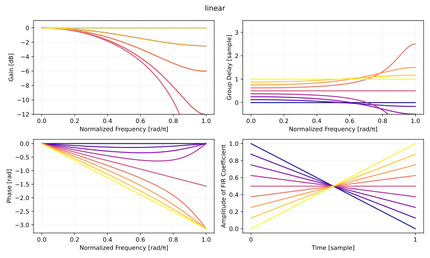
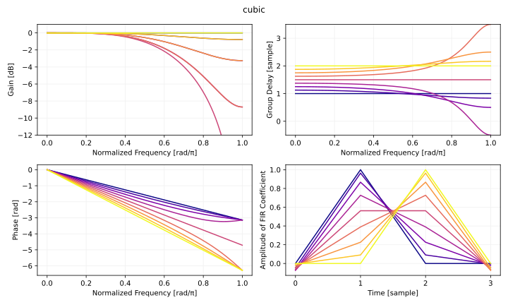
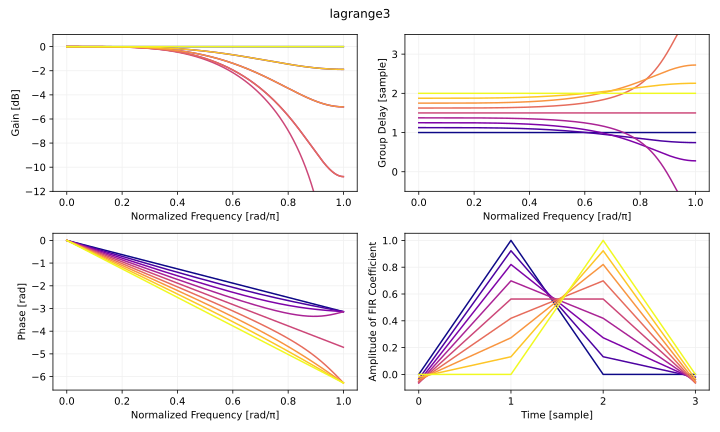
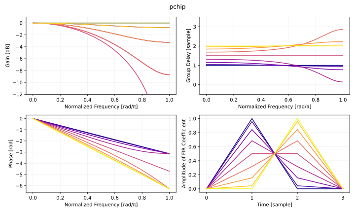
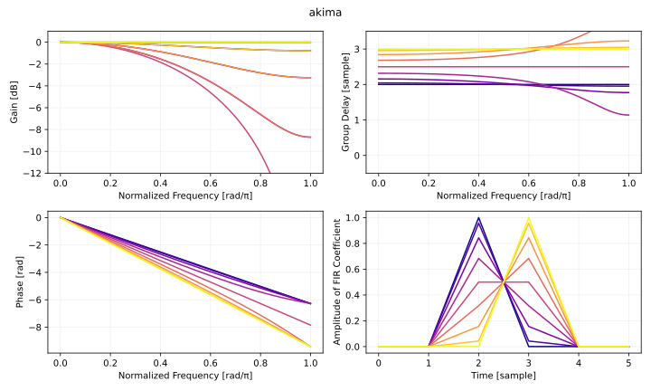
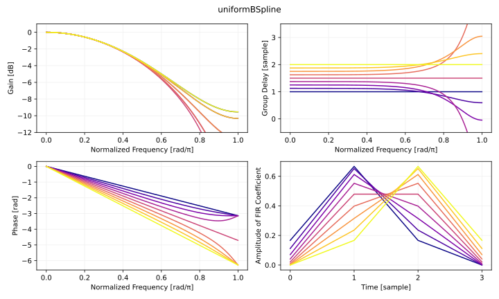
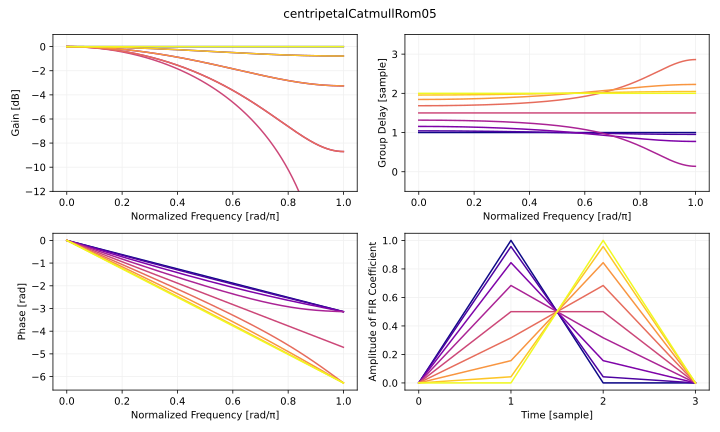
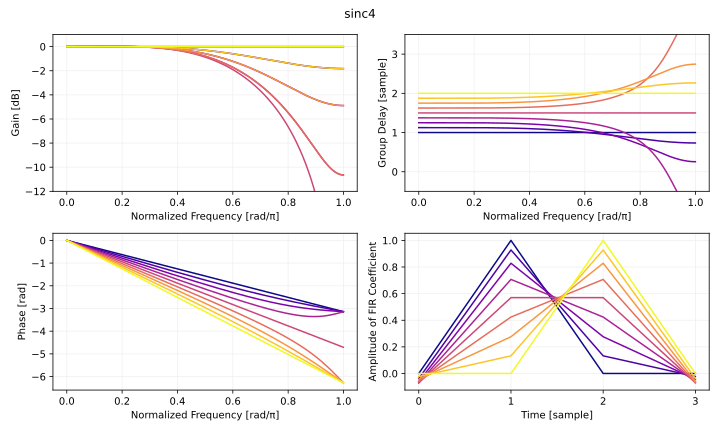

# 3 次補間の比較
3 次補間の特性を比較します。ついでに線形補間も比較します。

## 実装
ここでは補間したい位置の前後の数サンプルだけがわかっていれば使える方法のみを扱います。線形補間や Catmull-Rom 補間はこの種類の補間です。また等間隔でサンプリングされていることにします。等間隔でサンプリングされているときは補間の計算を簡略化できます。

補間したい曲線に関わるすべてのサンプルが必要になる方法としてはベジエ補間や natural cubic 補間があげられます。ただし音の補間については、すべてのサンプルが事前にわかっているのであればスプライン補間よりも [`scipy.signal.resample`](https://docs.scipy.org/doc/scipy/reference/generated/scipy.signal.resample.html) のような離散フーリエ変換によるリサンプリングのほうが適しています。画像では離散フーリエ変換によるリサンプリングをつかうと[リンギング](https://en.wikipedia.org/wiki/Ringing_artifacts)が問題になるので、 PCHIP などの[単調](https://mathworld.wolfram.com/MonotonicFunction.html)な補間のほうがいいかもしれません。

ここでは [`scipy.interpolate`](https://docs.scipy.org/doc/scipy/reference/interpolate.html) などを参考にして、比較のために以下の補間を実装しました。

- 線形補間
- [キュービック補間 (Catmull-Rom)](https://en.wikipedia.org/wiki/Cubic_Hermite_spline#Catmull%E2%80%93Rom_spline)
- 3 次[ラグランジュ補間](https://ccrma.stanford.edu/~jos/Interpolation/Lagrange_Interpolation.html)
- [PCHIP 補間](https://docs.scipy.org/doc/scipy/reference/generated/scipy.interpolate.PchipInterpolator.html)
- [Akima 補間](https://docs.scipy.org/doc/scipy/reference/generated/scipy.interpolate.Akima1DInterpolator.html)
- [Uniform B-spline 補間](http://www2.cs.uregina.ca/~anima/408/Notes/Interpolation/UniformBSpline.htm)
- [Centripetal Catmull-Rom 補間](https://en.wikipedia.org/wiki/Centripetal_Catmull%E2%80%93Rom_spline)

以下のリンク先に Python3 の実装を掲載しています。

- [Python3 による 3 次補間の実装を読む (github.com)](https://github.com/ryukau/filter_notes/blob/master/linear_and_cubic_interpolation/plot.py)

以下のリンク先に C++ の実装を掲載しています。

- [C++ による 3 次補間の実装を読む (github.com)](https://github.com/ryukau/filter_notes/blob/master/linear_and_cubic_interpolation/interp.cpp)

### 線形補間
`t` は範囲が `[0.0, 1.0]` の補間係数です。 C++20 では [`std::lerp`](https://en.cppreference.com/w/cpp/numeric/lerp) が使えるようになります。

```python
def linear(y0, y1, t):
    return y0 + t * (y1 - y0)
```

### キュービック補間 (Catmull-Rom)
サンプルが等間隔で並んでいるときは Catmull-Rom と呼ばれる簡略化した形のキュービック補間が使えます。以下の実装は[ウェーブテーブルの帯域制限と位相方向の補間](https://ryukau.github.io/filter_notes/wavetable/wavetable.html#%E3%81%9D%E3%81%AE%E4%BB%96)で紹介したものです。

```python
def cubic(y0, y1, y2, y3, t):
    t2 = t * t
    c0 = y1 - y2
    c1 = (y2 - y0) * 0.5
    c2 = c0 + c1
    c3 = c0 + c2 + (y3 - y1) * 0.5
    return c3 * t * t2 - (c2 + c3) * t2 + c1 * t + y1
```

- [Cubic Hermite spline - Wikipedia](https://en.wikipedia.org/wiki/Cubic_Hermite_spline)

### 3 次ラグランジュ補間
[ディレイの実装](https://ryukau.github.io/filter_notes/delay/delay.html#%E5%88%86%E6%95%B0%E3%83%87%E3%82%A3%E3%83%AC%E3%82%A4%E3%83%95%E3%82%A3%E3%83%AB%E3%82%BF)で紹介したラグランジュ補間の実装をさらに整理しました。

```python
def lagrange3(y0, y1, y2, y3, t):
    u = 1 + t
    d0 = y0 - y1
    d1 = d0 - (y1 - y2)
    d2 = d1 - ((y1 - y2) - (y2 - y3))
    return y0 - u * (d0 + (1 - u) / 2 * (d1 + (2 - u) / 3 * d2))
```

- [Lagrange Interpolation](https://ccrma.stanford.edu/~jos/Interpolation/Lagrange_Interpolation.html)

```
d(0, i) = y[i] - y[i + 1]
d(n, i) = d(n - 1, i) - d(n - 1, i + 1)

u = (N - 1) / 2. N is odd.

s(n)     = d(n, n) + (n + 1 - u) / (n + 2) * s(n + 1)
s(N - 1) = d(N - 1, N - 1)
v = y[0] - u * s(0)
```

### PCHIP 補間
Catmull-Rom との違いはオーバーシュートしないことです。 LFO の補間にはいいかもしれません。

```python
def pchip(y0, y1, y2, y3, t):
    m0 = y1 - y0
    m1 = y2 - y1
    m2 = y3 - y2

    dk0 = 0.0 if m0 * m1 <= 0 else 2 * (m0 * m1) / (m0 + m1)
    dk1 = 0.0 if m1 * m2 <= 0 else 2 * (m1 * m2) / (m1 + m2)

    t2 = t * t
    c0 = y1 - y2
    c1 = dk0
    c2 = c0 + c1
    c3 = c0 + c2 + dk1
    return c3 * t * t2 - (c2 + c3) * t2 + c1 * t + y1
```

- [scipy.interpolate.pchip_interpolate — SciPy v1.8.0 Manual](https://docs.scipy.org/doc/scipy/reference/generated/scipy.interpolate.pchip_interpolate.html)

### Akima 補間
Akima 補間の特長は、 1 階微分しても滑らかでありながら、補間したい位置の前後の数サンプルだけがわかっていれば計算できることです。

```python
def akima(y0, y1, y2, y3, y4, y5, t):
    m0 = y1 - y0
    m1 = y2 - y1
    m2 = y3 - y2
    m3 = y4 - y3
    m4 = y5 - y4

    w2 = abs(m1 - m0)
    w3 = abs(m2 - m1)
    w4 = abs(m3 - m2)
    w5 = abs(m4 - m3)

    b2 = m1 if w2 + w4 == 0 else (w4 * m1 + w2 * m2) / (w2 + w4)
    b3 = m2 if w3 + w5 == 0 else (w5 * m2 + w3 * m3) / (w3 + w5)

    c2 = 3.0 * m2 - 2.0 * b2 - b3

    d2 = b2 + b3 - 2.0 * m2

    return ((d2 * t + c2) * t + b2) * t + y2
```

- [scipy.interpolate.pchip_interpolate — SciPy v1.8.0 Manual](https://docs.scipy.org/doc/scipy/reference/generated/scipy.interpolate.pchip_interpolate.html)

### Uniform B-spline 補間
Uniform B-spline はコントロールポイントを通りません。音にかけるとローパスフィルタのようになります。

```python
def uniformBSpline(y0, y1, y2, y3, t):
    t2 = t * t
    t3 = t2 * t

    b0 = 1 / 6 - t / 2 + t2 / 2 - t3 / 6
    b1 = 2 / 3 - t2 + t3 / 2
    b2 = 1 / 6 + t / 2 + t2 / 2 - t3 / 2
    b3 = t3 / 6
    return b0 * y0 + b1 * y1 + b2 * y2 + b3 * y3
```

- [Uniform Cubic B-Spline Curves](http://www2.cs.uregina.ca/~anima/408/Notes/Interpolation/UniformBSpline.htm)

### Centripetal Catmull-Rom 補間
Centripetal Catmull-Rom は Catmull-Rom のサンプリング間隔を `alpha` で変えられるようにした補間方法です。 2 次元以上の曲線の描画でコントロールポイントの間隔が近いときに `alpha` を調整してループやふくらみなどの問題を回避することができます。

以下の実装は Wikipedia の記事に掲載されているコードをもとにして、 0 除算を避けるように改変しています。

```python
def centripetalCatmullRom(y0, y1, y2, y3, t, alpha=0.5):
    # 0 =< alpha =< 1.
    if t <= 0:
        return y1
    if t >= 1:
        return y2

    t0 = 0
    t1 = t0 + np.power(abs(y1 - y0), alpha)
    if t0 == t1:
        t1 += np.finfo(np.float64).eps
    t2 = t1 + np.power(abs(y2 - y1), alpha)
    if t1 == t2:
        t2 += t1 * np.finfo(np.float64).eps
    t3 = t2 + np.power(abs(y3 - y2), alpha)
    if t2 == t3:
        t3 += t2 * np.finfo(np.float64).eps

    # ここに到達したときに t0 < t1 < t2 < t3 でなければ 0 除算が起きる。

    t = t1 + t * (t2 - t1)

    A1 = (t1 - t) / (t1 - t0) * y0 + (t - t0) / (t1 - t0) * y1
    A2 = (t2 - t) / (t2 - t1) * y1 + (t - t1) / (t2 - t1) * y2
    A3 = (t3 - t) / (t3 - t2) * y2 + (t - t2) / (t3 - t2) * y3
    B1 = (t2 - t) / (t2 - t0) * A1 + (t - t0) / (t2 - t0) * A2
    B2 = (t3 - t) / (t3 - t1) * A2 + (t - t1) / (t3 - t1) * A3
    return (t2 - t) / (t2 - t1) * B1 + (t - t1) / (t2 - t1) * B2
```

- [Centripetal Catmull–Rom spline - Wikipedia](https://en.wikipedia.org/wiki/Centripetal_Catmull%E2%80%93Rom_spline)

## 評価
振幅、位相、群遅延特性をプロットして比較します。以下は周波数特性を計算するコード例です。実際にプロットに使ったコードは実装の節の Python3 の実装を参照してください。

```python
import numpy as np
import scipy.signal as signal

def lagrange3(y0, y1, y2, y3, t):
    u = 1 + t
    d0 = y0 - y1
    d1 = d0 - (y1 - y2)
    d2 = d1 - ((y1 - y2) - (y2 - y3))
    return y0 - u * (d0 + (1 - u) / 2 * (d1 + (2 - u) / 3 * d2))

impulseResponse = [
    [lagrange3(*impulse, t) for impulse in np.eye(4)]
    for t in np.linspace(0, 1, 9, endpoint=False)
]

sampleRate = 2
for fir in impulseResponse:
    ω, response = signal.freqz(fir, fs=sampleRate) # response は複素数の周波数特性。
    gain = 20 * np.log10(np.abs(response))
    phase = np.unwrap(np.angle(response))
    _, delay = signal.group_delay((fir, 1), fs=sampleRate)

    # プロットは省略。
```

以下では図の左上が振幅特性、左下が位相特性、右上が群遅延特性、右下がインパルス応答です。青くなるほど `t = 0` 、黄色くなるほど `t = 1` に近くなります。振幅特性は `t = 0.5` を中心として対称性があるので重なっている曲線があります。

線形補間の特性です。以下のような典型的な分数ディレイフィルタの特性がみられます。

- `0 < t < 1` のときの振幅特性はローパス。
- 群遅延特性が低域でフラット。
- `t = 0.5` のとき最もローパスが強くかかるが、群遅延はフラット。
- インパルス応答と振幅特性は `t = 0.5` を中心に対称。

<figure>

</figure>

キュービック補間の特性です。線形補間よりは低域でフラットな領域が増えています。単純に考えると FIR フィルタ係数が 2 倍長いので、振幅特性の[ロールオフ](https://en.wikipedia.org/wiki/Roll-off)が半分ほどになるはずです。

<figure>

</figure>

3 次ラグランジュ補間の特性です。キュービック補間とほとんど同じですが、低域でのフラットさが増して、高域での誤差が増えています。

<figure>

</figure>

PCHIP 補間の特性です。 PCHIP 補間は入力信号によって補間の特性が変わるので、以下の周波数特性は参考程度のものです。ただし、線形補間、キュービック補間、 3 次ラグランジュ補間に比べると、周波数特性が悪くなるケースがあるということは言えそうです。また、群遅延特性が `t` の値に応じて一様に分布しない点にも注意が必要です。

<figure>

</figure>

Akima 補間の特性です。 PCHIP 補間と同様に入力信号によって補間の特性が変わるので、以下の周波数特性は参考程度のものです。

<figure>

</figure>

Uniform B-spline 補間の特性です。ローパスが強くかかるので用途は限られそうです。

<figure>

</figure>

Centripetal Catmull-Rom 補間の特性です。 `alpha = 0.5` としていますが、入力信号がインパルスのときは 0 除算を避けるコードパスを通るので、 `alpha` の値を変えても同じ特性となります。音のデータは等間隔でサンプリングされていることが普通なので centripetal Catmull-Rom 補間のようにサンプリング間隔を変えて補間の特性を変える手法は音の補間に適していません。エフェクタに歪みを加えるときにはいいかもしれません。

<figure>

</figure>

キュービック補間と 3 次ラグランジュ補間については周波数特性に基づいて選ぶよりも、ベンチマークをとって速いほうを使うことも考えられます。 [godbolt.org](https://godbolt.org/) でアセンブラ出力を見たところ、今回の実装ではキュービック補間のほうが 3 次ラグランジュ補間よりもコードが短くなる傾向がありました。

- [cubic と lagrange3 の比較 (godbolt.org)](https://godbolt.org/#z:OYLghAFBqd5QCxAYwPYBMCmBRdBLAF1QCcAaPECAMzwBtMA7AQwFtMQByARg9KtQYEAysib0QXACx8BBAKoBnTAAUAHpwAMvAFYTStJg1DIApACYAQuYukl9ZATwDKjdAGFUtAK4sGIM6SuADJ4DJgAcj4ARpjE/gDspAAOqAqETgwe3r7%2ByanpAiFhkSwxcWaJdpgOGUIETMQEWT5%2BAVU1AnUNBEUR0bEJtvWNzTltwz2hfaUDFQCUtqhexMjsHASYLEkGGyYAzG4EAJ5JjKyYANQAKvvY1xfIXlF4yACSgrFJEFcXRxqk9yOXABPyOAUBexBFwIcxMGgAgiZ4lYERd7gQzBd9gARaEXABU0P2KPhaJ%2ByA0WL2uKBFwAtL8zMS4aT7sguFTcRAwfTfho5hcAPTXCBmWF7Elkh6YnEPSnWB5cZmotl7TlyrGWaWaiwXblqhlAgXCq6i8WSi7ETAEZYMB5qwkEAnQzEMiDIGVa5B7AWOz269nOp0KoHKxHxbEsllUWioJhO5ChDbEL4xuNOv4AtPx37Ai7ZjPggu/SH52M5mFY5EstFoq024h2x7PN4fFP7NwF27c/65gFg/ulmFhpGRhEsjZbHaYDvHU7MNjXW73AzAYiGYCYPbvZNfUG90F50Hg0Gln7D8fVlU/Lzq01cAUKghhqXoeXUvm80MSmv3dAc2U315bkOUNMUXz/GUP3/YCQK/MVgJ5Q0fXNX961tT8GVvQkICAhVvggB9eS8Y0RQQnCYPw00EKw0jTR9Z10DFVDLzHREEWLWg9iTT5qHLDNe2LIEs34xkRPTEtxIrWFLwtdDGwuVd1yMLcd0%2BDsuz2bAe37PMB0k6EWPDbEOAWWhOAAVl4PwOC0UhUE4NxrAVBQlhWS5zD2HhSAITRTIWABrEALP%2BcyOEkay/PszheAUEB/l82zTNIOBYCQNAtjoWJyEoDKkiyuJgC4LhIRoWhkziiAoii55mGII5OG8jK2EEAB5BhaAapLSCwFgN3Ebr8CtGoADdMDi7rMFUaovA2RreB4sK7NoPAonXeqPCwKKCGIPAWHmhYYyYYAFAANTwTAAHdWvneaZEEEQxHYKR7vkJQ1Ci3RgQMIwUGcyx9FWuLIAWVAkkcAQJrpVqDSoKgmAUAg6T6ggEHpFgqD62LMHsCG/AgVxRj8YFgimEoyj0FI0jxonKfyPHenJgZgXaPGuhGTwWj0VnagmRn%2BjiFmJlpoXun5mZBYWVzllWPQdswNYeDMyzIu6hyOFUAAOAA2OltckC5gGQZALmKgA6NUICcyxrABXBCBITUvIBDxMvoYgnYfXhEq0OZAuC0LOAi0gbLs9XYviny/L9/RODMVWw5iqOkpjsbiDSZxJCAA%3D%3D%3D)


### まとめ
計算の速さが求められるときは線形補間で十分です。

3 次の補間を使うときは Catmull-Rom キュービック補間か 3 次ラグランジュ補間が使えます。キュービック補間は 3 次ラグランジュ補間より高速ですが、低域での特性が悪くなります。

オーバーシュートが許容できないときは PCHIP 補間が使えます。

Akima 、 uniform B-spline 、 centripetal Catmull-Rom は音の補間には不適です。音に癖をつけたいときはいいかもしれません。

## その他
以下のように sinc 関数から直接 FIR フィルタ係数を計算する方法も考えられますが、 補間のたびに `sin()` を FIR のタップ数だけ繰り返し計算するのはリアルタイムの音の処理ではかなり重たいです。

```python
def sinc4(y0, y1, y2, y3, t):
    s0 = np.sinc(t + 1) / np.e
    s1 = np.sinc(t)
    s2 = np.sinc(t - 1)
    s3 = np.sinc(t - 2) / np.e
    denom = s0 + s1 + s2 + s3
    return (y0 * s0 + y1 * s1 + y2 * s2 + y3 * s3) / denom
```

`np.e` で値を割っているのは窓関数の計算です。以下のコードから出力されるインデックス 0 とインデックス 3 の値とほぼ一致します。

```python
win = scipy.signal.get_window(("kaiser", 2 * np.pi), 6, fftbins=False)[1:-1]
print(win / win[1])
```

特性は窓関数によって変わりますが、上の `sinc4` は 3 次ラグランジュ補間とほぼ一致します。

<figure>

</figure>

## 参考サイト
- [Cubic Hermite spline - Wikipedia](https://en.wikipedia.org/wiki/Cubic_Hermite_spline)
- [Lagrange Interpolation](https://ccrma.stanford.edu/~jos/Interpolation/Lagrange_Interpolation.html)
- [scipy.interpolate.PchipInterpolator — SciPy v1.8.0 Manual](https://docs.scipy.org/doc/scipy/reference/generated/scipy.interpolate.PchipInterpolator.html)
- [scipy.interpolate.Akima1DInterpolator — SciPy v1.8.0 Manual](https://docs.scipy.org/doc/scipy/reference/generated/scipy.interpolate.Akima1DInterpolator.html)
- [Uniform Cubic B-Spline Curves](http://www2.cs.uregina.ca/~anima/408/Notes/Interpolation/UniformBSpline.htm)
- [Centripetal Catmull–Rom spline - Wikipedia](https://en.wikipedia.org/wiki/Centripetal_Catmull%E2%80%93Rom_spline)
- [scipy.signal.resample — SciPy v1.8.0 Manual](https://docs.scipy.org/doc/scipy/reference/generated/scipy.signal.resample.html)
- [Ringing artifacts - Wikipedia](https://en.wikipedia.org/wiki/Ringing_artifacts)

## 変更点
- 2022/05/07
  - ロールオフをフォールオフに間違えていた点を修正。
  - 図の説明を追加。
