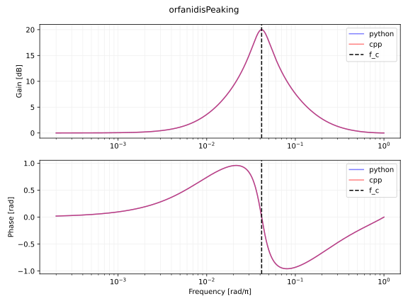
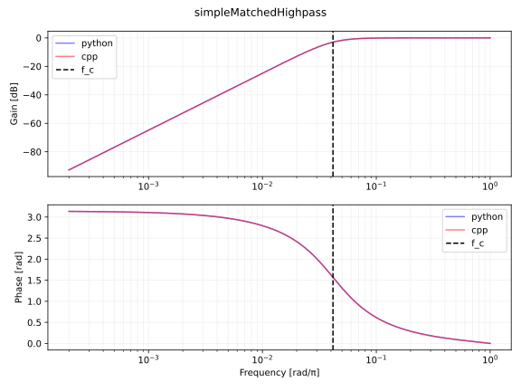
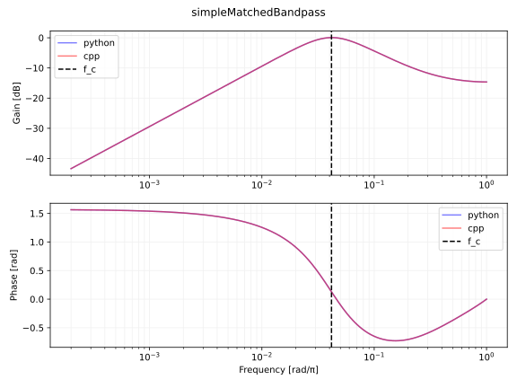
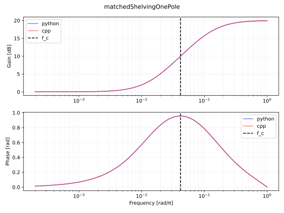

# アナログの周波数特性に一致する二次のデジタルフィルタの実装
Martin Vicanek さんによる [Matched Second Order Digital Filters](https://vicanek.de/articles/BiquadFits.pdf) と [Matched One-Pole Digital Shelving Filters](https://vicanek.de/articles/ShelvingFits.pdf) で紹介されていた整合フィルタ (matched filter) を実装します。整合フィルタとはアナログの周波数特性に一致する離散フィルタのことです。

[Audio EQ Cookbook](https://www.w3.org/TR/audio-eq-cookbook/) などで紹介されている二次フィルタはバイリニア変換を使っています。バイリニア変換は $\tan$ によって周波数を歪ませてマッピングしているので、アナログ特性とデジタル特性の間に差が生じます。整合フィルタの特長は、このような周波数の歪みを避けるように設計されていることです。

## 実装
Python 3 でフィルタ係数 $b_0, b_1, b_2, a_1, a_2$ を計算する関数を実装します。フィルタ係数は以下の離散系の伝達関数と対応します。

$$
\begin{equation}
H(z) = \frac{b_0 + b_1 z^{-1} + b_2 z^{-2}}{1 + a_1 z^{-1} + a_2 z^{-1}}
\end{equation}
$$

ユーザから入力されるパラメータの一覧です。

- $\omega_0$, `cutoffRadian`: カットオフ周波数。単位はラジアン (rad) 。
- $Q$, `Q`: Q 値 (quality factor) 。レゾナンス。
- $G$, `G`: ピークゲイン。例えばゲインが 10 倍なら `G=10`。ピーキングとシェルビングフィルタのみで利用。

各フィルタの実装の後に掲載しているプロットは $\omega_0=2\pi\dfrac{1000}{48000},Q=\dfrac{1}{\sqrt{2}},G=10$ としたときの周波数特性です。 $\omega_0$ はサンプリング周波数が 48000 Hz のときにカットオフ周波数が 1000 Hz となるようにしています。以下は プロットに使った Python 3 のコードです。

- [filter_notes/matched_iir_filter/demo/matchediir.py at master · ryukau/filter_notes · GitHub](https://github.com/ryukau/filter_notes/blob/master/matched_iir_filter/demo/matchediir.py)

以下は C++ による実装です。 `MatchedBiquad` がフィルタのクラスです。

- [filter_notes/matched_iir_filter/demo/test.cpp at master · ryukau/filter_notes · GitHub](https://github.com/ryukau/filter_notes/blob/master/matched_iir_filter/demo/test.cpp)

### Orfanidis のピーキングフィルタ
"Matched Second Order Digital Filters" の式 13 から式 16 に掲載されている、 [Orfanidis によるピーキングフィルタ](https://www.ece.rutgers.edu/~orfanidi/ece348/peq.pdf) のフィルタ係数の計算式を実装します。 $G_0, \Delta\omega, G_B$ の設定は論文の式 18 に基づいています。 $G_1$ は適当に設定しています。

```python
def orfanidisPeaking(cutoffRadian, Q, G):
    ω0 = cutoffRadian
    G0 = 1
    G1 = 1
    Δω = ω0 / Q
    GB = np.sqrt(G)

    Ω0 = np.tan(0.5 * ω0)

    G_2 = G * G
    GB_2 = GB * GB
    G0_2 = G0 * G0
    G1_2 = G1 * G1

    W_2 = np.sqrt((G_2 - G1_2) / (G_2 - G0_2)) * Ω0 * Ω0
    ΔΩ = (1 + np.sqrt((GB_2 - G0_2) / (GB_2 - G1_2)) * W_2) * np.tan(0.5 * Δω)

    C = (ΔΩ * ΔΩ) * np.abs(GB_2 - G1_2) - 2 * W_2 * (
        np.abs(GB_2 - G0 * G1) - np.sqrt((GB_2 - G0_2) * (GB_2 - G1_2))
    )
    D = 2 * W_2 * (np.abs(G_2 - G0 * G1) - np.sqrt((G_2 - G0_2) * (G_2 - G1_2)))

    A = np.sqrt((C + D) / np.abs(G_2 - GB_2))
    B = np.sqrt((G_2 * C + GB_2 * D) / np.abs(G_2 - GB_2))

    a0 = 1 + W_2 + A
    a1 = -2 * (1 - W_2) / a0
    a2 = (1 + W_2 - A) / a0
    b0 = (G1 + G0 * W_2 + B) / a0
    b1 = -2 * (G1 - G0 * W_2) / a0
    b2 = (G1 + G0 * W_2 - B) / a0

    return [[b0, b1, b2, 1, a1, a2]]  # scipy.signal の sos 形式。
```

\

### Massberg の整合ローパスフィルタ
"Matched Second Order Digital Filters" の式 20 から式 23 に掲載されている、 Massberg による二次整合ローパスフィルタのフィルタ係数の計算式を実装します。

```python
def massbergLowpass(cutoffRadian, Q):
    ω0 = cutoffRadian

    Q2 = Q * Q
    t1 = np.pi * np.pi / (ω0 * ω0)
    t2 = 1 - t1
    t3 = t1 / Q2
    g1 = 1 / (np.sqrt(t2 * t2 + t3 * t3))

    Ωs = 0
    if Q > np.sqrt(0.5):
        gr = 2 * Q2 / np.sqrt(4 * Q2 - 1)
        ωr = ω0 * np.sqrt(1 - 1 / (2 * Q2))
        Ωs = np.tan(ωr / 2) * np.power((gr * gr - g1 * g1) / (gr * gr - 1), 1 / 4)
    else:
        ωm = ω0 * np.sqrt(
            1 - 1 / 2 / Q2 + np.sqrt((1 - 4 * Q2) / (4 * Q2 * Q2) + 1 / g1)
        )
        Ωs = min(0.5 * ω0 * np.power(1 - g1 * g1, 1 / 4), np.tan(ωm / 2))

    ωz = 2 * np.arctan(Ωs / np.sqrt(g1))
    z_tmp1 = ωz * ωz / (ω0 * ω0)
    z_tmp2 = 1 - z_tmp1
    gz = 1 / (z_tmp2 * z_tmp2 + z_tmp1 / Q2)

    ωp = 2 * np.arctan(Ωs)
    p_tmp1 = ωp * ωp / (ω0 * ω0)
    p_tmp2 = 1 - p_tmp1
    gp = 1 / (p_tmp2 * p_tmp2 + p_tmp1 / Q2)

    gz_2 = gz * gz
    gp_2 = gp * gp
    β = g1 - 1
    Qz = np.sqrt(g1 * g1 * (gp_2 - gz_2) / (gz_2 * (g1 + gp_2) * β * β))
    Qp = np.sqrt(g1 * (gp_2 - gz_2) / ((g1 + gz_2) * β * β))

    Ωs_2 = Ωs * Ωs
    sqrt_g1 = np.sqrt(g1)
    β0 = Ωs_2 + sqrt_g1 * Ωs / Qz + g1
    β1 = 2 * (Ωs_2 - g1)
    β2 = Ωs_2 - sqrt_g1 * Ωs / Qz + g1
    γ = Ωs_2 + Ωs / Qp + 1
    α1 = 2 * (Ωs_2 - 1)
    α2 = Ωs_2 - Ωs / Qp + 1

    b0 = β0 / γ
    b1 = β1 / γ
    b2 = β2 / γ
    a1 = α1 / γ
    a2 = α2 / γ

    return [[b0, b1, b2, 1, a1, a2]]  # scipy.signal の sos 形式。
```

\

### Vicanek の整合フィルタ
Vicanek の整合フィルタは伝達関数の分母に関する計算が共通しています。以下は関連する "Matched Second Order Digital Filters" の式の一覧です。

- 式 12 に $a_1, a_2$ 。
- 式 26 に $\phi_0, \phi_1, \phi_2$ 。
- 式 27 に $A_0, A_1, A_2$ 。

以下は共通部の実装です。

```python
def solveDenominator(ω0, Q):
    q = 0.5 / Q
    a1 = -2 * np.exp(-q * ω0)
    if q <= 1:
        a1 *= np.cos(np.sqrt(1 - q * q) * ω0)
    else:
        a1 *= np.cosh(np.sqrt(q * q - 1) * ω0)
    a2 = np.exp(-2 * q * ω0)

    sn = np.sin(ω0 / 2)
    φ0 = 1 - sn * sn
    φ1 = sn * sn
    φ2 = 4 * φ0 * φ1

    A0 = (1 + a1 + a2) ** 2
    A1 = (1 - a1 + a2) ** 2
    A2 = -4 * a2

    return (a1, a2, φ0, φ1, φ2, A0, A1, A2)
```

#### ローパス
"Matched Second Order Digital Filters" の式 31 から式 34 の実装です。式 30 に続く文で $b_2 = 0$ が指定されています。

```python
def matchedLowpass(cutoffRadian, Q):
    ω0 = cutoffRadian

    a1, a2, φ0, φ1, φ2, A0, A1, A2 = solveDenominator(ω0, Q)

    sqrt_B0 = 1 + a1 + a2
    B0 = A0

    R1 = Q * Q * (A0 * φ0 + A1 * φ1 + A2 * φ2)
    B1 = (R1 - B0 * φ0) / φ1

    b0 = 0.5 * (sqrt_B0 + np.sqrt(B1))
    b1 = sqrt_B0 - b0

    return [[b0, b1, 0, 1, a1, a2]]  # scipy.signal の sos 形式。
```

\

#### ハイパス
"Matched Second Order Digital Filters" の式 36 の実装です。

```python
def matchedHighpass(cutoffRadian, Q):
    ω0 = cutoffRadian

    a1, a2, φ0, φ1, φ2, A0, A1, A2 = solveDenominator(ω0, Q)

    b0 = Q * np.sqrt(A0 * φ0 + A1 * φ1 + A2 * φ2) / (4 * φ1)
    b1 = -2 * b0
    b2 = b0

    return [[b0, b1, b2, 1, a1, a2]]  # scipy.signal の sos 形式。
```

\

#### バンドパス
"Matched Second Order Digital Filters" の式 37 から式 41 の実装です。

```python
def matchedBandpass(cutoffRadian, Q):
    ω0 = cutoffRadian

    a1, a2, φ0, φ1, φ2, A0, A1, A2 = solveDenominator(ω0, Q)

    R1 = A0 * φ0 + A1 * φ1 + A2 * φ2
    R2 = -A0 + A1 + 4 * (φ0 - φ1) * A2

    B2 = (R1 - R2 * φ1) / (4 * φ1 * φ1)
    B1 = R2 - 4 * (φ0 - φ1) * B2

    b1 = -0.5 * np.sqrt(B1)
    b0 = 0.5 * (np.sqrt(B2 + b1 * b1) - b1)
    b2 = -b0 - b1

    return [[b0, b1, b2, 1, a1, a2]]  # scipy.signal の sos 形式。
```

\

#### ピーキング
"Matched Second Order Digital Filters" の式 44 から式 45 の実装です。 $b_0, b_1, b_2$ は式 29 に掲載されています。

```python
def matchedPeaking(cutoffRadian, Q, gain):
    ω0 = cutoffRadian
    G = gain

    a1, a2, φ0, φ1, φ2, A0, A1, A2 = solveDenominator(ω0, Q)

    R1 = G * G * (A0 * φ0 + A1 * φ1 + A2 * φ2)
    R2 = G * G * (-A0 + A1 + 4 * (φ0 - φ1) * A2)

    B0 = A0
    B2 = (R1 - R2 * φ1 - B0) / (4 * φ1 * φ1)
    B1 = R2 + B0 - 4 * (φ0 - φ1) * B2

    sqrt_B0 = 1 + a1 + a2
    sqrt_B1 = np.sqrt(B1)

    W = 0.5 * (sqrt_B0 + sqrt_B1)
    b0 = 0.5 * (W + np.sqrt(W * W + B2))
    b1 = 0.5 * (sqrt_B0 - sqrt_B1)
    b2 = -B2 / (4 * b0)

    return [[b0, b1, b2, 1, a1, a2]]  # scipy.signal の sos 形式。
```

\

### 簡略な整合フィルタ
Vicanek による、フィルタ係数の計算を簡略化した整合フィルタを実装します。このフィルタは計算が軽いだけでなく、より安定しているので、オーディオレートでフィルタのパラメータを変調するときに適しているそうです。アナログ特性との整合性はバイリニア変換よりはいいですが、前節の整合フィルタに比べるとやや劣ります。

`solveDenominator()` を使いまわしています。 `a1, a2` だけを使うので本格的な実装では計算を簡略化できます。

#### ローパス
"Matched Second Order Digital Filters" の式 46 から式 47 の実装です。

```python
def simpleMatchedLowpass(cutoffRadian, Q):
    ω0 = cutoffRadian
    ω0_2 = ω0 * ω0

    a1, a2, _, _, _, _, _, _ = solveDenominator(ω0, Q)

    r0 = 1 + a1 + a2
    r1 = (1 - a1 + a2) * ω0_2 / np.sqrt((1 - ω0_2) ** 2 + ω0_2 / Q / Q)

    b0 = 0.5 * (r0 + r1)
    b1 = r0 - b0

    return [[b0, b1, 0, 1, a1, a2]]
```

\

#### ハイパス
"Matched Second Order Digital Filters" の式 48 から式 49 の実装です。

```python
def simpleMatchedHighpass(cutoffRadian, Q):
    ω0 = cutoffRadian
    ω0_2 = ω0 * ω0

    a1, a2, _, _, _, _, _, _ = solveDenominator(ω0, Q)

    r1 = (1 - a1 + a2) / np.sqrt((1 - ω0_2) ** 2 + ω0_2 / Q / Q)

    b0 = 0.25 * r1
    b1 = -2 * b0
    b2 = b0

    return [[b0, b1, b2, 1, a1, a2]]
```

\

#### バンドパス
"Matched Second Order Digital Filters" の式 50 から式 51 の実装です。

```python
def simpleMatchedBandpass(cutoffRadian, Q):
    ω0 = cutoffRadian
    ω0_2 = ω0 * ω0

    a1, a2, _, _, _, _, _, _ = solveDenominator(ω0, Q)

    r0 = (1 + a1 + a2) / (ω0 * Q)
    r1 = (1 - a1 + a2) * ω0 / Q / np.sqrt((1 - ω0_2) ** 2 + ω0_2 / Q / Q)

    b0 = 0.5 * r0 + 0.25 * r1
    b1 = -0.5 * r1
    b2 = -b0 - b1

    return [[b0, b1, b2, 1, a1, a2]]  # scipy.signal の sos 形式。
```

\

### 整合一次ハイシェルビングフィルタ
"Matched One-Pole Digital Shelving Filters" で紹介されていた整合一次ハイシェルビングフィルタのフィルタ係数の計算を実装します。対応する式は 4, 5, 10, 11, 12 です。

一次なのでレゾナンス $Q$ はありません。

ローシェルビングフィルタはハイシェルビングの出力にゲインの逆数を乗算すれば作ることができます。ローシェルビング出力を $H_{\mathrm{LS1}}$ 、ハイシェルビング出力を $H_{\mathrm{HS1}}$ 、とすると $H_{\mathrm{LS1}} = \dfrac{H_{\mathrm{HS1}}}{G}$ です。

```python
def matchedShelvingOnePole(cutoffRadian, gain):
    fc = cutoffRadian / np.pi
    G = gain

    fm = 0.9
    φm = 1 - np.cos(np.pi * fm)

    def alphabeta(V):
        return 2 / (np.pi * np.pi) * (1 / (fm * fm) + V) - 1 / φm

    α = alphabeta(1 / (G * fc * fc))
    β = alphabeta(G / (fc * fc))

    a1 = -α / (1 + α + np.sqrt(1 + 2 * α))
    b = -β / (1 + β + np.sqrt(1 + 2 * β))
    b0 = (1 + a1) / (1 + b)
    b1 = b * b0

    return [[b0, b1, 0, 1, a1, 0]]  # scipy.signal の sos 形式。
```

\

## 参考文献
- [MV's Plugins Articles](https://vicanek.de/articles.htm)
- Martin Vicanek, ["Matched Second Order Digital Filters"](https://vicanek.de/articles/BiquadFits.pdf), 2016-02-14.
- Martin Vicanek, ["Matched One-Pole Digital Shelving Filters"](https://vicanek.de/articles/ShelvingFits.pdf), revised 2019-09-24.

## 変更点
- 2024/04/17
  - 文章の整理。
