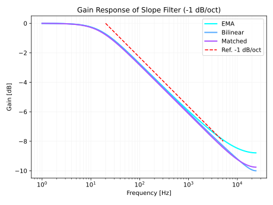
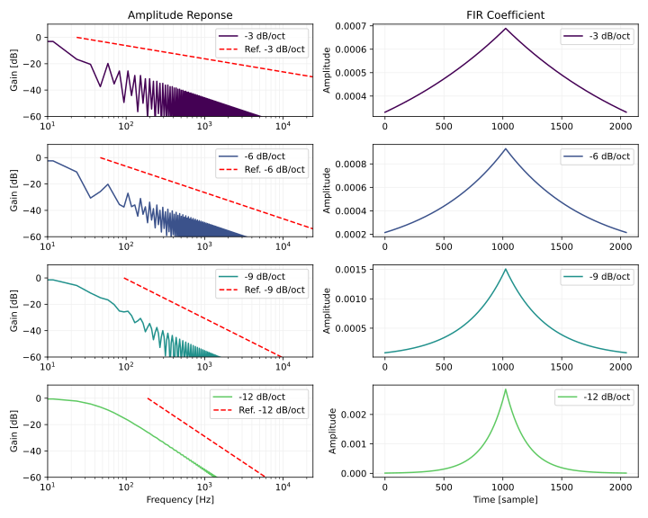
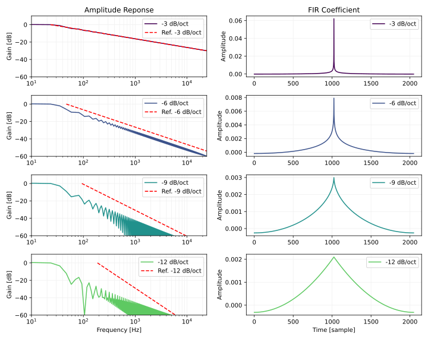

# n dB/octのスロープを持つフィルタ
n dB/oct のスロープを持つフィルタを設計します。

位相特性が問題でなければ「[IIR のハイシェルフフィルタを使う方法](#iir-のハイシェルフフィルタを使う方法)」がおすすめです。その他の節では FIR フィルタによる実装を紹介していますが、どれも一長一短です。設計の手間を考えると最も手軽な逆離散フーリエ変換を使う方法で十分な気がします。

以下は実験に使ったコードへのリンクです。

- [IIR のハイシェルフフィルタを使う方法の Python 3 による実装](https://github.com/ryukau/filter_notes/blob/master/ndboct/iir.py) (github.com)
- [FIR フィルタを使う方法の Python 3 による実装](https://github.com/ryukau/filter_notes/blob/master/ndboct/exponential.py) (github.com)
- [逆フーリエ変換を使う方法の Python 3 による実装](https://github.com/ryukau/filter_notes/blob/master/ndboct/ifft.py) (github.com)

## IIR のハイシェルフフィルタを使う方法
以下のブロック線図のように直列にハイシェルフ (high-shelf) フィルタをつなぐことで n dB/oct のフィルタを近似できます。

<figure>

</figure>

ハイシェルフフィルタのパラメータは以下のように設定します。

- カットオフ周波数は 1 オクターブ間隔。
  - カットオフ周波数を $f_c$ 、ハイシェルフフィルタのインデックスを $i$ とすると、 $f_c = 2^i l$ 。
  - サンプリング周波数を $f_s$ とすると、 $f_c = f_s / 2^{i+1}$ とも設定できる。
- Q 値は $\dfrac{1}{\sqrt{2}}$ 。 (2 次フィルタのときのみ)
- ゲインは n dB/oct の n を使う。

ハイシェルフフィルタの数を $1/k$ にしてカットオフ周波数を $k$ オクターブ間隔にすることでも近い特性が得られます。ただし $k$ を増やすほど特性が階段状に波打ちます。

以下は実装へのリンクです。

- [Python 3 による実装](https://github.com/ryukau/filter_notes/blob/master/ndboct/iir.py) (github.com)
- [JavaScript による実装](https://github.com/ryukau/UhhyouWebSynthesizers/blob/9830094f6e7fb74c7b627bf10c4e5f0c384f6763/common/dsp/slopefilter.js#L57-L99) (github.com)
- [C++ による実装](https://github.com/ryukau/UhhyouPluginsJuce/blob/9e5c2ae4e76f29b880a8409fb25e2c133012e275/SlopeFilter/dsp/filter.hpp#L86-L151) (github.com)

以下は 1 次のハイシェルフフィルタで n dB/oct の傾きを近似した振幅特性です。 Exponential moving average (EMA), バイリニア変換 (bilinear) 、 [整合フィルタ](../matched_iir_filter/matched_iir_filter.html#整合一次ハイシェルビングフィルタ) (matched) の 3 種類の 1 次フィルタを比較しています。参照となる赤い点線 (Ref.) と並行であるほど性能が良くなります。どれもほぼ似たような特性ですが、バイリニア変換によるフィルタは最も誤差が少なく見えます。 EMA フィルタはナイキスト周波数に近い部分で誤差が増えますが、計算量が小さいという利点があります。整合フィルタは中間的な誤差ですが、フィルタ係数の計算量が 3 つの中で最も大きいので出番はなさそうです。

<figure>

</figure>

以下は 2 次のハイシェルフフィルタで n dB/oct の傾きを近似した振幅特性です。ハイシェルフフィルタの数を 1/k に減らしたときの変化を示しています。 k が 2 以下であれば、よく近似できているように見えます。 k が 3 以上になると誤差が目立っています。

<figure>

</figure>

## Exponential 窓
Exponential 窓を使うと -12 dB/oct のスロープを近似できます。カットオフ周波数を 1 オクターブ下げるごとに、フィルタ係数の数を倍にしなければならない点が欠点です。

以下は Python 3 による実装例です。

```python
def exponentialWindow(length: int, slopeDecibel: float):
    mid = length // 2

    fir = np.zeros(length)
    tau = (length / 2) * (np.e / 10 ** (slopeDecibel / 10))
    for i in range(length):
        x = i - mid
        fir[i] = np.exp(-np.abs(x) / tau)
    return fir / np.sum(fir)
```

以下は周波数特性です。傾きを比べやすいようにフィルタ係数の数を 2048 にしています。 -3 dB/oct の傾きは近似できていません。 -12 dB/oct の傾きは近似できているように見えます。 -6 と -9 dB/oct は傾きを近似できているように見えるものの、リップルを考慮すると質は悪いと言えそうです。

<figure>

</figure>

## 改変したピンクノイズフィルタ
Abhranil による "Camouflage detection & signal discrimination: theory, methods & experiments" で紹介されている、ホワイトノイズをピンクノイズに変えるフィルタ (ピンクノイズフィルタ) を改変することで -6 dB/oct あたりまでの傾きを作ることができます。

以下は Abhranil の論文のセクション 5.5.1 (p.115) に掲載されているピンクノイズフィルタの式です。後述の実装と合わせるため論文で $x - 1$ となっている部分を $x$ に置き換えています。

$$
h(x) = \frac{1}{N} \left(
  1
+ \frac{1}{\sqrt{N/2}} \cos \left( \pi x \right)
+ 2 \sum_{k = 1}^{N/2 - 1} \frac{1}{\sqrt{k}} \cos \left(\frac{2 \pi k}{N} x\right)
\right).
$$

このフィルタは 1 オクターブあたり $1/\sqrt{2}$ 、つまり約 -3 dB/oct の傾きが出ます。

上の式は $1, \dfrac{1}{\sqrt{1}}, \dfrac{1}{\sqrt{2}}, \dfrac{1}{\sqrt{3}}, \dots, \dfrac{1}{\sqrt{3}}, \dfrac{1}{\sqrt{2}}, \dfrac{1}{\sqrt{1}}$ となる数列を逆離散フーリエ変換すると出てくるそうです。この数列は $1, \dfrac{1}{1^\alpha}, \dfrac{1}{2^\alpha}, \dfrac{1}{3^\alpha}, \dots, \dfrac{1}{3^\alpha}, \dfrac{1}{2^\alpha}, \dfrac{1}{1^\alpha},\,\alpha=1/2$ と書き換えることができます。ここで適当に $\alpha = n / (40 \log_{10} (1 / \sqrt{2}))$ として傾き $n$ から $\alpha$ を決めることでフィルタ特性を調節することができます。

$\alpha$ をピンクフィルタの式に組み込みます。

$$
h(x) = \frac{1}{N} \left(
  1
+ \left( \frac{2}{N} \right)^\alpha \cos \left( \pi x \right)
+ 2 \sum_{k = 1}^{N/2 - 1} \frac{1}{k^\alpha} \cos \left(\frac{2 \pi k}{N} x\right)
\right).
$$

ここでは上の式のことを改変したピンクノイズフィルタと呼んでいます。

Python 3 で実装します。

```python
def pinkNoiseFilter(length: int, slopeDecibel: float):
    N = length + length % 2  # Make it even number.
    mid = N // 2
    x = np.arange(1 - mid, 1 + mid)

    alpha = slopeDecibel / (40 * np.log10(1 / np.sqrt(2)))

    fir = np.ones(N)
    fir += np.cos(np.pi * x) / mid**alpha
    for k in range(1, mid):
        fir += 2 * np.cos(2 * np.pi * k * x / N) / k**alpha
    fir /= N
    if length % 2 == 1:
        return fir[0:-1]
    return fir
```

以下は周波数特性です。 -3 と -6 dB/oct は近似できています。 -9 と -12 ではリップルが目立っているので質は悪そうです。

<figure>

</figure>

## 逆離散フーリエ変換を使う方法
[逆離散フーリエ変換（IDFT）](https://en.wikipedia.org/wiki/Discrete_Fourier_transform)を使って楽に設計します。

この節のコードは順番にPython3のインタープリタにコピーすれば動作します。別ページでまとめて見ることもできます。

- [n dB/octのフィルタを作るコード (github.com)](https://github.com/ryukau/filter_notes/blob/master/ndboct/ndboct.py)

以下はフィルタの仕様です。

<figure>

</figure>

$$
\begin{aligned}
A(\omega) &=
\begin{cases}
(h/l)^{M}, &  (-\pi \leq \omega \leq -h) \\
(\omega/l)^{M}, &  (-h \lt \omega \lt -l) \\
1, & (-l \leq \omega \leq l) \\
(\omega/l)^{M}, & (l \lt \omega \lt h) \\
(h/l)^{M}, & (h \leq \omega \leq \pi)
\end{cases} \\\\
M &= {{\,n}\over{20}}\log_2 10
\end{aligned}
$$

[SciPy](https://www.scipy.org/)、[NumPy](http://www.numpy.org/)、[Matplotlib](https://matplotlib.org/tutorials/introductory/pyplot.html)を import します。

```python
import matplotlib.pyplot as p
import numpy as np
from scipy import signal
from scipy.fftpack import *
```

プロットに使う関数を用意します。

```python
def showResponse(sample_rate, sig):
    # sig の周波数成分を dB に変換してプロット。
    res = fftshift(fft(sig, 2**16) / (len(sig) / 2.0))
    gain = np.array_split(
        20 * np.log10(abs(res / np.max(abs(res)))),
        2,
    )[0][::-1]
    freq = getFreq(sample_rate, gain)
    p.plot(freq, gain)
    p.grid(which='both')
    p.show()

def getFreq(sample_rate, spec):
    # 出力はプロットのx軸に使う。
    freq_step = sample_rate / 2 / (len(spec) - 1)
    return [i * freq_step for i in range(0, len(spec))]

def toDecibel(spec):
    return [20 * np.log10(v) for v in spec]
```

欲しい周波数特性を用意します。

```python
def makeFrequencySpecification(sample_rate, length, low, high, slope):
    # slope は負の値。単位は[dB/oct]。
    # low, high は周波数[Hz]。
    #
    # dB/oct を算出する式の解説。
    # https://femci.gsfc.nasa.gov/random/randomequations.html
    #
    # 6.020599913279624 = 20 * np.log10(2)
    #
    oct = (high / low)**(slope / 6.020599913279624)
    spec = [0] * length
    freq_step = sample_rate / 2 / (length - 1)
    for i in range(0, len(spec)):
        freq = i * freq_step
        if freq <= low:
            spec[i] = 1
        elif freq >= high:
            spec[i] = oct
        else:
            spec[i] = (freq / low)**(slope / 6.020599913279624)
    return spec


sample_rate = 44100
spec = makeFrequencySpecification(sample_rate, 1024, 100, 10000, -10)

# 設計した特性をプロット。
spec_db = toDecibel(spec)
freq = getFreq(sample_rate, spec)

p.title('Specification')
p.plot(freq, spec_db)
p.xscale('log')
p.grid(which='both')
p.show()
```

ここでは100Hzから10000Hz間において、-10dB/octの傾きで減衰する、窓長1024の特性を作りました。

<figure>

</figure>

フィルタ係数を出します。

```python
filt = fftshift(ifft(spec + spec[::-1]))

# フィルタ係数の見た目。
p.title('Filter Coefficients')
p.plot(filt)
p.show()

# フィルタの周波数応答。
p.title('Frequency Response of the filter')
p.xscale('log')
showResponse(sample_rate, filt)
```

フィルタ係数の見た目です。

<figure>

</figure>

フィルタの周波数応答です。作った特性と一致します。

<figure>

</figure>

不連続点を拡大すると[ギブス現象](https://en.wikipedia.org/wiki/Gibbs_phenomenon)が観察できます。

```python
showResponse(sample_rate, filt)
```

<figure>

</figure>

図の左は周波数軸が対数でないときのフィルタの周波数応答です。右上は低域側の不連続点、右下は高域側の不連続点を拡大したものです。

フィルタができたので、ノイズを作ってかけてみます。

```python
# フィルタをノイズに適用。
noise = np.random.uniform(-1.0, 1.0, sample_rate)
p.title('Before')
p.xscale('log')
showResponse(sample_rate, noise)

filtered = signal.convolve(noise, filt, mode='same')
p.title('After')
p.xscale('log')
showResponse(sample_rate, filtered)
```

フィルタをかける前とかけた後のスペクトラムです。

<figure>

</figure>

### 式を途中まで解く
[解析解](https://math.stackexchange.com/questions/935405/what-s-the-difference-between-analytical-and-numerical-approaches-to-problems)について調べます。

問題を再掲します。

$$
\begin{aligned}
A(\omega) &=
\begin{cases}
(h/l)^{M}, &  (-\pi \leq \omega \leq -h) \\
(\omega/l)^{M}, &  (-h \lt \omega \lt -l) \\
1, & (-l \leq \omega \leq l) \\
(\omega/l)^{M}, & (l \lt \omega \lt h) \\
(h/l)^{M}, & (h \leq \omega \leq \pi)
\end{cases} \\\\
M &= {{\,n}\over{20}}\log_2 10
\end{aligned}
$$

$A(\omega)$ を[逆DTFT](https://en.wikipedia.org/wiki/Discrete-time_Fourier_transform#Inverse_transform)の式に入れてMaximaで解きます。

```maxima
/* Maxima */
expintrep: true;
expintexpand: true;
declare(n, integer, M, real, l, real, h, real);
assume(n > 0, l >= 0, l <= pi, h >= 0, h <= pi, h > l);

oct(m, l, h) := (h / l)**(M);

O: integrate(oct(m, l, h) * exp(%i*omega*n), omega, -pi, -h);
P: integrate(oct(m, l, omega) * exp(%i*omega*n), omega, -h, -l);
Q: integrate(exp(%i*omega*n), omega, -l, l);
R: integrate(oct(m, l, omega) * exp(%i*omega*n), omega, l, h);
S: integrate(oct(m, l, h) * exp(%i*omega*n), omega, h, pi);
answer: expand(demoivre((O + P + Q + R + S) / (2*pi)));

/* where */
M: log(10)*m/20/log(2);
```

$$
\begin{aligned}
\frac{1}{2\pi}\int^{\pi}_{-\pi} A(\omega) e^{j\omega n} d\omega
=
&{{h^{M}}\over{l^{M}}}\int_{-\pi}^{-h}{e^{i\,n\,\omega}\;d\omega}\\
&+{{1}\over{l^{M}}}\int_{-h}^{-l}{\omega^{M}\,e^{i\,n\,\omega}\;d\omega}\\
&+\int_{-l}^{l}{e^{i\,n\,\omega}\;d\omega}\\
&+{{1}\over{l^{M}}}\int_{l}^{h}{\omega^{M}\,e^{i\,n\,\omega}\;d\omega}\\
&+{{h^{M}}\over{l^{M}}}\int_{h}^{\pi}{e^{i\,n\,\omega}\;d\omega}\\
=
&{{\sin \left(l\,n\right)}\over{n\,\pi}}
+{{h^{M}\,\sin \left(n\,\pi\right)}\over{l^{M}\,n\,\pi}}
-{{h^{M}\,\sin \left(h\,n\right)}\over{l^{M}\,n\,\pi}}
\\
&+{{i\,\left(-1\right)^{{{M}\over{2}}} n^{-M-1}}\over{2\,\pi\,l^{M}}}
\Bigl(\Gamma\left(M+1 , i\,h\,n\right) - \Gamma\left(M+1 , i\,l\,n\right)\Bigr)
\\
&+{{i\,\left(-i\right)^{-M}\,n^{-M-1}}\over{2\,\pi\,l^{M}}}
\Bigl(\Gamma\left(M+1 , -i\,l\,n\right) - \Gamma\left(M+1 , -i\,h\,n\right)\Bigr)
\end{aligned}
$$

$\Gamma(s, x)$ は [upper incomplete gamma function](https://en.wikipedia.org/wiki/Incomplete_gamma_function#Definition) です。

$$
\Gamma(s, x) = \int_{x}^{\infty} t^{s - 1} e^{-t} dt
$$

$\Gamma(s, x)$ がどこから出てきたのかを確認するために、Maximaのコードで定義したP式とR式に注目します。

```maxima
oct(m, l, h) := (h / l)**(M);
assume(n > 0, l >= 0, l <= pi, h >= 0, h <= pi, h > l);
P: integrate(oct(m, l, omega) * exp(%i*omega*n), omega, -h, -l);
R: integrate(oct(m, l, omega) * exp(%i*omega*n), omega, l, h);
```

$$
\begin{aligned}
\int^{\pi}_{-\pi} A_P(\omega) e^{j\omega n} d\omega
=
&{{i\,\left(-1\right)^{{{M}\over{2}}} n^{-M-1}}\over{2\,\pi\,l^{M}}}
\Bigl(\Gamma\left(M+1 , i\,h\,n\right) - \Gamma\left(M+1 , i\,l\,n\right)\Bigr)
\\
\int^{\pi}_{-\pi} A_R(\omega) e^{j\omega n} d\omega
=
&{{i\,\left(-i\right)^{-M}\,n^{-M-1}}\over{2\,\pi\,l^{M}}}
\Bigl(\Gamma\left(M+1 , -i\,l\,n\right) - \Gamma\left(M+1 , -i\,h\,n\right)\Bigr)
\end{aligned}
$$

適当に $\Gamma\left(M+1 , i\,h\,n\right)$ を展開します。

$$
\Gamma\left(M+1 , i\,h\,n\right) = \int_{i\,h\,n}^{\infty} t^{M} e^{-t} dt
$$

[複素数の線積分](https://en.wikipedia.org/wiki/Line_integral#Complex_line_integral)に見えます。

## 逆フーリエ変換
この節では、試してみたもののうまくいかなかった内容を掲載しています。

以下はフィルタの振幅特性 $A$ の仕様です。

$$
A(\omega) = e^{-k |\omega|}.
$$

逆フーリエ変換します。

$$
\begin{align}
\frac{1}{2\pi}\int_{-\infty}^{\infty} A(\omega) e^{j\omega x} d\omega
&= \frac{1}{2\pi}\left(
    \int_{0}^{\infty} e^{(-k + jx) \omega} d\omega
  + \int_{-\infty}^{0} e^{(-k + jx) \omega} d\omega
\right) \\
&= \frac{1}{2\pi}\left(
    \int_{0}^{\infty} e^{(-k + jx) \omega} + e^{(k - jx) \omega} d\omega
\right) \\
&= \frac{2 k}{k^{2} + x^{2}}, \quad \text{if} \enspace x > 0 \enspace \text{and} \enspace k > 0.
\end{align}
$$

以下の SymPy を用いたコードから $x > 0$ かつ $k > 0$ のときだけ解が得られました。 Maxima では解けなかったです。

```python
from sympy import *

x = Symbol("x", real=True, positive=True)
ω = Symbol("ω", real=True)
k = Symbol("k", real=True, positive=True)
result = integrate(
    exp(-k * Abs(ω)) * exp(I * ω * x),
    (ω, -oo, oo),
)
print(latex(result))
```

Python 3 で実装します。 $x < 0$ の解がありませんが、 $x = 0$ を中心に無理やり対称にしています。

```python
def slopeFir(length: int, k: float):
    length -= (length + 1) % 2  # 係数の数を奇数にする。
    mid = length // 2

    fir = np.zeros(length)
    for i in range(length):
        x = i - mid
        fir[i] = 2 * k / (k * k + x * x)
    return fir / np.sum(fir)
```

周波数特性です。左上の図に、フィルタの振幅特性を表す黒い実線と、 -9 dB/oct を表す赤い点線が示されています。黒い実線が log-log で直線になっていないので、失敗していることが分かります。

<figure>

</figure>

## 参考サイト
- [Maxima 5.41.0 Manual: 11. Maximas Database](http://maxima.sourceforge.net/docs/manual/maxima_11.html#declare)
  - Maxima の declare。
- [Stop maxima from asking positive, negative or zero - Stack Overflow](https://stackoverflow.com/questions/14291119/stop-maxima-from-asking-positive-negative-or-zero)
  - Maxima の assume。
- [Maxima 5.41.0 Manual: 15. Special Functions](http://maxima.sourceforge.net/docs/manual/maxima_15.html)
- [Exponential integral - Wikipedia](https://en.wikipedia.org/wiki/Exponential_integral)
  - Incomplete gamma function と関連。
- [Poisson Window](https://ccrma.stanford.edu/~jos/sasp/Poisson_Window.html)
-  Gade, Svend; Herlufsen, Henrik (1987). "[Technical Review No 3-1987: Windows to FFT analysis (Part I)](http://www.bksv.com/doc/Bv0031.pdf)" (PDF). Brüel & Kjær.
- Das, Abhranil. [Camouflage detection & signal discrimination: theory, methods & experiments](https://www.researchgate.net/publication/360401120_Camouflage_Detection_Signal_Discrimination_Theory_Methods_Experiments?channel=doi&linkId=62745d1f973bbb29cc65d5f5&showFulltext=true). Diss. 2022.
