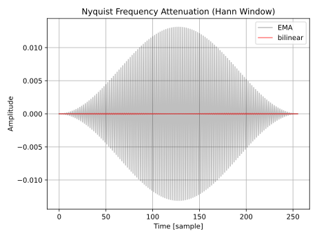

# 1 次ローパスのバイリニア変換
Exponential moving average (EMA) フィルタではナイキスト周波数の成分が残るので、バイリニア変換した 1 次ローパスフィルタを作ることにしました。

以下は 1 次ローパスの連続系での伝達関数です。

$$
H(s) = \frac{1}{1 + s/\omega_c}
$$

以下はバイリニア変換の式です。

$$
s = \frac{2}{T} \frac{1-z^{-1}}{1+z^{-1}}
$$

以降では $T=2$ とします。 $T=2$ とするとカットオフ周波数を $f_c / f_s$ と正規化できます。 $f_c$ はカットオフ周波数、 $f_s$ はサンプリング周波数です。

バイリニア変換の式を $H(s)$ に代入します。また、簡略化のために $k=1/\omega_c$ と置きます。

$$
\begin{aligned}
H(z)
&= \frac{1}{1 + k (1-z^{-1})/(1+z^{-1})} \\
&= \frac{1 + z^{-1}}{1+z^{-1} + k - k z^{-1}} \\
&= \frac{1 + z^{-1}}{(1 + k) + (1 - k) z^{-1}} \\
\end{aligned}
$$

以下はバイリニア変換による周波数歪みを考慮した $k$ の計算式です。

$$
k = \frac{1}{\tan(\pi f_c / f_s)}
$$

Python 3 で実装します。

```python
import numpy as np

sampleRate = 48000
cutoffHz = 10000

k = 1 / np.tan(np.pi * cutoffHz / sampleRate)
a0 = 1 + k
a1 = (1 - k) / a0
b = 1 / a0
sos = [[b, b, 0, 1, a1, 0]]
```

以下は周波数特性のプロットです。ゲイン特性とカットオフ周波数が -3 dB で交差していることが確認できました。厳密な交差点のゲインは $20 \log_{10} (1/\sqrt{2}) \approx -3.0103\ \text{dB}$ です。

<figure>

</figure>

## ナイキスト周波数でのゲイン
ナイキスト周波数のゲインは $z=-1$ を $H(z)$ に代入すると得られます。 $H(z)$ は分母が $1 + z^{-1}$ なので理論上のゲインは 0 です。

実際に計算すると理論通りに動かないことがあるので以下のコードで確認しました。 `x` が入力、 `y` が出力です

```python
x = np.ones(2**16)
x[1::2] = -1
y = signal.sosfilt(sos, x)
```

以下は `y` のプロットです。 0 に収束しています。

<figure>

</figure>

EMA フィルタよりは性能がいいことが見て取れます。

インパルス応答のような波形になっているのは、何もないところからサイン波がいきなり立ち上がったからです。 `x` が緩やかにフェードインするように窓関数をかけて再度試しました。

```python
x = np.ones(2**16)
x[1::2] = -1
x *= signal.get_window("hann", len(x))  # 追加。
y = signal.sosfilt(sos, x)
```

以下は `y` のプロットです。図を拡大すると振幅は小さいものの完全には 0 にならないことが分かります。それでも EMA より良い性能を維持しています。

<figure>

</figure>

## C++ による実装
C++ 20 で実装します。

```c++
#include <cmath>
#include <numbers>

// BLT: Bilinear transform.
template<typename Sample> class BLTLP1 {
private:
  Sample bn = 1;
  Sample a1 = -1; // Negated.
  Sample x1 = 0;
  Sample y1 = 0;

public:
  void reset()
  {
    x1 = 0;
    y1 = 0;
  }

  void setCutoff(Sample sampleRate, Sample cutoffHz)
  {
    constexpr Sample pi = std::numbers::pi_v<Sample>;
    auto k = std::tan(pi * cutoffHz / sampleRate);
    auto a0 = Sample(1) + Sample(1) / k;
    bn = Sample(1) / a0;
    a1 = (k - Sample(1)) / a0; // Negated.
  }

  Sample process(Sample x0)
  {
    y0 = bn * (x0 + x1) + a1 * y1;
    x1 = x0;
    return y1 = y0;
  }
};
```

## その他
### EMA フィルタの SOS
以下は EMA フィルタの伝達関数です。

$$
\begin{aligned}
H(z) &= \frac{k_p}{1 + (k_p - 1) z^{-1}}, \\
k_p &= -y + \sqrt{y^2 + 2 y}, \\
y &= 1 - \cos(2 \pi f_c / f_s).
\end{aligned}
$$

以下は `scipy.signal` の sos 形式で EMA フィルタを設計するコードです。

```python
def getEMASos(sampleRate, cutoffHz):
    y = 1 - np.cos(2 * np.pi * cutoffHz / sampleRate)
    kp = np.sqrt(y * y + 2 * y) - y
    return [[kp, 0, 0, 1, kp - 1, 0]]
```

### プロットに使ったコード
- [filter_notes/one_pole_lowpass/code/test.py at master · ryukau/filter_notes · GitHub](https://github.com/ryukau/filter_notes/blob/master/one_pole_lowpass/code/test.py)

## 参考文献
- [Understanding Low-Pass Filter Transfer Functions - Technical Articles](https://www.allaboutcircuits.com/technical-articles/understanding-transfer-functions-for-low-pass-filters/)
- [Bilinear transform - Wikipedia](https://en.wikipedia.org/wiki/Bilinear_transform)
