# Polyphase IIR フィルタ
ダウンサンプリングにつかう IIR (infinite impulse response) フィルタをポリフェイズ (polyphase) 化して direct form による実装と比べます。

## 理論
IIR フィルタの伝達関数から始めます。

$$
H(z) = \frac{B(z)}{A(z)} = \frac{\sum_{i=0}^{L} b_i z^{-i}}{1 + \sum_{i=1}^{N} a_i z^{-i}}.
$$

分母の多項式 $A$ を因数分解します。 $p_i$ は $H$ の極です。 $H$ は有理関数なので、その極とは $A(z)=0$ の解のことです。

$$
A(z) = \prod_{i=1}^{N} (1 - p_i z^{-1}).
$$

$z^M$ にあわせて極をスケーリングした伝達関数 $A_M$ を定義します。 $M$ はダウンサンプリングの倍率です。

$$
A_M(z^M) = \prod_{i=1}^{N} (1 - p_i^M z^{-M}).
$$

伝達関数に $A_M$ をねじこみます。

$$
H(z)
= \frac{B(z)}{A(z)} \cdot \frac{A_M(z^{-M})}{A_M(z^{-M})}
= \frac{Q(z)}{A_M(z^{-M})}, \quad \text{where} \enspace Q(z) = B(z) \dfrac{A_M(z^{-M})}{A(z)}.
$$

ここで $Q$ について以下の変形ができます。

$$
\begin{aligned}
B(z) \frac{A_M(z^M)}{A(z)}
&= B(z) \prod_{i=1}^{N} \frac{1 - (p_i z^{-1})^M}{1 - p_i z^{-1}} \\
&= B(z) \prod_{i=1}^{N} \frac{
  \cancel{(1 - (p_i z^{-1}))}(1 + (p_i z^{-1}) + (p_i z^{-1})^2 + (p_i z^{-1})^3 + \dots + (p_i z^{-1})^{M-1})
}{
  \cancel{1 - p_i z^{-1}}
} \\
&= B(z) \prod_{i=1}^{N} \left( \sum_{k=0}^{M-1} p_i^k z^{-k} \right).
\end{aligned}
$$

分母が 1 となって消えたので FIR です。 FIR である $Q$ はポリフェイズ分解できます。

$$
Q(z) = \sum_{k=0}^{M-1} z^{-k} Q_k(z^M).
$$

ここでは FIR のポリフェイズ分解の詳細は省略します。ざっくり言えばインデックス $n$ について $z^{-(nM+k)}$ の項を集めたものがポリフェイズ分解後の FIR となる $Q_k$ です。例えば $M=2$ で係数を $q_n$ とすると、 $Q_0 = q_0 z + q_2 z^{-2} + q_4 z^{-4}, \dots$ 、 $Q_1 = q_1 z^{-1} + q_3 z^{-3} + q_5 z^{-5}, \dots$ となります。

$H$ に戻ります。

$$
H(z) = \sum_{k=0}^{M-1} z^{-k} \frac{Q_k(z^M)}{A_M(z^M)}.
$$

分母を含めてポリフェイズ分解できています。

## 設計
以下は SciPy, NumPy を使ったフィルタ設計の実装例です。「[実装](#実装)」の節に mpmath を使った任意制度計算の実装例を掲載しています。

```python
import numpy as np
from scipy import signal

def design_polyphase_butterworth_numpy(order, cutoff, M):
    z, p, k = signal.butter(order, cutoff, btype="low", output="zpk", analog=False)

    p_new = p**M
    denom_low = np.real(np.poly(p_new))

    s = np.array([1.0], dtype=complex)
    for pi in p:
        S_i = pi ** np.arange(M)
        s = np.convolve(s, S_i)
    s = np.real(s)  # Imaginary parts cancel out since poles occur in conjugate pairs

    b = np.real(np.poly(z)) * k
    q = np.convolve(b, s)

    polyphase_branches = []
    for k in range(M):
        coeffs = q[k::M]
        polyphase_branches.append(coeffs)

    return polyphase_branches, denom_low
```

プロトタイプとなる [zpk 形式の伝達関数](https://www.mathworks.com/help/control/ref/zpk.html)から $A_M$ と $Q_k$ を求めれば計算できる形になります。 zpk は MATLAB や SciPy で使われている伝達関数のゼロ、極、ゲイン (zero, pole, gain) の組です。 SciPy では [`scipy.signal.butter`](https://docs.scipy.org/doc/scipy/reference/generated/scipy.signal.butter.html) や [`scipy.signal.ellip`](https://docs.scipy.org/doc/scipy/reference/generated/scipy.signal.ellip.html) の引数に `output="zpk"` を指定すれば zpk の組が得られます。

## 計算方法
高速で正確な計算方法を検討します。計算方法のバリエーションには以下の軸があります。

- 軸 1 : フィルタ係数の表現をすべて [SOS](https://docs.scipy.org/doc/scipy/tutorial/signal.html#second-order-sections-representation) にするか、分子と分母を分けて計算するか。
- 軸 2 : 単純加算するか、 [Kahan summation](https://en.wikipedia.org/wiki/Kahan_summation_algorithm) を使うか。

以降では、軸 1 の分子と分母を分けて計算する方法のことをハイブリッド (hybrid) と呼ぶことにします。ハイブリッド形式では分子を FIR 、分母を SOS として計算します。分子を別に計算するため、分母の SOS は 1 セクションあたりの係数を $a_1, a_2$ の 2 つに減らせます。

軸 2 の Kahan summation はポリフェイズ出力と、ハイブリッドの FIR の計算に適用できます。単純加算に比べると遅くなりますが、その遅さが許容範囲内か、また意味のある正確さの向上が得られるかについて調べます。

以下は C++20 での実装へのリンクです。リンク先のコードには、いくつか FMA の無しの実装が含まれています。この文章では FMA 有りの実装のみについて検討します。

- [filter_notes/polyphase_iir/polyphaseiir.hpp at master · ryukau/filter_notes · GitHub](https://github.com/ryukau/filter_notes/blob/master/polyphase_iir/polyphaseiir.hpp)

### テスト結果
数が多いので折りたたんでいます。

##### Butterworth, order = 4, M = 2, fc/fs = 0.125

<details>
<summary>速度と正確さの比較</summary>

###### `cl /std:c++20 /O2 /EHsc /arch:AVX2`, Microsoft (R) C/C++ Optimizing Compiler Version 19.51.36248 for x64

<figure>
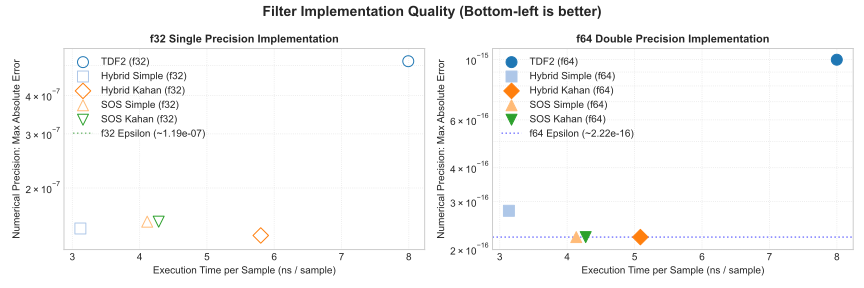
</figure>

###### `clang++ -std=c++20 -O3 -mfma -march=native`, clang 22.1.3 x86_64-pc-windows-msvc

<figure>
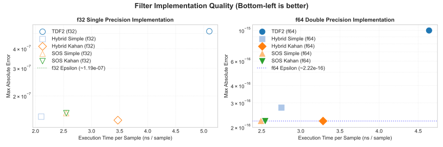
</figure>

###### `g++ -std=c++20 -O3 -mfma -march=native`, g++ (GCC) 16.1.1 20260515 (Red Hat 16.1.1-2)

<figure>
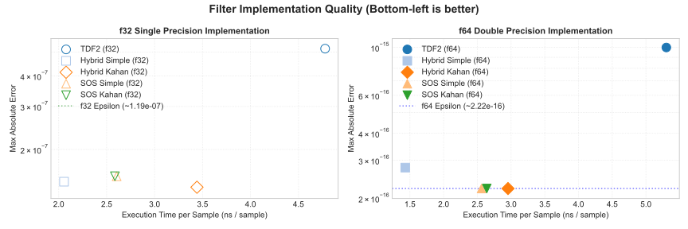
</figure>

</details>

<details>
<summary>周波数特性</summary>

###### `cl /std:c++20 /O2 /EHsc /arch:AVX2`, Microsoft (R) C/C++ Optimizing Compiler Version 19.51.36248 for x64

<figure>
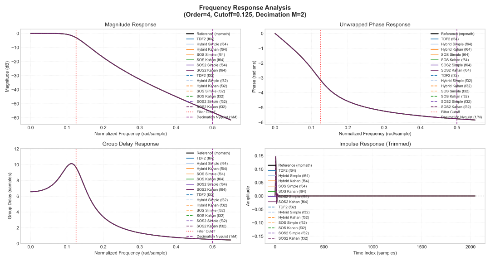
</figure>

###### `clang++ -std=c++20 -O3 -mfma -march=native`, clang 22.1.3 x86_64-pc-windows-msvc

<figure>

</figure>

###### `g++ -std=c++20 -O3 -mfma -march=native`, g++ (GCC) 16.1.1 20260515 (Red Hat 16.1.1-2)

<figure>
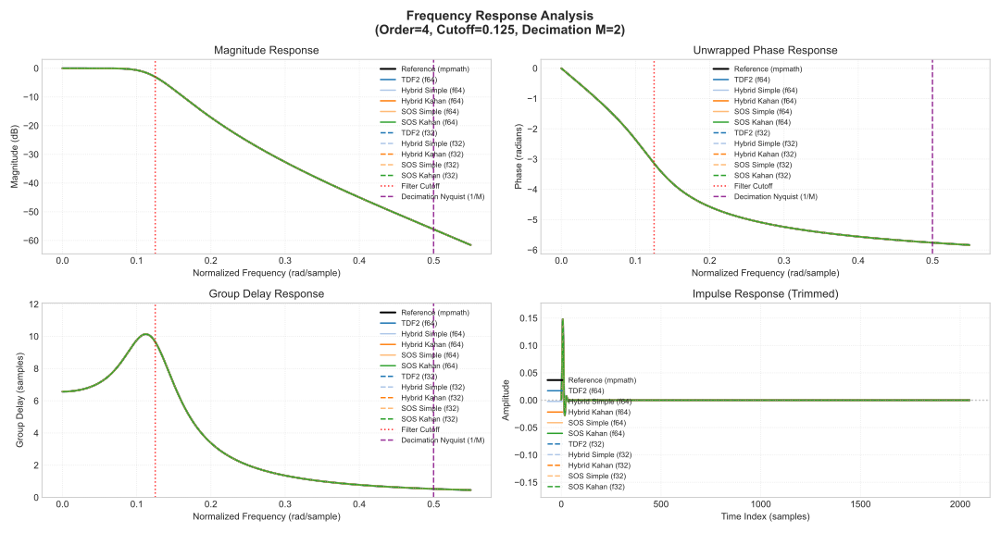
</figure>

</details>

##### Butterworth, order = 8, M = 4, fc/fs = 0.03125

<details>
<summary>速度と正確さの比較</summary>

###### `cl /std:c++20 /O2 /EHsc /arch:AVX2`, Microsoft (R) C/C++ Optimizing Compiler Version 19.51.36248 for x64

<figure>
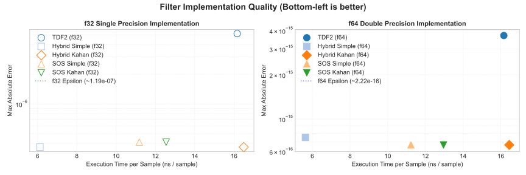
</figure>

###### `clang++ -std=c++20 -O3 -mfma -march=native`, clang 22.1.3 x86_64-pc-windows-msvc

<figure>
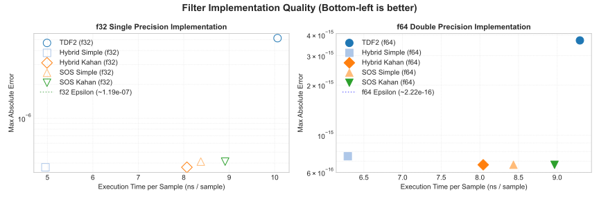
</figure>

###### `g++ -std=c++20 -O3 -mfma -march=native`, g++ (GCC) 16.1.1 20260515 (Red Hat 16.1.1-2)

<figure>
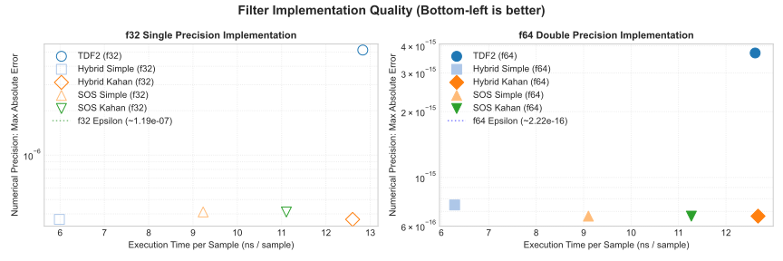
</figure>

</details>

<details>
<summary>周波数特性</summary>

###### `cl /std:c++20 /O2 /EHsc /arch:AVX2`, Microsoft (R) C/C++ Optimizing Compiler Version 19.51.36248 for x64

<figure>
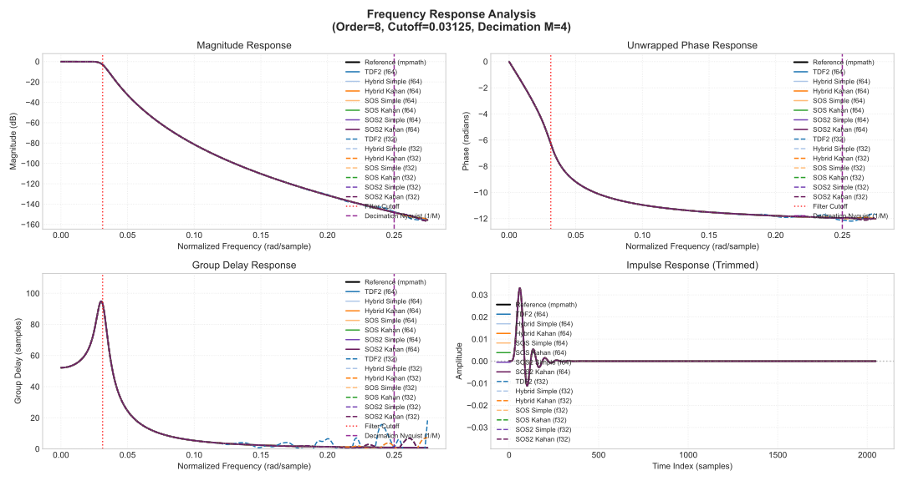
</figure>

###### `clang++ -std=c++20 -O3 -mfma -march=native`, clang 22.1.3 x86_64-pc-windows-msvc

<figure>

</figure>

###### `g++ -std=c++20 -O3 -mfma -march=native`, g++ (GCC) 16.1.1 20260515 (Red Hat 16.1.1-2)

<figure>

</figure>

</details>

##### Butterworth, order = 12, M = 4, fc/fs = 0.02

<details>
<summary>速度と正確さの比較</summary>

###### `cl /std:c++20 /O2 /EHsc /arch:AVX2`, Microsoft (R) C/C++ Optimizing Compiler Version 19.51.36248 for x64

<figure>
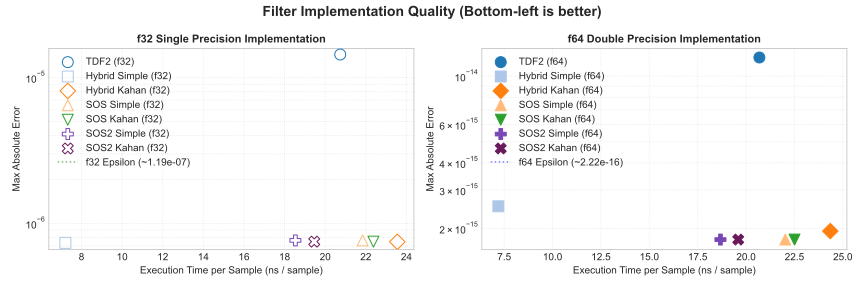
</figure>

###### `clang++ -std=c++20 -O3 -mfma -march=native`, clang 22.1.3 x86_64-pc-windows-msvc

<figure>
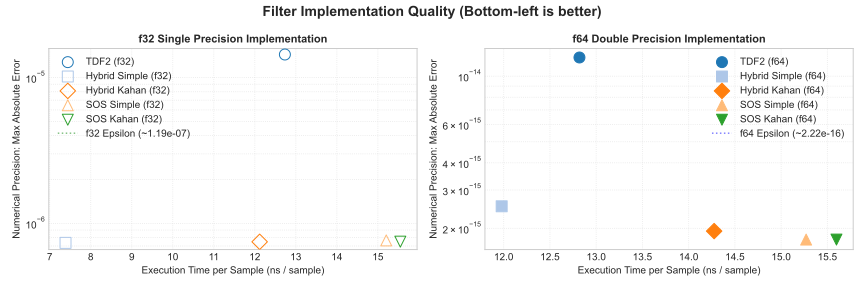
</figure>

###### `g++ -std=c++20 -O3 -mfma -march=native`, g++ (GCC) 16.1.1 20260515 (Red Hat 16.1.1-2)

<figure>
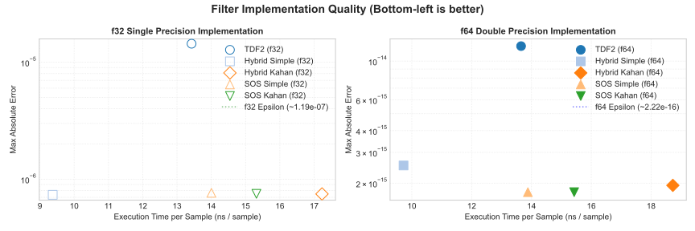
</figure>

</details>

<details>
<summary>周波数特性</summary>

###### `cl /std:c++20 /O2 /EHsc /arch:AVX2`, Microsoft (R) C/C++ Optimizing Compiler Version 19.51.36248 for x64

<figure>
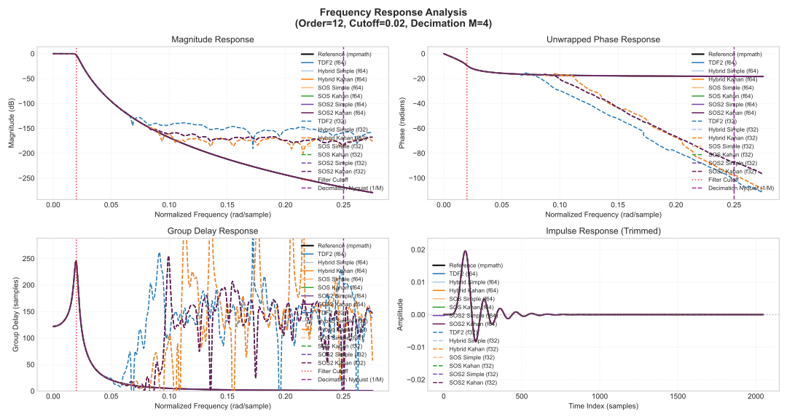
</figure>

###### `clang++ -std=c++20 -O3 -mfma -march=native`, clang 22.1.3 x86_64-pc-windows-msvc

<figure>
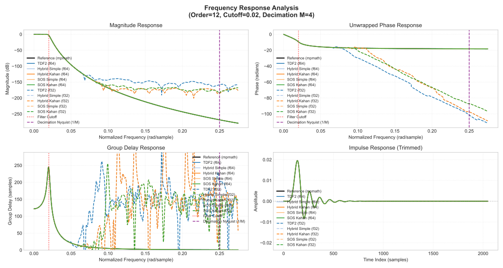
</figure>

###### `g++ -std=c++20 -O3 -mfma -march=native`, g++ (GCC) 16.1.1 20260515 (Red Hat 16.1.1-2)

<figure>

</figure>

</details>

##### Butterworth, order = 16, M = 8, fc/fs = 0.015625

<details>
<summary>速度と正確さの比較</summary>

###### `cl /std:c++20 /O2 /EHsc /arch:AVX2`, Microsoft (R) C/C++ Optimizing Compiler Version 19.51.36248 for x64

<figure>
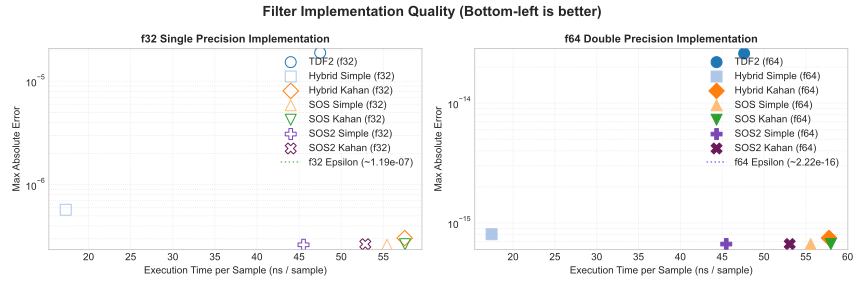
</figure>

###### `clang++ -std=c++20 -O3 -mfma -march=native`, clang 22.1.3 x86_64-pc-windows-msvc

<figure>
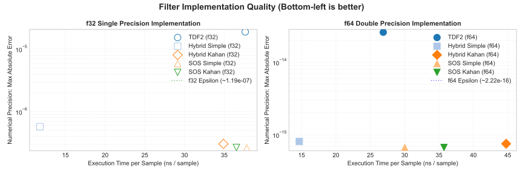
</figure>

###### `g++ -std=c++20 -O3 -mfma -march=native`, g++ (GCC) 16.1.1 20260515 (Red Hat 16.1.1-2)

<figure>
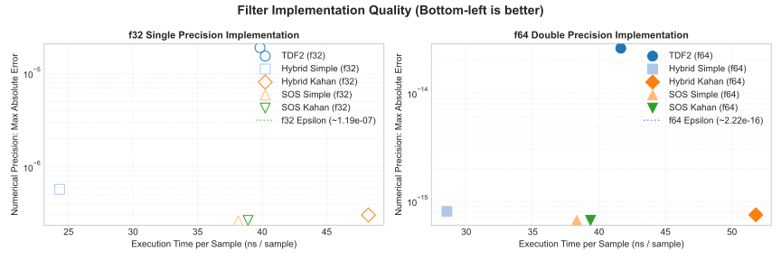
</figure>

</details>

<details>
<summary>周波数特性</summary>

###### `cl /std:c++20 /O2 /EHsc /arch:AVX2`, Microsoft (R) C/C++ Optimizing Compiler Version 19.51.36248 for x64

<figure>
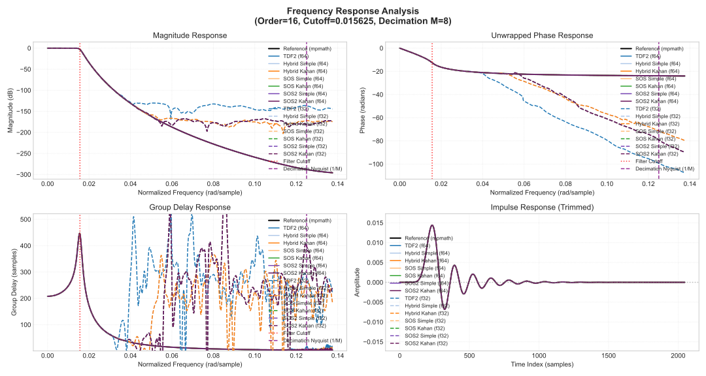
</figure>

###### `clang++ -std=c++20 -O3 -mfma -march=native`, clang 22.1.3 x86_64-pc-windows-msvc

<figure>
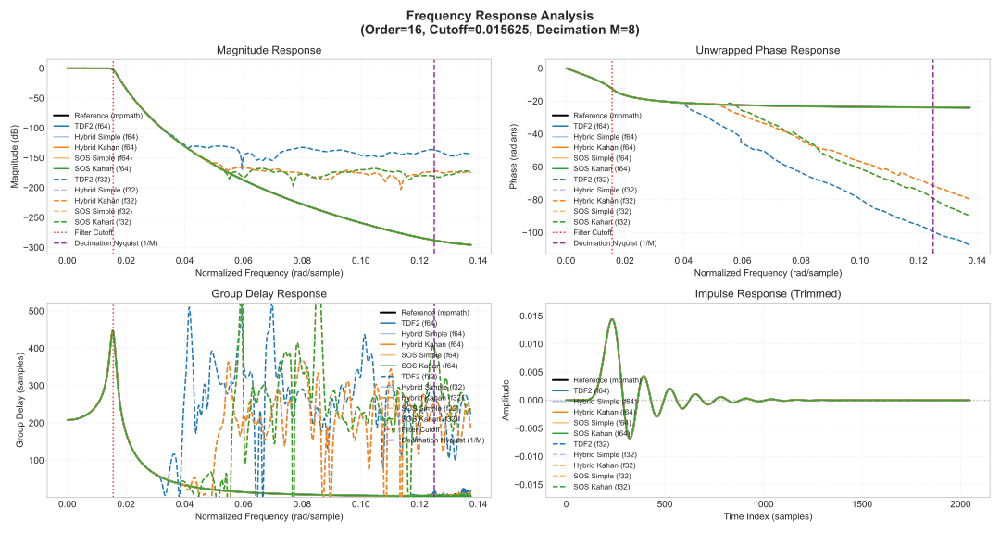
</figure>

###### `g++ -std=c++20 -O3 -mfma -march=native`, g++ (GCC) 16.1.1 20260515 (Red Hat 16.1.1-2)

<figure>

</figure>

</details>

##### Butterworth, order = 16, M = 32, fc/fs = 0.0078125
1 / 64 倍のダウンサンプリングの 1 ステージ目として設計したフィルタです。 2 ステージ以上に分割したほうが速いかもしれません。

<details>
<summary>速度と正確さの比較</summary>

###### `cl /std:c++20 /O2 /EHsc /arch:AVX2`, Microsoft (R) C/C++ Optimizing Compiler Version 19.51.36248 for x64

<figure>
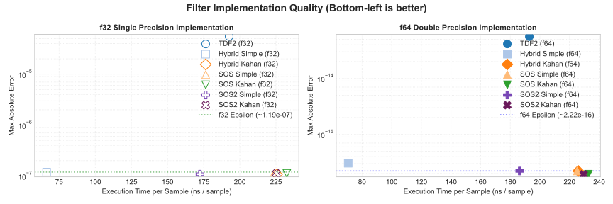
</figure>

###### `clang++ -std=c++20 -O3 -mfma -march=native`, clang 22.1.3 x86_64-pc-windows-msvc

<figure>
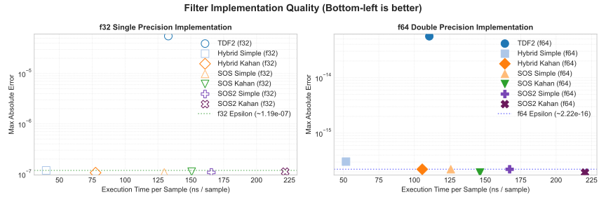
</figure>

###### `g++ -std=c++20 -O3 -mfma -march=native`, g++ (GCC) 16.1.1 20260515 (Red Hat 16.1.1-2)

<figure>
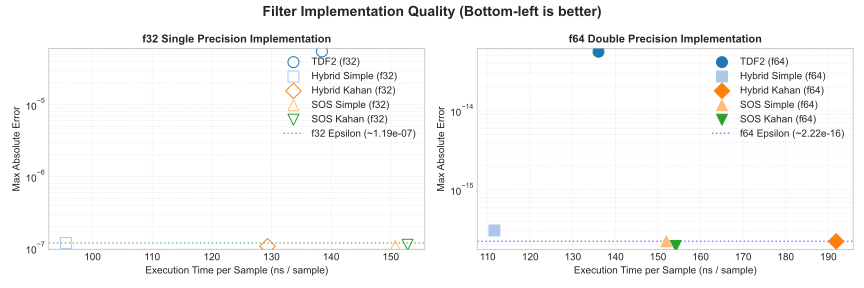
</figure>

</details>

<details>
<summary>周波数特性</summary>

###### `cl /std:c++20 /O2 /EHsc /arch:AVX2`, Microsoft (R) C/C++ Optimizing Compiler Version 19.51.36248 for x64

<figure>
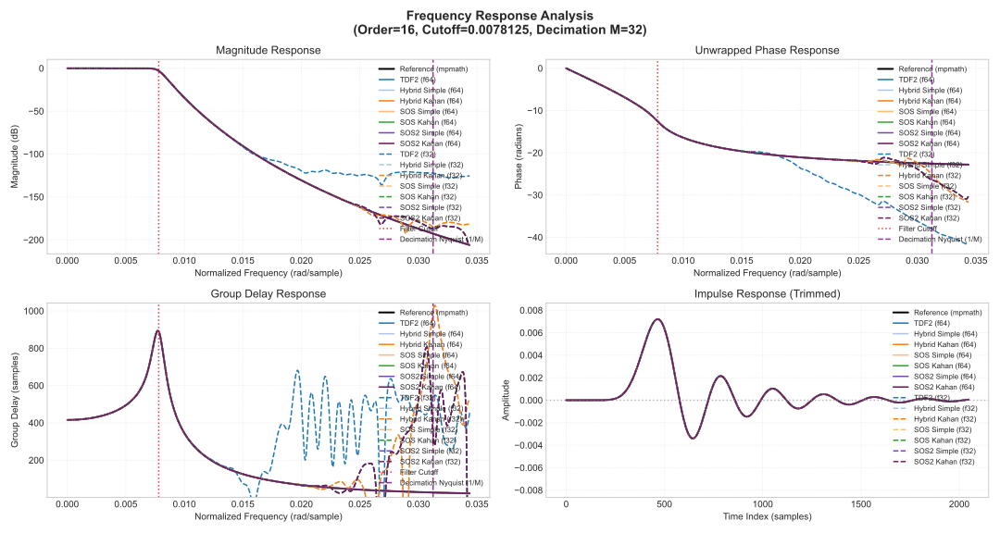
</figure>

###### `clang++ -std=c++20 -O3 -mfma -march=native`, clang 22.1.3 x86_64-pc-windows-msvc

<figure>

</figure>

###### `g++ -std=c++20 -O3 -mfma -march=native`, g++ (GCC) 16.1.1 20260515 (Red Hat 16.1.1-2)

<figure>
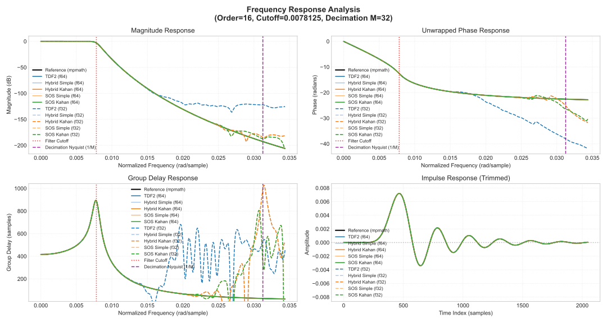
</figure>

</details>

#### 所見
Butterworth フィルタについては、どの polyphase IIR の実装であっても速度、正確さ共に transposed direct form II (TDF-II) を超える性能と言えそうです。

Hybrid Simple が速いです。 Hybrid Simple は伝達関数の分子を FIR として計算しており、また FIR 内で Kahan summation を使っていない実装です。

SOS Simple が二番目に早いです。 `clang++` では f64, order = 4, M = 2 のフィルタで Hybrid Simple を上回る性能になっています。

Kahan summation については予想通り遅くなっています。正確さについては大きく向上するとは言い難く、一部のケースを除いて SOS Simple のほうが正確に見えます。

f64 と f32 で実行速度がほぼ同じです。 IIR フィルタと Kahan summation は 1 サンプル前の計算結果を利用するので自動ベクトル化が入らないことが原因と考えられます。 Hybrid Simple は FIR 部分で自動ベクトル化が入っています (`g++` で確認) 。複数の信号を SIMD で並列計算するときは f32 のほうが速くなると予想されます。

f32 の実装は振幅特性が -120 dB を下回るあたりから周波数特性が歪んでいます。周波数特性がおかしく見えるフィルタはすべて f32 の実装です。プロット上の点線が f32 、実線が f64 です。

### 係数の数
以下は軸 1 のフィルタ係数の表現の違いによる係数の数を比較した表です。ハイブリッド形式のほうがフィルタ係数の数が少なくなる傾向があります。 SOS 形式については $a_0=1$ とすることで、 1 セクションあたりの係数の数を 5 として数えています。

<details>
<summary>ハイブリッド形式の係数の数の表</summary>

↓ Order \ M → | 1 |  2 |  3 |  4 |  5 |  6 |   7 |   8 |  9 |  10 |  11 |  12 |  13 |  14 |  15 |  16
-------------:|--:|---:|---:|---:|---:|---:|----:|----:|---:|----:|----:|----:|----:|----:|----:|---:
1             |   |    |    |    |    |    |     |     |    |     |     |     |     |     |     |    
2             |   |  7 |    |    |    |    |     |     |    |     |     |     |     |     |     |    
3             |   |    | 14 |    |    |    |     |     |    |     |     |     |     |     |     |    
4             |   | 13 |    | 21 |    |    |     |     |    |     |     |     |     |     |     |    
5             |   |    |    |    | 32 |    |     |     |    |     |     |     |     |     |     |    
6             |   | 19 | 25 |    |    | 43 |     |     |    |     |     |     |     |     |     |    
7             |   |    |    |    |    |    |  58 |     |    |     |     |     |     |     |     |    
8             |   | 25 |    | 41 |    |    |     |  73 |    |     |     |     |     |     |     |    
9             |   |    | 38 |    |    |    |     |     | 92 |     |     |     |     |     |     |    
10            |   | 31 |    |    | 61 |    |     |     |    | 111 |     |     |     |     |     |    
11            |   |    |    |    |    |    |     |     |    |     | 134 |     |     |     |     |    
12            |   | 37 | 49 | 61 |    | 85 |     |     |    |     |     | 157 |     |     |     |    
13            |   |    |    |    |    |    |     |     |    |     |     |     | 184 |     |     |    
14            |   | 43 |    |    |    |    | 113 |     |    |     |     |     |     | 211 |     |    
15            |   |    | 62 |    | 92 |    |     |     |    |     |     |     |     |     | 242 |    
16            |   | 49 |    | 81 |    |    |     | 145 |    |     |     |     |     |     |     | 273

</details>

<details>
<summary>SOS 形式の係数の数の表</summary>

Order \ M | 1 |  2 |   3 |   4 |   5 |   6 |   7 |   8 |   9 |  10 |  11 |  12 |  13 |  14 |  15 |  16
---------:|--:|---:|----:|----:|----:|----:|----:|----:|----:|----:|----:|----:|----:|----:|----:|---:
1         |   |    |     |     |     |     |     |     |     |     |     |     |     |     |     |    
2         |   | 10 |     |     |     |     |     |     |     |     |     |     |     |     |     |    
3         |   |    |  30 |     |     |     |     |     |     |     |     |     |     |     |     |    
4         |   | 20 |     |  40 |     |     |     |     |     |     |     |     |     |     |     |    
5         |   |    |     |     |  75 |     |     |     |     |     |     |     |     |     |     |    
6         |   | 30 |  45 |     |     |  90 |     |     |     |     |     |     |     |     |     |    
7         |   |    |     |     |     |     | 140 |     |     |     |     |     |     |     |     |    
8         |   | 40 |     |  80 |     |     |     | 160 |     |     |     |     |     |     |     |    
9         |   |    |  75 |     |     |     |     |     | 225 |     |     |     |     |     |     |    
10        |   | 50 |     |     | 125 |     |     |     |     | 250 |     |     |     |     |     |    
11        |   |    |     |     |     |     |     |     |     |     | 330 |     |     |     |     |    
12        |   | 60 |  90 | 120 |     | 180 |     |     |     |     |     | 360 |     |     |     |    
13        |   |    |     |     |     |     |     |     |     |     |     |     | 455 |     |     |    
14        |   |    |     |     |     |     | 245 |     |     |     |     |     |     | 490 |     |    
15        |   |    | 120 |     | 200 |     |     |     |     |     |     |     |     |     | 600 |    
16        |   |    |     | 160 |     |     |     | 320 |     |     |     |     |     |     |     | 640

</details>

## 実装
以下は Python による設計コードと C++20 による Hybrid Simple のフィルタ実装です。

<details>
<summary>Python によるフィルタ設計の実装例</summary>

次数が高いフィルタは正確に設計できないことがあるので mpmath を使っています。 `tf2sos_mp` を省略しているので、そのままでは動きません。


```python
from mpmath import mp

def design_polyphase_iir(
    z_mp,
    p_mp,
    k_mp,
    M: int,
    output: str = "ba",
    as_float: bool = False,
    workdps: int | None = None,
):
    """
    Decomposes an arbitrary IIR filter (given by its zeros, poles, and gain)
    for polyphase down-sampling.

    Parameters:
    -----------
    z_mp : list or iterable
        Zeros of the filter as mpmath numbers.
    p_mp : list or iterable
        Poles of the filter as mpmath numbers.
    k_mp : mpmath number
        System gain.
    M : int
        Down-sampling factor.
    output : str, optional
        Format of the output filter: "ba", "sos", or "hybrid".
    as_float : bool, optional
        Cast the coefficients to Python float.
    workdps : int, optional
        Working precision in decimal places (dps). If None, the current
        ambient mpmath precision context is used.

    Returns:
    --------
    tuple or list
        The returned structure depends on the value of the `output` parameter:
        * If "ba" (default):
          Returns a tuple `(q_polyphase, a_low_poly)` where:
            - `q_polyphase` (list of lists): Numerator coefficients for each of the `M` polyphase branches.
            - `a_low_poly` (list): Denominator coefficients shared by all branches (expressed in powers of z^-M).
        * If "sos":
          Returns `sos_polyphase` (list of lists of lists): A list of length `M` containing the Second-Order Section (SOS) representations for each polyphase branch.
        * If "hybrid":
          Returns a tuple `(q_polyphase, sos_sections)` where:
            - `q_polyphase` (list of lists): Numerator coefficients for each of the `M` polyphase branches.
            - `sos_sections` (list of lists): Denominator coefficients `[a1, a2]` for each pole pair.

        Coefficients are returned as standard Python floats if `as_float` is True; otherwise, they are `mpmath` types.
    """
    if output not in ("ba", "sos", "hybrid"):
        raise ValueError("output must be one of 'ba', 'sos', or 'hybrid'")

    with mp.workdps(workdps):

        def poly_from_roots(roots):
            """
            Expands (x - r1)(x - r2)... into polynomial coefficients.
            Returns coefficients in descending order of powers (highest power first).
            """
            c = [mp.mpf(1)]
            for r in roots:
                c += [0]
                for i in range(len(c) - 1, 0, -1):
                    c[i] -= r * c[i - 1]
            return c

        def convolve(a, b):
            len_a = len(a)
            len_b = len(b)
            out = [mp.mpf(0.0)] * (len_a + len_b - 1)
            for i in range(len_a):
                for j in range(len_b):
                    out[i + j] += a[i] * b[j]
            return out

        b_poly = [mp.re(x * k_mp) for x in poly_from_roots(z_mp)]

        p_new = [p**M for p in p_mp]
        a_low_poly = [mp.re(x) for x in poly_from_roots(p_new)]

        s_poly = [mp.mpc(1.0)]
        for pi in p_mp:
            S_i = [pi**k for k in range(M)]
            s_poly = convolve(s_poly, S_i)
        s_poly = [mp.re(x) for x in s_poly]

        q_poly = [mp.re(x) for x in convolve(b_poly, s_poly)]

        q_polyphase = []
        for k in range(M):
            q_polyphase.append(q_poly[k::M])

        if output == "ba":
            if as_float:
                q_polyphase = apply(q_polyphase, float)
                a_low_poly = apply(a_low_poly, float)
            return q_polyphase, a_low_poly

        elif output == "sos":
            sos_polyphase = []
            for k in range(M):
                q_k = q_poly[k::M]
                sos_section = tf2sos_mp(q_k, a_low_poly)
                sos_polyphase.append(sos_section)

            if as_float:
                sos_polyphase = apply(sos_polyphase, float)
            return sos_polyphase

        elif output == "hybrid":
            sos_sections = []
            pool = list(p_new)
            while len(pool) > 0:
                p1 = pool.pop(0)

                if abs(mp.im(p1)) < 1e-20:
                    a1 = -mp.re(p1)
                    a2 = mp.mpf(0.0)
                    sos_sections.append([a1, a2])
                    continue

                best_idx = -1
                best_err = mp.mpf("inf")

                for i, p2 in enumerate(pool):
                    err = abs(p1 - mp.conj(p2))
                    if err < best_err:
                        best_err = err
                        best_idx = i

                if best_idx != -1:
                    p2 = pool.pop(best_idx)
                    a1 = -2 * mp.re(p1)
                    a2 = abs(p1) ** 2
                    sos_sections.append([a1, a2])
                else:
                    a1 = -mp.re(p1)
                    a2 = mp.mpf(0.0)
                    sos_sections.append([a1, a2])

            if as_float:
                q_polyphase = apply(q_polyphase, float)
                sos_sections = apply(sos_sections, float)
            return q_polyphase, sos_sections
```

</details>

<details>
<summary>C++20 による Hybrid Simple の実装</summary>

```c++
#pragma once

#include <array>
#include <cmath>
#include <concepts>
#include <cstddef>
#include <ranges>
#include <tuple>
#include <utility>

// Hybrid 形式の polyphase IIR の係数。 (Butterworth, order=8, cutoff=0.3125, M=4)
template<typename T> struct Hybrid {
  static constexpr int nPhase = 4; // 文中の M に対応。

  // 分母の SOS: {a1, a2} for 1 / (1 + a1*z^-1 + a2*z^-2)
  static constexpr std::array<std::array<T, 2>, 4> denom{{
    { T(7.60834734050858330e-01), T(2.70020217408328600e-01) },
    { T(2.45817342985895443e-01), T(1.83487154523652787e-02) },
    { T(6.21709429503566474e-02), T(1.10913984116065879e-03) },
    { T(-8.69548164131942261e-03), T(1.06677160707193438e-04) },
  }};

  // 分子の FIR.
  static constexpr std::array<std::array<T, 9>, nPhase> branches{{
    { T(4.67360371460534638e-04), T(1.78965525913988399e-01), T(2.66265704737198072e-01), T(1.82695165925812308e-01), T(3.59985359464480154e-02), T(3.47770758488648735e-03), T(9.76101633490265749e-05), T(5.13705983926379128e-07), T(5.56796711341444609e-11) },
    { T(5.13399690923943292e-03), T(2.82921645103193231e-01), T(2.25756981966161091e-01), T(1.35987195285923984e-01), T(2.25319762725637897e-02), T(1.58374704330561684e-03), T(3.19637728170234209e-05), T(9.14850632661454864e-08), T(0.00000000000000000e+00) },
    { T(2.62245483078802598e-02), T(3.38960281490826409e-01), T(2.16172793820407716e-01), T(8.99252575894855938e-02), T(1.32404246635418957e-02), T(6.76027869152339453e-04), T(9.30032662397550523e-06), T(1.25270724575848982e-08), T(0.00000000000000000e+00) },
    { T(8.25615432363466933e-02), T(3.22027248938468458e-01), T(2.10495757082402951e-01), T(5.67774689416133613e-02), T(7.09628583197262353e-03), T(2.68501683273136621e-04), T(2.36627742844577689e-06), T(1.17002404623042308e-09), T(0.00000000000000000e+00) },
  }};
};

template<std::floating_point T, auto Coefficients> class FirSection {
private:
  static constexpr std::size_t N = Coefficients.size();

  alignas(64) std::array<T, (N > 0 ? N - 1 : 0)> s{};

public:
  void reset() { s.fill(T(0)); }

  inline T process(T input) {
    if constexpr (N == 0) { return T(0); }

    constexpr auto b0 = Coefficients[0];
    if constexpr (N == 1) { return b0 * input; }

    T y = std::fma(b0, input, s[0]);
    for (std::size_t i = 0; i < N - 2; ++i) {
      s[i] = std::fma(Coefficients[i + 1], input, s[i + 1]);
    }
    s[N - 2] = Coefficients[N - 1] * input;
    return y;
  }
};

template<std::floating_point T, auto Coefficients> class IirSection {
private:
  static constexpr std::size_t nSections = Coefficients.size();
  std::array<std::array<T, 2>, nSections> s{};

  template<std::size_t... I> inline void process_sections(T& val, std::index_sequence<I...>) {
    ((process_one_section<I>(val)), ...);
  }

  template<std::size_t Index> inline void process_one_section(T& val) {
    T y_out = val + s[Index][0];
    s[Index][0] = std::fma(-Coefficients[Index][0], y_out, s[Index][1]);
    s[Index][1] = -Coefficients[Index][1] * y_out;
    val = y_out;
  }

public:
  void reset() {
    for (auto& sec : s) { sec.fill(T(0)); }
  }

  inline T process(T input) {
    if constexpr (nSections == 0) { return input; }
    T y = input;
    process_sections(y, std::make_index_sequence<nSections>{});
    return y;
  }
};

template<std::floating_point T, typename Coefficients> class PolyphaseIir {
public:
  static constexpr int nPhase = Coefficients::nPhase;

private:
  template<std::size_t... I> static auto make_fir_tuple(std::index_sequence<I...>) {
    return std::tuple<FirSection<T, Coefficients::branches[I]>...>{};
  }
  using FirTuple = decltype(make_fir_tuple(std::make_index_sequence<nPhase>{}));

  FirTuple fir_branches;
  IirSection<T, Coefficients::denom> iir_filter;

  template<std::size_t Index> inline T process_branch(T input) {
    return std::get<Index>(fir_branches).process(input);
  }

  template<std::size_t... I>
  inline T sum_branches(const std::array<T, nPhase>& inputs, std::index_sequence<I...>) {
    return (... + process_branch<I>(inputs[I]));
  }

  template<std::size_t... I> inline void reset_branches(std::index_sequence<I...>) {
    ((std::get<I>(fir_branches).reset()), ...);
  }

public:
  void reset() {
    reset_branches(std::make_index_sequence<nPhase>{});
    iir_filter.reset();
  }

  inline T process(const std::array<T, nPhase>& inputs) {
    T fir_sum = sum_branches(inputs, std::make_index_sequence<nPhase>{});
    return iir_filter.process(fir_sum);
  }
};

// 使用例。
template<std::floating_point T> auto down_sample(std::vector<T>& inputs) {
  PolyphaseIir<T, Hybrid<T>> filter;

  constexpr size_t M = Hybrid<T>::nPhase;
  constexpr size_t n_sample = inputs.size() / M;

  std::vector<T> outputs;
  outputs.reserve(n_sample);

  for (size_t n = 0; n < n_sample; n += M) {
    std::array<T, M> frame;
    for (size_t k = 0; k < M; ++k) { frame[k] = inputs[n + k]; }
    outputs.push_back(filter.process(frame));
  }

  return outputs;
}
```

</details>

完全な形のコードを以下のリンク先に掲載しています。

- [filter_notes/polyphase_iir at master · ryukau/filter_notes · GitHub](https://github.com/ryukau/filter_notes/tree/master/polyphase_iir)

Python による完全な設計コードはリンク先の `design.py` と `signal_mp.py` に書かれています。 `design.py` は `design_polyphase_iir` を含むメインの設計コード、 `signal_mp.py` は主に SciPy の実装を mpmath に移植したものです。

C++20 による他のフィルタ形式の実装は `polyphaseiir.hpp` に書かれています。

## その他
### テスト結果の詳細
ベンチマークの [Msps](https://www.analog.com/en/resources/glossary/msps.html) は mega-sample per second です。

誤差については "Abs Error" と "Rel Error, Tol=1.19e-07" が性能を表しています。 "Rel Error, Tol=0" は誤差が大きくなりすぎるので、あまり参考にはなりません。 IIR フィルタは安定な条件を満たしていても小さい値で発振することがあるからです。誤差が大きめのため、 ULP は意味のある指標とは言い難いです。

`g++` の結果が遅めに見えます。 `cl` と `clang++` は Windows 11 の上で実行していますが、 `g++` のみ WSL 上で実行したことが影響しているかもしれません。

<details>
<summary><code>cl</code></summary>

```
Loading existing reference file from data/reference_4_2.json
Code-generated coefficients header written to coefficients.hpp
Running: cl /std:c++20 /O2 /EHsc /arch:AVX2 test_runner.cpp /Fetest_runner /DENABLE_BENCHMARK=1
Running: ./test_runner.exe data/reference_4_2.json data/results_4_2_cl.json

## Benchmarks

| Implementation    | Time (ms) | ns / Sample | Throughput (MSps) | nSample |
|:------------------|----------:|------------:|------------------:|--------:|
| Tdf2 F64          |      7.62 |        7.94 |            126.01 |  960000 |
| Hybrid Simple F64 |      2.98 |        3.11 |            321.68 |  960000 |
| Hybrid Kahan F64  |      4.84 |        5.04 |            198.34 |  960000 |
| Sos Simple F64    |      3.89 |        4.05 |            246.91 |  960000 |
| Sos Kahan F64     |      4.02 |        4.18 |            239.08 |  960000 |
| Tdf2 F32          |      7.61 |        7.93 |            126.13 |  960000 |
| Hybrid Simple F32 |      2.98 |        3.10 |            322.27 |  960000 |
| Hybrid Kahan F32  |      4.79 |        4.99 |            200.59 |  960000 |
| Sos Simple F32    |      3.86 |        4.02 |            248.79 |  960000 |
| Sos Kahan F32     |      4.08 |        4.25 |            235.20 |  960000 |

## Filter=butterworth, Order=4, Cutoff=0.125, M=2
Results are shown as Max / Mean.

| Implementation          | Abs Error               | Rel Error, Tol=0          | Rel Error, Tol=1.19e-07 | ULP                 |
|:------------------------|:------------------------|:--------------------------|:------------------------|:--------------------|
| Tdf2 F64 Noise          | 9.9920e-16 / 8.7185e-17 | 1.0331e-11 / 2.6748e-15   | 1.0331e-11 / 2.6748e-15 | 8.53e+04 / 1.79e+01 |
| Tdf2 F64 Ir             | 5.5511e-17 / 9.1978e-21 | 9.2000e+01 / 2.1238e-01   | 9.8228e-14 / 2.4264e-15 | 6.05e+05 / 1.91e+02 |
| Hybrid Simple F64 Noise | 2.7756e-16 / 2.5968e-17 | 3.1398e-12 / 8.6712e-16   | 3.1398e-12 / 8.6712e-16 | 2.59e+04 / 5.73e+00 |
| Hybrid Simple F64 Ir    | 2.7756e-17 / 1.6804e-21 | 2.0000e+00 / 2.4643e-03   | 1.3548e-13 / 2.8702e-15 | 5.00e+05 / 9.72e+01 |
| Hybrid Kahan F64 Noise  | 2.2204e-16 / 2.6129e-17 | 3.1398e-12 / 8.2794e-16   | 3.1398e-12 / 8.2794e-16 | 2.59e+04 / 5.51e+00 |
| Hybrid Kahan F64 Ir     | 2.7756e-17 / 1.6804e-21 | 2.0000e+00 / 2.4643e-03   | 1.3548e-13 / 2.8702e-15 | 5.00e+05 / 9.72e+01 |
| Sos Simple F64 Noise    | 2.2204e-16 / 3.1004e-17 | 2.0056e-12 / 1.0310e-15   | 2.0056e-12 / 1.0310e-15 | 1.66e+04 / 6.81e+00 |
| Sos Simple F64 Ir       | 2.7756e-17 / 4.1063e-21 | 1.0000e+00 / 1.0944e-03   | 1.3014e-13 / 2.5965e-15 | 4.67e+05 / 9.41e+01 |
| Sos Kahan F64 Noise     | 2.2204e-16 / 3.1004e-17 | 2.0056e-12 / 1.0310e-15   | 2.0056e-12 / 1.0310e-15 | 1.66e+04 / 6.81e+00 |
| Sos Kahan F64 Ir        | 2.7756e-17 / 4.1063e-21 | 1.0000e+00 / 1.0944e-03   | 1.3014e-13 / 2.5965e-15 | 4.67e+05 / 9.41e+01 |
| Tdf2 F32 Noise          | 5.1665e-07 / 5.4255e-08 | 1.5986e-03 / 1.6617e-06   | 1.5986e-03 / 1.6617e-06 | 2.14e+04 / 2.01e+01 |
| Tdf2 F32 Ir             | 7.0847e-08 / 9.8666e-12 | 1.7018e+280 / 3.9754e+277 | 1.1847e-04 / 2.9145e-06 | 3.24e+04 / 6.23e+01 |
| Hybrid Simple F32 Noise | 1.4772e-07 / 1.7340e-08 | 8.5024e-04 / 5.6744e-07   | 8.5024e-04 / 5.6744e-07 | 1.03e+04 / 6.98e+00 |
| Hybrid Simple F32 Ir    | 1.0426e-08 / 1.7258e-12 | 2.8363e+278 / 4.5450e+275 | 1.3985e-05 / 4.5292e-07 | 3.07e+03 / 1.07e+00 |
| Hybrid Kahan F32 Noise  | 1.4028e-07 / 1.7374e-08 | 9.6931e-04 / 5.4606e-07   | 9.6931e-04 / 5.4606e-07 | 1.30e+04 / 6.74e+00 |
| Hybrid Kahan F32 Ir     | 1.0426e-08 / 1.7258e-12 | 2.8363e+278 / 4.5450e+275 | 1.3985e-05 / 4.5292e-07 | 3.07e+03 / 1.07e+00 |
| Sos Simple F32 Noise    | 1.5548e-07 / 2.0679e-08 | 6.1845e-04 / 6.4430e-07   | 6.1845e-04 / 6.4430e-07 | 9.55e+03 / 7.89e+00 |
| Sos Simple F32 Ir       | 2.4993e-08 / 3.0269e-12 | 2.8363e+278 / 5.7710e+275 | 1.8559e-05 / 5.6913e-07 | 4.93e+03 / 1.02e+00 |
| Sos Kahan F32 Noise     | 1.5548e-07 / 2.0679e-08 | 6.1845e-04 / 6.4430e-07   | 6.1845e-04 / 6.4430e-07 | 9.55e+03 / 7.89e+00 |
| Sos Kahan F32 Ir        | 2.4993e-08 / 3.0269e-12 | 2.8363e+278 / 5.7710e+275 | 1.8559e-05 / 5.6913e-07 | 4.93e+03 / 1.02e+00 |

Loading existing reference file from data/reference_8_4.json
Code-generated coefficients header written to coefficients.hpp
Running: cl /std:c++20 /O2 /EHsc /arch:AVX2 test_runner.cpp /Fetest_runner /DENABLE_BENCHMARK=1
Running: ./test_runner.exe data/reference_8_4.json data/results_8_4_cl.json

## Benchmarks

| Implementation    | Time (ms) | ns / Sample | Throughput (MSps) | nSample |
|:------------------|----------:|------------:|------------------:|--------:|
| Tdf2 F64          |     15.52 |       16.16 |             61.87 |  960000 |
| Hybrid Simple F64 |      5.41 |        5.63 |            177.48 |  960000 |
| Hybrid Kahan F64  |     15.79 |       16.45 |             60.79 |  960000 |
| Sos Simple F64    |     10.79 |       11.23 |             89.01 |  960000 |
| Sos Kahan F64     |     12.44 |       12.96 |             77.15 |  960000 |
| Tdf2 F32          |     15.52 |       16.17 |             61.86 |  960000 |
| Hybrid Simple F32 |      5.87 |        6.12 |            163.46 |  960000 |
| Hybrid Kahan F32  |     15.84 |       16.50 |             60.62 |  960000 |
| Sos Simple F32    |     10.73 |       11.18 |             89.45 |  960000 |
| Sos Kahan F32     |     12.04 |       12.54 |             79.72 |  960000 |

## Filter=butterworth, Order=8, Cutoff=0.03125, M=4
Results are shown as Max / Mean.

| Implementation          | Abs Error               | Rel Error, Tol=0          | Rel Error, Tol=1.19e-07 | ULP                 |
|:------------------------|:------------------------|:--------------------------|:------------------------|:--------------------|
| Tdf2 F64 Noise          | 3.7054e-15 / 5.8190e-16 | 3.5531e-10 / 6.0338e-14   | 3.5531e-10 / 6.0339e-14 | 2.68e+06 / 3.95e+02 |
| Tdf2 F64 Ir             | 1.0929e-16 / 1.7876e-19 | 6.6497e+08 / 1.5099e+06   | 2.9075e-11 / 2.5592e-13 | 1.45e+09 / 2.92e+08 |
| Hybrid Simple F64 Noise | 7.4940e-16 / 9.6872e-17 | 3.7352e-11 / 8.1079e-15   | 3.7352e-11 / 8.1081e-15 | 2.00e+05 / 5.13e+01 |
| Hybrid Simple F64 Ir    | 4.8572e-17 / 3.2177e-20 | 1.4500e+02 / 1.6841e-01   | 5.8788e-12 / 1.5354e-14 | 4.67e+06 / 9.07e+02 |
| Hybrid Kahan F64 Noise  | 6.6613e-16 / 9.8264e-17 | 4.2445e-11 / 8.3697e-15   | 4.2445e-11 / 8.3698e-15 | 2.85e+05 / 5.35e+01 |
| Hybrid Kahan F64 Ir     | 4.8572e-17 / 3.2177e-20 | 1.4500e+02 / 1.6841e-01   | 5.8788e-12 / 1.5354e-14 | 4.67e+06 / 9.07e+02 |
| Sos Simple F64 Noise    | 6.6613e-16 / 1.0237e-16 | 5.9176e-11 / 9.3084e-15   | 5.9176e-11 / 9.3086e-15 | 3.17e+05 / 5.87e+01 |
| Sos Simple F64 Ir       | 5.5511e-17 / 2.7522e-20 | 8.9710e+03 / 5.2861e+00   | 1.3756e-12 / 6.7579e-15 | 5.65e+06 / 1.90e+03 |
| Sos Kahan F64 Noise     | 6.6613e-16 / 1.0235e-16 | 5.3068e-11 / 9.1886e-15   | 5.3068e-11 / 9.1888e-15 | 2.85e+05 / 5.81e+01 |
| Sos Kahan F64 Ir        | 5.5511e-17 / 2.7522e-20 | 8.9710e+03 / 5.2861e+00   | 1.3756e-12 / 6.7579e-15 | 5.65e+06 / 1.90e+03 |
| Tdf2 F32 Noise          | 5.1536e-06 / 7.3137e-07 | 1.8354e-01 / 5.8974e-05   | 1.8354e-01 / 5.8975e-05 | 2.22e+06 / 6.95e+02 |
| Tdf2 F32 Ir             | 2.9897e-07 / 3.2180e-10 | 2.1295e+287 / 4.8353e+284 | 5.9291e-02 / 2.8324e-04 | 7.53e+08 / 7.01e+08 |
| Hybrid Simple F32 Noise | 3.6682e-07 / 5.5855e-08 | 2.5796e-02 / 5.1922e-06   | 2.5796e-02 / 5.1923e-06 | 2.58e+05 / 6.15e+01 |
| Hybrid Simple F32 Ir    | 2.6995e-08 / 1.9588e-11 | 7.6239e+281 / 1.7250e+279 | 2.9249e-03 / 2.0201e-05 | 1.23e+06 / 2.70e+03 |
| Hybrid Kahan F32 Noise  | 3.6682e-07 / 5.5308e-08 | 2.9049e-02 / 5.7402e-06   | 2.9049e-02 / 5.7403e-06 | 4.09e+05 / 6.97e+01 |
| Hybrid Kahan F32 Ir     | 2.6995e-08 / 1.9588e-11 | 7.6239e+281 / 1.7250e+279 | 2.9249e-03 / 2.0201e-05 | 1.23e+06 / 2.70e+03 |
| Sos Simple F32 Noise    | 4.1194e-07 / 5.8273e-08 | 6.2561e-02 / 6.5822e-06   | 6.2561e-02 / 6.5824e-06 | 6.25e+05 / 7.80e+01 |
| Sos Simple F32 Ir       | 3.0918e-08 / 2.4070e-11 | 4.8784e+280 / 7.4343e+277 | 2.2240e-03 / 1.7322e-05 | 1.20e+06 / 3.30e+02 |
| Sos Kahan F32 Noise     | 4.1194e-07 / 5.8238e-08 | 6.2561e-02 / 6.5598e-06   | 6.2561e-02 / 6.5600e-06 | 6.25e+05 / 7.78e+01 |
| Sos Kahan F32 Ir        | 3.0918e-08 / 2.4070e-11 | 4.8784e+280 / 7.4343e+277 | 2.2240e-03 / 1.7322e-05 | 1.20e+06 / 3.30e+02 |

Loading existing reference file from data/reference_12_4.json
Code-generated coefficients header written to coefficients.hpp
Running: cl /std:c++20 /O2 /EHsc /arch:AVX2 test_runner.cpp /Fetest_runner /DENABLE_BENCHMARK=1
Running: ./test_runner.exe data/reference_12_4.json data/results_12_4_cl.json

## Benchmarks

| Implementation    | Time (ms) | ns / Sample | Throughput (MSps) | nSample |
|:------------------|----------:|------------:|------------------:|--------:|
| Tdf2 F64          |     19.40 |       20.20 |             49.49 |  960000 |
| Hybrid Simple F64 |      6.72 |        7.00 |            142.95 |  960000 |
| Hybrid Kahan F64  |     22.15 |       23.07 |             43.35 |  960000 |
| Sos Simple F64    |     20.52 |       21.38 |             46.78 |  960000 |
| Sos Kahan F64     |     20.91 |       21.78 |             45.92 |  960000 |
| Tdf2 F32          |     19.28 |       20.09 |             49.78 |  960000 |
| Hybrid Simple F32 |      6.66 |        6.94 |            144.19 |  960000 |
| Hybrid Kahan F32  |     22.04 |       22.96 |             43.56 |  960000 |
| Sos Simple F32    |     20.33 |       21.18 |             47.23 |  960000 |
| Sos Kahan F32     |     20.86 |       21.73 |             46.01 |  960000 |

## Filter=butterworth, Order=12, Cutoff=0.02, M=4
Results are shown as Max / Mean.

| Implementation          | Abs Error               | Rel Error, Tol=0          | Rel Error, Tol=1.19e-07 | ULP                 |
|:------------------------|:------------------------|:--------------------------|:------------------------|:--------------------|
| Tdf2 F64 Noise          | 1.2185e-14 / 1.6098e-15 | 1.1859e-09 / 1.6202e-13   | 1.1859e-09 / 1.6205e-13 | 7.17e+06 / 1.02e+03 |
| Tdf2 F64 Ir             | 3.2786e-16 / 6.4333e-19 | 2.7581e-07 / 2.3518e-11   | 4.9703e-12 / 8.6425e-14 | 1.51e+09 / 1.50e+05 |
| Hybrid Simple F64 Noise | 2.5258e-15 / 3.5012e-16 | 2.5351e-10 / 3.6608e-14   | 2.5351e-10 / 3.6613e-14 | 1.53e+06 / 2.29e+02 |
| Hybrid Simple F64 Ir    | 1.1276e-16 / 1.8225e-19 | 7.6323e-08 / 6.6121e-12   | 5.6968e-12 / 5.3307e-14 | 4.18e+08 / 4.23e+04 |
| Hybrid Kahan F64 Noise  | 1.9429e-15 / 3.5533e-16 | 2.8197e-10 / 3.2326e-14   | 2.8197e-10 / 3.2331e-14 | 1.70e+06 / 2.07e+02 |
| Hybrid Kahan F64 Ir     | 1.1276e-16 / 1.8225e-19 | 7.6323e-08 / 6.6121e-12   | 5.6968e-12 / 5.3307e-14 | 4.18e+08 / 4.23e+04 |
| Sos Simple F64 Noise    | 1.7764e-15 / 3.6169e-16 | 2.0337e-10 / 3.6090e-14   | 2.0337e-10 / 3.6096e-14 | 1.23e+06 / 2.26e+02 |
| Sos Simple F64 Ir       | 1.1276e-16 / 1.7343e-19 | 7.3666e-08 / 6.5299e-12   | 7.7483e-12 / 5.5984e-14 | 4.04e+08 / 4.18e+04 |
| Sos Kahan F64 Noise     | 1.7764e-15 / 3.6172e-16 | 2.0608e-10 / 3.6150e-14   | 2.0608e-10 / 3.6155e-14 | 1.25e+06 / 2.27e+02 |
| Sos Kahan F64 Ir        | 1.1276e-16 / 1.7343e-19 | 7.3666e-08 / 6.5299e-12   | 7.7483e-12 / 5.5984e-14 | 4.04e+08 / 4.18e+04 |
| Tdf2 F32 Noise          | 1.4400e-05 / 2.7513e-06 | 1.6942e+00 / 2.7431e-04   | 1.6942e+00 / 2.7435e-04 | 1.91e+07 / 3.21e+03 |
| Tdf2 F32 Ir             | 8.3569e-07 / 9.9827e-10 | 9.9321e+207 / 3.9802e+203 | 3.7025e-03 / 5.1473e-05 | 5.11e+15 / 4.33e+15 |
| Hybrid Simple F32 Noise | 7.3536e-07 / 1.5246e-07 | 1.3288e-01 / 1.9056e-05   | 1.3288e-01 / 1.9059e-05 | 1.48e+06 / 2.21e+02 |
| Hybrid Simple F32 Ir    | 5.8122e-08 / 7.3639e-11 | 3.9191e+199 / 1.0920e+195 | 1.0562e-03 / 2.0650e-05 | 2.55e+07 / 8.80e+06 |
| Hybrid Kahan F32 Noise  | 7.4776e-07 / 1.5211e-07 | 1.1859e-01 / 1.7757e-05   | 1.1859e-01 / 1.7760e-05 | 1.34e+06 / 2.07e+02 |
| Hybrid Kahan F32 Ir     | 5.8122e-08 / 7.3639e-11 | 3.9191e+199 / 1.0920e+195 | 1.0562e-03 / 2.0650e-05 | 2.55e+07 / 8.80e+06 |
| Sos Simple F32 Noise    | 7.6446e-07 / 1.5557e-07 | 1.5147e-01 / 1.8520e-05   | 1.5147e-01 / 1.8522e-05 | 1.47e+06 / 2.13e+02 |
| Sos Simple F32 Ir       | 5.8301e-08 / 7.8061e-11 | 8.8089e+201 / 4.1385e+197 | 1.1617e-03 / 1.8998e-05 | 2.44e+10 / 6.26e+09 |
| Sos Kahan F32 Noise     | 7.4956e-07 / 1.5556e-07 | 1.4809e-01 / 1.8415e-05   | 1.4809e-01 / 1.8418e-05 | 1.45e+06 / 2.12e+02 |
| Sos Kahan F32 Ir        | 5.8301e-08 / 7.8061e-11 | 8.8089e+201 / 4.1385e+197 | 1.1617e-03 / 1.8998e-05 | 2.44e+10 / 6.26e+09 |

Loading existing reference file from data/reference_16_8.json
Code-generated coefficients header written to coefficients.hpp
Running: cl /std:c++20 /O2 /EHsc /arch:AVX2 test_runner.cpp /Fetest_runner /DENABLE_BENCHMARK=1
Running: ./test_runner.exe data/reference_16_8.json data/results_16_8_cl.json

## Benchmarks

| Implementation    | Time (ms) | ns / Sample | Throughput (MSps) | nSample |
|:------------------|----------:|------------:|------------------:|--------:|
| Tdf2 F64          |     44.33 |       46.18 |             21.65 |  960000 |
| Hybrid Simple F64 |     16.53 |       17.22 |             58.06 |  960000 |
| Hybrid Kahan F64  |     54.14 |       56.39 |             17.73 |  960000 |
| Sos Simple F64    |     51.86 |       54.02 |             18.51 |  960000 |
| Sos Kahan F64     |     53.76 |       56.00 |             17.86 |  960000 |
| Tdf2 F32          |     44.36 |       46.21 |             21.64 |  960000 |
| Hybrid Simple F32 |     16.04 |       16.71 |             59.85 |  960000 |
| Hybrid Kahan F32  |     53.97 |       56.22 |             17.79 |  960000 |
| Sos Simple F32    |     51.42 |       53.56 |             18.67 |  960000 |
| Sos Kahan F32     |     53.46 |       55.69 |             17.96 |  960000 |

## Filter=butterworth, Order=16, Cutoff=0.015625, M=8
Results are shown as Max / Mean.

| Implementation          | Abs Error               | Rel Error, Tol=0          | Rel Error, Tol=1.19e-07 | ULP                 |
|:------------------------|:------------------------|:--------------------------|:------------------------|:--------------------|
| Tdf2 F64 Noise          | 2.6007e-14 / 3.6148e-15 | 8.8408e-10 / 3.6115e-13   | 8.8408e-10 / 3.6120e-13 | 6.26e+06 / 2.39e+03 |
| Tdf2 F64 Ir             | 1.1753e-15 / 3.3341e-18 | 1.2096e-06 / 9.8305e-11   | 1.5734e-10 / 1.0518e-12 | 5.59e+09 / 6.05e+05 |
| Hybrid Simple F64 Noise | 8.0491e-16 / 1.1085e-16 | 3.6082e-11 / 1.0968e-14   | 3.6082e-11 / 1.0969e-14 | 1.86e+05 / 7.00e+01 |
| Hybrid Simple F64 Ir    | 4.0766e-17 / 7.5215e-20 | 1.8664e-08 / 1.4379e-12   | 3.2771e-12 / 1.5371e-14 | 8.62e+07 / 8.83e+03 |
| Hybrid Kahan F64 Noise  | 7.4940e-16 / 1.1161e-16 | 2.6738e-11 / 1.0964e-14   | 2.6738e-11 / 1.0965e-14 | 1.71e+05 / 7.08e+01 |
| Hybrid Kahan F64 Ir     | 4.0766e-17 / 7.5215e-20 | 1.8664e-08 / 1.4379e-12   | 3.2771e-12 / 1.5371e-14 | 8.62e+07 / 8.83e+03 |
| Sos Simple F64 Noise    | 6.6613e-16 / 1.2498e-16 | 1.9339e-11 / 1.2139e-14   | 1.9339e-11 / 1.2140e-14 | 1.28e+05 / 7.94e+01 |
| Sos Simple F64 Ir       | 4.5103e-17 / 8.1975e-20 | 1.8493e-08 / 1.4545e-12   | 3.8108e-12 / 1.7116e-14 | 8.54e+07 / 8.94e+03 |
| Sos Kahan F64 Noise     | 6.6613e-16 / 1.2492e-16 | 1.9339e-11 / 1.2186e-14   | 1.9339e-11 / 1.2187e-14 | 1.28e+05 / 7.98e+01 |
| Sos Kahan F64 Ir        | 4.5103e-17 / 8.1975e-20 | 1.8493e-08 / 1.4545e-12   | 3.8108e-12 / 1.7116e-14 | 8.54e+07 / 8.94e+03 |
| Tdf2 F32 Noise          | 1.8867e-05 / 3.4714e-06 | 5.3377e-01 / 2.8083e-04   | 5.3377e-01 / 2.8087e-04 | 5.91e+06 / 3.43e+03 |
| Tdf2 F32 Ir             | 7.8856e-07 / 2.9234e-09 | 2.3669e+120 / 1.0827e+116 | 1.8765e-01 / 1.1667e-03 | 1.10e+24 / 8.17e+23 |
| Hybrid Simple F32 Noise | 5.7314e-07 / 3.8357e-08 | 6.7349e-03 / 3.5871e-06   | 6.7349e-03 / 3.5876e-06 | 8.00e+04 / 4.37e+01 |
| Hybrid Simple F32 Ir    | 1.4417e-08 / 2.8330e-11 | 1.0351e+102 / 5.4072e+97  | 1.4794e-03 / 5.2796e-06 | 8.06e+06 / 5.22e+05 |
| Hybrid Kahan F32 Noise  | 3.0491e-07 / 3.8484e-08 | 1.2223e-02 / 3.7762e-06   | 1.2223e-02 / 3.7767e-06 | 1.31e+05 / 4.48e+01 |
| Hybrid Kahan F32 Ir     | 1.4417e-08 / 2.8330e-11 | 1.0351e+102 / 5.4072e+97  | 1.4794e-03 / 5.2796e-06 | 8.06e+06 / 5.22e+05 |
| Sos Simple F32 Noise    | 2.6263e-07 / 5.0319e-08 | 6.6350e-03 / 4.7720e-06   | 6.6350e-03 / 4.7727e-06 | 6.65e+04 / 5.84e+01 |
| Sos Simple F32 Ir       | 1.4410e-08 / 2.6087e-11 | 1.8275e+109 / 4.6586e+104 | 1.5984e-03 / 6.3569e-06 | 1.99e+13 / 1.85e+12 |
| Sos Kahan F32 Noise     | 2.6635e-07 / 5.0221e-08 | 6.5164e-03 / 4.7892e-06   | 6.5164e-03 / 4.7899e-06 | 6.65e+04 / 5.86e+01 |
| Sos Kahan F32 Ir        | 1.4410e-08 / 2.6087e-11 | 1.8275e+109 / 4.6586e+104 | 1.5984e-03 / 6.3569e-06 | 1.99e+13 / 1.85e+12 |

Loading existing reference file from data/reference_16_32.json
Code-generated coefficients header written to coefficients.hpp
Running: cl /std:c++20 /O2 /EHsc /arch:AVX2 test_runner.cpp /Fetest_runner /DENABLE_BENCHMARK=1
Running: ./test_runner.exe data/reference_16_32.json data/results_16_32_cl.json

## Benchmarks

| Implementation    | Time (ms) | ns / Sample | Throughput (MSps) | nSample |
|:------------------|----------:|------------:|------------------:|--------:|
| Tdf2 F64          |    177.36 |      184.75 |              5.41 |  960000 |
| Hybrid Simple F64 |     64.10 |       66.77 |             14.98 |  960000 |
| Hybrid Kahan F64  |    206.29 |      214.89 |              4.65 |  960000 |
| Sos Simple F64    |    207.75 |      216.40 |              4.62 |  960000 |
| Sos Kahan F64     |    215.72 |      224.71 |              4.45 |  960000 |
| Tdf2 F32          |    176.51 |      183.86 |              5.44 |  960000 |
| Hybrid Simple F32 |     60.95 |       63.49 |             15.75 |  960000 |
| Hybrid Kahan F32  |    214.71 |      223.65 |              4.47 |  960000 |
| Sos Simple F32    |    205.52 |      214.09 |              4.67 |  960000 |
| Sos Kahan F32     |    212.54 |      221.40 |              4.52 |  960000 |

## Filter=butterworth, Order=16, Cutoff=0.0078125, M=32
Results are shown as Max / Mean.

| Implementation          | Abs Error               | Rel Error, Tol=0        | Rel Error, Tol=1.19e-07 | ULP                 |
|:------------------------|:------------------------|:------------------------|:------------------------|:--------------------|
| Tdf2 F64 Noise          | 5.5816e-14 / 8.0741e-15 | 6.7996e-08 / 2.8466e-12 | 1.4625e-08 / 1.4301e-12 | 5.49e+08 / 2.07e+04 |
| Tdf2 F64 Ir             | 5.9154e-16 / 5.3205e-18 | 6.5210e-08 / 4.1997e-11 | 8.7330e-11 / 1.0631e-12 | 3.76e+08 / 2.71e+05 |
| Hybrid Simple F64 Noise | 3.0531e-16 / 2.4210e-17 | 2.8251e-10 / 9.9488e-15 | 4.2562e-11 / 4.0636e-15 | 2.28e+06 / 7.48e+01 |
| Hybrid Simple F64 Ir    | 6.9389e-18 / 2.5271e-20 | 3.9069e-10 / 2.6048e-13 | 1.3973e-12 / 7.8829e-15 | 2.24e+06 / 1.68e+03 |
| Hybrid Kahan F64 Noise  | 2.2204e-16 / 2.3646e-17 | 7.4486e-11 / 5.1600e-15 | 1.1370e-11 / 3.6086e-15 | 6.02e+05 / 3.61e+01 |
| Hybrid Kahan F64 Ir     | 6.9389e-18 / 2.5271e-20 | 3.9069e-10 / 2.6048e-13 | 1.3973e-12 / 7.8829e-15 | 2.24e+06 / 1.68e+03 |
| Sos Simple F64 Noise    | 2.2204e-16 / 3.1908e-17 | 2.5298e-10 / 1.1297e-14 | 3.8464e-11 / 6.0268e-15 | 2.04e+06 / 8.15e+01 |
| Sos Simple F64 Ir       | 6.5052e-18 / 2.9118e-20 | 3.8356e-10 / 2.6157e-13 | 2.1530e-12 / 9.4861e-15 | 2.23e+06 / 1.69e+03 |
| Sos Kahan F64 Noise     | 1.9429e-16 / 3.1039e-17 | 5.1262e-10 / 1.6396e-14 | 3.0657e-11 / 5.7171e-15 | 4.14e+06 / 1.24e+02 |
| Sos Kahan F64 Ir        | 6.5052e-18 / 2.9118e-20 | 3.8356e-10 / 2.6157e-13 | 2.1530e-12 / 9.4861e-15 | 2.23e+06 / 1.69e+03 |
| Tdf2 F32 Noise          | 5.5132e-05 / 1.0150e-05 | 6.5225e+01 / 3.2258e-03 | 1.5678e+01 / 1.8671e-03 | 9.81e+08 / 4.33e+04 |
| Tdf2 F32 Ir             | 1.8805e-06 / 1.0204e-08 | 3.6484e+56 / 2.4955e+52 | 4.1459e-01 / 2.2100e-03 | 1.95e+28 / 9.50e+27 |
| Hybrid Simple F32 Noise | 1.1897e-07 / 1.5931e-08 | 4.3539e-02 / 4.3015e-06 | 4.3539e-02 / 4.0815e-06 | 5.48e+05 / 5.26e+01 |
| Hybrid Simple F32 Ir    | 4.4338e-09 / 1.3761e-11 | 1.3283e+30 / 3.3756e+26 | 2.8618e-04 / 1.7434e-06 | 4.45e+04 / 3.08e+02 |
| Hybrid Kahan F32 Noise  | 1.0715e-07 / 1.5801e-08 | 1.4125e-01 / 5.3990e-06 | 7.2950e-03 / 2.4565e-06 | 2.13e+06 / 7.38e+01 |
| Hybrid Kahan F32 Ir     | 4.4338e-09 / 1.3761e-11 | 1.3283e+30 / 3.3756e+26 | 2.8618e-04 / 1.7434e-06 | 4.45e+04 / 3.08e+02 |
| Sos Simple F32 Noise    | 1.0855e-07 / 1.9015e-08 | 4.0759e-01 / 1.2837e-05 | 4.9000e-02 / 4.3462e-06 | 6.13e+06 / 1.77e+02 |
| Sos Simple F32 Ir       | 5.3084e-09 / 1.6376e-11 | 4.8573e+35 / 9.8900e+31 | 4.5751e-04 / 2.2852e-06 | 1.53e+09 / 9.58e+07 |
| Sos Kahan F32 Noise     | 1.1233e-07 / 1.8619e-08 | 2.6820e-01 / 1.0027e-05 | 4.7246e-02 / 4.4396e-06 | 4.04e+06 / 1.34e+02 |
| Sos Kahan F32 Ir        | 5.3084e-09 / 1.6376e-11 | 4.8573e+35 / 9.8900e+31 | 4.5751e-04 / 2.2852e-06 | 1.53e+09 / 9.58e+07 |
```

</details>

<details>
<summary><code>clang++</code></summary>

```
Loading existing reference file from data/reference_4_2.json
Code-generated coefficients header written to coefficients.hpp
Running: clang++ -std=c++20 -O3 -mfma -march=native test_runner.cpp -o test_runner -DENABLE_BENCHMARK=1
Running: ./test_runner data/reference_4_2.json data/results_4_2_clang++.json

## Benchmarks

| Implementation    | Time (ms) | ns / Sample | Throughput (MSps) | nSample |
|:------------------|----------:|------------:|------------------:|--------:|
| Tdf2 F64          |      4.45 |        4.64 |            215.59 |  960000 |
| Hybrid Simple F64 |      2.64 |        2.75 |            363.31 |  960000 |
| Hybrid Kahan F64  |      3.15 |        3.28 |            304.44 |  960000 |
| Sos Simple F64    |      2.39 |        2.49 |            401.40 |  960000 |
| Sos Kahan F64     |      2.44 |        2.55 |            392.77 |  960000 |
| Tdf2 F32          |      4.90 |        5.10 |            196.11 |  960000 |
| Hybrid Simple F32 |      2.02 |        2.10 |            475.81 |  960000 |
| Hybrid Kahan F32  |      3.33 |        3.47 |            288.31 |  960000 |
| Sos Simple F32    |      2.45 |        2.55 |            392.62 |  960000 |
| Sos Kahan F32     |      2.45 |        2.55 |            392.19 |  960000 |

## Filter=butterworth, Order=4, Cutoff=0.125, M=2
Results are shown as Max / Mean.

| Implementation          | Abs Error               | Rel Error, Tol=0          | Rel Error, Tol=1.19e-07 | ULP                 |
|:------------------------|:------------------------|:--------------------------|:------------------------|:--------------------|
| Tdf2 F64 Noise          | 9.9920e-16 / 8.7185e-17 | 1.0331e-11 / 2.6748e-15   | 1.0331e-11 / 2.6748e-15 | 8.53e+04 / 1.79e+01 |
| Tdf2 F64 Ir             | 5.5511e-17 / 9.1978e-21 | 9.2000e+01 / 2.1238e-01   | 9.8228e-14 / 2.4264e-15 | 6.05e+05 / 1.91e+02 |
| Hybrid Simple F64 Noise | 2.7756e-16 / 2.5968e-17 | 3.1398e-12 / 8.6712e-16   | 3.1398e-12 / 8.6712e-16 | 2.59e+04 / 5.73e+00 |
| Hybrid Simple F64 Ir    | 2.7756e-17 / 1.6804e-21 | 2.0000e+00 / 2.4643e-03   | 1.3548e-13 / 2.8702e-15 | 5.00e+05 / 9.72e+01 |
| Hybrid Kahan F64 Noise  | 2.2204e-16 / 2.6129e-17 | 3.1398e-12 / 8.2794e-16   | 3.1398e-12 / 8.2794e-16 | 2.59e+04 / 5.51e+00 |
| Hybrid Kahan F64 Ir     | 2.7756e-17 / 1.6804e-21 | 2.0000e+00 / 2.4643e-03   | 1.3548e-13 / 2.8702e-15 | 5.00e+05 / 9.72e+01 |
| Sos Simple F64 Noise    | 2.2204e-16 / 3.1004e-17 | 2.0056e-12 / 1.0310e-15   | 2.0056e-12 / 1.0310e-15 | 1.66e+04 / 6.81e+00 |
| Sos Simple F64 Ir       | 2.7756e-17 / 4.1063e-21 | 1.0000e+00 / 1.0944e-03   | 1.3014e-13 / 2.5965e-15 | 4.67e+05 / 9.41e+01 |
| Sos Kahan F64 Noise     | 2.2204e-16 / 3.1004e-17 | 2.0056e-12 / 1.0310e-15   | 2.0056e-12 / 1.0310e-15 | 1.66e+04 / 6.81e+00 |
| Sos Kahan F64 Ir        | 2.7756e-17 / 4.1063e-21 | 1.0000e+00 / 1.0944e-03   | 1.3014e-13 / 2.5965e-15 | 4.67e+05 / 9.41e+01 |
| Tdf2 F32 Noise          | 5.1665e-07 / 5.4255e-08 | 1.5986e-03 / 1.6617e-06   | 1.5986e-03 / 1.6617e-06 | 2.14e+04 / 2.01e+01 |
| Tdf2 F32 Ir             | 7.0847e-08 / 9.8666e-12 | 1.7018e+280 / 3.9754e+277 | 1.1847e-04 / 2.9145e-06 | 3.24e+04 / 6.23e+01 |
| Hybrid Simple F32 Noise | 1.4772e-07 / 1.7340e-08 | 8.5024e-04 / 5.6744e-07   | 8.5024e-04 / 5.6744e-07 | 1.03e+04 / 6.98e+00 |
| Hybrid Simple F32 Ir    | 1.0426e-08 / 1.7258e-12 | 2.8363e+278 / 4.5450e+275 | 1.3985e-05 / 4.5292e-07 | 3.07e+03 / 1.07e+00 |
| Hybrid Kahan F32 Noise  | 1.4028e-07 / 1.7374e-08 | 9.6931e-04 / 5.4606e-07   | 9.6931e-04 / 5.4606e-07 | 1.30e+04 / 6.74e+00 |
| Hybrid Kahan F32 Ir     | 1.0426e-08 / 1.7258e-12 | 2.8363e+278 / 4.5450e+275 | 1.3985e-05 / 4.5292e-07 | 3.07e+03 / 1.07e+00 |
| Sos Simple F32 Noise    | 1.5548e-07 / 2.0679e-08 | 6.1845e-04 / 6.4430e-07   | 6.1845e-04 / 6.4430e-07 | 9.55e+03 / 7.89e+00 |
| Sos Simple F32 Ir       | 2.4993e-08 / 3.0269e-12 | 2.8363e+278 / 5.7710e+275 | 1.8559e-05 / 5.6913e-07 | 4.93e+03 / 1.02e+00 |
| Sos Kahan F32 Noise     | 1.5548e-07 / 2.0679e-08 | 6.1845e-04 / 6.4430e-07   | 6.1845e-04 / 6.4430e-07 | 9.55e+03 / 7.89e+00 |
| Sos Kahan F32 Ir        | 2.4993e-08 / 3.0269e-12 | 2.8363e+278 / 5.7710e+275 | 1.8559e-05 / 5.6913e-07 | 4.93e+03 / 1.02e+00 |

Loading existing reference file from data/reference_8_4.json
Code-generated coefficients header written to coefficients.hpp
Running: clang++ -std=c++20 -O3 -mfma -march=native test_runner.cpp -o test_runner -DENABLE_BENCHMARK=1
Running: ./test_runner data/reference_8_4.json data/results_8_4_clang++.json

## Benchmarks

| Implementation    | Time (ms) | ns / Sample | Throughput (MSps) | nSample |
|:------------------|----------:|------------:|------------------:|--------:|
| Tdf2 F64          |      8.92 |        9.29 |            107.60 |  960000 |
| Hybrid Simple F64 |      6.04 |        6.29 |            158.93 |  960000 |
| Hybrid Kahan F64  |      7.72 |        8.04 |            124.33 |  960000 |
| Sos Simple F64    |      8.10 |        8.43 |            118.57 |  960000 |
| Sos Kahan F64     |      8.61 |        8.97 |            111.54 |  960000 |
| Tdf2 F32          |      9.66 |       10.06 |             99.37 |  960000 |
| Hybrid Simple F32 |      4.76 |        4.96 |            201.74 |  960000 |
| Hybrid Kahan F32  |      7.75 |        8.07 |            123.92 |  960000 |
| Sos Simple F32    |      8.04 |        8.38 |            119.40 |  960000 |
| Sos Kahan F32     |      8.55 |        8.91 |            112.23 |  960000 |

## Filter=butterworth, Order=8, Cutoff=0.03125, M=4
Results are shown as Max / Mean.

| Implementation          | Abs Error               | Rel Error, Tol=0          | Rel Error, Tol=1.19e-07 | ULP                 |
|:------------------------|:------------------------|:--------------------------|:------------------------|:--------------------|
| Tdf2 F64 Noise          | 3.7054e-15 / 5.8190e-16 | 3.5531e-10 / 6.0338e-14   | 3.5531e-10 / 6.0339e-14 | 2.68e+06 / 3.95e+02 |
| Tdf2 F64 Ir             | 1.0929e-16 / 1.7876e-19 | 6.6497e+08 / 1.5099e+06   | 2.9075e-11 / 2.5592e-13 | 1.45e+09 / 2.92e+08 |
| Hybrid Simple F64 Noise | 7.4940e-16 / 9.6872e-17 | 3.7352e-11 / 8.1079e-15   | 3.7352e-11 / 8.1081e-15 | 2.00e+05 / 5.13e+01 |
| Hybrid Simple F64 Ir    | 4.8572e-17 / 3.2177e-20 | 1.4500e+02 / 1.6841e-01   | 5.8788e-12 / 1.5354e-14 | 4.67e+06 / 9.07e+02 |
| Hybrid Kahan F64 Noise  | 6.6613e-16 / 9.8264e-17 | 4.2445e-11 / 8.3697e-15   | 4.2445e-11 / 8.3698e-15 | 2.85e+05 / 5.35e+01 |
| Hybrid Kahan F64 Ir     | 4.8572e-17 / 3.2177e-20 | 1.4500e+02 / 1.6841e-01   | 5.8788e-12 / 1.5354e-14 | 4.67e+06 / 9.07e+02 |
| Sos Simple F64 Noise    | 6.6613e-16 / 1.0237e-16 | 5.9176e-11 / 9.3084e-15   | 5.9176e-11 / 9.3086e-15 | 3.17e+05 / 5.87e+01 |
| Sos Simple F64 Ir       | 5.5511e-17 / 2.7522e-20 | 8.9710e+03 / 5.2861e+00   | 1.3756e-12 / 6.7579e-15 | 5.65e+06 / 1.90e+03 |
| Sos Kahan F64 Noise     | 6.6613e-16 / 1.0235e-16 | 5.3068e-11 / 9.1886e-15   | 5.3068e-11 / 9.1888e-15 | 2.85e+05 / 5.81e+01 |
| Sos Kahan F64 Ir        | 5.5511e-17 / 2.7522e-20 | 8.9710e+03 / 5.2861e+00   | 1.3756e-12 / 6.7579e-15 | 5.65e+06 / 1.90e+03 |
| Tdf2 F32 Noise          | 5.1536e-06 / 7.3137e-07 | 1.8354e-01 / 5.8974e-05   | 1.8354e-01 / 5.8975e-05 | 2.22e+06 / 6.95e+02 |
| Tdf2 F32 Ir             | 2.9897e-07 / 3.2180e-10 | 2.1295e+287 / 4.8353e+284 | 5.9291e-02 / 2.8324e-04 | 7.53e+08 / 7.01e+08 |
| Hybrid Simple F32 Noise | 3.6682e-07 / 5.5855e-08 | 2.5796e-02 / 5.1922e-06   | 2.5796e-02 / 5.1923e-06 | 2.58e+05 / 6.15e+01 |
| Hybrid Simple F32 Ir    | 2.6995e-08 / 1.9588e-11 | 7.6239e+281 / 1.7250e+279 | 2.9249e-03 / 2.0201e-05 | 1.23e+06 / 2.70e+03 |
| Hybrid Kahan F32 Noise  | 3.6682e-07 / 5.5308e-08 | 2.9049e-02 / 5.7402e-06   | 2.9049e-02 / 5.7403e-06 | 4.09e+05 / 6.97e+01 |
| Hybrid Kahan F32 Ir     | 2.6995e-08 / 1.9588e-11 | 7.6239e+281 / 1.7250e+279 | 2.9249e-03 / 2.0201e-05 | 1.23e+06 / 2.70e+03 |
| Sos Simple F32 Noise    | 4.1194e-07 / 5.8273e-08 | 6.2561e-02 / 6.5822e-06   | 6.2561e-02 / 6.5824e-06 | 6.25e+05 / 7.80e+01 |
| Sos Simple F32 Ir       | 3.0918e-08 / 2.4070e-11 | 4.8784e+280 / 7.4343e+277 | 2.2240e-03 / 1.7322e-05 | 1.20e+06 / 3.30e+02 |
| Sos Kahan F32 Noise     | 4.1194e-07 / 5.8238e-08 | 6.2561e-02 / 6.5598e-06   | 6.2561e-02 / 6.5600e-06 | 6.25e+05 / 7.78e+01 |
| Sos Kahan F32 Ir        | 3.0918e-08 / 2.4070e-11 | 4.8784e+280 / 7.4343e+277 | 2.2240e-03 / 1.7322e-05 | 1.20e+06 / 3.30e+02 |

Loading existing reference file from data/reference_12_4.json
Code-generated coefficients header written to coefficients.hpp
Running: clang++ -std=c++20 -O3 -mfma -march=native test_runner.cpp -o test_runner -DENABLE_BENCHMARK=1
Running: ./test_runner data/reference_12_4.json data/results_12_4_clang++.json

## Benchmarks

| Implementation    | Time (ms) | ns / Sample | Throughput (MSps) | nSample |
|:------------------|----------:|------------:|------------------:|--------:|
| Tdf2 F64          |     12.15 |       12.65 |             79.03 |  960000 |
| Hybrid Simple F64 |     10.68 |       11.12 |             89.92 |  960000 |
| Hybrid Kahan F64  |     16.38 |       17.07 |             58.59 |  960000 |
| Sos Simple F64    |     14.40 |       15.00 |             66.65 |  960000 |
| Sos Kahan F64     |     14.77 |       15.39 |             64.98 |  960000 |
| Tdf2 F32          |     12.11 |       12.61 |             79.28 |  960000 |
| Hybrid Simple F32 |      6.82 |        7.10 |            140.81 |  960000 |
| Hybrid Kahan F32  |     11.39 |       11.86 |             84.28 |  960000 |
| Sos Simple F32    |     14.38 |       14.98 |             66.74 |  960000 |
| Sos Kahan F32     |     14.72 |       15.34 |             65.20 |  960000 |

## Filter=butterworth, Order=12, Cutoff=0.02, M=4
Results are shown as Max / Mean.

| Implementation          | Abs Error               | Rel Error, Tol=0          | Rel Error, Tol=1.19e-07 | ULP                 |
|:------------------------|:------------------------|:--------------------------|:------------------------|:--------------------|
| Tdf2 F64 Noise          | 1.2185e-14 / 1.6098e-15 | 1.1859e-09 / 1.6202e-13   | 1.1859e-09 / 1.6205e-13 | 7.17e+06 / 1.02e+03 |
| Tdf2 F64 Ir             | 3.2786e-16 / 6.4333e-19 | 2.7581e-07 / 2.3518e-11   | 4.9703e-12 / 8.6425e-14 | 1.51e+09 / 1.50e+05 |
| Hybrid Simple F64 Noise | 2.5258e-15 / 3.5012e-16 | 2.5351e-10 / 3.6608e-14   | 2.5351e-10 / 3.6613e-14 | 1.53e+06 / 2.29e+02 |
| Hybrid Simple F64 Ir    | 1.1276e-16 / 1.8225e-19 | 7.6323e-08 / 6.6121e-12   | 5.6968e-12 / 5.3307e-14 | 4.18e+08 / 4.23e+04 |
| Hybrid Kahan F64 Noise  | 1.9429e-15 / 3.5533e-16 | 2.8197e-10 / 3.2326e-14   | 2.8197e-10 / 3.2331e-14 | 1.70e+06 / 2.07e+02 |
| Hybrid Kahan F64 Ir     | 1.1276e-16 / 1.8225e-19 | 7.6323e-08 / 6.6121e-12   | 5.6968e-12 / 5.3307e-14 | 4.18e+08 / 4.23e+04 |
| Sos Simple F64 Noise    | 1.7764e-15 / 3.6169e-16 | 2.0337e-10 / 3.6090e-14   | 2.0337e-10 / 3.6096e-14 | 1.23e+06 / 2.26e+02 |
| Sos Simple F64 Ir       | 1.1276e-16 / 1.7343e-19 | 7.3666e-08 / 6.5299e-12   | 7.7483e-12 / 5.5984e-14 | 4.04e+08 / 4.18e+04 |
| Sos Kahan F64 Noise     | 1.7764e-15 / 3.6172e-16 | 2.0608e-10 / 3.6150e-14   | 2.0608e-10 / 3.6155e-14 | 1.25e+06 / 2.27e+02 |
| Sos Kahan F64 Ir        | 1.1276e-16 / 1.7343e-19 | 7.3666e-08 / 6.5299e-12   | 7.7483e-12 / 5.5984e-14 | 4.04e+08 / 4.18e+04 |
| Tdf2 F32 Noise          | 1.4400e-05 / 2.7513e-06 | 1.6942e+00 / 2.7431e-04   | 1.6942e+00 / 2.7435e-04 | 1.91e+07 / 3.21e+03 |
| Tdf2 F32 Ir             | 8.3569e-07 / 9.9827e-10 | 9.9321e+207 / 3.9802e+203 | 3.7025e-03 / 5.1473e-05 | 5.11e+15 / 4.33e+15 |
| Hybrid Simple F32 Noise | 7.3536e-07 / 1.5246e-07 | 1.3288e-01 / 1.9056e-05   | 1.3288e-01 / 1.9059e-05 | 1.48e+06 / 2.21e+02 |
| Hybrid Simple F32 Ir    | 5.8122e-08 / 7.3639e-11 | 3.9191e+199 / 1.0920e+195 | 1.0562e-03 / 2.0650e-05 | 2.55e+07 / 8.80e+06 |
| Hybrid Kahan F32 Noise  | 7.4776e-07 / 1.5211e-07 | 1.1859e-01 / 1.7757e-05   | 1.1859e-01 / 1.7760e-05 | 1.34e+06 / 2.07e+02 |
| Hybrid Kahan F32 Ir     | 5.8122e-08 / 7.3639e-11 | 3.9191e+199 / 1.0920e+195 | 1.0562e-03 / 2.0650e-05 | 2.55e+07 / 8.80e+06 |
| Sos Simple F32 Noise    | 7.6446e-07 / 1.5557e-07 | 1.5147e-01 / 1.8520e-05   | 1.5147e-01 / 1.8522e-05 | 1.47e+06 / 2.13e+02 |
| Sos Simple F32 Ir       | 5.8301e-08 / 7.8061e-11 | 8.8089e+201 / 4.1385e+197 | 1.1617e-03 / 1.8998e-05 | 2.44e+10 / 6.26e+09 |
| Sos Kahan F32 Noise     | 7.4956e-07 / 1.5556e-07 | 1.4809e-01 / 1.8415e-05   | 1.4809e-01 / 1.8418e-05 | 1.45e+06 / 2.12e+02 |
| Sos Kahan F32 Ir        | 5.8301e-08 / 7.8061e-11 | 8.8089e+201 / 4.1385e+197 | 1.1617e-03 / 1.8998e-05 | 2.44e+10 / 6.26e+09 |

Loading existing reference file from data/reference_16_8.json
Code-generated coefficients header written to coefficients.hpp
Running: clang++ -std=c++20 -O3 -mfma -march=native test_runner.cpp -o test_runner -DENABLE_BENCHMARK=1
Running: ./test_runner data/reference_16_8.json data/results_16_8_clang++.json

## Benchmarks

| Implementation    | Time (ms) | ns / Sample | Throughput (MSps) | nSample |
|:------------------|----------:|------------:|------------------:|--------:|
| Tdf2 F64          |     25.69 |       26.76 |             37.37 |  960000 |
| Hybrid Simple F64 |     13.94 |       14.52 |             68.89 |  960000 |
| Hybrid Kahan F64  |     43.59 |       45.41 |             22.02 |  960000 |
| Sos Simple F64    |     28.34 |       29.52 |             33.88 |  960000 |
| Sos Kahan F64     |     33.83 |       35.24 |             28.38 |  960000 |
| Tdf2 F32          |     31.43 |       32.74 |             30.55 |  960000 |
| Hybrid Simple F32 |     11.14 |       11.61 |             86.16 |  960000 |
| Hybrid Kahan F32  |     33.22 |       34.60 |             28.90 |  960000 |
| Sos Simple F32    |     31.64 |       32.96 |             30.34 |  960000 |
| Sos Kahan F32     |     34.11 |       35.53 |             28.14 |  960000 |

## Filter=butterworth, Order=16, Cutoff=0.015625, M=8
Results are shown as Max / Mean.

| Implementation          | Abs Error               | Rel Error, Tol=0          | Rel Error, Tol=1.19e-07 | ULP                 |
|:------------------------|:------------------------|:--------------------------|:------------------------|:--------------------|
| Tdf2 F64 Noise          | 2.6007e-14 / 3.6148e-15 | 8.8408e-10 / 3.6115e-13   | 8.8408e-10 / 3.6120e-13 | 6.26e+06 / 2.39e+03 |
| Tdf2 F64 Ir             | 1.1753e-15 / 3.3341e-18 | 1.2096e-06 / 9.8305e-11   | 1.5734e-10 / 1.0518e-12 | 5.59e+09 / 6.05e+05 |
| Hybrid Simple F64 Noise | 8.0491e-16 / 1.1085e-16 | 3.6082e-11 / 1.0968e-14   | 3.6082e-11 / 1.0969e-14 | 1.86e+05 / 7.00e+01 |
| Hybrid Simple F64 Ir    | 4.0766e-17 / 7.5215e-20 | 1.8664e-08 / 1.4379e-12   | 3.2771e-12 / 1.5371e-14 | 8.62e+07 / 8.83e+03 |
| Hybrid Kahan F64 Noise  | 7.4940e-16 / 1.1161e-16 | 2.6738e-11 / 1.0964e-14   | 2.6738e-11 / 1.0965e-14 | 1.71e+05 / 7.08e+01 |
| Hybrid Kahan F64 Ir     | 4.0766e-17 / 7.5215e-20 | 1.8664e-08 / 1.4379e-12   | 3.2771e-12 / 1.5371e-14 | 8.62e+07 / 8.83e+03 |
| Sos Simple F64 Noise    | 6.6613e-16 / 1.2498e-16 | 1.9339e-11 / 1.2139e-14   | 1.9339e-11 / 1.2140e-14 | 1.28e+05 / 7.94e+01 |
| Sos Simple F64 Ir       | 4.5103e-17 / 8.1975e-20 | 1.8493e-08 / 1.4545e-12   | 3.8108e-12 / 1.7116e-14 | 8.54e+07 / 8.94e+03 |
| Sos Kahan F64 Noise     | 6.6613e-16 / 1.2492e-16 | 1.9339e-11 / 1.2186e-14   | 1.9339e-11 / 1.2187e-14 | 1.28e+05 / 7.98e+01 |
| Sos Kahan F64 Ir        | 4.5103e-17 / 8.1975e-20 | 1.8493e-08 / 1.4545e-12   | 3.8108e-12 / 1.7116e-14 | 8.54e+07 / 8.94e+03 |
| Tdf2 F32 Noise          | 1.8867e-05 / 3.4714e-06 | 5.3377e-01 / 2.8083e-04   | 5.3377e-01 / 2.8087e-04 | 5.91e+06 / 3.43e+03 |
| Tdf2 F32 Ir             | 7.8856e-07 / 2.9234e-09 | 2.3669e+120 / 1.0827e+116 | 1.8765e-01 / 1.1667e-03 | 1.10e+24 / 8.17e+23 |
| Hybrid Simple F32 Noise | 5.7314e-07 / 3.8357e-08 | 6.7349e-03 / 3.5871e-06   | 6.7349e-03 / 3.5876e-06 | 8.00e+04 / 4.37e+01 |
| Hybrid Simple F32 Ir    | 1.4417e-08 / 2.8330e-11 | 1.0351e+102 / 5.4072e+97  | 1.4794e-03 / 5.2796e-06 | 8.06e+06 / 5.22e+05 |
| Hybrid Kahan F32 Noise  | 3.0491e-07 / 3.8484e-08 | 1.2223e-02 / 3.7762e-06   | 1.2223e-02 / 3.7767e-06 | 1.31e+05 / 4.48e+01 |
| Hybrid Kahan F32 Ir     | 1.4417e-08 / 2.8330e-11 | 1.0351e+102 / 5.4072e+97  | 1.4794e-03 / 5.2796e-06 | 8.06e+06 / 5.22e+05 |
| Sos Simple F32 Noise    | 2.6263e-07 / 5.0319e-08 | 6.6350e-03 / 4.7720e-06   | 6.6350e-03 / 4.7727e-06 | 6.65e+04 / 5.84e+01 |
| Sos Simple F32 Ir       | 1.4410e-08 / 2.6087e-11 | 1.8275e+109 / 4.6586e+104 | 1.5984e-03 / 6.3569e-06 | 1.99e+13 / 1.85e+12 |
| Sos Kahan F32 Noise     | 2.6635e-07 / 5.0221e-08 | 6.5164e-03 / 4.7892e-06   | 6.5164e-03 / 4.7899e-06 | 6.65e+04 / 5.86e+01 |
| Sos Kahan F32 Ir        | 1.4410e-08 / 2.6087e-11 | 1.8275e+109 / 4.6586e+104 | 1.5984e-03 / 6.3569e-06 | 1.99e+13 / 1.85e+12 |

Loading existing reference file from data/reference_16_32.json
Code-generated coefficients header written to coefficients.hpp
Running: clang++ -std=c++20 -O3 -mfma -march=native test_runner.cpp -o test_runner -DENABLE_BENCHMARK=1
Running: ./test_runner data/reference_16_32.json data/results_16_32_clang++.json

## Benchmarks

| Implementation    | Time (ms) | ns / Sample | Throughput (MSps) | nSample |
|:------------------|----------:|------------:|------------------:|--------:|
| Tdf2 F64          |    102.32 |      106.58 |              9.38 |  960000 |
| Hybrid Simple F64 |     47.89 |       49.89 |             20.05 |  960000 |
| Hybrid Kahan F64  |     90.11 |       93.86 |             10.65 |  960000 |
| Sos Simple F64    |    114.99 |      119.78 |              8.35 |  960000 |
| Sos Kahan F64     |    134.80 |      140.42 |              7.12 |  960000 |
| Tdf2 F32          |    127.32 |      132.62 |              7.54 |  960000 |
| Hybrid Simple F32 |     36.76 |       38.30 |             26.11 |  960000 |
| Hybrid Kahan F32  |     71.91 |       74.90 |             13.35 |  960000 |
| Sos Simple F32    |    124.87 |      130.07 |              7.69 |  960000 |
| Sos Kahan F32     |    143.01 |      148.97 |              6.71 |  960000 |

## Filter=butterworth, Order=16, Cutoff=0.0078125, M=32
Results are shown as Max / Mean.

| Implementation          | Abs Error               | Rel Error, Tol=0        | Rel Error, Tol=1.19e-07 | ULP                 |
|:------------------------|:------------------------|:------------------------|:------------------------|:--------------------|
| Tdf2 F64 Noise          | 5.5816e-14 / 8.0741e-15 | 6.7996e-08 / 2.8466e-12 | 1.4625e-08 / 1.4301e-12 | 5.49e+08 / 2.07e+04 |
| Tdf2 F64 Ir             | 5.9154e-16 / 5.3205e-18 | 6.5210e-08 / 4.1997e-11 | 8.7330e-11 / 1.0631e-12 | 3.76e+08 / 2.71e+05 |
| Hybrid Simple F64 Noise | 3.0531e-16 / 2.4210e-17 | 2.8251e-10 / 9.9488e-15 | 4.2562e-11 / 4.0636e-15 | 2.28e+06 / 7.48e+01 |
| Hybrid Simple F64 Ir    | 6.9389e-18 / 2.5271e-20 | 3.9069e-10 / 2.6048e-13 | 1.3973e-12 / 7.8829e-15 | 2.24e+06 / 1.68e+03 |
| Hybrid Kahan F64 Noise  | 2.2204e-16 / 2.3646e-17 | 7.4486e-11 / 5.1600e-15 | 1.1370e-11 / 3.6086e-15 | 6.02e+05 / 3.61e+01 |
| Hybrid Kahan F64 Ir     | 6.9389e-18 / 2.5271e-20 | 3.9069e-10 / 2.6048e-13 | 1.3973e-12 / 7.8829e-15 | 2.24e+06 / 1.68e+03 |
| Sos Simple F64 Noise    | 2.2204e-16 / 3.1908e-17 | 2.5298e-10 / 1.1297e-14 | 3.8464e-11 / 6.0268e-15 | 2.04e+06 / 8.15e+01 |
| Sos Simple F64 Ir       | 6.5052e-18 / 2.9118e-20 | 3.8356e-10 / 2.6157e-13 | 2.1530e-12 / 9.4861e-15 | 2.23e+06 / 1.69e+03 |
| Sos Kahan F64 Noise     | 1.9429e-16 / 3.1039e-17 | 5.1262e-10 / 1.6396e-14 | 3.0657e-11 / 5.7171e-15 | 4.14e+06 / 1.24e+02 |
| Sos Kahan F64 Ir        | 6.5052e-18 / 2.9118e-20 | 3.8356e-10 / 2.6157e-13 | 2.1530e-12 / 9.4861e-15 | 2.23e+06 / 1.69e+03 |
| Tdf2 F32 Noise          | 5.5132e-05 / 1.0150e-05 | 6.5225e+01 / 3.2258e-03 | 1.5678e+01 / 1.8671e-03 | 9.81e+08 / 4.33e+04 |
| Tdf2 F32 Ir             | 1.8805e-06 / 1.0204e-08 | 3.6484e+56 / 2.4955e+52 | 4.1459e-01 / 2.2100e-03 | 1.95e+28 / 9.50e+27 |
| Hybrid Simple F32 Noise | 1.1897e-07 / 1.5931e-08 | 4.3539e-02 / 4.3015e-06 | 4.3539e-02 / 4.0815e-06 | 5.48e+05 / 5.26e+01 |
| Hybrid Simple F32 Ir    | 4.4338e-09 / 1.3761e-11 | 1.3283e+30 / 3.3756e+26 | 2.8618e-04 / 1.7434e-06 | 4.45e+04 / 3.08e+02 |
| Hybrid Kahan F32 Noise  | 1.0715e-07 / 1.5801e-08 | 1.4125e-01 / 5.3990e-06 | 7.2950e-03 / 2.4565e-06 | 2.13e+06 / 7.38e+01 |
| Hybrid Kahan F32 Ir     | 4.4338e-09 / 1.3761e-11 | 1.3283e+30 / 3.3756e+26 | 2.8618e-04 / 1.7434e-06 | 4.45e+04 / 3.08e+02 |
| Sos Simple F32 Noise    | 1.0855e-07 / 1.9015e-08 | 4.0759e-01 / 1.2837e-05 | 4.9000e-02 / 4.3462e-06 | 6.13e+06 / 1.77e+02 |
| Sos Simple F32 Ir       | 5.3084e-09 / 1.6376e-11 | 4.8573e+35 / 9.8900e+31 | 4.5751e-04 / 2.2852e-06 | 1.53e+09 / 9.58e+07 |
| Sos Kahan F32 Noise     | 1.1233e-07 / 1.8619e-08 | 2.6820e-01 / 1.0027e-05 | 4.7246e-02 / 4.4396e-06 | 4.04e+06 / 1.34e+02 |
| Sos Kahan F32 Ir        | 5.3084e-09 / 1.6376e-11 | 4.8573e+35 / 9.8900e+31 | 4.5751e-04 / 2.2852e-06 | 1.53e+09 / 9.58e+07 |
```

</details>

<details>
<summary><code>g++</code></summary>

```
Loading existing reference file from data/reference_4_2.json
Code-generated coefficients header written to coefficients.hpp
Running: g++ -std=c++20 -O3 -mfma -march=native test_runner.cpp -o test_runner -DENABLE_BENCHMARK=1
Running: ./test_runner data/reference_4_2.json data/results_4_2_g++.json

## Benchmarks

| Implementation    | Time (ms) | ns / Sample | Throughput (MSps) | nSample |
|:------------------|----------:|------------:|------------------:|--------:|
| Tdf2 F64          |      5.09 |        5.30 |            188.60 |  960000 |
| Hybrid Simple F64 |      1.37 |        1.43 |            698.88 |  960000 |
| Hybrid Kahan F64  |      2.84 |        2.95 |            338.47 |  960000 |
| Sos Simple F64    |      2.46 |        2.56 |            390.30 |  960000 |
| Sos Kahan F64     |      2.53 |        2.64 |            378.87 |  960000 |
| Tdf2 F32          |      4.59 |        4.78 |            209.31 |  960000 |
| Hybrid Simple F32 |      1.97 |        2.06 |            486.52 |  960000 |
| Hybrid Kahan F32  |      3.30 |        3.44 |            290.55 |  960000 |
| Sos Simple F32    |      2.50 |        2.60 |            383.95 |  960000 |
| Sos Kahan F32     |      2.48 |        2.59 |            386.68 |  960000 |

## Filter=butterworth, Order=4, Cutoff=0.125, M=2
Results are shown as Max / Mean.

| Implementation          | Abs Error               | Rel Error, Tol=0          | Rel Error, Tol=1.19e-07 | ULP                 |
|:------------------------|:------------------------|:--------------------------|:------------------------|:--------------------|
| Tdf2 F64 Noise          | 9.9920e-16 / 8.7185e-17 | 1.0331e-11 / 2.6748e-15   | 1.0331e-11 / 2.6748e-15 | 8.53e+04 / 1.79e+01 |
| Tdf2 F64 Ir             | 5.5511e-17 / 9.1978e-21 | 9.2000e+01 / 2.1238e-01   | 9.8228e-14 / 2.4264e-15 | 6.05e+05 / 1.91e+02 |
| Hybrid Simple F64 Noise | 2.7756e-16 / 2.5968e-17 | 3.1398e-12 / 8.6712e-16   | 3.1398e-12 / 8.6712e-16 | 2.59e+04 / 5.73e+00 |
| Hybrid Simple F64 Ir    | 2.7756e-17 / 1.6804e-21 | 2.0000e+00 / 2.4643e-03   | 1.3548e-13 / 2.8702e-15 | 5.00e+05 / 9.72e+01 |
| Hybrid Kahan F64 Noise  | 2.2204e-16 / 2.6129e-17 | 3.1398e-12 / 8.2794e-16   | 3.1398e-12 / 8.2794e-16 | 2.59e+04 / 5.51e+00 |
| Hybrid Kahan F64 Ir     | 2.7756e-17 / 1.6804e-21 | 2.0000e+00 / 2.4643e-03   | 1.3548e-13 / 2.8702e-15 | 5.00e+05 / 9.72e+01 |
| Sos Simple F64 Noise    | 2.2204e-16 / 3.1004e-17 | 2.0056e-12 / 1.0310e-15   | 2.0056e-12 / 1.0310e-15 | 1.66e+04 / 6.81e+00 |
| Sos Simple F64 Ir       | 2.7756e-17 / 4.1063e-21 | 1.0000e+00 / 1.0944e-03   | 1.3014e-13 / 2.5965e-15 | 4.67e+05 / 9.41e+01 |
| Sos Kahan F64 Noise     | 2.2204e-16 / 3.1004e-17 | 2.0056e-12 / 1.0310e-15   | 2.0056e-12 / 1.0310e-15 | 1.66e+04 / 6.81e+00 |
| Sos Kahan F64 Ir        | 2.7756e-17 / 4.1063e-21 | 1.0000e+00 / 1.0944e-03   | 1.3014e-13 / 2.5965e-15 | 4.67e+05 / 9.41e+01 |
| Tdf2 F32 Noise          | 5.1665e-07 / 5.4255e-08 | 1.5986e-03 / 1.6617e-06   | 1.5986e-03 / 1.6617e-06 | 2.14e+04 / 2.01e+01 |
| Tdf2 F32 Ir             | 7.0847e-08 / 9.8666e-12 | 1.7018e+280 / 3.9754e+277 | 1.1847e-04 / 2.9145e-06 | 3.24e+04 / 6.23e+01 |
| Hybrid Simple F32 Noise | 1.4772e-07 / 1.7340e-08 | 8.5024e-04 / 5.6744e-07   | 8.5024e-04 / 5.6744e-07 | 1.03e+04 / 6.98e+00 |
| Hybrid Simple F32 Ir    | 1.0426e-08 / 1.7258e-12 | 2.8363e+278 / 4.5450e+275 | 1.3985e-05 / 4.5292e-07 | 3.07e+03 / 1.07e+00 |
| Hybrid Kahan F32 Noise  | 1.4028e-07 / 1.7374e-08 | 9.6931e-04 / 5.4606e-07   | 9.6931e-04 / 5.4606e-07 | 1.30e+04 / 6.74e+00 |
| Hybrid Kahan F32 Ir     | 1.0426e-08 / 1.7258e-12 | 2.8363e+278 / 4.5450e+275 | 1.3985e-05 / 4.5292e-07 | 3.07e+03 / 1.07e+00 |
| Sos Simple F32 Noise    | 1.5548e-07 / 2.0679e-08 | 6.1845e-04 / 6.4430e-07   | 6.1845e-04 / 6.4430e-07 | 9.55e+03 / 7.89e+00 |
| Sos Simple F32 Ir       | 2.4993e-08 / 3.0269e-12 | 2.8363e+278 / 5.7710e+275 | 1.8559e-05 / 5.6913e-07 | 4.93e+03 / 1.02e+00 |
| Sos Kahan F32 Noise     | 1.5548e-07 / 2.0679e-08 | 6.1845e-04 / 6.4430e-07   | 6.1845e-04 / 6.4430e-07 | 9.55e+03 / 7.89e+00 |
| Sos Kahan F32 Ir        | 2.4993e-08 / 3.0269e-12 | 2.8363e+278 / 5.7710e+275 | 1.8559e-05 / 5.6913e-07 | 4.93e+03 / 1.02e+00 |

Loading existing reference file from data/reference_8_4.json
Code-generated coefficients header written to coefficients.hpp
Running: g++ -std=c++20 -O3 -mfma -march=native test_runner.cpp -o test_runner -DENABLE_BENCHMARK=1
Running: ./test_runner data/reference_8_4.json data/results_8_4_g++.json

## Benchmarks

| Implementation    | Time (ms) | ns / Sample | Throughput (MSps) | nSample |
|:------------------|----------:|------------:|------------------:|--------:|
| Tdf2 F64          |     10.56 |       11.00 |             90.92 |  960000 |
| Hybrid Simple F64 |      6.09 |        6.34 |            157.65 |  960000 |
| Hybrid Kahan F64  |     11.93 |       12.43 |             80.47 |  960000 |
| Sos Simple F64    |      8.64 |        9.00 |            111.10 |  960000 |
| Sos Kahan F64     |     10.49 |       10.92 |             91.54 |  960000 |
| Tdf2 F32          |     10.57 |       11.01 |             90.82 |  960000 |
| Hybrid Simple F32 |      5.73 |        5.97 |            167.49 |  960000 |
| Hybrid Kahan F32  |     11.74 |       12.23 |             81.75 |  960000 |
| Sos Simple F32    |      8.56 |        8.92 |            112.12 |  960000 |
| Sos Kahan F32     |     10.56 |       11.00 |             90.89 |  960000 |

## Filter=butterworth, Order=8, Cutoff=0.03125, M=4
Results are shown as Max / Mean.

| Implementation          | Abs Error               | Rel Error, Tol=0          | Rel Error, Tol=1.19e-07 | ULP                 |
|:------------------------|:------------------------|:--------------------------|:------------------------|:--------------------|
| Tdf2 F64 Noise          | 3.7054e-15 / 5.8190e-16 | 3.5531e-10 / 6.0338e-14   | 3.5531e-10 / 6.0339e-14 | 2.68e+06 / 3.95e+02 |
| Tdf2 F64 Ir             | 1.0929e-16 / 1.7876e-19 | 6.6497e+08 / 1.5099e+06   | 2.9075e-11 / 2.5592e-13 | 1.45e+09 / 2.92e+08 |
| Hybrid Simple F64 Noise | 7.4940e-16 / 9.6872e-17 | 3.7352e-11 / 8.1079e-15   | 3.7352e-11 / 8.1081e-15 | 2.00e+05 / 5.13e+01 |
| Hybrid Simple F64 Ir    | 4.8572e-17 / 3.2177e-20 | 1.4500e+02 / 1.6841e-01   | 5.8788e-12 / 1.5354e-14 | 4.67e+06 / 9.07e+02 |
| Hybrid Kahan F64 Noise  | 6.6613e-16 / 9.8264e-17 | 4.2445e-11 / 8.3697e-15   | 4.2445e-11 / 8.3698e-15 | 2.85e+05 / 5.35e+01 |
| Hybrid Kahan F64 Ir     | 4.8572e-17 / 3.2177e-20 | 1.4500e+02 / 1.6841e-01   | 5.8788e-12 / 1.5354e-14 | 4.67e+06 / 9.07e+02 |
| Sos Simple F64 Noise    | 6.6613e-16 / 1.0237e-16 | 5.9176e-11 / 9.3084e-15   | 5.9176e-11 / 9.3086e-15 | 3.17e+05 / 5.87e+01 |
| Sos Simple F64 Ir       | 5.5511e-17 / 2.7522e-20 | 8.9710e+03 / 5.2861e+00   | 1.3756e-12 / 6.7579e-15 | 5.65e+06 / 1.90e+03 |
| Sos Kahan F64 Noise     | 6.6613e-16 / 1.0235e-16 | 5.3068e-11 / 9.1886e-15   | 5.3068e-11 / 9.1888e-15 | 2.85e+05 / 5.81e+01 |
| Sos Kahan F64 Ir        | 5.5511e-17 / 2.7522e-20 | 8.9710e+03 / 5.2861e+00   | 1.3756e-12 / 6.7579e-15 | 5.65e+06 / 1.90e+03 |
| Tdf2 F32 Noise          | 5.1536e-06 / 7.3137e-07 | 1.8354e-01 / 5.8974e-05   | 1.8354e-01 / 5.8975e-05 | 2.22e+06 / 6.95e+02 |
| Tdf2 F32 Ir             | 2.9897e-07 / 3.2180e-10 | 2.1295e+287 / 4.8353e+284 | 5.9291e-02 / 2.8324e-04 | 7.53e+08 / 7.01e+08 |
| Hybrid Simple F32 Noise | 3.6682e-07 / 5.5855e-08 | 2.5796e-02 / 5.1922e-06   | 2.5796e-02 / 5.1923e-06 | 2.58e+05 / 6.15e+01 |
| Hybrid Simple F32 Ir    | 2.6995e-08 / 1.9588e-11 | 7.6239e+281 / 1.7250e+279 | 2.9249e-03 / 2.0201e-05 | 1.23e+06 / 2.70e+03 |
| Hybrid Kahan F32 Noise  | 3.6682e-07 / 5.5308e-08 | 2.9049e-02 / 5.7402e-06   | 2.9049e-02 / 5.7403e-06 | 4.09e+05 / 6.97e+01 |
| Hybrid Kahan F32 Ir     | 2.6995e-08 / 1.9588e-11 | 7.6239e+281 / 1.7250e+279 | 2.9249e-03 / 2.0201e-05 | 1.23e+06 / 2.70e+03 |
| Sos Simple F32 Noise    | 4.1194e-07 / 5.8273e-08 | 6.2561e-02 / 6.5822e-06   | 6.2561e-02 / 6.5824e-06 | 6.25e+05 / 7.80e+01 |
| Sos Simple F32 Ir       | 3.0918e-08 / 2.4070e-11 | 4.8784e+280 / 7.4343e+277 | 2.2240e-03 / 1.7322e-05 | 1.20e+06 / 3.30e+02 |
| Sos Kahan F32 Noise     | 4.1194e-07 / 5.8238e-08 | 6.2561e-02 / 6.5598e-06   | 6.2561e-02 / 6.5600e-06 | 6.25e+05 / 7.78e+01 |
| Sos Kahan F32 Ir        | 3.0918e-08 / 2.4070e-11 | 4.8784e+280 / 7.4343e+277 | 2.2240e-03 / 1.7322e-05 | 1.20e+06 / 3.30e+02 |

Loading existing reference file from data/reference_12_4.json
Code-generated coefficients header written to coefficients.hpp
Running: g++ -std=c++20 -O3 -mfma -march=native test_runner.cpp -o test_runner -DENABLE_BENCHMARK=1
Running: ./test_runner data/reference_12_4.json data/results_12_4_g++.json

## Benchmarks

| Implementation    | Time (ms) | ns / Sample | Throughput (MSps) | nSample |
|:------------------|----------:|------------:|------------------:|--------:|
| Tdf2 F64          |     13.11 |       13.65 |             73.24 |  960000 |
| Hybrid Simple F64 |      9.33 |        9.72 |            102.85 |  960000 |
| Hybrid Kahan F64  |     17.98 |       18.73 |             53.40 |  960000 |
| Sos Simple F64    |     13.33 |       13.88 |             72.04 |  960000 |
| Sos Kahan F64     |     14.81 |       15.43 |             64.82 |  960000 |
| Tdf2 F32          |     12.89 |       13.42 |             74.49 |  960000 |
| Hybrid Simple F32 |      9.00 |        9.37 |            106.68 |  960000 |
| Hybrid Kahan F32  |     16.54 |       17.23 |             58.04 |  960000 |
| Sos Simple F32    |     13.44 |       14.00 |             71.41 |  960000 |
| Sos Kahan F32     |     14.70 |       15.32 |             65.29 |  960000 |

## Filter=butterworth, Order=12, Cutoff=0.02, M=4
Results are shown as Max / Mean.

| Implementation          | Abs Error               | Rel Error, Tol=0          | Rel Error, Tol=1.19e-07 | ULP                 |
|:------------------------|:------------------------|:--------------------------|:------------------------|:--------------------|
| Tdf2 F64 Noise          | 1.2185e-14 / 1.6098e-15 | 1.1859e-09 / 1.6202e-13   | 1.1859e-09 / 1.6205e-13 | 7.17e+06 / 1.02e+03 |
| Tdf2 F64 Ir             | 3.2786e-16 / 6.4333e-19 | 2.7581e-07 / 2.3518e-11   | 4.9703e-12 / 8.6425e-14 | 1.51e+09 / 1.50e+05 |
| Hybrid Simple F64 Noise | 2.5258e-15 / 3.5012e-16 | 2.5351e-10 / 3.6608e-14   | 2.5351e-10 / 3.6613e-14 | 1.53e+06 / 2.29e+02 |
| Hybrid Simple F64 Ir    | 1.1276e-16 / 1.8225e-19 | 7.6323e-08 / 6.6121e-12   | 5.6968e-12 / 5.3307e-14 | 4.18e+08 / 4.23e+04 |
| Hybrid Kahan F64 Noise  | 1.9429e-15 / 3.5533e-16 | 2.8197e-10 / 3.2326e-14   | 2.8197e-10 / 3.2331e-14 | 1.70e+06 / 2.07e+02 |
| Hybrid Kahan F64 Ir     | 1.1276e-16 / 1.8225e-19 | 7.6323e-08 / 6.6121e-12   | 5.6968e-12 / 5.3307e-14 | 4.18e+08 / 4.23e+04 |
| Sos Simple F64 Noise    | 1.7764e-15 / 3.6169e-16 | 2.0337e-10 / 3.6090e-14   | 2.0337e-10 / 3.6096e-14 | 1.23e+06 / 2.26e+02 |
| Sos Simple F64 Ir       | 1.1276e-16 / 1.7343e-19 | 7.3666e-08 / 6.5299e-12   | 7.7483e-12 / 5.5984e-14 | 4.04e+08 / 4.18e+04 |
| Sos Kahan F64 Noise     | 1.7764e-15 / 3.6172e-16 | 2.0608e-10 / 3.6150e-14   | 2.0608e-10 / 3.6155e-14 | 1.25e+06 / 2.27e+02 |
| Sos Kahan F64 Ir        | 1.1276e-16 / 1.7343e-19 | 7.3666e-08 / 6.5299e-12   | 7.7483e-12 / 5.5984e-14 | 4.04e+08 / 4.18e+04 |
| Tdf2 F32 Noise          | 1.4400e-05 / 2.7513e-06 | 1.6942e+00 / 2.7431e-04   | 1.6942e+00 / 2.7435e-04 | 1.91e+07 / 3.21e+03 |
| Tdf2 F32 Ir             | 8.3569e-07 / 9.9827e-10 | 9.9321e+207 / 3.9802e+203 | 3.7025e-03 / 5.1473e-05 | 5.11e+15 / 4.33e+15 |
| Hybrid Simple F32 Noise | 7.3536e-07 / 1.5246e-07 | 1.3288e-01 / 1.9056e-05   | 1.3288e-01 / 1.9059e-05 | 1.48e+06 / 2.21e+02 |
| Hybrid Simple F32 Ir    | 5.8122e-08 / 7.3639e-11 | 3.9191e+199 / 1.0920e+195 | 1.0562e-03 / 2.0650e-05 | 2.55e+07 / 8.80e+06 |
| Hybrid Kahan F32 Noise  | 7.4776e-07 / 1.5211e-07 | 1.1859e-01 / 1.7757e-05   | 1.1859e-01 / 1.7760e-05 | 1.34e+06 / 2.07e+02 |
| Hybrid Kahan F32 Ir     | 5.8122e-08 / 7.3639e-11 | 3.9191e+199 / 1.0920e+195 | 1.0562e-03 / 2.0650e-05 | 2.55e+07 / 8.80e+06 |
| Sos Simple F32 Noise    | 7.6446e-07 / 1.5557e-07 | 1.5147e-01 / 1.8520e-05   | 1.5147e-01 / 1.8522e-05 | 1.47e+06 / 2.13e+02 |
| Sos Simple F32 Ir       | 5.8301e-08 / 7.8061e-11 | 8.8089e+201 / 4.1385e+197 | 1.1617e-03 / 1.8998e-05 | 2.44e+10 / 6.26e+09 |
| Sos Kahan F32 Noise     | 7.4956e-07 / 1.5556e-07 | 1.4809e-01 / 1.8415e-05   | 1.4809e-01 / 1.8418e-05 | 1.45e+06 / 2.12e+02 |
| Sos Kahan F32 Ir        | 5.8301e-08 / 7.8061e-11 | 8.8089e+201 / 4.1385e+197 | 1.1617e-03 / 1.8998e-05 | 2.44e+10 / 6.26e+09 |

Loading existing reference file from data/reference_16_8.json
Code-generated coefficients header written to coefficients.hpp
Running: g++ -std=c++20 -O3 -mfma -march=native test_runner.cpp -o test_runner -DENABLE_BENCHMARK=1
Running: ./test_runner data/reference_16_8.json data/results_16_8_g++.json

## Benchmarks

| Implementation    | Time (ms) | ns / Sample | Throughput (MSps) | nSample |
|:------------------|----------:|------------:|------------------:|--------:|
| Tdf2 F64          |     34.81 |       36.26 |             27.58 |  960000 |
| Hybrid Simple F64 |     28.03 |       29.20 |             34.25 |  960000 |
| Hybrid Kahan F64  |     49.09 |       51.13 |             19.56 |  960000 |
| Sos Simple F64    |     36.87 |       38.41 |             26.04 |  960000 |
| Sos Kahan F64     |     37.58 |       39.15 |             25.55 |  960000 |
| Tdf2 F32          |     32.58 |       33.94 |             29.47 |  960000 |
| Hybrid Simple F32 |     23.66 |       24.64 |             40.58 |  960000 |
| Hybrid Kahan F32  |     46.39 |       48.33 |             20.69 |  960000 |
| Sos Simple F32    |     36.73 |       38.26 |             26.13 |  960000 |
| Sos Kahan F32     |     37.57 |       39.14 |             25.55 |  960000 |

## Filter=butterworth, Order=16, Cutoff=0.015625, M=8
Results are shown as Max / Mean.

| Implementation          | Abs Error               | Rel Error, Tol=0          | Rel Error, Tol=1.19e-07 | ULP                 |
|:------------------------|:------------------------|:--------------------------|:------------------------|:--------------------|
| Tdf2 F64 Noise          | 2.6007e-14 / 3.6148e-15 | 8.8408e-10 / 3.6115e-13   | 8.8408e-10 / 3.6120e-13 | 6.26e+06 / 2.39e+03 |
| Tdf2 F64 Ir             | 1.1753e-15 / 3.3341e-18 | 1.2096e-06 / 9.8305e-11   | 1.5734e-10 / 1.0518e-12 | 5.59e+09 / 6.05e+05 |
| Hybrid Simple F64 Noise | 8.0491e-16 / 1.1085e-16 | 3.6082e-11 / 1.0968e-14   | 3.6082e-11 / 1.0969e-14 | 1.86e+05 / 7.00e+01 |
| Hybrid Simple F64 Ir    | 4.0766e-17 / 7.5215e-20 | 1.8664e-08 / 1.4379e-12   | 3.2771e-12 / 1.5371e-14 | 8.62e+07 / 8.83e+03 |
| Hybrid Kahan F64 Noise  | 7.4940e-16 / 1.1161e-16 | 2.6738e-11 / 1.0964e-14   | 2.6738e-11 / 1.0965e-14 | 1.71e+05 / 7.08e+01 |
| Hybrid Kahan F64 Ir     | 4.0766e-17 / 7.5215e-20 | 1.8664e-08 / 1.4379e-12   | 3.2771e-12 / 1.5371e-14 | 8.62e+07 / 8.83e+03 |
| Sos Simple F64 Noise    | 6.6613e-16 / 1.2498e-16 | 1.9339e-11 / 1.2139e-14   | 1.9339e-11 / 1.2140e-14 | 1.28e+05 / 7.94e+01 |
| Sos Simple F64 Ir       | 4.5103e-17 / 8.1975e-20 | 1.8493e-08 / 1.4545e-12   | 3.8108e-12 / 1.7116e-14 | 8.54e+07 / 8.94e+03 |
| Sos Kahan F64 Noise     | 6.6613e-16 / 1.2492e-16 | 1.9339e-11 / 1.2186e-14   | 1.9339e-11 / 1.2187e-14 | 1.28e+05 / 7.98e+01 |
| Sos Kahan F64 Ir        | 4.5103e-17 / 8.1975e-20 | 1.8493e-08 / 1.4545e-12   | 3.8108e-12 / 1.7116e-14 | 8.54e+07 / 8.94e+03 |
| Tdf2 F32 Noise          | 1.8867e-05 / 3.4714e-06 | 5.3377e-01 / 2.8083e-04   | 5.3377e-01 / 2.8087e-04 | 5.91e+06 / 3.43e+03 |
| Tdf2 F32 Ir             | 7.8856e-07 / 2.9234e-09 | 2.3669e+120 / 1.0827e+116 | 1.8765e-01 / 1.1667e-03 | 1.10e+24 / 8.17e+23 |
| Hybrid Simple F32 Noise | 5.7314e-07 / 3.8357e-08 | 6.7349e-03 / 3.5871e-06   | 6.7349e-03 / 3.5876e-06 | 8.00e+04 / 4.37e+01 |
| Hybrid Simple F32 Ir    | 1.4417e-08 / 2.8330e-11 | 1.0351e+102 / 5.4072e+97  | 1.4794e-03 / 5.2796e-06 | 8.06e+06 / 5.22e+05 |
| Hybrid Kahan F32 Noise  | 3.0491e-07 / 3.8484e-08 | 1.2223e-02 / 3.7762e-06   | 1.2223e-02 / 3.7767e-06 | 1.31e+05 / 4.48e+01 |
| Hybrid Kahan F32 Ir     | 1.4417e-08 / 2.8330e-11 | 1.0351e+102 / 5.4072e+97  | 1.4794e-03 / 5.2796e-06 | 8.06e+06 / 5.22e+05 |
| Sos Simple F32 Noise    | 2.6263e-07 / 5.0319e-08 | 6.6350e-03 / 4.7720e-06   | 6.6350e-03 / 4.7727e-06 | 6.65e+04 / 5.84e+01 |
| Sos Simple F32 Ir       | 1.4410e-08 / 2.6087e-11 | 1.8275e+109 / 4.6586e+104 | 1.5984e-03 / 6.3569e-06 | 1.99e+13 / 1.85e+12 |
| Sos Kahan F32 Noise     | 2.6635e-07 / 5.0221e-08 | 6.5164e-03 / 4.7892e-06   | 6.5164e-03 / 4.7899e-06 | 6.65e+04 / 5.86e+01 |
| Sos Kahan F32 Ir        | 1.4410e-08 / 2.6087e-11 | 1.8275e+109 / 4.6586e+104 | 1.5984e-03 / 6.3569e-06 | 1.99e+13 / 1.85e+12 |

Loading existing reference file from data/reference_16_32.json
Code-generated coefficients header written to coefficients.hpp
Running: g++ -std=c++20 -O3 -mfma -march=native test_runner.cpp -o test_runner -DENABLE_BENCHMARK=1
Running: ./test_runner data/reference_16_32.json data/results_16_32_g++.json

## Benchmarks

| Implementation    | Time (ms) | ns / Sample | Throughput (MSps) | nSample |
|:------------------|----------:|------------:|------------------:|--------:|
| Tdf2 F64          |    130.59 |      136.03 |              7.35 |  960000 |
| Hybrid Simple F64 |    107.12 |      111.59 |              8.96 |  960000 |
| Hybrid Kahan F64  |    184.16 |      191.83 |              5.21 |  960000 |
| Sos Simple F64    |    145.88 |      151.96 |              6.58 |  960000 |
| Sos Kahan F64     |    148.01 |      154.18 |              6.49 |  960000 |
| Tdf2 F32          |    132.92 |      138.46 |              7.22 |  960000 |
| Hybrid Simple F32 |     91.71 |       95.54 |             10.47 |  960000 |
| Hybrid Kahan F32  |    124.17 |      129.34 |              7.73 |  960000 |
| Sos Simple F32    |    144.73 |      150.76 |              6.63 |  960000 |
| Sos Kahan F32     |    146.71 |      152.82 |              6.54 |  960000 |

## Filter=butterworth, Order=16, Cutoff=0.0078125, M=32
Results are shown as Max / Mean.

| Implementation          | Abs Error               | Rel Error, Tol=0        | Rel Error, Tol=1.19e-07 | ULP                 |
|:------------------------|:------------------------|:------------------------|:------------------------|:--------------------|
| Tdf2 F64 Noise          | 5.5816e-14 / 8.0741e-15 | 6.7996e-08 / 2.8466e-12 | 1.4625e-08 / 1.4301e-12 | 5.49e+08 / 2.07e+04 |
| Tdf2 F64 Ir             | 5.9154e-16 / 5.3205e-18 | 6.5210e-08 / 4.1997e-11 | 8.7330e-11 / 1.0631e-12 | 3.76e+08 / 2.71e+05 |
| Hybrid Simple F64 Noise | 3.0531e-16 / 2.4210e-17 | 2.8251e-10 / 9.9488e-15 | 4.2562e-11 / 4.0636e-15 | 2.28e+06 / 7.48e+01 |
| Hybrid Simple F64 Ir    | 6.9389e-18 / 2.5271e-20 | 3.9069e-10 / 2.6048e-13 | 1.3973e-12 / 7.8829e-15 | 2.24e+06 / 1.68e+03 |
| Hybrid Kahan F64 Noise  | 2.2204e-16 / 2.3646e-17 | 7.4486e-11 / 5.1600e-15 | 1.1370e-11 / 3.6086e-15 | 6.02e+05 / 3.61e+01 |
| Hybrid Kahan F64 Ir     | 6.9389e-18 / 2.5271e-20 | 3.9069e-10 / 2.6048e-13 | 1.3973e-12 / 7.8829e-15 | 2.24e+06 / 1.68e+03 |
| Sos Simple F64 Noise    | 2.2204e-16 / 3.1908e-17 | 2.5298e-10 / 1.1297e-14 | 3.8464e-11 / 6.0268e-15 | 2.04e+06 / 8.15e+01 |
| Sos Simple F64 Ir       | 6.5052e-18 / 2.9118e-20 | 3.8356e-10 / 2.6157e-13 | 2.1530e-12 / 9.4861e-15 | 2.23e+06 / 1.69e+03 |
| Sos Kahan F64 Noise     | 1.9429e-16 / 3.1039e-17 | 5.1262e-10 / 1.6396e-14 | 3.0657e-11 / 5.7171e-15 | 4.14e+06 / 1.24e+02 |
| Sos Kahan F64 Ir        | 6.5052e-18 / 2.9118e-20 | 3.8356e-10 / 2.6157e-13 | 2.1530e-12 / 9.4861e-15 | 2.23e+06 / 1.69e+03 |
| Tdf2 F32 Noise          | 5.5132e-05 / 1.0150e-05 | 6.5225e+01 / 3.2258e-03 | 1.5678e+01 / 1.8671e-03 | 9.81e+08 / 4.33e+04 |
| Tdf2 F32 Ir             | 1.8805e-06 / 1.0204e-08 | 3.6484e+56 / 2.4955e+52 | 4.1459e-01 / 2.2100e-03 | 1.95e+28 / 9.50e+27 |
| Hybrid Simple F32 Noise | 1.1897e-07 / 1.5931e-08 | 4.3539e-02 / 4.3015e-06 | 4.3539e-02 / 4.0815e-06 | 5.48e+05 / 5.26e+01 |
| Hybrid Simple F32 Ir    | 4.4338e-09 / 1.3761e-11 | 1.3283e+30 / 3.3756e+26 | 2.8618e-04 / 1.7434e-06 | 4.45e+04 / 3.08e+02 |
| Hybrid Kahan F32 Noise  | 1.0715e-07 / 1.5801e-08 | 1.4125e-01 / 5.3990e-06 | 7.2950e-03 / 2.4565e-06 | 2.13e+06 / 7.38e+01 |
| Hybrid Kahan F32 Ir     | 4.4338e-09 / 1.3761e-11 | 1.3283e+30 / 3.3756e+26 | 2.8618e-04 / 1.7434e-06 | 4.45e+04 / 3.08e+02 |
| Sos Simple F32 Noise    | 1.0855e-07 / 1.9015e-08 | 4.0759e-01 / 1.2837e-05 | 4.9000e-02 / 4.3462e-06 | 6.13e+06 / 1.77e+02 |
| Sos Simple F32 Ir       | 5.3084e-09 / 1.6376e-11 | 4.8573e+35 / 9.8900e+31 | 4.5751e-04 / 2.2852e-06 | 1.53e+09 / 9.58e+07 |
| Sos Kahan F32 Noise     | 1.1233e-07 / 1.8619e-08 | 2.6820e-01 / 1.0027e-05 | 4.7246e-02 / 4.4396e-06 | 4.04e+06 / 1.34e+02 |
| Sos Kahan F32 Ir        | 5.3084e-09 / 1.6376e-11 | 4.8573e+35 / 9.8900e+31 | 4.5751e-04 / 2.2852e-06 | 1.53e+09 / 9.58e+07 |
```

</details>

## 参考文献
- [Msps | Analog Devices](https://www.analog.com/en/resources/glossary/msps.html)

## 変更点
- 2026/07/08
  - 「設計」に SciPy 実装を追加。 `deconvolve` を使わない計算方法に変更。
- 2026/07/06
  - `Butterworth, order = 16, M = 32, fc/fs = 0.0078125` のテストを追加。
  - 「テスト結果の詳細」を追加。
