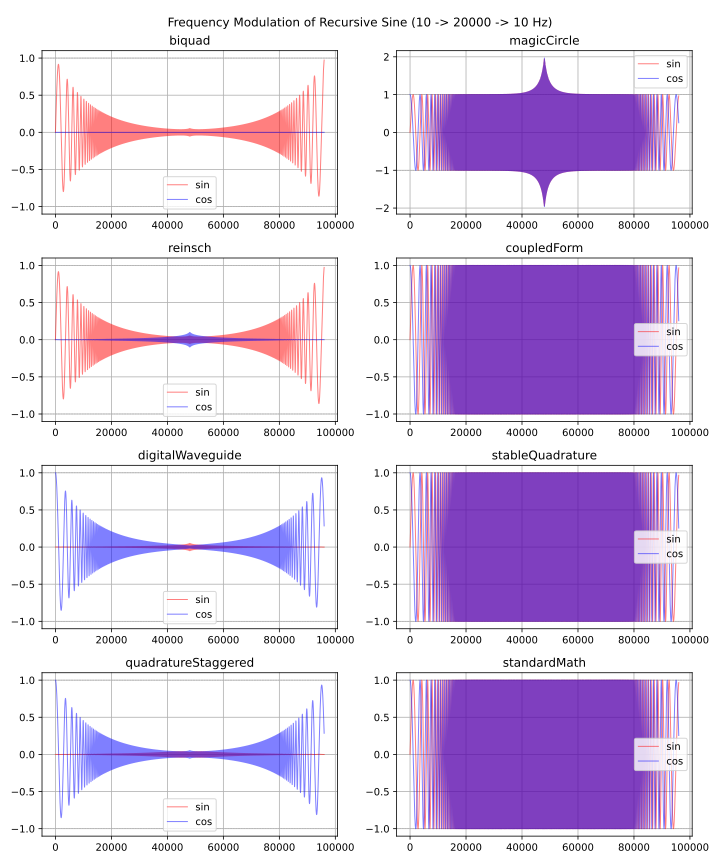
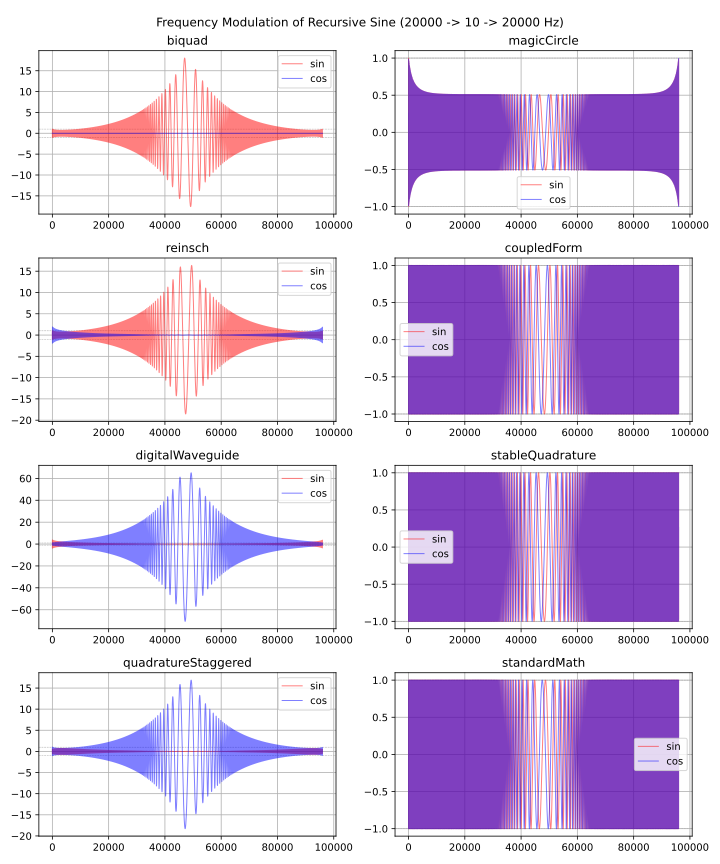

# sin, cos を反復的に計算するアルゴリズムのレシピ
sin と cos を反復的に計算するアルゴリズムのレシピ集です。出典は Martin Vicanek さんによる "[A New Recursive Quadrature Oscillator](https://www.vicanek.de/articles/QuadOsc.pdf)" の appendix (pp.7-9) です。初期位相の設定方法については、この文章で独自に追加しています。

オシレータの質は以下の項目を満たすほど良くなります。各アルゴリズムの比較表は "A New Recursive Quadrature Oscillator" の p.10 に掲載されています。

- sin と cos の振幅が等しい。 (Equal Amplitudes)
- 同じ位相の sin と cos が同時に計算できる。 (Quadrature, 直行)
- システムが安定。 (Stable)
- 低周波数でも正確。 (Low frequency accurate)

ここでは加算合成シンセサイザのオシレータへの応用を考慮しています。大量のオシレータを同時に鳴らすわけでなければ標準ライブラリの sin, cos, sincos などを使うほうがいいです。

この文章では Python 3 のコード例を掲載しています。以下は JavaScript による実装へのリンクです。

- [UhhyouWebSynthesizers/common/dsp/recursivesine.js at main · ryukau/UhhyouWebSynthesizers · GitHub](https://github.com/ryukau/UhhyouWebSynthesizers/blob/main/common/dsp/recursivesine.js)

## 記号
- $n$ : 時間。サンプル数。
- $\omega$ : オシレータの周波数。 Radian 。
- $\phi$ : 初期位相。 Radian 。
- $s, t, u, v, w$ : 状態変数。
- $k$ : 係数。周波数から決定されるパラメータ。
- $A$ : 1 ではない出力振幅。 sin と cos が同時に計算できるアルゴリズムでは片方の振幅が 1 でないものがある。

## Biquad Oscillator
出力が sin だけですが、最も高速に計算できます。低周波数で精度が落ちるそうですが、音への応用かつ 32-bit float が使えるならあまり問題にはなりません。

| 反復部                      | パラメータ               | 初期化                                                                                       | 出力                   |
|-----------------------------|---------------------|----------------------------------------------------------------------------------------------|------------------------|
| $u_{n+1} = k u_n - u_{n-1}$ | $k = 2 \cos \omega$ | $\begin{aligned}u_{-1} &= \sin(\phi - \omega)\\u_{-2} &= \sin(\phi - 2 \omega)\end{aligned}$ | $u_n = \sin(n \omega)$ |

```python
import numpy as np

def biquad(freqNormalized, initialPhase):
    """
    `freqNormalized` is in [0, 0.5).
    `initialPhase` is in [0, 1).

    Return value is `(sin, cos)`.
    """
    omega = 2 * np.pi * freqNormalized
    phi = 2 * np.pi * initialPhase
    u1 = np.sin(phi - omega)
    u2 = np.sin(phi - 2 * omega)
    k = 2 * np.cos(omega)
    while True:
        u0 = k * u1 - u2
        u2 = u1
        u1 = u0
        yield (u0, 0)
```

## Reinsch Oscillator
Vicanek さんによると、周波数が固定なら理想的なオシレータだそうです。

| 反復部                                                                         | パラメータ                                                                                               | 初期化                                                                                                    | 出力                                                                                          |
|--------------------------------------------------------------------------------|-----------------------------------------------------------------------------------------------------|-----------------------------------------------------------------------------------------------------------|-----------------------------------------------------------------------------------------------|
| $\begin{aligned}u_{n+1} &= u_n + v_n\\v_{n+1} &= v_n - k u_{n+1}\end{aligned}$ | $\begin{aligned}k &= 4 \sin^2 (\tfrac{1}{2} \omega)\\A &= 2 \sin(\tfrac{1}{2} \omega)\end{aligned}$ | $\begin{aligned}u_{-1} &= \sin(\phi - \omega)\\v_{-1} &= A \cos(\phi - \tfrac{1}{2} \omega)\end{aligned}$ | $\begin{aligned}u_n &= \sin(n \omega)\\v_n &= A \cos[(n + \tfrac{1}{2}) \omega]\end{aligned}$ |

```python
def reinsch(freqNormalized, initialPhase):
    omega = 2 * np.pi * freqNormalized
    phi = 2 * np.pi * initialPhase
    A = 2 * np.sin(omega / 2)
    u = np.sin(phi - omega)
    v = A * np.cos(phi - omega / 2)
    k = A * A
    while True:
        u = u + v
        v = v - k * u
        yield (u, v)  # `u` is main output.
```

## Digital Waveguide Oscillator
他と比べると周波数変調時の振幅の変化が大きいオシレータです。

| 反復部                                                                                                     | パラメータ                                                                           | 初期化                                                                                       | 出力                                                                         |
|------------------------------------------------------------------------------------------------------------|---------------------------------------------------------------------------------|----------------------------------------------------------------------------------------------|------------------------------------------------------------------------------|
| $\begin{aligned}s_n &= k (u_n + v_n)\\t_n &= s_n + v_n\\v_{n+1} &= s_n - v_n\\v_{n+1} &= t_n\end{aligned}$ | $\begin{aligned}k &= \cos \omega\\A &= -\tan(\tfrac{1}{2} \omega)\end{aligned}$ | $\begin{aligned}u_{-1} &= A \sin(\phi - \omega)\\v_{-1} &= \cos(\phi - \omega)\end{aligned}$ | $\begin{aligned}u_n &= A \sin(n \omega)\\v_n &= \cos(n \omega)\end{aligned}$ |

```python
def digitalWaveguide(freqNormalized, initialPhase):
    omega = 2 * np.pi * freqNormalized
    phi = 2 * np.pi * initialPhase
    u = -np.tan(omega / 2) * np.sin(phi - omega)
    v = np.cos(phi - omega)
    k = np.cos(omega)
    while True:
        s = k * (u + v)
        t = s + u
        u = s - v
        v = t
        yield (u, v)  # `v` is main output.
```

## Quadrature Oscillator with Staggered Update
出所がよくわからないオシレータです。

| 反復部                                                                           | パラメータ                                                              | 初期化                                                                                       | 出力                                                                         |
|----------------------------------------------------------------------------------|--------------------------------------------------------------------|----------------------------------------------------------------------------------------------|------------------------------------------------------------------------------|
| $\begin{aligned}v_{n+1} &= u_n + k v_n\\u_{n+1} &= k v_{n+1} - v_n\end{aligned}$ | $\begin{aligned}k &= \cos \omega\\A &= -\sin(\omega)\end{aligned}$ | $\begin{aligned}u_{-1} &= A \sin(\phi - \omega)\\v_{-1} &= \cos(\phi - \omega)\end{aligned}$ | $\begin{aligned}u_n &= A \sin(n \omega)\\v_n &= \cos(n \omega)\end{aligned}$ |

```python
def quadratureStaggered(freqNormalized, initialPhase):
    omega = 2 * np.pi * freqNormalized
    phi = 2 * np.pi * initialPhase
    u = -np.sin(omega) * np.sin(phi - omega)
    v = np.cos(phi - omega)
    k = np.cos(omega)
    while True:
        t = v
        v = u + k * v
        u = k * v - t
        yield (u, v)  # `v` is main output.
```

## Magic Circle Oscillator
Modified coupled form とも呼ばれます。以下はアルゴリズムのアイデアを示す資料へのリンクです。フットノートの [C.17](https://ccrma.stanford.edu/~jos/pasp/footnode.html#foot53986) に追加情報があります。

- [Digital Sinusoid Generators](https://ccrma.stanford.edu/~jos/pasp/Digital_Sinusoid_Generators.html)

以下の式は Vicenak さんによって紹介されている形とは異なります。 Quadrature オシレータとなるように変更を加えています。パラメータ $k$ は [small angle approximation](https://en.wikipedia.org/wiki/Small-angle_approximation) によって $2 \sin(\tfrac{1}{2} \omega) \approx \omega$ と近似できます。つまり、低い周波数であれば高速に周波数を変更できます。

| 反復部                                                                           | パラメータ                             | 初期化                                                                                                 | 出力                                                                       |
|----------------------------------------------------------------------------------|-----------------------------------|--------------------------------------------------------------------------------------------------------|----------------------------------------------------------------------------|
| $\begin{aligned}u_{n+1} &= u_n - k v_n\\v_{n+1} &= v_n + k u_{n+1}\end{aligned}$ | $k = 2 \sin(\tfrac{1}{2} \omega)$ | $\begin{aligned}u_{-1} &= \cos(\phi - \frac{3}{2} \omega)\\v_{-1} &= \sin(\phi - \omega)\end{aligned}$ | $\begin{aligned}u_n &= \cos(n \omega)\\v_n &= \sin(n \omega)\end{aligned}$ |

```python
def magicCircle(freqNormalized, initialPhase):
    omega = 2 * np.pi * freqNormalized
    phi = 2 * np.pi * initialPhase
    u = np.cos(phi - omega * 3 / 2)
    v = np.sin(phi - omega)
    k = 2 * np.sin(omega / 2)
    while True:
        u -= k * v
        v += k * u
        yield (v, u)
```

## Coupled Form Oscillator
Vicenak さんによると、このオシレータは不安定で、周波数が一定でも時間とともに振幅が変わるそうです。ただし数秒程度の音の計算であればそれほど問題にはなりません。 [2 次元の回転行列](https://en.wikipedia.org/wiki/Rotation_matrix)の計算と同じ形をしています。

| 反復部                                                                                   | パラメータ                                                                | 初期化                                                                                     | 出力                                                                       |
|------------------------------------------------------------------------------------------|----------------------------------------------------------------------|--------------------------------------------------------------------------------------------|----------------------------------------------------------------------------|
| $\begin{aligned}u_{n+1} &= k_1 u_n - k_2 v_n\\v_{n+1} &= k_2 u_n + k_1 v_n\end{aligned}$ | $\begin{aligned}k_1 &= \cos \omega\\k_2 &= \sin \omega\end{aligned}$ | $\begin{aligned}u_{-1} &= \cos(\phi - \omega)\\v_{-1} &= \sin(\phi - \omega)\end{aligned}$ | $\begin{aligned}u_n &= \cos(n \omega)\\v_n &= \sin(n \omega)\end{aligned}$ |

```python
def coupledForm(freqNormalized, initialPhase):
    omega = 2 * np.pi * freqNormalized
    phi = 2 * np.pi * initialPhase
    u = np.cos(phi - omega)
    v = np.sin(phi - omega)
    k1 = np.cos(omega)
    k2 = np.sin(omega)
    while True:
        u0 = u
        v0 = v
        u = k1 * u0 - k2 * v0
        v = k2 * u0 + k1 * v0
        yield (v, u)
```

## Stable Quadrature Oscillator
最も質のいいオシレータです。

| 反復部                                                                                                     | パラメータ                                                                              | 初期化                                                                                     | 出力                                                                       |
|------------------------------------------------------------------------------------------------------------|------------------------------------------------------------------------------------|--------------------------------------------------------------------------------------------|----------------------------------------------------------------------------|
| $\begin{aligned}w_n &= u_n - k_1 v_n\\v_{n+1} &= v_n + k_2 w_n\\u_{n+1} &= w_n - k_1 v_{n+1}\end{aligned}$ | $\begin{aligned}k_1 &= \tan(\tfrac{1}{2} \omega)\\k_2 &= \sin \omega\end{aligned}$ | $\begin{aligned}u_{-1} &= \cos(\phi - \omega)\\v_{-1} &= \sin(\phi - \omega)\end{aligned}$ | $\begin{aligned}u_n &= \cos(n \omega)\\v_n &= \sin(n \omega)\end{aligned}$ |

```python
def stableQuadrature(freqNormalized, initialPhase):
    omega = 2 * np.pi * freqNormalized
    phi = 2 * np.pi * initialPhase
    u = np.cos(phi - omega)
    v = np.sin(phi - omega)
    k1 = np.tan(omega / 2)
    k2 = np.sin(omega)
    while True:
        w = u - k1 * v
        v += k2 * w
        u = w - k1 * v
        yield (v, u)
```

## 周波数変調時の挙動
反復的に計算するアルゴリズムで周波数を変えたときに振幅がどのように変わるのかを調べました。以下はプロットに使った Python 3 のコードへのリンクです。

- [filter_notes/recursive_sine/modulation.py at master · ryukau/filter_notes · GitHub](https://github.com/ryukau/filter_notes/blob/master/recursive_sine/modulation.py)

図の右下の `standardMath` は NumPy の `np.sin` と `np.cos` で計算したリファレンス信号です。

以下はサンプリング周波数を 48000 Hz として、 10, 20000, 10 Hz と周波数を変調したときの様子です。信号の長さは 96000 サンプル = 2 秒です。 Coupled form と stable quadrature は周波数変調をかけても振幅が安定しています。 Magic circle はナイキスト周波数に近づくときだけ振幅が大きくなっています。その他のアルゴリズムではナイキスト周波数に近づくほど振幅が下がっています。

<figure>

</figure>

以下はサンプリング周波数を 48000 Hz として、 20000, 10, 20000 Hz と、上の図とは逆となるように周波数を変調したときの様子です。信号の長さは 96000 サンプル = 2 秒です。 Coupled form と stable quadrature は上の図と同様に、周波数変調をかけても振幅が安定しています。 Biquad, Reinsch, quadrature with staggered update の 3 つは振幅のピークが 15 を少し超えるほど大きくなっています。 Digital waveguide は他に比べると振幅の振れ幅が大きく、ピーク振幅は 60 を超えてます。 Magic circle は周波数の低下とともに振幅が下がっています。

<figure>

</figure>

## 高速な周波数の変更
パラメータの $k$ をルックアップテーブルにしてしまうことで高速に周波数を変更できます。指定できる周波数が固定されてしまいますが、楽器への応用であればそこまで問題にはなりません。

以下の例は C++ による magic circle oscillator の実装例です。テーブルの値については倍音関係を正確に表せるようにするなど工夫の余地があります。

```c++
#include <algorithm>
#include <array>
#include <cmath>
#include <numeric>

template<typename Sample, size_t nOsc> class MagicCircleNoteAcc {
public:
  static constexpr size_t centPerOctave = 1200;
  static constexpr size_t centPerSemitone = 100;
  static constexpr size_t nSemitone = 156;
  static constexpr auto lowestFreq = Sample(2.575215288381796); // 440 * 2^(-89 / 12).

  std::array<Sample, nSemitone * centPerSemitone> table{};
  std::array<Sample, nOsc> u{};
  std::array<Sample, nOsc> v{};

  void set(Sample sampleRate)
  {
    auto normalizedF0 = lowestFreq / sampleRate;
    for (size_t i = 0; i < table.size(); ++i) {
      auto freq = normalizedF0 * std::exp2(Sample(i) / Sample(centPerOctave));
      table[i] = 2 * std::sin(Sample(pi) * freq);
    }

    u.fill(Sample(1));
    v.fill(Sample(0));
  }

  // Range of `midinote` is [-20.0, 136.0].
  Sample process(const std::array<Sample, nOsc> &midinote)
  {
    for (size_t i = 0; i < nOsc; ++i) {
      auto index
        = std::min(size_t(centPerSemitone * (midinote[i] + 20)), table.size() - 1);
      u[i] -= table[index] * v[i];
      v[i] += table[index] * u[i];
    }
    return std::accumulate(v.begin(), v.end(), Sample(0));
  }
};
```

## ナイキスト周波数での挙動
ナイキスト周波数で発散するかどうかを調べました。実装では `freq = min(freq, 0.49 * samplingRate)` のように、周波数の上限をナイキスト周波数より少し低めにしておいたほうが安全です。

| 種類              | ナイキスト周波数での振幅 |
|-------------------|-----------------|
| Biquad            | 発散              |
| Reinsch           | 発散              |
| Digital waveguide | 発散              |
| Staggered Update  | 一定              |
| Magic circle      | 発散              |
| Coupled form      | 一定              |
| Stable Quadrature | 一定              |

## 参考文献
- Martin Vicanek, "[A New Recursive Quadrature Oscillator](https://www.vicanek.de/articles/QuadOsc.pdf)", 21. October 20.
- [Digital Sinusoid Generators](https://ccrma.stanford.edu/~jos/pasp/Digital_Sinusoid_Generators.html)

## 変更点
- 2024/08/01
  - Biquad と magic circle の式を修正。
  - 「ナイキスト周波数での挙動」の節を追加。
- 2024/07/29
  - 文章の追加、整理。
