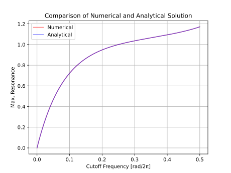

# 一次ローパスと一次オールパスからなるレゾナントフィルタ
TestBedSynth に組み込む候補として、以下のブロック線図のフィルタを思いつきました。以降ではレゾナントフィルタと呼ぶことにします。

\

- LP1: 一次ローパス。
- AP1: 一次オールパス。
- $c_1, c_2$: フィルタ係数。カットオフ周波数から計算。
- $q$: レゾナンス。


実装して試したところ、カットオフ周波数に応じてフィルタが発散する `q` の値が変わることがわかりました。ここではカットオフ周波数から発散しない `q` の最大値を求める関数を作ってフィルタをチューニングします。

## 実装
### 一次ローパス
一次ローパスについては Pieter P さんによる [Exponential Moving Average](https://tttapa.github.io/Pages/Mathematics/Systems-and-Control-Theory/Digital-filters/Exponential%20Moving%20Average/Exponential-Moving-Average.html) の記事で丁寧に説明されています。

以下は一次ローパス、あるいは exponential moving average (EMA) と呼ばれるフィルタの実装例です。コードは C++ で、 `#include <cmath>` は省略しています。 `pi` は円周率です。

```c++
template<typename Sample> struct LP1 {
  Sample u1 = 0;
  Sample cut1 = 1;

  void setCutoff(Sample sampleRate, Sample cutoffHz) {
    auto y = 1 - std::cos(2 * pi * cutoffHz / sampleRate);
    cut1 = std::sqrt((y + 2) * y) - y;
  }

  Sample process(Sample x0) { return u1 += cut1 * (x0 - u1); }
};
```

### 一次オールパス
以下は一次オールパスの実装例です。 [WolfSound の記事](https://thewolfsound.com/allpass-filter/) を参考にしています。

```c++
template<typename Sample> struct AP1 {
  Sample v1 = 0;
  Sample u2 = 0;
  Sample cut2 = 1;

  void setCutoff(Sample sampleRate, Sample cutoffHz) {
    auto t = std::tan(pi * cutoffHz / sampleRate);
    cut2 = (t - 1) / (t + 1);
  }

  Sample process(Sample x0) {
    v1 = cut2 * (x0 - v1) + u2;
    u2 = x0;
    return v1;
  }
};
```

### レゾナントフィルタ
一次ローパスと一次オールパスを組み合わせて以下のように実装しました。

```c++
template<typename Sample> struct ResonantEmaLowpass {
private:
  Sample u1 = 0;
  Sample v1 = 0;
  Sample u2 = 0;

  Sample cut1 = 1;
  Sample cut2 = 1;
  Sample q = 0;

public:
  void reset()
  {
    u1 = 0;
    v1 = 0;
    u2 = 0;
  }

  //  resonance の範囲は [0.0, 1.0] 。 cutoffHz < sampleRate / 2 。
  void prepare(Sample sampleRate, Sample cutoffHz, Sample resonance)
  {
    // cut1, cut2 の設定は LP1, AP1 の setCutoff と同じなので省略。
    q = resonance * getMaxResonance(cutoffHz / sampleRate);
  }

  Sample process(Sample input)
  {
    v1 = cut2 * (u1 - v1) + u2;
    u2 = u1;
    return u1 += cut1 * (input - u1) - q * v1;
  }
};
```

レゾナントフィルタは[伝達関数](#伝達関数)を見ると二次フィルタですが、[バイクアッドフィルタ](https://webaudio.github.io/Audio-EQ-Cookbook/audio-eq-cookbook.html)に比べると状態変数の数が少なく、加算と乗算の数も少ないので効率よく計算できます。バイクアッドフィルタと同様に、信号の流れの計算よりもカットオフ周波数をフィルタ係数に変換する計算のほうが重いです。フィルタ係数の更新はコントロールレートでのみ行い、オーディオレートでは補間することによって計算量を節約できます。

以降では `getMaxResonance` を実装するために試行錯誤します。

## レゾナンスの最大値の探索
### 伝達関数
以下はフィルタ計算のコードです。

```c++
v1 = cut2 * (u1 - v1) + u2;
u2 = u1;
return u1 += cut1 * (input - u1) - q * v1;
```

以下は変数の一覧です。

- `u1`: 一次ローパスの状態変数。
- `v1`, `u2`: 一次オールパスの状態変数。
- `cut1`: 一次ローパスのフィルタ係数。カットオフ周波数から計算。
- `cut2`: 一次オールパスのフィルタ係数。カットオフ周波数から計算。
- `q`: レゾナンス。

連立方程式の形に変形します。コードで `s1 = f(s1)` のような計算を行っている式を `s0 = f(s1)` と置きなおしています。変数の添え字は、何サンプル前に計算された値なのかを表しています。 `v` はオールパスの出力、 `u` はローパスの出力 、 `x` は入力です。また、以降で数式として書くので `cut` を `c` と置きなおしています。

```
v0 = c2 * (u1 - v1) + u2; // (A)
u0 = c1 * x0 + (1 - c1) * u1 - q * v0;
```

`u0` の式を `v0` について解きます。

```
v0 = (c1 * x0 + (1 - c1) * u1 - u0) / q;
```

得られた式を `(A)` に代入します。 [Maxima](https://maxima.sourceforge.io/) を使います。変数の添え字 `i` を `(n - i)` と置きなおしています。

```maxima
v(n) := (c_1 * x(n) + (1 - c_1) * u(n - 1) - u(n)) / q;

result: v(n) = c_2 * (u(n - 1) - v(n - 1)) + u(n - 2);

ratvars(u(n), u(n-1), u(n-2), u(n-3), x(n), x(n-1), x(n-2), x(n-3));
ratsimp(0 = lhs(result) - rhs(result));
```

整理した出力です。

$$
  u[n]
- (1 - c_1 - c_2 - q c_2) u[n - 1]
- (c_2 - c_1 c_2 - q) u[n - 2]
=
  c_1 x[n]
+ c_1 c_2 x[n - 1]
$$

伝達関数です。 $f_c$ はカットオフ周波数、 $f_s$ はサンプリング周波数です。

$$
\begin{align}
H(z) &= \frac{
  c_1 + c_1 c_2 z^{-1}
}{
  1 - (1 - c_1 - c_2 - q c_2) z^{-1} - (c_2 - c_1 c_2 - q) z^{-2}
}. \\
\end{align}
$$

$$
\begin{align}
c_1 &= -s + \sqrt{s^2 + 2 s}, && \text{where} \quad s = 1 - \cos(2 \pi f_c / f_s). \\
c_2 &= \frac{t - 1}{t + 1} ,  && \text{where} \quad t = \tan(\pi f_c / f_s). \\
\end{align}
$$

$H(z)$ は離散系の伝達関数なので、[極](https://web.mit.edu/2.14/www/Handouts/PoleZero.pdf)が単位円以内であれば安定です。つまり以下の条件を満たせばフィルタは発散しません。不等式の右辺は二次方程式の解の公式です。 $a = 1$ なので、 $a$ は省略しています。

**注意**: 以下の解き方は中途半端です。[安定条件の解き方の見直し](#安定条件の解き方の見直し)で使える解が得られています。

$$
\begin{aligned}
1 &> \left| \frac{-b \pm \sqrt{b^2 - 4c}}{2} \right| \\
b &= - (1 - c_1 - c_2 - q c_2) \\
c &= - (c_2 - c_1 c_2 - q) \\
\end{aligned}
$$

厳密には二次方程式の解の公式に代入する $a$ と $c$ の値が逆なのですが、最終的な結果に影響しなかったのでここでは適当に流します。

Maxima の `to_poly_solve` で安定条件を $q$ について解きます。

```maxima
load(to_poly_solve);

b: - (1 - c_1 - c_2 - q*c_2);
c: - (c_2 - c_1*c_2 - q);

resultP: to_poly_solve(1 = abs((-b + (b^2 - 4*c)^(1/2))/2), q);
resultN: to_poly_solve(1 = abs((-b - (b^2 - 4*c)^(1/2))/2), q);
```

以下は整形した `resultP` の出力です。 `resultN` は条件の `parg` 内の正負が逆になるだけだったので省略しています。

```
%union(
  %if(
    (-(%pi/2) < parg((1-c_1)*c_2+c_1+1))
      %and (parg((1-c_1)*c_2+c_1+1) <= %pi/2),
    [q=-c_1],
    %union()
  )
  ,
  %if(
    (-(%pi/2) < parg((c_1-1)*c_2+c_1-3))
      %and (parg((c_1-1)*c_2+c_1-3) <= %pi/2),
    [q=c_1-2],
    %union()
  )
)
```

- [`%union`](https://maxima.sourceforge.io/docs/manual/maxima_346.html#index-_0025union) は解の集合。 `%union()` は空集合、つまり解なし。
- [`parg`](https://maxima.sourceforge.io/docs/manual/maxima_346.html#index-parg) は `[-%pi, %pi]` の範囲で値を返す複素数の偏角 (complex argument) 。

以下の解らしい式が 2 つ得られています。

- $q = -c_1$
- $q = c_1 - 2$

$q$ の値の範囲は $[0, 1]$ を想定していたのですが、どちらも負の値となっています。適当に $q = c_1$ としたところ発散はしなくなったのですが、発散寸前の状態とはなりませんでした。つまり $q = c_1$ はレゾナンスの最大値としては不適です。

### 数値計算
Maxima の `to_poly_solve` では安定条件が解けないことがわかったので、数値計算でレゾナンスの最大値 $q$ のテーブルを作ってルックアップすることにします。

レゾナンスの最大値は二分探索で求めました。以下は探索の手順です。

0. 探索の初期状態を `low = 0, mid = 1, high = 2` と設定。
1. レゾナンスを `q = mid` としてフィルタのインパルス応答を計算。インパルスの振幅は 1 。
2. フィルタが発散しているか判定。
   - 発散しているときは `high = mid` と代入。
   - 発散していないときは `low = mid` と代入。
3. `mid = (low + high) / 2` と代入。
4. 1 に戻る。

発散しているかどうかの判定として以下の 3 つの方法を思いつきました。

- 方法 1: インパルス応答を一定の時間まで計算。振幅の絶対値が 1 を超えたら発散と判定。
- 方法 2: インパルス応答を 2 つめのピークまで計算。前のピークが後のピークより小さければ発散と判定。
- 方法 3: インパルス応答を一定の時間まで計算。得られた信号の線形回帰の傾きが正の値なら発散と判定。

結論を先に言うと、方法 3 が最もいい値を得ることができます。方法 1 は探索範囲が狭くなってきたときに発散が検知できません。方法 2 はカットオフ周波数がかなり低くなければ発散が検知できません。

以下は探索に使ったコードへのリンクです。

- [探索に使った Python 3 のコード (github.com)](https://github.com/ryukau/filter_notes/blob/master/resonant_one_pole_filter/code/resonance.py)

以下は得られたテーブルです。フィルタのカットオフが周波数 (Hz) で入力されるときは等間隔、 MIDI ノートなどの対数スケールで入力されるときは対数スケーリングしたテーブルの使用を想定しています。

- [カットオフが等間隔のテーブル (github.com)](https://github.com/ryukau/filter_notes/blob/master/resonant_one_pole_filter/code/table_linear.json)
- [カットオフが対数スケールのテーブル (github.com)](https://github.com/ryukau/filter_notes/blob/master/resonant_one_pole_filter/code/table_log.json)

以下はテーブルルックアップの実装例です。

```c++
#include <array>

namespace FeedbackEmaUtil {

template<typename T> struct ResonanceTable {
  static constexpr std::array<T, 32768> qTableLin{ /* テーブルの値は省略。 */ };
  static constexpr std::array<T, 32768> qTableLog{ /* テーブルの値は省略。 */ };

  // `normalizedFreq` の範囲は [0, 0.5] 。単位は [rad/2π] 。
  static T getLinear(T normalizedFreq)
  {
    T pos = normalizedFreq * T(2) * T(qTableLin.size() - 1);
    size_t i = size_t(pos);
    return qTableLin[i] + (pos - T(i)) * (qTableLin[i + 1] - qTableLin[i]);
  }

  // `note` の範囲は [0, 127] 。単位は MIDI ノート番号 。
  static T getLog(T note)
  {
    if (note < 0) return 0;
    if (note > T(127)) return qTableLog.back();
    T pos = note * T(qTableLog.size() - 1) / T(127);
    size_t i = size_t(pos);
    return qTableLog[i] + (pos - T(i)) * (qTableLog[i + 1] - qTableLog[i]);
  }
};
```

### 安定条件の解き方の見直し
この記事の初版を見直していたところ、伝達関数の安定条件を場合分けすれば Maxima の `solve` で解ける形にできることに気が付きました。

以下は安定条件の再掲です。得られる解の数が変わったので、先に掲載した式とは $a$ と $c$ が入れ替わっています。

$$
\begin{aligned}
1 &> \left| \frac{-b \pm \sqrt{b^2 - 4ac}}{2a} \right| \\
a &= - (c_2 - c_1 c_2 - q) \\
b &= - (1 - c_1 - c_2 - q c_2) \\
c &= 1 \\
\end{aligned}
$$

Maxima で解きます。

```maxima
a: - (c_2 - c_1*c_2 - q);
b: - (1 - c_1 - c_2 - q*c_2);

case1: (2*a + b)^2 = +b^2 - 4*a;
case2: (2*a + b)^2 = -b^2 + 4*a;
case3: (2*a - b)^2 = -b^2 + 4*a;
case4: (2*a - b)^2 = +b^2 - 4*a;

solve(case1, q);
solve(case2, q);
solve(case3, q);
solve(case4, q);
```

以下は `case1` の解です。

```
[
  q = c_2 - c_1*c_2,
  q = -c_1
]
```

新しく出てきた解 $q = c_2 - c_1 c_2$ を数値計算で得られた $q$ の値と比べたところ以下の図が得られました。図の Analytical が新しく出てきた解、 Numerical が数値計算で得られた値です。


切片がずれているだけのように見えるので Analytical に 1 を足します。



曲線が一致しました。つまり、レゾナンスの最大値の曲線は以下の式で表されます。

$$
q = c_2 - c_1 c_2 + 1.
$$

以下はレゾナンスの最大値の曲線の式を使った完全な `ResonantEmaLowpass` の実装例です。 C++ 20 です。

```c++
#include <cmath>
#include <numbers>

template<typename Sample> struct ResonantEmaLowpass {
private:
  Sample u1 = 0;
  Sample v1 = 0;
  Sample u2 = 0;

  Sample c1Value = Sample(1);
  Sample c2Value = Sample(1);
  Sample qValue = 0;

  Sample c1Target = Sample(1);
  Sample c2Target = Sample(1);
  Sample qTarget = 0;

public:
  void reset()
  {
    u1 = 0;
    v1 = 0;
    u2 = 0;

    c1Value = c1Target = Sample(1);
    c2Value = c2Target = Sample(1);
    qValue = qTarget = 0;
  }

  //  resonance の範囲は [0.0, 1.0] 。 cutoffHz < sampleRate / 2 。
  // 計算が重いのでコントロールレートで呼び出す。
  void prepare(Sample sampleRate, Sample cutoffHz, Sample resonance)
  {
    constexpr Sample pi = std::numbers::pi_v<Sample>;

    auto freq = std::clamp(cutoffHz / sampleRate, Sample(0), Sample(0.4999));

    auto s = Sample(1) - std::cos(Sample(2) * pi * freq);
    c1Target = std::sqrt((s + Sample(2)) * s) - s;

    auto t = std::tan(pi * freq);
    c2Target = (t - Sample(1)) / (t + Sample(1));

    auto maxQ = c2Target - c1Target * c2Target + Sample(1);
    qTarget = maxQ * resonance;
  }

  Sample process(Sample input)
  {
    // 一次ローパスによる状態変数の補間。
    c1Value += rate * (c1Target - c1Value);
    c2Value += rate * (c2Target - c2Value);
    qValue += rate * (qTarget - qValue);

    // フィルタ本体の計算。
    v1 = c2Value * (u1 - v1) + u2;
    u2 = u1;
    return u1 += c1Value * (input - u1) - qValue * v1;
  }
};
```

実装時の注意点として、カットオフ周波数がナイキスト周波数ぴったりになるとフィルタが発散します。したがって `std::clamp(cutoff, 0.0, 0.4999)` などとしてナイキスト周波数を少しだけ下回るようにしておくと安全です。

## 音のデモ
以下はカットオフ周波数を等間隔で区切ったテーブルを使ったフィルタのデモです。入力はのこぎり波です。 `q=0.99` としているのは発振を避けるためです。 `q=1.0` とするとちょうど発振します。

<figure>
  <figcaption>Cutoff 0.1 to Nyquist [Hz], q=0.99, No oversampling.</figcaption>
  <audio controls src="audio/resonant_lp_1x.opus">
    <a href="audio/resonant_lp_1x.opus">Download audio</a>
  </audio>
</figure>

<figure>
  <figcaption>Cutoff 0.1 to Nyquist [Hz], q=0.99, 2-fold oversampling.</figcaption>
  <audio controls src="audio/resonant_lp_1x.opus">
    <a href="audio/resonant_lp_1x.opus">Download audio</a>
  </audio>
</figure>

<figure>
  <figcaption>Cutoff 0.1 to 100000 [Hz], q=0.99, 8-fold oversampling.</figcaption>
  <audio controls src="audio/resonant_lp_1x.opus">
    <a href="audio/resonant_lp_1x.opus">Download audio</a>
  </audio>
</figure>

FL Studio の 3x OSC などで使える Fast LP と似ていますが、低域でも発振する点が異なります。

ここで得られたレゾナンスの最大値をそのまま使うこともできますが、発振の有無、低域あるいは高域に向かってレゾナンスを弱くする、といった楽器としてのチューニングを施すことで音の印象を変えることができます。

## その他
### 一次ローパスと一次オールパスの伝達関数
以下は一次ローパスの伝達関数です。

$$
H_L (z) = \frac{k_p}{1 - (1 - k_p) z^{-1}}
$$

以下は一次オールパスの伝達関数です。

$$
H_A (z) = \frac{a_1 + z^{-1}}{1 + a_1 z^{-1}}
$$

## 参考文献
- [Exponential Moving Average](https://tttapa.github.io/Pages/Mathematics/Systems-and-Control-Theory/Digital-filters/Exponential%20Moving%20Average/Exponential-Moving-Average.html)
- [Single-pole IIR low-pass filter - which is the correct formula for the decay coefficient? - Signal Processing Stack Exchange](https://dsp.stackexchange.com/questions/54086/single-pole-iir-low-pass-filter-which-is-the-correct-formula-for-the-decay-coe)
- [Allpass Filter: All You Need To Know - WolfSound](https://thewolfsound.com/allpass-filter/)
- [Stability Revisited](https://ccrma.stanford.edu/~jos/filters/Stability_Revisited.html)
- [Maxima does not solve the system sqrt(x)=1, y=1 with the solve function - Stack Overflow](https://stackoverflow.com/questions/46907829/maxima-does-not-solve-the-system-sqrtx-1-y-1-with-the-solve-function)
- [Maxima 5.46.0 Manual: Functions and Variables for to_poly_solve](https://maxima.sourceforge.io/docs/manual/maxima_346.html)
- [Cookbook formulae for audio EQ biquad filter coefficients](https://webaudio.github.io/Audio-EQ-Cookbook/audio-eq-cookbook.html)

## 変更点
- 2023/06/13
  - 「安定条件の解き方の見直し」の節を追加。
