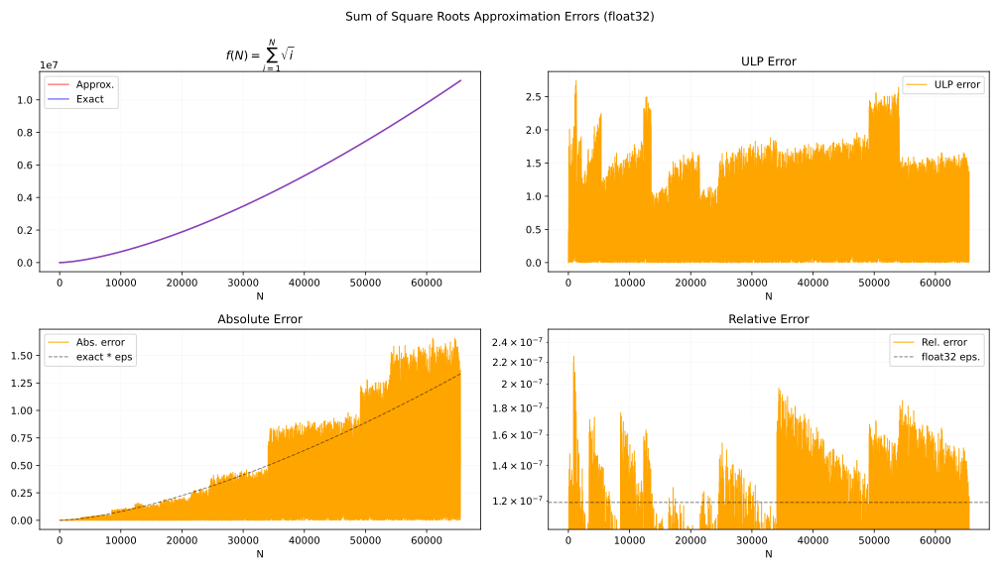
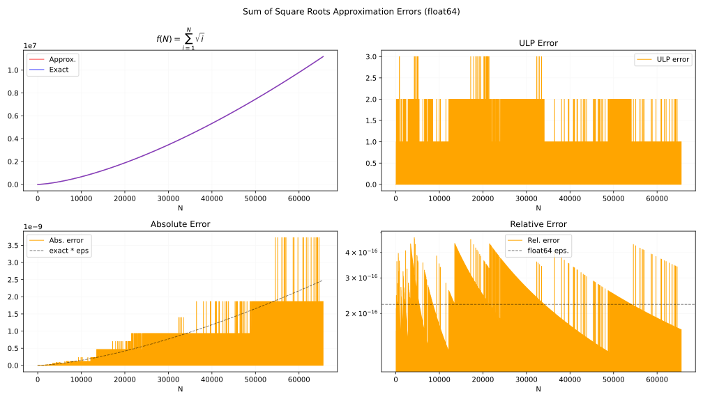

# Sum of Square Roots の近似関数
Sum of square roots は以下の関数です。

$$
S(N) = \sum_{n=1}^{N} \sqrt{n}.
$$

$N$ は 0 以上の整数です。 $N=0$ のときは足し合わせる項がないので $S(0) = 0$ です。

$S$ は $x^2 \bmod 1$ の逆微分を計算するときに使えます。

以下は検証に使ったコードへのリンクです。

- [filter_notes/sum_of_square_roots at master · ryukau/filter_notes · GitHub](https://github.com/ryukau/filter_notes/tree/master/sum_of_square_roots)

## 近似方法
$S$ は [Riemann zeta function](https://en.wikipedia.org/wiki/Riemann_zeta_function) と似た形をしています。以下は $\mathrm{Re}(s) \ge 1$ における Riemann zeta function の定義です。

$$
\zeta(s) = \sum_{n=1}^\infty n^{-s}.
$$

$s=-1/2$ と代入すると、総和の上限以外は $S$ と同じです。

$$
\zeta(-1/2) = \sum_{n=1}^\infty n^{1/2}.
$$

ここでは $S$ と $\zeta(-1/2)$ を Euler-Maclaurin formula でつなげて近似式を得るという方針を取っています。 Euler-Maclaurin formula は総和と積分の関係を表した式で、積分を総和に、あるいは総和を積分に変えて近似計算できる形が得られることがあります。 $\zeta(-1/2)$ は $\mathrm{Re}(s) \ge 1$ を満たしていませんが、以降の式変形で何とかします ([analytic continuation](https://en.wikipedia.org/wiki/Analytic_continuation)) 。

### Euler-Maclaurin Formula
["Euler-Maclaurin Formula" (people.csail.mit.edu/kuat)](https://people.csail.mit.edu/kuat/courses/euler-maclaurin.pdf) に掲載されている Euler-Maclaurin formula を使います。 $[a, N]$ の範囲の総和を近似する一般的な形です。 $\sum_{i=2}^k$ の項は $i$ が 3 以上の奇数のときに $b_i = 0$ となるので、実質は 2 刻みで総和を取っています。

$$
\begin{aligned}
\sum_{n=a}^N f(n) &\sim
\int_a^N f(x)\;dx
+ \frac{f(N) + f(a)}{2}
+ \sum_{i=2}^{k} \frac{b_i}{i!} (f^{(i-1)}(N) - f^{(i-1)}(a))
- R_k.
\\
R_k &= \int_a^N \frac{B_k(\{1 - t\})}{k!} f^{(k)}(t) dt.
\end{aligned}
$$

- $b_n$ : [Bernoulli numbers](https://en.wikipedia.org/wiki/Bernoulli_number).
- $B_n$ : [Bernoulli polynomials](https://en.wikipedia.org/wiki/Bernoulli_polynomials).
- $R_n$ : Remainder term.
- $\{\}$ : 実数から小数点以下の値を取り出す演算子。 $\{x\} = x - \lfloor x \rfloor$.
- $f^{(n)}$ : $S$ の $n$ 階微分。
- $k$ : 2 以上の偶数。以降「[誤差と級数の打ち切り](#誤差と級数の打ち切り)」に設定方法を掲載。

式変形中に以下の関数を使います。

- $g(x) = x^{-s}.$
- $h(x) = x^{1/2}.$

### 近似式の導出
$\zeta$ に Euler-Maclaurin formula を当てはめます。 $g(x) = x^{-s}$ 、 $a=1$ として以下のように式を立てます。 $g$ は $\zeta$ の総和の各項 $(n^{-s})$ と対応します。

$$
\sum_{n=1}^N n^{-s}
= \int_1^N g(x) dx + \frac{N^{-s} + 1}{2} + \sum_{i=2}^k \frac{b_i}{i!} \left(g^{(i-1)}(N) - g^{(i-1)}(1)\right) - \int_1^N \frac{B_k(\{1 - t\})}{k!} g^{(k)}(t) dt.
$$

$N \to \infty$ の極限を取ります。 $\text{Re}(s) > 1$ であれば、以下の $\infty$ が絡む項が収束します。

- $\displaystyle \lim_{N \to \infty} \int_1^N g(x) dx = \lim_{N \to \infty} \int_1^N x^{-s} dx = \lim_{N \to \infty} \left[ \frac{N^{1-s}}{1-s} - \frac{1}{1-s} \right] = \frac{1}{s-1}.$
- $\displaystyle \lim_{N \to \infty} N^{-s} = 0.$
- $\displaystyle \lim_{N \to \infty} g^{(i-1)}(N) = \lim_{N \to \infty} N^{-s-i+1}= 0.$

先の式に代入すると $\zeta(s)$ についての Euler-Maclaurin formula が得られます。この式は $\zeta$ の analytic continuation の 1 つです。

$$
\zeta(s)
= \frac{1}{s-1} + \frac{1}{2}
- \sum_{i=2}^k \frac{b_i}{i!} g^{(i-1)}(1)
- \int_1^\infty \frac{B_k(\{1 - t\})}{k!} g^{(k)}(t) dt.
$$

ここで $g(x) = x^{-s}$ の定義より、右辺の $\int_1^\infty$ の項 (remainder term) は $\mathrm{Re}(s) > 1 - k$ のときに収束します。ターゲットとなる $\zeta(-1/2)$ では $k \geq 2$ であれば収束するので計算できそうです。 $h(x) = x^{1/2}$ です。

$$
\zeta(-1/2)
= -\frac{2}{3} + \frac{1}{2}
- \sum_{i=2}^k \frac{b_i}{i!} h^{(i-1)}(1)
- \int_1^\infty \frac{B_k(\{1 - t\})}{k!} h^{(k)}(t) dt.
$$

次に $S$ に Euler-Maclaurin formula を当てはめます。

$$
\sum_{n=1}^N n^{1/2}
= \underbrace{\int_1^N x^{1/2} dx}_{\text{Integral term}}
+ \frac{N^{1/2} + 1}{2}
+ \sum_{i=2}^k \frac{b_i}{i!} \left(h^{(i-1)}(N) - h^{(i-1)}(1)\right)
- \underbrace{\int_1^N \frac{B_k(\{1 - t\})}{k!} h^{(k)}(t) dt}_{R_k}.
$$

1 つめの区間積分を展開し、もう一つの区間積分である remainder term を $\int_1^N = \int_1^\infty - \int_N^\infty$ と 2 つの区間に分割します。

$$
\begin{aligned}
\sum_{n=1}^N n^{1/2}
=& \underbrace{\left( \frac{2}{3}N^{3/2} - \frac{2}{3} \right)}_{\text{Integral term}}
+ \frac{N^{1/2}}{2} + \frac{1}{2}
+ \sum_{i=2}^k \frac{b_i}{i!} h^{(i-1)}(N)
- \sum_{i=2}^k \frac{b_i}{i!} h^{(i-1)}(1) \\
&- \underbrace{\left(
    \int_1^\infty \frac{B_k(\{1 - t\})}{k!} h^{(k)}(t) dt
  - \int_N^\infty \frac{B_k(\{1 - t\})}{k!} h^{(k)}(t) dt
\right)}_{R_k}.
\end{aligned}
$$

項を並べ替えると $\zeta(-1/2)$ が見つかります。

$$
\begin{aligned}
\sum_{n=1}^N n^{1/2}
=& \frac{2}{3}N^{3/2} + \frac{N^{1/2}}{2}
+ \underbrace{\left(
  -\frac{2}{3} + \frac{1}{2}
  - \sum_{i=2}^k \frac{b_i}{i!} h^{(i-1)}(1)
  - \int_1^\infty \frac{B_k(\{1 - t\})}{k!} h^{(k)}(t) dt
\right)}_{\zeta(-1/2)}\\
&+ \sum_{i=2}^k \frac{b_i}{i!} h^{(i-1)}(N)
+ \int_N^\infty \frac{B_k(\{1 - t\})}{k!} h^{(k)}(t) dt.
\end{aligned}
$$

整理します。

$$
\sum_{n=1}^N n^{1/2}
= \frac{2}{3}N^{3/2}
+ \frac{1}{2}N^{1/2}
+ \zeta(-1/2)
+ \sum_{i=2}^k \frac{b_i}{i!} h^{(i-1)}(N)
+ \int_N^\infty \frac{B_k(\{1 - t\})}{k!} h^{(k)}(t) dt.
$$

以降では $k \geq 2$ とします。また $i$ が 3 以上の奇数のとき $b_i = 0$ なので $k$ を偶数に狭められます。

### 誤差と級数の打ち切り
Remainder term $R_k$ を解いて許容誤差 $\epsilon$ が与えられたときに $k$ を決める式を導きます。式の見通しをよくするため $1/k!$ は積分の外に出しています。

$$
R_k = - \frac{1}{k!} \int_N^\infty B_k(\{1 - t\}) h^{(k)}(t) dt.
$$

ここで Bernoulli polynomial $B_k$ について以下の性質があります。

$$
\begin{aligned}
\frac{d}{dx} B_k(t) &= k B_{k - 1}(t). && \text{(recurrence relation)} \\
B_k(1 - t) &= (-1)^k B_k(t).           && \text{(symmetry)} \\
\end{aligned}
$$

$B_{k+1}(\{1 - t\})$ にあてはめると以下の式が得られます。

$$
\frac{d}{dt} B_{k+1}(\{1 - t\}) = -(k + 1) B_k(\{1 - t\}).
$$

$B_k$ について解きます。

$$
B_k(\{1 - t\}) = -\frac{1}{k+1} \frac{d}{dt} B_{k+1}(\{1 - t\}).
$$

$R_k$ に代入します。積分の展開では $u = h^{(k)}(t)$ かつ $v' = \dfrac{d}{dt} B_{k+1}(\{1 - t\}) dt$ と置いて部分積分の公式を適用しています。

$$
\begin{aligned}
R_k
&= \frac{1}{(k+1)!}  \int_N^\infty \left( \frac{d}{dt} B_{k+1}(\{1 - t\}) \right) h^{(k)}(t) dt.
\\
&= \frac{1}{(k+1)!} \left(
    \left[ B_{k+1}(\{1 - t\}) h^{(k)}(t) \right]_N^\infty
   - \int_N^\infty B_{k+1}(\{1 - t\}) h^{(k+1)}(t) dt
\right).
\end{aligned}
$$

角かっこの境界項 $\left[\ \right]_N^\infty$ について以下のことが言えます。

- $\infty$ 側の項について、 $h^{(k)}(t) \propto t^{1/2 - k}$ なので、 $k \geq 2$ の条件下では 0 。
- $N$ 側の項について、 $N$ は整数なので $B_{k+1}(\{1 - N\}) = B_{k+1}(0) = b_{k+1}$ 。 $k$ が 2 以上の偶数という今回の条件と、 Bernoulli number $b_k$ は $k$ が 3 以上かつ奇数のときに 0 となる性質を組み合わせると、 $b_{k+1} = 0$ 。

よって境界項は 0 になるので $R_k$ が以下の形に変形できます。

$$
R_k = - \frac{1}{(k+1)!} \int_N^\infty B_{k+1}(\{1 - t\}) h^{(k+1)}(t) dt.
$$

さらにもう一度、同様の変形を行ってインデックス $k+2$ が出てくるように $R_k$ を変形します。

$$
\begin{aligned}
R_k
&=
\frac{1}{(k+2)!}  \int_N^\infty \left( \frac{d}{dt} B_{k+2}(\{1 - t\}) \right) h^{(k+1)}(t) dt
\\&=
\frac{1}{(k+2)!} \left(
    \left[ B_{k+2}(\{1 - t\}) h^{(k+1)}(t) \right]_N^\infty
  - \int_N^\infty B_{k+2}(\{1 - t\}) h^{(k+2)}(t) dt
\right).
\end{aligned}
$$

角かっこの境界項 $\left[\ \right]_N^\infty$ について以下のことが言えます。

- $\infty$ 側の項については同様に 0 。
- $N$ 側の項については $k+2$ が偶数となるので非ゼロ。

展開します。

$$
\left[ \frac{B_{k+2}(\{1 - t\})}{(k+2)!} h^{(k+1)}(t) \right]_N^\infty = 0 - \frac{B_{k+2}}{(k+2)!} h^{(k+1)}(N).
$$

$R_k$ に代入します。

$$
\begin{aligned}
R_k &= -\frac{B_{k+2}}{(k+2)!} h^{(k+1)}(N) - \int_N^\infty \frac{B_{k+2}(\{1 - t\})}{(k+2)!} h^{(k+2)}(t) dt
\\&= -\frac{B_{k+2}}{(k+2)!} h^{(k+1)}(N) + R_{k+2}.
\end{aligned}
$$

同様の変形を続けると以下の関係が現れます。

$$
R_k \sim - \frac{b_{k+2}}{(k+2)!} h^{(k+1)}(N) - \frac{b_{k+4}}{(k+4)!} h^{(k+3)}(N) - \frac{b_{k+6}}{(k+6)!} h^{(k+5)}(N) - \dots
$$

総和の形にします。この総和は $S$ の Euler-Maclaurin formula の総和項 $\sum_{i=2}^k$ の続きと同じ形です。

$$
R_k \sim -\sum_{i=k+2}^\infty \frac{b_i}{i!} h^{(i-1)}(N).
$$

総和の初項が誤差です。

$$R_k
\approx -\frac{b_{k+2}}{(k+2)!} h^{(k+1)}(N)
= -\frac{b_{k+2} P_{k+1}}{(k+2)!} N^{-(k+1/2)},
\quad P_{k} = \prod_{i=1}^{k} \left( \frac{3}{2} - i \right).
$$

誤差がマシンイプシロン $\epsilon$ 以下となるように不等式を立てます。

$$
\epsilon \ge \left| -\frac{b_{k+2} P_{k+1}}{(k+2)!} N^{-(k+1/2)} \right|.
$$

$N$ について解きます。

$$
N \ge \left| \frac{b_{k+2} P_{k+1}}{(k+2)!} \cdot \frac{1}{\epsilon} \right|^{1/(k + 1/2)}.
$$

これで $\epsilon$ から $N$ が得られるようになりました。実装します。

```python
import numpy as np
import scipy.special as special

def compute_min_n_table(max_order: int = 20, dtype=np.float64):
    B = special.bernoulli(max_order + 2)

    P = [1.0]
    value = 1.0
    for i in range(1, max_order + 3):
        value *= 3.0 / 2.0 - i
        P.append(value)

    results = []
    for k in range(2, max_order + 2, 2):
        coeff = abs((B[k + 2] / special.factorial(k + 2)) * P[k + 1])
        power = k + 0.5
        min_n = (coeff / np.finfo(dtype).eps) ** (1.0 / power)
        results.append(
            {
                "k": k,
                "Term": f"b_{k}",
                "Power": power,
                "Coeff": coeff,
                "Min_N": min_n,
            }
        )

    # print は省略。
```

以下は整形した実行結果です。

```
--- float32
k    Term   Power  Coeff          Min N  LUT Size
2    b_2    2.5    5.2083333e-04  29      116 B
4    b_4    4.5    1.0850694e-04  5        20 B
6    b_6    6.5    6.7138672e-05  3        12 B
8    b_8    8.5    8.2651774e-05  3        12 B
10   b_10   10.5   1.6893130e-04  2         8 B
12   b_12   12.5   5.1660339e-04  2         8 B
14   b_14   14.5   2.2081132e-03  2         8 B
16   b_16   16.5   1.2570609e-02  3        12 B
18   b_18   18.5   9.1942717e-02  3        12 B
20   b_20   20.5   8.4016314e-01  3        12 B

--- float64
k    Term   Power  Coeff          Min N  LUT Size
2    b_2    2.5    5.2083333e-04  88737   693 KiB
4    b_4    4.5    1.0850694e-04  396       3 KiB
6    b_6    6.5    6.7138672e-05  59      472 B
8    b_8    8.5    8.2651774e-05  23      184 B
10   b_10   10.5   1.6893130e-04  14      112 B
12   b_12   12.5   5.1660339e-04  10       80 B
14   b_14   14.5   2.2081132e-03  8        64 B
16   b_16   16.5   1.2570609e-02  7        56 B
18   b_18   18.5   9.1942717e-02  7        56 B
20   b_20   20.5   8.4016314e-01  6        48 B
```

ここでは `N < (Min N)` の範囲でルックアップテーブルを使います。 `LUT Size` は `Min N` を下回る $N$ の値をルックアップテーブルにしたときの大まかなサイズです。単位の `B` はバイト、 `KiB` は kibibyte (2^10) です。 CPU の L1 キャッシュの大きさは数十から数百 KiB なので、 f64 では $k=6$ 以上から実用的な近似となりそうです。 f32 は $k=4$ で十分そうです。

### 近似式の実装
$S$ の近似式を再掲します。 Remainder term は $R_k$ とします。

$$
\sum_{n=1}^N n^{1/2}
= \frac{2}{3}N^{3/2}
+ \frac{1}{2}N^{1/2}
+ \zeta(-1/2)
+ \sum_{i=2}^k \frac{b_i}{i!} h^{(i-1)}(N)
- R_k.
$$

級数項 $\sum_{i=2}^k$ を展開します。

$$
\begin{aligned}
\sum_{i=2}^\infty \frac{b_i}{i!} h^{(i-1)}(N)
&= \frac{1}{24} N^{-1/2} - \frac{1}{1920} N^{-5/2} + \frac{1}{9216} N^{-9/2} - \frac{11}{163840} N^{-13/2} + \dots \\
&= \sqrt{N} \left( \frac{1}{24} - \frac{1}{1920} N^{-2} + \frac{1}{9216} N^{-4} - \frac{11}{163840} N^{-6} + \dots \right)
\end{aligned}
$$

```
Order (k)  Power of N   Coefficient (Rational)    Coefficient (Float)
---------------------------------------------------------------------------
2          -1/2          1/24                     +4.16666666666666644e-02
4          -5/2         -1/1920                   -5.20833333333333326e-04
6          -9/2          1/9216                   +1.08506944444444438e-04
8          -13/2        -11/163840                -6.71386718750000054e-05
10         -17/2         65/786432                +8.26517740885416712e-05
12         -21/2        -223193/1321205760        -1.68931295001317576e-04
14         -25/2         52003/100663296          +5.16603390375773076e-04
16         -29/2        -4741887/2147483648       -2.20811320468783379e-03
18         -33/2         4535189795/360777252864  +1.25706090364560846e-02
20         -37/2        -25273021529/274877906944 -9.19427167136745993e-02
```

実装します。

```python
from mpmath import mp
import numpy as np

def sum_sqrt_mp_array(N: int):
    y = [mp.mpf(0)]
    for i in range(1, N):
        y.append(y[-1] + mp.sqrt(i))
    return [float(v) for v in y]

table_threshold = 64
table = sum_sqrt_mp_array(table_threshold)

def sum_of_sqrt_k2(N: int, dtype=np.float32):
    """f32 approximation (table size can be reduced)."""
    if N < table_threshold:
        return dtype(table[N])

    N = dtype(N)
    sqrt_n = np.sqrt(N, dtype=dtype)
    zeta_term = dtype(-0.2078862249773545660)  # zeta(-0.5)

    base = (dtype(2.0) / dtype(3.0) * N + dtype(0.5)) * sqrt_n + zeta_term

    v = dtype(1) / dtype(24)
    return base + (v / sqrt_n)

def sum_of_sqrt_k6(N: int, dtype=np.float64):
    """f64 approximation."""
    if N < table_threshold:
        return dtype(table[N])

    N = dtype(N)
    sqrt_n = np.sqrt(N, dtype=dtype)
    zeta_term = dtype(-0.2078862249773545660)  # zeta(-0.5)

    base = (dtype(2.0) / dtype(3.0) * N + dtype(0.5)) * sqrt_n + zeta_term

    m = dtype(1) / (N * N)

    v = dtype(1) / dtype(9216)
    v = v * m + dtype(-1) / dtype(1920)
    v = v * m + dtype(1) / dtype(24)

    return base + (v / sqrt_n)
```

以下は f32 かつ $k=2$ とした近似の誤差のプロットです。

<figure>

</figure>

以下は f64 かつ $k=6$ とした近似の誤差のプロットです。

<figure>

</figure>

以下は誤差が最大となる $N$ です。既知の値だけをリストしています。 f32, f64 ともに 3 ULP を超える誤差は見つかっていません。

```
--- f32, known max ULP arguments
N = [1076, 1178, 1271, 1274, 1310, 50258, 50327, 51617, 51698, 52178, 52481, 52910, 53324, 53408, 53864, 53975, 13277116, 13308523, 13320373, 13378468, 13448086, 13469641, 13483714, 13486981, 13487779, 13491181, 13500715, 13507162, 13529779, 13533154, 13534018, 13537963, 13541224, 13546933, 13565488, 13566907, 13569166, 13570855, 13572724, 13573654, 13577083, 13580077, 13584736, 13594366, 13599022, 13602013, 13603198, 13609936, 13610671, 13623235, 13633360, 13636243, 13636939, 13638946, 13657138, 13657849, 13662052, 13662718, 13675669, 13678300, 13679212, 13680655, 13685221, 13687096, 13697017, 13698526, 13700176, 13700617, 13701349, 13702372, 13704814, 13708330, 13709017, 13710928, 13714660, 13717765, 13720429, 13721422, 13728352, 13728703, 13731739, 13735729, 13739935, 13745101, 13747516, 13754440, 13754641, 13754842, 13755043, 13755244, 13755445, 13756720, 13759558, 13761190, 13762054, 13765927, 13766389, 13766851, 13772071, 13773247, 13778452, 13778548, 13780714, 13782262, 13783453, 13787077, 13788484, 13789153, 13792018, 13795975, 13796608, 13797805, 13800163, 13805353, 13806193, 13806877, 13807561, 13808089, 13808617, 13808989, 13813747, 13814638, 13815805, 13816021, 13816756, 13817767, 13818562, 13819357, 13821067, 13823347, 13824046, 13824745, 13827679, 13829758, 13830301, 13832284, 13834051, 13835128, 13836472, 13842886, 13845484, 13845544, 13847221, 13847926, 13847986, 13848631]

--- f64, known max ULP arguments
N = [797, 812, 839, 4241, 32668, 130891]
```

## C++ による実装
C++20 です。

```c++
#include <array>
#include <cmath>
#include <concepts>
#include <cstdint>
#include <type_traits>

template<std::floating_point T> inline T sum_of_sqrt(uint64_t N) {
  alignas(64) static constexpr std::array<T, 64> table{
    T(0.00000000000000000e00), T(1.00000000000000000e00), T(2.41421356237309492e00),
    T(4.14626436994197256e00), T(6.14626436994197256e00), T(8.38233234744176237e00),
    T(1.08318220902249394e01), T(1.34775734012895310e01), T(1.63060005260357208e01),
    T(1.93060005260357208e01), T(2.24682781862040990e01), T(2.57849029765595006e01),
    T(2.92490045916972541e01), T(3.28545558671612454e01), T(3.65962132539351828e01),
    T(4.04691966001426024e01), T(4.44691966001426024e01), T(4.85923022257602639e01),
    T(5.28349429128795478e01), T(5.71938418564202209e01), T(6.16659778114198005e01),
    T(6.62485535063756430e01), T(7.09389692661990665e01), T(7.57348007895117945e01),
    T(8.06337802750781520e01), T(8.56337802750781520e01), T(9.07327997886709312e01),
    T(9.59289522113775632e01), T(1.01220454833506750e02), T(1.06605619640641251e02),
    T(1.12082845215692913e02), T(1.17650609578522932e02), T(1.23307463828015315e02),
    T(1.29052026474553344e02), T(1.34882978369398643e02), T(1.40799058152498247e02),
    T(1.46799058152498247e02), T(1.52881820682796473e02), T(1.59046234685765455e02),
    T(1.65291232684163845e02), T(1.71615788004500615e02), T(1.78018912241933464e02),
    T(1.84499652940341321e02), T(1.91057091464643321e02), T(1.97690341045354131e02),
    T(2.04398544977853476e02), T(2.11180874960978770e02), T(2.18036529561379808e02),
    T(2.24964732791655308e02), T(2.31964732791655308e02), T(2.39035800603520784e02),
    T(2.46177229032063622e02), T(2.53388331582991611e02), T(2.60668441472272150e02),
    T(2.68016910700621679e02), T(2.75433109187717321e02), T(2.82916423961265195e02),
    T(2.90466258396535977e02), T(2.98082031502399843e02), T(3.05763177250268484e02),
    T(3.13509143942683295e02), T(3.21319393618589970e02), T(3.29193401492601765e02),
    T(3.37130655425795567e02),
  };
  if (N < static_cast<uint64_t>(table.size())) { return table[N]; }

  T n = static_cast<T>(N);
  T sqrt_n = std::sqrt(n);

  constexpr T zeta_term = T(-0.207886224977354566); // zeta(-0.5).
  T base = ((T(2) / T(3)) * n + T(0.5)) * sqrt_n + zeta_term;

  constexpr T C3 = T(1) / T(9216);
  constexpr T C2 = T(-1) / T(1920);
  constexpr T C1 = T(1) / T(24);
  if constexpr (std::is_same_v<T, float>) {
    return base + C1 / sqrt_n;
  } else {
    T m = T(1) / (n * n);
    return base + (((C3 * m + C2) * m + C1) / sqrt_n);
  }
}
```

## 参考文献
- [euler-maclaurin.pdf](https://people.csail.mit.edu/kuat/courses/euler-maclaurin.pdf)
- [sequences and series - Sum of Square roots formula. - Mathematics Stack Exchange](https://math.stackexchange.com/questions/1241864/sum-of-square-roots-formula#1241976)
- [summation - Assymptotics of the generalized harmonic number $H_{n,r}$ for $r < 1$ - Mathematics Stack Exchange](https://math.stackexchange.com/questions/1583452/assymptotics-of-the-generalized-harmonic-number-h-n-r-for-r-1)
- [Analytic Continuation -- from Wolfram MathWorld](https://mathworld.wolfram.com/AnalyticContinuation.html)
- [Bernoulli Polynomial -- from Wolfram MathWorld](https://mathworld.wolfram.com/BernoulliPolynomial.html)
- [Euler-Maclaurin Integration Formulas -- from Wolfram MathWorld](https://mathworld.wolfram.com/Euler-MaclaurinIntegrationFormulas.html)
- [Analytic continuation - Wikipedia](https://en.wikipedia.org/wiki/Analytic_continuation)
- [Bernoulli polynomials - Wikipedia](https://en.wikipedia.org/wiki/Bernoulli_polynomials)
- [Euler–Maclaurin formula - Wikipedia](https://en.wikipedia.org/wiki/Euler%E2%80%93Maclaurin_formula)

## 変更点
- 2026/06/25
  - $R_k$ の符号の誤りを修正。
