# ウェーブテーブルのピッチベンド
ピッチベンドをかけても倍音の欠落やエイリアシングノイズが出ないウェーブテーブルを実装します。

ここで紹介するテクニックは Laurent de Soras さんによる [The Quest For The Perfect Resampler](http://ldesoras.free.fr/doc/articles/resampler-en.pdf) の内容を基にしています。

文中のコードは Python3 です。実行には [SciPy](https://www.scipy.org/), [NumPy](https://numpy.org/) が必要です。

## エイリアシング低減の仕組み
ウェーブテーブルのピッチベンドの挙動を見ていきます。例としてサンプリング周波数 $f_s = 48000\,\text{[Hz]}$ 、基本周波数 $f_0 = 880\,\text{[Hz]}$ として帯域制限したウェーブテーブルを生成します。帯域制限の方法については[ウェーブテーブルのエイリアシングの低減](../wavetable/wavetable.html)を参照してください。

<figure>
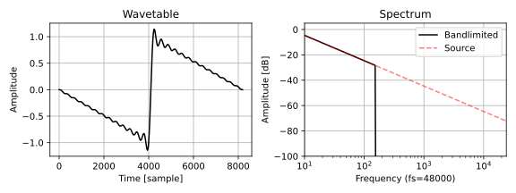
</figure>

生成したウェーブテーブルを指定したピッチで再生します。

以下はウェーブテーブルを一定の周波数 $f_0$ で再生したときのスペクトログラムです。明るい線がウェーブテーブルの倍音です。再生時の周波数が一定なので横一直線に伸びています。

<figure>
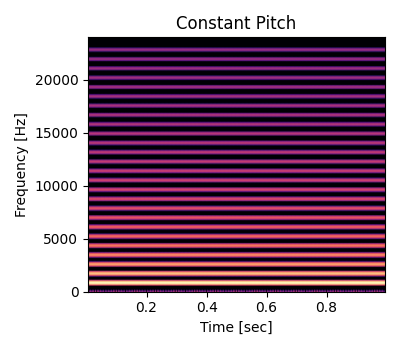
</figure>

以下は基本周波数より高くなるようにウェーブテーブルを $f_0$ から $2 f_0$ までピッチベンドしたときのスペクトログラムです。明るい線が上端で跳ね返っているように見えるのがエイリアシングノイズです。

<figure>
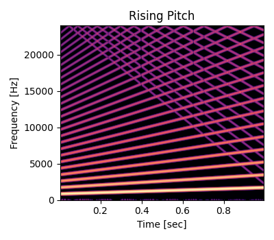
</figure>

以下は基本周波数より低くなるようにウェーブテーブルを $f_0$ から $0.5f_0$ までピッチベンドしたときのスペクトログラムです。高次の倍音が欠けています。

<figure>
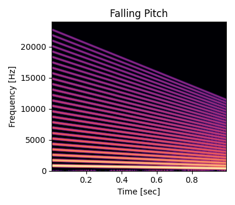
</figure>

倍音の欠落とエイリアシングノイズの問題を解決するためにはオーバーサンプリングが使えます。オーバーサンプリングの倍率を $L$ とするとナイキスト周波数を超えない最大の倍音の次数は $\displaystyle N_h = \left\lfloor \frac{f_s}{2 L f_0} \right\rfloor$ です。例として 2 倍のオーバーサンプリングを行います。

<figure>
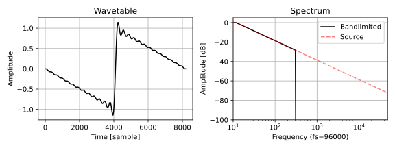
</figure>

以下は基本周波数より高くなるようにウェーブテーブルを $f_0$ から $2 f_0$ までピッチベンドしたときのスペクトログラムです。オーバーサンプリングによってできたマージンがあるのでエイリアシングが出ていません。図の左の周波数軸の値が 2 倍になっている点に注意してください。

<figure>

</figure>

マージンに現れた成分はダウンサンプリング時にかけるローパスフィルタで低減できます。以下はローパスフィルタをかけた後の信号のスペクトログラムです。

<figure>

</figure>

以下はフィルタをかけた信号をデシメーションした後のスペクトログラムです。オーバーサンプリングなしで高いほうに向かってピッチベンドしたときと比べると、エイリアシングノイズが消えていることが確認できます。また、ダウンサンプリングのフィルタによって 20000 Hz 以上の成分が低減されているので、図の上部が真っ黒になっています。

<figure>
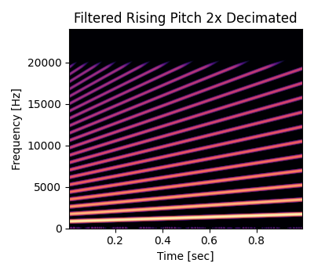
</figure>

アップサンプリングの倍率を $L$ とするとエイリアシングノイズが出ないピッチベンドの範囲は $[1, 2L - 1)$ です。あとは出力したい周波数の範囲に応じて複数のウェーブテーブルを用意して、入力されたピッチによって再生するウェーブテーブルを切り替えることで、ピッチベンドしてもエイリアシングノイズが出ないオシレータが作れます。

基本周波数 $f_0$ より低くなるようにピッチベンドするとオーバーサンプリングの有無にかかわらず倍音の欠落が防げません。よって切り替えを行うときには、入力された周波数 $f$ 以下のウェーブテーブルの中から、基本周波数 $f_0$ が $f$ に最も近いものを選びます。

以下は 1 オクターブ間隔で生成したウェーブテーブルと基本周波数、インデックスの対応表です。インデックスがそのまま基本周波数のオクターブ差になっています。表の半音 (semitone) は $f_L$ を 0 とした相対的な値です。

<figure>
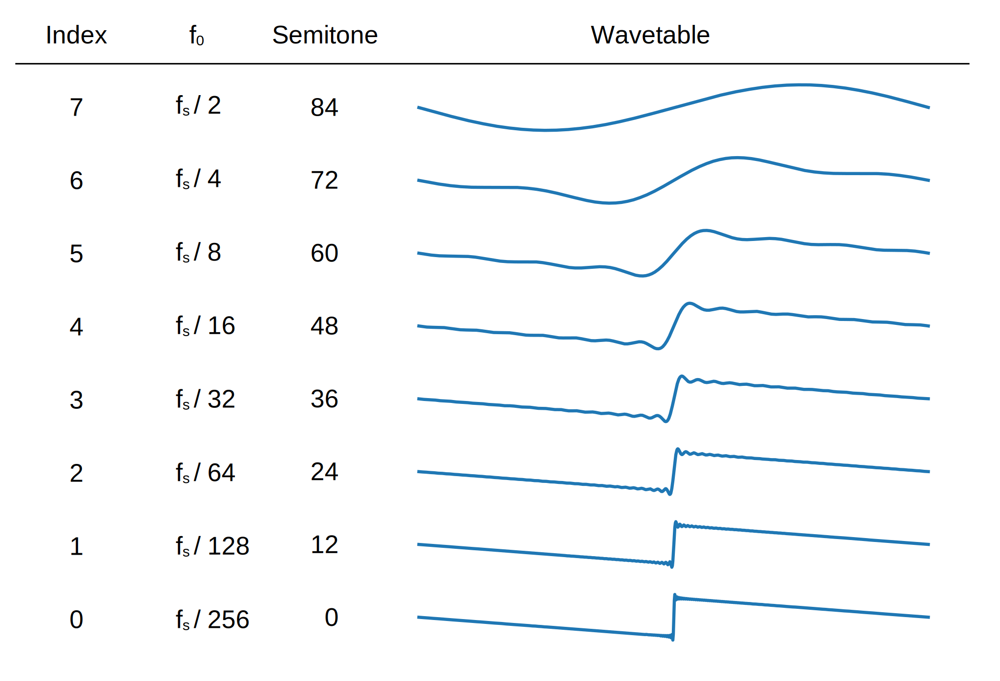
</figure>

以下のリンクは、ここまで掲載した図の作成に使ったウェーブテーブルの生成とピッチベンドのテストコードです。 Python 3 です。

- [1 つのウェーブテーブルのピッチベンドのテストコードを読む (github.com)](https://github.com/ryukau/filter_notes/blob/master/wavetable_pitchbend/demo.py)

## 設計
ここでは以下のパラメータから他の必要な値を決めます。

- 周波数が $f_L$ 以下になると倍音が欠落する。
- 1 つのウェーブテーブルを $B$ 倍までピッチベンドする。
- 1 つのウェーブテーブルはナイキスト周波数の $H$ 倍までの周波数成分を含む。
- $L$ 倍のオーバーサンプリング。

このとき以下の不等式を満たせばエイリアシングは起こりません。

$$
BH \leq 2L - 1
$$

ピッチを上げる方向に向かってだけピッチベンドするので $B \geq 1$ 、倍音の欠落が起こらないようにするので $H \geq 1$ です。

$2L - 1$ はオーバーサンプリングによってできる周波数方向のマージンを表しています。 $B, H, L$ はすべて比率なのでサンプリング周波数は式に入っていません。

$B$ と $H$ の決め方は実装の節で実験しながら見ていきます。

### ウェーブテーブルの作成
まずは倍音が欠けない最低の周波数 $f_L$ を決めます。そして $f_L$ を使ってウェーブテーブルの長さ $N$ を求めます。インデックスの巻き戻しでビットマスクを使うために、ウェーブテーブルの長さは $2^n$ に揃えます。

$$
N = 2^n, \quad n = \left\lfloor \log_2 \frac{f_s}{f_L} \right\rfloor
$$

次にウェーブテーブルの数 $M$ を求めます。 1 つのウェーブテーブルのピッチベンドの倍率を $B$ とすると以下の式が立ちます。

$$
B^M = \frac{N}{2}
$$

$\dfrac{N}{2}$ は 1 つのウェーブテーブルが含むことのできる最大の倍音の数です。上の式は最低周波数から $B$ 倍のピッチベンドを $M$ 回繰り返したときにナイキスト周波数以下の倍音が 1 つだけになることを表しています。

$M$ について解きます。 $M$ を整数にしたいので床関数を加えています。

$$
M = \left\lfloor \log_B \frac{N}{2} \right\rfloor
$$

最後にウェーブテーブルを作ります。ウェーブテーブルの作成は入力された波形を離散フーリエ変換で周波数領域に変換します。そしてエイリアシングが出ないように周波数成分を切り落としたあとに逆離散フーリエ変換で時間領域に戻すことで計算できます。ここではインデックス 0 のウェーブテーブルが最低周波数を再生するようにします。インデックスを $i$ としたときに切り落とす倍音の次数 $C$ は以下の式で計算できます。

$$
c = \left\lfloor \frac{N}{2} H^{-i} \right\rfloor + 1
$$

最後の $+1$ は直流成分を表しています。インデックスが $c$ 以上の周波数成分は 0 にします。

以下はウェーブテーブル作成の大まかな C++ のコードです。

```c++
/*
table は 2 次元配列。最後のテーブルは 0 で埋める。

sampleRate は出力のサンプリング周波数。
f_s はオーバーサンプリング中のサンプリング周波数。

waveform は元になる波形データ。
*/

float f_s = L * sampleRate;

size_t N = size_t(1) << size_t(std::log2(f_s / float(10))); // 2^n.
std::vector<std::complex<float>> spc = getSpectrum<float>(waveform);

size_t M = size_t(std::log(float(N / 2)) / std::log(B));
table.resize(M + 1); // 0 埋めテーブルを追加するので +1 。

std::vector<std::complex<float>> tmp(spc.size()); // 一時変数。
for (size_t idx = 0; idx < table.size() - 1; ++idx) {
  size_t cutoff = size_t(N / 2 * std::pow(B, -float(idx))) + 1; // c の式。

  std::fill(tmp.begin(), tmp.end(), std::complex<float>(0, 0));
  std::copy(spc.begin(), spc.begin() + cutoff, tmp.begin());

  table[idx].resize(N);
  fft.complex2real(tmp.data(), table[idx].data()); // numpy.fft.irfft と同じ計算。
}
table.back().resize(N);
std::fill(table.back().begin(), table.back().end(), float(0));
```

### ウェーブテーブルの切り替え
前提としてオシレータのピッチが浮動小数点数の MIDI ノート番号で入力されることにします。

事前に最低周波数 $f_L$ を最低 MIDI ノート番号 $\mathtt{basenote}$ に変換しておきます。

$$
\mathtt{basenote} = 12 \log_2 \left( \frac{f_L}{440} \right) - 69
$$

ピッチベンドの倍率 $B$ も半音 $\mathtt{interval}$ に変換しておきます。

$$
\mathtt{interval} = 12 \log_2 B
$$

すると MIDI ノート番号 $\nu$ が入力されたときに再生するウェーブテーブルのインデックス $i$ を以下の式で計算できます。

$$
i = \left\lfloor \frac{\nu - \mathtt{basenote}}{\mathtt{interval}} \right\rfloor
$$

C++ では以下のように書けます。配列の範囲外へのアクセスを防ぐために念のため `std::clamp` を追加しています。

```c++
class Osc {
public:
  float basenote;
  float interval;

  // 他のメンバは省略。

  // 事前計算。
  void setup(/* ... */) {
    // ...

    float f_L = f_s / float(N);
    basenote = float(12) * std::log2(f_L / float(440)) - float(69);
    interval = float(12) * std::log2(bendRange);

    // ...
  }

  // 毎サンプルの計算。
  float process(/* ... */) {
    // ...

    size_t index = std::clamp(size_t((note - basenote) / interval), 0, N - 1);

    // ...
  }
};
```

## 実装
ここでは以下の 3 つ実装を試しています。

- オーバーサンプリングありの実装
- オーバーサンプリングなしの実装
- ミップマップを使う実装

### オーバーサンプリングありの実装
オーバーサンプリングを行うウェーブテーブルオシレータのブロック線図です。

<figure>
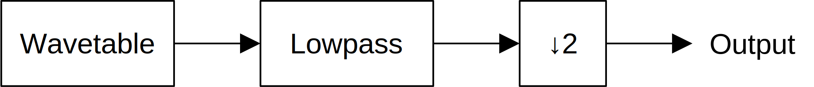
</figure>

#### インデックス方向の補間なし
まずは De Soras さんの資料に基づいて 1 オクターブ間隔で倍音を削ったウェーブテーブルを試します。 1 つのウェーブテーブルのピッチベンドの範囲は $[1, 2)$ です。

以下はコードへのリンクです。

- [Python 3 によるオーバーサンプリングあり、インデックス方向の補間なしの実装を読む (github.com)](https://github.com/ryukau/filter_notes/blob/f6c0a8b81bee51235b542e498d67c9caf9a65120/wavetable_pitchbend/pitchbend.py#L42)
- [C++ によるオーバーサンプリングあり、インデックス方向の補間なしの実装を読む (github.com)](https://github.com/ryukau/filter_notes/blob/f6c0a8b81bee51235b542e498d67c9caf9a65120/wavetable_pitchbend/cpp/bench/bench.cpp#L236)

以下は MIDI ノート番号で 0, 128, 0 とピッチベンドしたテスト出力のスペクトログラムです。エイリアシングは抑えられていますが、垂直な縦線が見えるのでポップノイズが出ています。

<figure>

</figure>

ポップノイズはウェーブテーブルの切り替えによって発生しています。以下のリンクから確認のために書いたコードを読むことができます。 Python 3 です。

- [ウェーブテーブルの切り替えがポップノイズの原因になっていることを確認するコードを読む (github.com)](https://github.com/ryukau/filter_notes/blob/master/wavetable_pitchbend/switching.py)

#### インデックス方向を線形補間
ウェーブテーブルをインデックス方向で補間することでポップノイズの低減方法を図ります。コードにインデックス方向の線形補間を加えます。

以下はコードへのリンクです。

- [Python 3 によるオーバーサンプリングあり、インデックス方向の補間ありの実装を読む (github.com)](https://github.com/ryukau/filter_notes/blob/f6c0a8b81bee51235b542e498d67c9caf9a65120/wavetable_pitchbend/pitchbend.py#L80)

以下は MIDI ノート番号で 0, 128, 0 とピッチベンドしたテスト出力のスペクトログラムです。ポップノイズは消えましたが、図の上部で波打つように暗くなっている箇所で高次の倍音が弱くなっています。

<figure>

</figure>

#### 最適な設計
インデックス方向を線形補間したときの高次の倍音の弱まりは、ウェーブテーブルを用意するときの倍音の削り方を工夫することで防ぐことができます。

最適な設計に関するパラメータを再掲します。最低周波数 $f_L$ はここでは使いません。

- ウェーブテーブルを $B$ 倍までピッチベンドする。
- ウェーブテーブルはナイキスト周波数の $H$ 倍までの周波数成分を含む。
- $L$ 倍のオーバーサンプリング。

このとき以下の不等式を満たせばエイリアシングは起こりません。

$$
BH \leq 2L - 1, \quad B \geq 1, \quad H \geq 1.
$$

$B > H$ としてピッチベンドの幅を広げると倍音の欠落が起こります。逆に $H > B$ として倍音の余剰を増やすとピッチベンドの幅が狭くなり、テーブルの数が増えます。倍音の欠落を防ぎつつ、テーブルの数が最小となるようにするには $H = B$ として上の不等式の上限の値と等しくなるように設計すればよさそうです。つまり $B$ と $H$ の値は以下の式で求められます。

$$
B = H = \sqrt{2L - 1}
$$

$L = 2$ のとき $B = H = \sqrt{3}$ です。

以下はコードへのリンクです。

- [Python 3 によるオーバーサンプリングあり、最適な設計の実装を読む (github.com)](https://github.com/ryukau/filter_notes/blob/f6c0a8b81bee51235b542e498d67c9caf9a65120/wavetable_pitchbend/pitchbend.py#L127)
- [C++ によるオーバーサンプリングあり、最適な設計の実装を読む (github.com)](https://github.com/ryukau/filter_notes/blob/f6c0a8b81bee51235b542e498d67c9caf9a65120/wavetable_pitchbend/cpp/bench/bench.cpp#L391)

以下は MIDI ノート番号で 0, 128, 0 とピッチベンドしたテスト出力のスペクトログラムです。テーブルの数は増えましたが、エイリアシングも倍音の弱まりもなくなっています。

<figure>
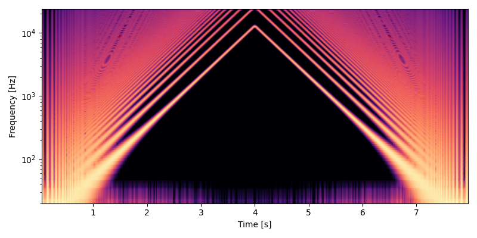
</figure>

ここまでやってしまえば、あとはダウンサンプリングのローパスフィルタの設計くらいでしか品質は変わりません。

### オーバーサンプリングなしの実装
ウェーブテーブルの数を増やして周波数方向の間隔を狭くすることで、オーバーサンプリング無しでもエイリアシングを低減できます。この方法は [CubicPadSynth](https://ryukau.github.io/VSTPlugins/manual/CubicPadSynth/CubicPadSynth_ja.html) で使いました。ただし CubicPadSynth は倍音のカットオフの計算を間違えているので、正しい実装は下のリンク先のコードを参照してください。

以下はコードへのリンクです。

- [Python 3 によるオーバーサンプリングなしの実装を読む (github.com)](https://github.com/ryukau/filter_notes/blob/f6c0a8b81bee51235b542e498d67c9caf9a65120/wavetable_pitchbend/pitchbend.py#L257)
- [C++ によるオーバーサンプリングなしの実装を読む (github.com)](https://github.com/ryukau/filter_notes/blob/f6c0a8b81bee51235b542e498d67c9caf9a65120/wavetable_pitchbend/cpp/bench/bench.cpp#L666)

以下は MIDI ノート番号で 0, 128, 0 とピッチベンドしたテスト出力のスペクトログラムです。オーバーサンプリングしていないのでエイリアシングも倍音の弱まりも起こっているはずですが、図を見る限りではどちらも確認できません。

<figure>
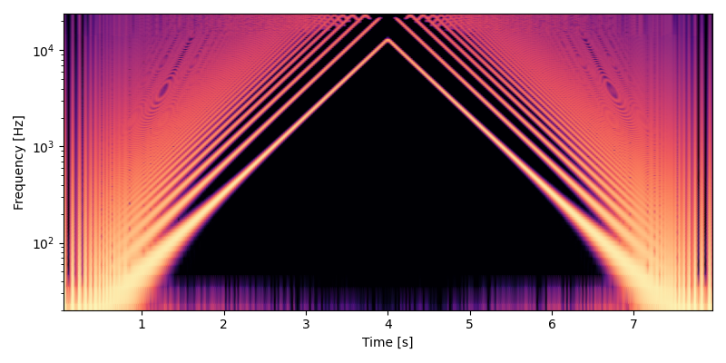
</figure>

オーバーサンプリングがない分だけ速いので使える場面はありそうです。ただし、メモリを大量に使うのでウェーブテーブルがあまりにも長くなるとパフォーマンスが落ちます。

### ミップマップを使う実装
The Quest For The Perfect Resampler で紹介されているミップマップを使う方法も実装して試しました。

メモリを節約したいときはミップマップを使うことができます。以下はウェーブテーブルのミップマップを表した図です。

<figure>
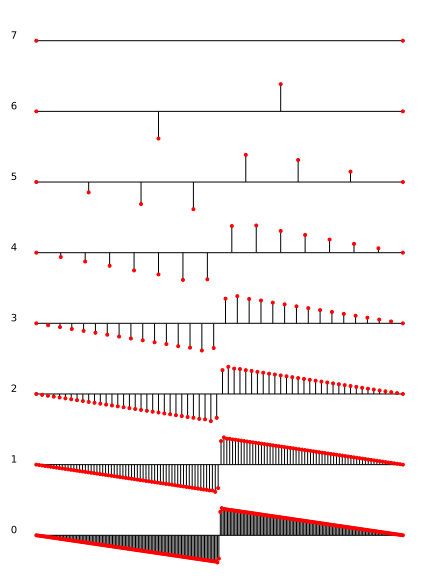
</figure>


ミップマップを使うとウェーブテーブルの間隔が 1 オクターブに固定されるので、インデックス方向の補間による倍音の弱まりが避けられない点に注意してください。

ミップマップを使うときは質のいいアップサンプラを使わないと耳で聴きとれるノイズがでます。以下は形補間を使ったときに MIDI ノート番号で 0, 128, 0 とピッチベンドしたテスト出力のスペクトログラムです。全体に薄くノイズが乗っていることが見て取れます。

<figure>
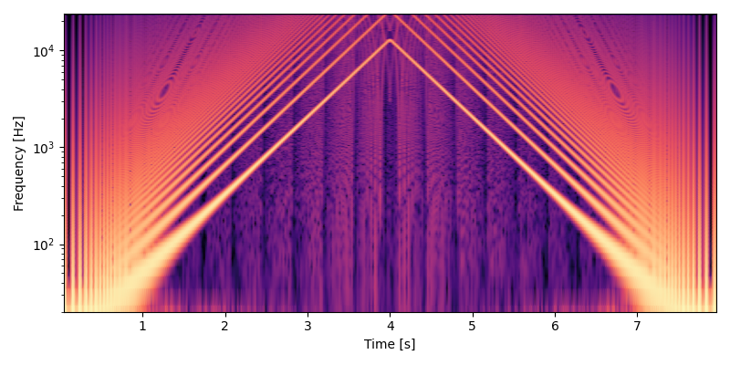
</figure>

以下のリンク先でミップマップと線形補間を使ったオシレータのコードが読めます。

- [Python 3 によるミップマップと線形補間を使ったオシレータの実装を読む (github.com)](https://github.com/ryukau/filter_notes/blob/f6c0a8b81bee51235b542e498d67c9caf9a65120/wavetable_pitchbend/pitchbend.py#L257)
- [C++ によるミップマップと線形補間を使ったオシレータの実装を読む (github.com)](https://github.com/ryukau/filter_notes/blob/f6c0a8b81bee51235b542e498d67c9caf9a65120/wavetable_pitchbend/pitchbend.py#L178)

#### アップサンプラのフィルタ設計
以下のパラメータを決めます。

- $f_p$: パスバンドの上限の周波数。
- $f_s$: ストップバンドの下限の周波数。
- $N_{\mathrm{fir}}$: ポリフェイズ 1 つあたりのタップ数。
- $M_{\mathrm{fir}}$: アップサンプリングの倍率。

フィルタ設計中のサンプリング周波数を $M$ にします。

$f_p$ と $f_s$ の値は適当に決めています。ここでは出力のナイキスト周波数は 0.5 です。またローパスなので $f_p < f_s$ を満たす必要があります。 $f_s$ が 0.5 より大きいとエイリアシングが出ます。しかし $f_p$ が 0.5 より小さいと高次の倍音が弱くなります。

$N$ と $M$ は増やすほどフィルタの質が良くなります。 De Soras さんの資料では $N = 12, M = 64$ としていますが、ここでは $N = 32, M = 64$ としました。

Python3 と SciPy を使ってフィルタを設計します。

```python
import numpy as np
import scipy.signal as signal

f_p = 0.4
f_s = 0.5
N_fir = 32
M_fir = 64

bands = np.hstack((
    [0, f_p],
    [f_s, M_fir / 2],
))
desired = (1, 0)
weight = (1, 100)
fir = signal.remez(N_fir * M_fir - 1, bands, desired, weight, fs=M_fir, maxiter=1024)
```

設計したフィルタをポリフェイズ分解します。各フェイズの出力振幅を 1 に正規化したいので `splitPolyPhase` の呼び出しで `M * fir` としています。

```python
import json

def splitPolyPhase(fir, nPhase):
    padding = nPhase - len(fir) % nPhase
    fir = np.hstack((fir, np.zeros(padding)))
    polyphase = []
    for phase in range(nPhase):
        part = fir[phase::nPhase]
        polyphase.append(part.tolist())
    return polyphase

fir = splitPolyPhase(M * fir, M)[::-1]
```

得られた `fir` は以下のような 2 次元配列になっています。

```
[
  [/* ポリフェイズ 0 の FIR 係数 */],
  [/* ポリフェイズ 1 の FIR 係数 */],
  [/* ポリフェイズ 2 の FIR 係数 */],
  // ...
]
```

ミップマップを `fir` で補間するには以下のように計算します。

```c++
// phase は [0.0, 1.0) の範囲で正規化された現在の位相。
// octave は入力されたピッチから決めたウェーブテーブルのインデックス。
Sample processTable(const Sample phase, const size_t octave)
{
  if (octave >= table.size()) return Sample(0);
  const auto &tbl = table[octave]; // table はミップマップの 2 次元配列。

  auto tblPos = Sample(tbl.size()) * phase;
  auto tblIdx = size_t(tblPos);
  auto tblFrac = tblPos - Sample(tblIdx);

  auto firPos = Sample(InterpFir::nPhase) * tblFrac;
  auto firIdx = size_t(firPos);
  auto firFrac = firPos - Sample(firIdx);

  // `tbl.size()` は常に 2^n 。よって `tbl.size() - 1` は常に `0b0..1..` 。
  auto bitmask = tbl.size() - 1;

  auto sum = Sample(0);
  for (size_t j = 0; j < InterpFir::bufferSize; ++j) {
    sum += tbl[(tblIdx + j) & bitmask] // ビットマスクでインデックスの巻き戻し。
      * (InterpFir::coefficient[firIdx][j] + firFrac * InterpFir::diff[firIdx][j]);
  }
  return sum;
}
```

De Soras さんの資料では `fir[firIdx][j + 1] - fir[firIdx][j]` を事前に計算して別の配列にしておくことで計算量を減らす方法が紹介されています。

以下のリンク先でミップマップとアップサンプラを使ったオシレータのコードが読めます。

- [C++ によるミップマップとアップサンプラを使ったオシレータの実装を読む (github.com)](https://github.com/ryukau/filter_notes/blob/f6c0a8b81bee51235b542e498d67c9caf9a65120/wavetable_pitchbend/cpp/bench/bench.cpp#L566)

以下は MIDI ノート番号で 0, 128, 0 とピッチベンドしたテスト出力のスペクトログラムです。エイリアシングはウェーブテーブルの切り替え時に少し出ていますが、悪くない品質です。図の上部が波打つように暗くなっているのは、インデックス方向の補間によって高次の倍音が弱くなっているからです。

<figure>

</figure>

ミップマップを使う方法はアップサンプラのフィルタの質で大きく音が変わります。 $f_p$ を 0.5 以下にすると今回のように倍音の弱まりが出ます。かと言って $f_p$ を 0.5 にすると $f_s$ を 0.5 より大きい値にする必要が出てくるので、今度はエイリアシングノイズが出ます。 $N_{\mathrm{fir}}$ の値を大きくすることで倍音の弱まりとエイリアシングの両方を改善できますが、今度は計算が重たくなります。

インデックス方向の線形補間を行うときは 1 サンプルあたりで 2 回の畳み込みが必要になります。簡単なベンチマークを取ったところ、今回実装した $N_{\mathrm{fir}} = 32$ でインデックス方向の線形補間ありのミップマップは、オーバーサンプリングありの実装と比べて約 1.5 倍ほどの計算時間がかかりました。

他の実装にない特徴として、アップサンプラのフィルタをローパス以外の特性に変えてエフェクトをかけることができそうです。

## 音のサンプル
各実装でのこぎり波をレンダリングした結果です。

<figure>
  <figcaption>オーバーサンプリングを行う実装 - インデックス方向の補間なし</figcaption>
  <audio controls>
    <source src="snd/chirp_TableOsc.wav" type="audio/wav">
  </audio>
</figure>

<figure>
  <figcaption>オーバーサンプリングを行う実装 - インデックス方向を線形補間</figcaption>
  <audio controls>
    <source src="snd/chirp_TableOscBilinear.wav" type="audio/wav">
  </audio>
</figure>

<figure>
  <figcaption>オーバーサンプリングを行う実装 - 最適な設計</figcaption>
  <audio controls>
    <source src="snd/chirp_TableOscAltInterval.wav" type="audio/wav">
  </audio>
</figure>

<figure>
  <figcaption>オーバーサンプリングを行わない実装</figcaption>
  <audio controls>
    <source src="snd/chirp_LpsOsc.wav" type="audio/wav">
  </audio>
</figure>

<figure>
  <figcaption>ミップマップ - 線形補間</figcaption>
  <audio controls>
    <source src="snd/chirp_MipmapLinear.wav" type="audio/wav">
  </audio>
</figure>

<figure>
  <figcaption>ミップマップ - アップサンプラ</figcaption>
  <audio controls>
    <source src="snd/chirp_MipmapDeSoras.wav" type="audio/wav">
  </audio>
</figure>

「オーバーサンプリングを行う実装 - 最適な設計」と「オーバーサンプリングを行わない実装」はエイリアシングも倍音の弱まりもないので理想的な音です。オーバーサンプリングを行う実装はダウンサンプリングのローパスに楕円フィルタを使っているので高域の位相特性があまりよくないのですが、耳で聴きとることは困難です。

「オーバーサンプリングを行う実装 - インデックス方向の補間なし」は音量を上げるとテーブルの切り替え時のポップノイズが聞こえます。

「オーバーサンプリングを行う実装 - インデックス方向を線形補間」と「ミップマップ - アップサンプラ」は高次の倍音が弱まっています。「ミップマップ - アップサンプラ」では倍音の弱まりが聞き取れます。

「ミップマップ - 線形補間」はエイリアシングが大量に出ているので明らかに音が違います。

## その他
ウェーブテーブルの標準的な長さは Serum で使われている 2048 サンプルのようです。サンプリング周波数が 48000 Hz のとき `48000 / 2048 = 23.4375` Hz までなら高次の倍音が欠けません。

- [Wavetable file format? - DSP and Plug-in Development Forum - KVR Audio](https://www.kvraudio.com/forum/viewtopic.php?t=517146)

## 参考文献
- [The Quest For The Perfect Resampler - resampler-en.pdf](http://ldesoras.free.fr/doc/articles/resampler-en.pdf)
- [Note names, MIDI numbers and frequencies](http://newt.phys.unsw.edu.au/jw/notes.html)
- [Fourier Series--Sawtooth Wave -- from Wolfram MathWorld](https://mathworld.wolfram.com/FourierSeriesSawtoothWave.html)

## 変更点
- 2021/02/24
  - 構成の変更。
  - 最適な設計のウェーブテーブルを追加。
  - De Soras のミップマップウェーブテーブルを追加。
  - オーバーサンプリングを行わない実装のバグ修正。倍音のカットオフの計算に間違いがあった。
